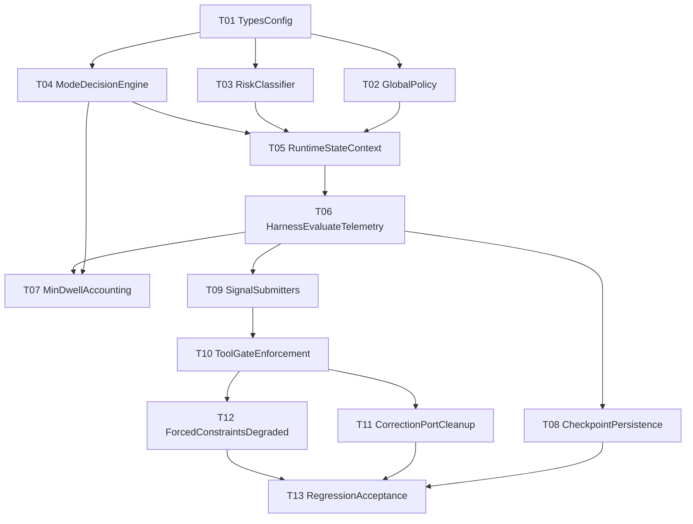

# 双模 V1.3.6 Implementation Tasks

依据：仅使用 `docs/双模方案2.md` 中 V1.3.6 相关冻结内容，尤其是 I10、§2.8、§8.11、§8.12、§14、§15、附录 A/B/C。实施顺序遵循附录 C 迁移计划和当前代码落点。

## 任务边界

- **不重新设计架构：新增** `src/harness/supervisor/` **包、**`ModeDecisionEngine`**、**`TaskRiskClassifier`**、**`ToolGate`**、**`CorrectionPort` **均来自文档。**
- 不修改 phase：沿用现有 Phase 注释与任务图实现，不引入新的 phase 编号。
- 每个任务限定为一次可提交 commit，前置任务未完成时不做后置接入。

## 依赖 DAG

## 推荐执行顺序

1. T01 类型与配置字段落盘
2. T02 GlobalModePolicy / ModeController
3. T03 TaskRiskClassifier
4. T04 ModeDecisionEngine
5. T05 RuntimeExecutionState / ModeDecisionContext 构造
6. T06 Harness before-LLM 接入与 telemetry
7. T07 V1.3.6 I10 task-bearing round 计数
8. T08 checkpoint 持久化与恢复信号
9. T09 各模块仅 submitSignal
10. T10 ToolGate 真正阻断执行
11. T11 CorrectionPort 收敛纠偏写入口
12. T12 Forced constraints 与 degraded execution
13. T13 全量 regression / acceptance 固化

## 任务拆分

### T01 类型与配置字段落盘

涉及文件：

- 新增：`src/types/supervisor.ts`
- 修改：`src/harness/types.ts`
- 修改：`src/harness/harness-run-state.ts`
- 修改：`src/types/runtime-checkpoint.ts`
- 新增测试：`test/harness/supervisor-types.test.ts` 或并入 `test/harness/checkpoint-engine.test.ts`

新增类型：

- `SupervisorConfigFile`
- `ModeParams`
- `SupervisorTriggers`
- `GoalDriftConfig`
- `SnapshotConfidenceConfig`
- `CorrectionBudgetConfig`
- `RiskEvaluatorWeights`
- `EventTimelineConfig`
- `ExecutionModeConfig`
- `ExecutionMode`
- `TaskRiskLevel`
- `ModeSignal`
- `ForcedDegradedTier`
- `ExecutionModeTelemetryPayload`
- `ModeSignalSource`
- `RuntimeExecutionState`
- `TaskBearingRoundOutcome`
- `ModeDecisionContext`
- `ModeDecision`
- `CorrectionBlock` / `CorrectionPort`
- `ToolGateAction` / `ToolGateEntry` / `ToolGatePlan` / `ToolGate` / `GateContext`

修改函数：

- `emptyRuntimeCheckpointV2`
- `isRuntimeCheckpointV2`
- `HarnessStepEvent` type union
- `LoopState` / `HarnessRunState` interface 初始化字段的后续承载位

风险点：

- checkpoint v2 必须保持向后兼容，不能让旧 checkpoint 因新增字段解析失败。
- `HarnessStepEvent` 扩展不能破坏前端已有事件类型分支。

验收标准：

- TypeScript 编译通过。
- 旧 checkpoint fixture 仍能 `loadV2()` 返回 null 或正常解析。
- 新增字段不要求业务逻辑生效，仅类型可被后续任务引用。

### T02 GlobalModePolicy / ModeController

涉及文件：

- 新增：`src/harness/supervisor/mode-controller.ts`
- 新增：`src/harness/supervisor/supervisor-config.ts`
- 新增或修改：`data/supervisor-config.example.json`
- 修改：`src/harness/types.ts`
- 新增测试：`test/harness/mode-controller.test.ts`

新增类型：

- `GlobalModePolicy`
- `SupervisorMode`
- `ResolvedSupervisorConfig`

修改函数：

- `Harness` constructor：仅注入可选配置依赖，不在此任务接入 per-round 决策。
- 新增 `resolveGlobalPolicy()`
- 新增 `loadSupervisorConfig()` / `defaultSupervisorConfig()`

风险点：

- I6：环境变量只能在 Global 层解析，后续业务模块不得读 `process.env.ICE_SUPERVISOR_*`。
- `ICE_TASK_GRAPH` 按文档废弃规划处理，不应继续作为双模局部判断依据。

验收标准：

- `off` 解析为 `modeDecisionEngineEnabled=false` 且 floor 为 `free`。
- `adaptive` 解析为启用决策链且 floor 为 `free`。
- `strict` 解析为启用决策链且 floor 为 `forced`。
- 配置默认包含 `executionMode.forcedMinDwellRounds=1`。

### T03 TaskRiskClassifier 纯函数

涉及文件：

- 新增：`src/harness/supervisor/task-risk-classifier.ts`
- 新增测试：`test/harness/task-risk-classifier.test.ts`

新增类型：

- 无，复用 T01 类型。

修改函数：

- 新增 `TaskRiskClassifier.classify(state)`
- 可新增 `isReadonlyToolPlan(state)` 作为本文件内部辅助

风险点：

- 禁止使用用户 goal、中文动词、`inferIntent()` 或 LLM 分类触发 Forced。
- L0 只读计划必须永远 Free。

验收标准：

- 计划工具全在 `readonlyToolNames`、无 graph、无写目标时为 `L0_observation`。
- 单写目标、小 diff、无失败时为 `L1_minor_edit`。
- 任一 §2.8.5 进入条件状态成立时为 `L2_structural`。
- 测试中不出现关键词 fixture 驱动分类。

### T04 ModeDecisionEngine 纯决策

涉及文件：

- 新增：`src/harness/supervisor/mode-decision-engine.ts`
- 新增测试：`test/harness/mode-decision-engine.test.ts`

新增类型：

- 无，复用 T01 类型。

修改函数：

- 新增 `sortSignalsByPrecedence(signals)`
- 新增 `formatForcedReasonHuman(enteredBy)`
- 新增 `shouldEnterForcedMode(state, cfg, signals)`
- 新增 `shouldExitForcedMode(state, cfg, lockRemaining)`
- 新增 `ModeDecisionEngine.evaluate(ctx)`
- 新增 `ModeDecisionEngine.submitSignal(source, signal, payload?)`

风险点：

- I5：这是唯一可裁决 `executionMode` 的模块。
- I10：退出顺序必须是 mode lock 先挡，再检查 min dwell，再检查退出条件。
- fail-safe 必须进入/保持 forced，不能 fallback free。

验收标准：

- 多 signal enter 时 `enteredBy` 按 P0 到 P7 排序。
- `recovery_pending` 不参与 enter precedence，只阻塞 exit。
- `executionModeLockRemaining > 0` 时不 exit。
- `forcedTaskBearingRoundsSinceEntry < forcedMinDwellRounds` 时不 exit。
- `evaluate` 异常路径返回 `enter_forced` 且 `failSafe=true`。

### T05 RuntimeExecutionState / ModeDecisionContext 构造

涉及文件：

- 新增：`src/harness/supervisor/runtime-execution-state.ts`
- 修改：`src/harness/harness-round-prep.ts`
- 修改：`src/harness/harness-run-state.ts`
- 修改：`src/harness/task-graph-executor.ts`
- 新增测试：`test/harness/runtime-execution-state.test.ts`

新增类型：

- 无，复用 T01 类型。

修改函数：

- 新增 `buildRuntimeExecutionState(state, deps, round, plannedToolNames)`
- 新增 `buildModeDecisionContext(state, deps, round)`
- `prepareHarnessRound`：保留 `normalizedMsgs` 和 `round`，附带 planned tool names 或使构造器可从 state/tools 推导。
- `GraphExecutor`：提供读取 active graph、pending step count、active implement node 的只读方法。

风险点：

- 状态构造只能读取运行态，不能在此处写 `executionMode`。
- `plannedWriteTargets` 与 `writeTargetsThisRound` 的统计不能把只读工具误判为写。

验收标准：

- read/search/list 工具计划构造为 L0 输入。
- active graph + pending steps 可被正确映射到 `taskGraphActive` / `pendingStepCount`。
- checkpoint resumed 信息可映射到 `checkpointResumedThisSession`，但不直接改 mode。

### T06 Harness before-LLM 接入与 telemetry

涉及文件：

- 修改：`src/harness/harness.ts`
- 修改：`src/harness/runtime-telemetry.ts`
- 修改：`src/harness/types.ts`
- 新增：`src/harness/supervisor/execution-mode-constraints.ts`
- 新增测试：`test/harness/execution-mode-harness.test.ts`

新增类型：

- 无，复用 T01 类型。

修改函数：

- `Harness` constructor：实例化 `ModeController` / `ModeDecisionEngine` / `TaskRiskClassifier`。
- `Harness.buildRunDeps()`：下发 supervisor deps。
- `Harness.run()`：在 `prepareHarnessRound` 之后、`callHarnessLlm` 之前调用 `evaluate`。
- `RuntimeTelemetryEvent` union：新增 `execution_mode_enter` / `execution_mode_exit`。
- `RuntimeTelemetry`：新增 `recordExecutionMode()`。
- 新增 `applyExecutionModeConstraints(state, decision, deps)`。

风险点：

- `ICE_SUPERVISOR_MODE=off` 必须保持今日 Harness 行为，不多 inject、不多 gate。
- telemetry 异步写失败不能影响主循环。
- `strict` floor 仍由引擎写 state，不允许 Harness 散落 `if strict then forced`。

验收标准：

- before-LLM 插入点位于 `prepareHarnessRound` 后、`callHarnessLlm` 前。
- free→forced 产生 step event / telemetry，包含 `enteredBy`、`enteredByPrimary`、`primaryReasonHuman`。
- off 模式下不进入 forced，不启用 step gate。

### T07 V1.3.6 I10 task-bearing round 计数

涉及文件：

- 修改：`src/harness/supervisor/mode-decision-engine.ts`
- 修改：`src/harness/harness-tool-round.ts`
- 修改：`src/harness/harness-run-state.ts`
- 修改：`src/harness/repo-context.ts`
- 修改测试：`test/harness/mode-decision-engine.test.ts`
- 新增测试：`test/harness/execution-mode-min-dwell.test.ts`

新增类型：

- 无，复用 `TaskBearingRoundOutcome`。

修改函数：

- 新增 `isTaskBearingRound(outcome)`
- 新增 `recordTaskBearingRoundIfForced(state, outcome, cfg)`
- `runHarnessToolRound()`：在工具轮结束后构造 outcome 并调用记录函数。
- `ModeDecisionEngine.evaluate()` / `shouldExitForcedMode()`：使用 `forcedTaskBearingRoundsSinceEntry` 判定 I10。

风险点：

- 工具 skip/block/deny 不得计入 task-bearing。
- 仅 LLM 回复、无工具调用不得计入 task-bearing。
- graph signal 清零后也不能绕过 min dwell。

验收标准：

- enter forced 后 signal 清空、无 task-bearing round 时不得 exit。
- 成功 execute 至少 1 个工具后计数加 1。
- graph 步骤推进后计数加 1。
- 写类工具成功且 `RepoContext.filesChanged` 更新后计数加 1。
- exit forced 时清零 `forcedEntryRound` / `forcedTaskBearingRoundsSinceEntry`。

### T08 checkpoint 持久化与恢复信号

涉及文件：

- 修改：`src/types/runtime-checkpoint.ts`
- 修改：`src/harness/checkpoint-engine.ts`
- 修改：`src/harness/harness.ts`
- 修改测试：`test/harness/checkpoint-engine.test.ts`

新增类型：

- `RuntimeCheckpointV2.supervisorState` 或等价字段，字段需包含 `executionMode`、lock、dwell、`enteredBy`、`forcedDegradedTier`、event timeline 片段。

修改函数：

- `CheckpointEngine.save()` / `applyInput()`：持久化 supervisor state。
- `CheckpointEngine.loadV2()`：恢复 supervisor state。
- `Harness.run()` checkpoint resume 分支：提交 `checkpoint_resumed` signal。

风险点：

- 旧 runtimeV2 schema 不得被新增 supervisor 字段破坏。
- checkpoint 恢复只能提交 signal，不能由 CheckpointEngine 直接写 `executionMode`。

验收标准：

- 保存后 checkpoint 包含 `executionMode` / lock / dwell / enteredBy。
- 旧 checkpoint 仍兼容。
- resume 后 `checkpoint_resumed` 进入 ModeDecisionEngine，触发顺序 P0。

### T09 各模块仅 submitSignal

涉及文件：

- 修改：`src/harness/task-graph-executor.ts`
- 修改：`src/harness/harness-tool-round.ts`
- 修改：`src/harness/branch-budget.ts`
- 修改：`src/harness/checkpoint-engine.ts`
- 修改：`src/harness/stop-hooks.ts` 如存在 stop hook 信号入口
- 修改测试：对应 harness / task graph / branch budget 测试

新增类型：

- 无。

修改函数：

- `GraphExecutor`：在 active graph、pending steps、implement node 状态变化时通过桥接提交 signal。
- `runHarnessToolRound()`：工具失败提交 `tool_failure`，多写/大 diff 提交 `multi_write` / `large_diff`。
- checkpoint resume 分支：提交 `checkpoint_resumed`。
- branch budget 超限：提交 `branch_switched` 或 recovery 相关信号，按文档来源约束。

风险点：

- 禁止 `GraphExecutor`、`RecoverySupervisor`、`CheckpointEngine`、`ToolGate` 直接写 `state.executionMode`。
- signal 生命周期必须是本轮 append-only，evaluate 后清理或归档，避免旧信号重复触发。

验收标准：

- grep 不存在非 ModeDecisionEngine 写 `executionMode` 的代码路径。
- 多 signal 同轮可全部进入 `enteredBy`。
- `recovery_pending` 仅阻塞 exit。

### T10 ToolGate 真正阻断执行

涉及文件：

- 新增：`src/harness/supervisor/tool-gate.ts`
- 修改：`src/harness/harness-tool-round.ts`
- 修改：`src/harness/harness-tool-executor.ts`
- 修改：`src/harness/task-graph-executor.ts`
- 新增测试：`test/harness/tool-gate.test.ts`
- 修改测试：`test/task-graph-executor.test.ts`

新增类型：

- 无，复用 T01 `ToolGate*` 类型。

修改函数：

- 新增 `ToolGate.decide(calls, ctx)`
- `GraphExecutor.checkToolCall()`：只返回 hint，不再直接促成 `msgs.push`。
- `runHarnessToolRound()`：先生成 `GateContext`，再只执行 action=`execute` 的 tool calls。
- `executeToolCallsStreaming()`：接受已过滤调用，或由上层保证过滤。

风险点：

- I2：block 的工具绝不能进入 executor。
- skip 的 tool call 必须补 tool result 或等价 user 说明，避免 LLM API 缺少 tool result。
- free 模式不检查 graphHints；forced 模式才启用 step gate。

验收标准：

- `block` 工具没有进入 `executeToolCallsStreaming`。
- `skip` 的调用在 messages 中有可见 tool result 或说明。
- free 模式下 graph hint 不阻断工具。
- forced 模式下 graph hint 生效。

### T11 CorrectionPort 收敛纠偏写入口

涉及文件：

- 新增：`src/harness/supervisor/correction-port.ts`
- 修改：`src/harness/harness-tool-round.ts`
- 修改：`src/harness/task-graph-executor.ts`
- 修改：`src/harness/harness-round-no-tools.ts`
- 修改：`src/harness/harness-resilience.ts`
- 新增测试：`test/harness/correction-port.test.ts`

新增类型：

- 无，复用 `CorrectionBlock` / `CorrectionPort`。

修改函数：

- 新增 `CorrectionPort.inject(block, ctx)`
- `runHarnessToolRound()`：将 repeated failure / graph hint 等 C 类长策略注入迁入 CorrectionPort 或 PassiveObserver。
- `GraphExecutor.evaluateRound()`：不再返回可直接 push 的纠偏文案，改为 hint 输入或 metrics。
- `handleNoToolCalls()` / resilience 相关函数：free 段长策略注入受 `CorrectionBudget` 控制。

风险点：

- I1：纠偏文案出口必须唯一。
- free 段默认无 C 类策略注入，保留的生命周期短说明不能混成策略说教。

验收标准：

- grep 直接 `msgs.push` 的策略类文案均已归类或迁移。
- takeover / recovery / graph_hint 类内容只经 CorrectionPort。
- free 段连续失败不再出现第 2/3 条长 System 策略 inject。

### T12 Forced constraints 与 degraded execution

涉及文件：

- 修改：`src/harness/supervisor/execution-mode-constraints.ts`
- 修改：`src/harness/task-graph-executor.ts`
- 修改：`src/harness/branch-budget.ts`
- 修改：`src/harness/checkpoint-engine.ts`
- 修改：`src/harness/harness-tool-round.ts`
- 新增测试：`test/harness/execution-mode-constraints.test.ts`

新增类型：

- 无，复用 `ForcedDegradedTier`。

修改函数：

- `applyExecutionModeConstraints()`：forced 下启用 step gate、branch budget、checkpoint 强制策略。
- `GraphExecutor`：新增 `setStepGateEnabled()` 或等价 forced 约束开关。
- `BranchBudgetTracker`：新增 `setEnabled()` 或由调用方按 executionMode gate。
- `CheckpointEngine`：新增 forced checkpoint policy 入口或由调用方按 executionMode gate。
- graph builder / graph failure 路径：保持 forced，仅更新 `forcedDegradedTier`。

风险点：

- RetrospectiveGraphBuilder / graph 合约失败不得使 `executionMode` 回 free。
- degraded tier 不能绕过 shouldExitForcedMode。
- branch budget 启停不能破坏既有 resilience v2 行为。

验收标准：

- forced 下 step gate / branch budget / checkpoint policy 生效。
- graph failure 后 `executionMode` 仍为 forced，`forcedDegradedTier` 降级。
- `shouldExitForcedMode` 不因 degraded 自动 true。

### T13 全量 regression / acceptance 固化

涉及文件：

- 新增或修改：`test/harness/execution-mode-acceptance.test.ts`
- 修改：现有相关测试 fixture
- 可选新增：`test/harness/supervisor-regression.test.ts`

新增类型：

- 无。

修改函数：

- 无业务函数，补测试和验证脚本覆盖。

风险点：

- 该任务不应再引入新行为，只补缺口测试。
- 若发现前序行为缺失，回到对应任务修复，不在此任务混入大改。

验收标准：

- 附录 B 门禁子集通过。
- 附录 B Execution Mode 子集通过。
- 附录 B 全量验收中与当前实现范围相关项通过，不相关项显式标注未落地前置模块。
- `npm test` 通过。
- `npm run build:server` 或 `npm run build` 通过。

## 全量 Regression Checklist

门禁子集：

- `ToolGate` 的 `block` 不进入 `executeToolCallsStreaming`。
- `skip` 调用有 tool result 或 user 说明，非静默丢弃。
- `adaptive` + 关键 intent 第一轮无 `task_graph_init`，`strict` 除外。
- takeover 段 C 类 `msgs` 来源仅 `CorrectionSource.supervisor`。
- free 段连续 3 轮工具失败无重复长 System 策略 inject，只累计 timeline/signal。

Execution Mode 子集：

- 仅 `ModeDecisionEngine` 可写 `LoopState` / `HarnessRunState.executionMode`。
- L0 只读计划工具不进入 Forced，不启用 step gate。
- `pendingStepCount >= 2` 进入 Forced，`GraphExecutor.checkToolCall` 经 ToolGate 生效。
- Forced 进入后 mode lock 2 轮内不退出。
- I10：enter forced 后 signal 清空且无 task-bearing round，不得 exit。
- 至少 1 次 task-bearing round 后，满足 §2.8.5 退出条件才可 exit。
- `supervisorPhase=takeover` 时 Forced 不可降为 Free，直至 handoff 完成。
- 无 user goal 关键词 / `inferIntent` 直接触发 Forced。
- 无业务模块直接读 `ICE_SUPERVISOR_*` / `process.env.ICE_SUPERVISOR_*`。
- free→forced telemetry / state 含排序后的 `enteredBy` 与 `primaryReasonHuman`。
- 多 signal 同时触发时 P0 优先。
- `ModeDecisionEngine.evaluate` 抛错时 forced + `failSafe=true`。
- graph builder 失败时 executionMode 保持 forced，`forcedDegradedTier` 下降。

全量验收：

- `ICE_SUPERVISOR_MODE=off` 与今日 Harness 行为一致，无额外 inject。
- `ICE_SUPERVISOR_SHADOW=1` + `adaptive` 只写 timeline / shadow 记录，不真实改 takeover phase。
- `strict` + 关键域第一轮 task graph 初始化，graph hint 经 CorrectionPort。
- `adaptive` 连续失败 / 漂移可进入 takeover，再走模板图或强提示。
- 接管后无 `consecutiveToolFailures` / branch recover 重复 inject。
- 稳定窗口满足后 handoff，cooldown 内不二次 takeover。
- 恢复预算耗尽进入 `user_checkpoint`，EventTimeline 含 failure。
- rollback 走 confirm，拒绝后进入人工级。
- checkpoint 重启后 `supervisorPhase` / `eventTimeline` / execution mode 状态可恢复。
- 无异常任务 token 开销相对 baseline 小于 +5%。

代码级回归：

- `test/harness/harness.test.ts` 既有主循环用例仍通过。
- `test/task-graph-executor.test.ts` 既有 graph 生命周期用例仍通过。
- `test/harness/checkpoint-engine.test.ts` 旧 checkpoint 兼容用例仍通过。
- `test/harness/branch-budget.test.ts` 预算统计与恢复 signal 用例仍通过。
- `test/harness/tool-planner.test.ts` 首轮工具计划不因 execution mode 接入回归。
- `test/harness/casual-mode.test.ts` casual / question / inspect 任务保持自由。
- `npm run build:server` 通过。
- `npm test` 通过。

