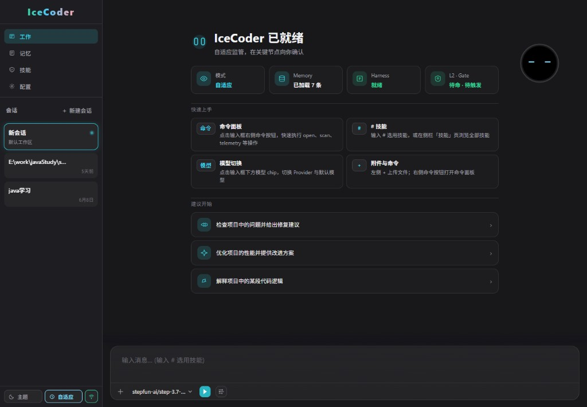

# iceCoder

**自托管的工具化 LLM 运行时治理层** — 用 **L1/L2 双模监管**、Checkpoint、文件记忆与受控工具循环，让长编码任务不跑偏（Harness 实测 **217+ 轮**稳定）。

[English README](./README.md) · [**使用说明与命令**](./docs/使用文档.md) · [项目介绍](./docs/项目介绍.md) · [Project guide](./docs/PROJECT-GUIDE.md)

## 界面预览

### 桌面端

**工作 / 聊天** — 侧栏多会话、工具执行记录、冰豆状态指示与 `#` / `@` 输入区：


**记忆图谱** — 标签筛选 + 力导向关系图，点击节点查看详情：


**技能库** — 列表 + Markdown 预览，输入 `#` 可快速挂载：


**设置 · MCP** — 管理 MCP 服务器、启动/停止、查看工具列表与 JSON 配置：


**手机扫码远程** — `~scan` 生成二维码，手机与 PC **同一会话**同步（需同一局域网）：


欢迎页状态面板（模式 / Memory / Harness / L2·Gate）：



### 移动端 H5

与桌面共用同一 bundle，路由 `#/m/*`，底栏四 Tab（工作 / 记忆 / 技能 / 设置）：

**工作** — 聊天详情、模型选择与 token 统计：


**技能** — 卡片列表，支持删除与「使用技能」：


**设置 · MCP** — 与桌面相同的 MCP 管理能力：


---

## 快速上手

### Windows 桌面版（推荐）

无需安装 Node.js，下载安装包即可使用（内置服务端 + Electron 壳 + 悬浮冰豆）：

**[下载 iceCoder — Windows x64](./releases/windows/iceCoder-windows.exe)**

安装后首次启动请在「配置」页填写 API Key；数据目录默认 `~/.iceCoder/`。从源码自行打包见 [`docs/使用文档.md`](./docs/使用文档.md) 或执行 `npm run build:desktop`。

### 源码 / Web / CLI

安装、配置 API Key、启动开发/Web/CLI、一次性任务、测试与覆盖率 — **全部命令见** [`docs/使用文档.md`](./docs/使用文档.md)（README 不重复罗列）。

Node.js **22+**（必需，与 `engines.node >=22` 一致）· 开发数据 `./data/` · 生产 `~/.iceCoder/` — 环境变量见 [`docs/环境变量.md`](./docs/环境变量.md)。

---

## 核心能力

### 双模运行时（L0 / L1 / L2）

三层分工：**L0** 是你在 Web 侧栏底栏切换的监管档位（`off` / `adaptive` / `strict`），决定整体松紧；**L1** 是 Harness 内的 `free` ↔ `forced` 执行模式，在风险升高时收紧工具门禁（`ToolGate`、分支预算、TaskGraph 约束）；**L2** 在后台观察 `no_progress`、`file_loop`、`tool_repeat_fail`、`goal_drift` 等信号，必要时 **takeover → 纠偏 → handoff** 交还主循环，事件写入 `supervisor-events.jsonl`。

- **adaptive**（默认）：按任务风险在自由与强约束间切换，适合日常编码；**strict** 全程偏 forced，首轮即建图，部分 L2 场景（如 file_loop）须此档。
- 与 **TaskGraph**、**Verification Gate** 联动：改过代码未跑验证不能「口头完工」；`critical_*` 域映射影响 L2 是否可接管。
- 配置：`data/config.json` 的 `supervisorMode` + `data/supervisor-config.json`；支持 `ICE_SUPERVISOR_SHADOW=1` 影子对照。

### Harness 主循环与 TaskGraph

**Harness** 把「模型想做什么」落成「实际执行了什么」：权限裁决（allow/confirm/deny）、无工具早停兜底、重复失败检测、上下文微/硬压缩与恢复重注入。**TaskGraph** 是唯一的结构化执行上下文来源（已替代旧 Execution Plan）：对 `edit` / `debug` / `test` / `refactor` 注入节点与分支上下文；`question` / `inspect` 等保持自由模式不建图。

- **TaskState + RepoContext**：跟踪 intent、阶段、改动文件、验证状态与读过的仓库面。
- **CheckpointEngine v2**：在同一份 `{sessionId}.checkpoint.json` 上叠加 `runtimeV2`（工具轨迹、失败、分支预算、监管快照），长会话可续跑。
- **子代理**：`delegate_to_subagent` 用只读白名单工具做探索，主上下文只收短摘要，减轻搜索/读文件带来的 token 膨胀。

### 冰豆（Web 会话指示器）

仅 **Web 聊天页** 的 Canvas 宠物「冰豆」，把后端 Harness / Supervisor / TaskGraph 事件映射成可见反馈，**不参与**运行时决策。

- **L0 眼色**：侧栏底栏 `off` / `adaptive` / `strict` 三档对应不同瞳孔/高光；欢迎页同步展示 Harness 与 L2·Gate 状态。
- **L1 角标**：底部 `forced · …` chip，与 `execution_mode_enter` 原因对齐。
- **表情与 token 环**：约 20 种表情（运行中、等待工具、成功、失败、压缩等）+ 外圈 token 用量；任务图步骤摘要与「第 N 轮」文案同步 WebSocket 事件。

### 文件记忆（Memory v2）

长期事实以 **Markdown 文件** 落在 `data/memory-files/`（及用户记忆目录），无需外置向量库。

- **结构化分级**：`hard_rule` / `project_fact` / `preference` / `observation` / `session_state`，配合 `evidenceStrength` 参与排序与淘汰。
- **意图感知召回**：按 execute / inspect / question 过滤；同主题冲突记忆**同轮只注入一侧**（结构化 tag +「是否允许改代码」启发式）。
- **粗召回（pre-LLM）**：按关键词从文件记忆拉最多 3 条注入提示，成本低、可审计。
- **提取与维护（post-tool）**：工具执行后写入/更新片段；**Dream** 与淘汰策略控制体积与冲突。
- **会话笔记**：`session-notes` 与 `icecoder-runtime` 块保存压缩前快照；与 Harness 记忆集成协作。
- **Eval**：`npm run eval:agent -- --case memory-conflict` 防止旧偏好阻止当前明确的改代码指令。

### Agent Skills（技能库）

可复用的 **Markdown 技能文件** 落在 `data/skills/`（`ICE_SKILLS_DIR`，与用户记忆同级）。

- **技能页**：侧栏 **技能** Tab — 桌面 **`#/skills`** / 移动 **`#/m/skills`**，支持列表、预览、删除。
- **聊天 `#` 选择器**：输入框输入 `#` 挂载技能 chip，发送时将技能正文注入提示词。
- **目录约定**：根目录 `.md` 或 `文件夹/skill.md`（可带脚本）；内置指引见 [`data/skills/创建技能.md`](./data/skills/创建技能.md)。
- **API**：`GET/DELETE /api/skills` — Agent 创建/修改技能**只能**写入 `ICE_SKILLS_DIR`。

### 多会话、移动端 H5 与跨端同步

侧栏对会话 **增删改查**，每条会话独立聊天历史、`session-notes`、checkpoint 与 **工作区根目录**，互不污染。

- **移动端 H5 Shell**：与桌面同一 bundle；路由 **`#/m/work`**、**`#/m/work/:sessionId`**、**`#/m/memory`**、**`#/m/skills`**、**`#/m/config`** — 底栏四 Tab、左侧会话抽屉、保活策略与桌面一致。
- **`~scan`**：生成二维码，手机与 PC 绑定 **同一会话 id**，远程页与桌面共享上下文（非仅看板镜像）。
- Web 保活与 **runningTurn**：流式进行中刷新或断线重连可恢复 UI 状态（见保活需求文档）。

### 文件引用与系统浏览

- **`@` 工作区引用**：级联选择器浏览会话工作区（`/api/workspace/browse`），选中路径以 chip 展示在输入框上方。
- **系统文件浏览器工具**：`list_drives`、`browse_directory`、`open_file` — 可浏览/读取仓库外路径（配合手机远程查看电脑文件）。
- **`~open`**：服务端确定性执行目录列举，避免模型编造磁盘列表后再回答。

### Checkpoint、压缩与断点恢复

磁盘 checkpoint 串联 **任务态、TaskGraph/runtimeV2、BranchBudget、Supervisor 快照**；写盘经 Harness 串行 tail，避免交错损坏。

- **硬压缩后**：重新注入 TaskState + RepoContext，保留目标、改动文件与待跑验证命令。
- **F5 / WebSocket 重连**：依赖 `runningTurn` 与 checkpoint 重放，避免「刷新即丢半轮输出」。
- 旧版无 `runtimeV2` 的 checkpoint 仍可读取，新字段对老路径透明。

### 工具生态（30 内置 + MCP）

内置覆盖读写的文件/Git/Shell、搜索、子代理委派、URL 抓取、Office 解析、**系统文件浏览器**等；**MCP** 子进程把外部 Server 工具注册进同一 `ToolRegistry`。

- **Shell 双轨**：`run_command` 运行时分类——长任务进后台、短命令前台；软超时后可 escalate，避免聊天被 `npm test` 堵死。
- **Diff Viewer**：编辑类工具在聊天内嵌 Git 风格 diff，可展开核对。
- **权限与 confirm**：需用户确认的操作无 UI 回调时默认 **拒绝**，避免无人值守误删改。

### 遥测与可观测性

Harness 轮次、记忆操作、L1 模式切换、L2 Timeline 等写入 `data/*/telemetry.jsonl` 与 `supervisor-events.jsonl`。

- Web：**`~telemetry`**、**`~supervisor`**（可 `days=` / `event=` / `limit=`）、**`~memory`** 等；输入 `~` 可打开命令面板。
- HTTP：`GET /api/supervisor/events` 等与聊天命令等价；便于排障长任务与对照 shadow 模式。
- 命令与路径详见 [`docs/使用文档.md`](./docs/使用文档.md)。

### 测试与质量基线

**约 2,000+** 条 Vitest（`src/` 行覆盖约 **78%**；Harness **~84%**、Supervisor **~95%**、记忆 **~71%**，以本地 `npm run test:coverage` 为准）。

- 覆盖 Harness 门禁、TaskGraph、双模、记忆生命周期、Web 路由等；长会话与监管有专项用例。
- **`npm run eval:agent`**：Agent 行为回归评测 — 7 个固定 case 在临时沙箱中真实跑 Harness + 工具，输出 pass/fail 与指标；`--mode=mock` 可无 API Key 烟测。详见 [`docs/使用文档.md`](./docs/使用文档.md)。
- 跑测命令见 [`docs/使用文档.md`](./docs/使用文档.md)。

### 本地 Benchmark

与 **Claude Code** 等同模型、同 prompt、同沙箱的盲评对比（裁判 Cursor Composer 2.5）；强调 **验收通过率（SR）** + **Composite（Gate 40 + Judge 60）**，不只比轮次。

- 任务分层 L1–L7 与 **L4+ / L7**（billing 97 文件 19 BUG；**L7 融合** 142 文件 33 探针）；修复类 iceCoder 常见 **+3** Composite，长周期游戏与 L4+ 见下表。
- 跑法与目录约定：[`docs/使用文档.md` §本地 Benchmark](./docs/使用文档.md) · 体系 [`benchMark/md/三平台同模对比评测与裁判评分体系.md`](./benchMark/md/三平台同模对比评测与裁判评分体系.md)。

**深入阅读：** 双模 → [`docs/requirement/L2测试过程.md`](./docs/requirement/L2测试过程.md) · 全貌 → [`docs/项目介绍.md`](./docs/项目介绍.md) · 记忆 → [`docs/requirement/记忆系统调整-finish.md`](./docs/requirement/记忆系统调整-finish.md) · 多会话 → [`docs/requirement/多会话-web侧栏-finish.md`](./docs/requirement/多会话-web侧栏-finish.md) · 移动端 H5 → [`docs/requirement/移动端H5-Shell方案.md`](./docs/requirement/移动端H5-Shell方案.md)

---

## 本地 Benchmark 跑分

裁判：**Cursor Composer 2.5** · 体系：[`benchMark/md/三平台同模对比评测与裁判评分体系.md`](./benchMark/md/三平台同模对比评测与裁判评分体系.md)  
报告：[`benchMark/reports/`](./benchMark/reports/) · 任务：[`benchMark/tasks/`](./benchMark/tasks/) · **如何跑：** [`docs/使用文档.md` §本地 Benchmark](./docs/使用文档.md)

> 跨平台对比须 **同模型批次**（`m2.7` / `m2.5-pro` / `MiniMax-M3` 勿混比）。

| 任务 | 平台 | 模型 | SR | Composite | 相对 CC | 耗时 |
|------|------|------|-----|-----------|---------|------|
| [订单流水线](./benchMark/reports/multi-file-order-pipeline.md) | iceCoder | m2.7 | ✅ | **86** | +3 | — |
| [Saga 对账](./benchMark/reports/saga-warehouse-reconciliation-basic.md) | iceCoder | m2.7 | ✅ | **88** | +3 | — |
| [Spell Brigade](./benchMark/reports/implement-spellbrigade-survivor.md) | iceCoder / CC | m2.5-pro | 1 / 1 | **81** / **80** | +1 | ~120分 / 87分 |
| [计费 19 BUG](./benchMark/reports/debug-billing-settlement.md) **01** | iceCoder | **MiniMax-M3** | ✅ 19/19 | **93** | 比 02 +1 | **≈3.6 分** · 23 轮 |
| [计费 19 BUG](./benchMark/reports/debug-billing-settlement.md) **02** | CC | **MiniMax-M3** | ✅ 19/19 | **92** | — | **5 分 45 秒** |
| [融合 L7 33 探针](./benchMark/reports/debug-fusion-supply-fintech.md) **01** | iceCoder | **MiniMax-M3** | ✅ 33/33 | **91** | — | **≈5.3 分** |
| [融合 L7 33 探针](./benchMark/reports/debug-fusion-supply-fintech.md) **02** | CC | **MiniMax-M3** | ✅ 33/33 | **92** | +1 | **6m 17s** |

**结论：** 同模同仓 — iceCoder 在验收通过、综合分或 L4+ 墙钟上更稳；CC 在个别模块实现上可更优（如 `tax-line-builder`）。计费任务 **93 vs 92 的 1 分差仅在 D6 交付说明**（见报告「分差解读」），验收与代码质量同档。

---

## 架构（简图）

```text
CLI / Web / WS / 移动端 H5 → 记忆 + 技能召回 → Harness（工具、验收、压缩）
  → TaskGraph → Supervisor L1/L2 → Checkpoint + BranchBudget → 30 工具 + MCP
```

| 模块 | 作用 |
|------|------|
| **Harness** | 主循环、验收门禁、压缩、遥测 |
| **Supervisor** | L1 执行模式 + L2 接管/交还 |
| **TaskGraph** | 结构化计划注入 |
| **文件记忆** | Memory v2：分级 / 证据强度 / 冲突裁决 + 会话笔记 |
| **Skills** | `ICE_SKILLS_DIR` 技能 Markdown；`#` 注入 + 技能页 |
| **Web / 移动端** | 冰豆、多会话、H5 Shell、`@`/`#` 输入、Diff、`~` 命令 |

---

## 文档索引

| 文档 | 内容 |
|------|------|
| [**使用文档**](./docs/使用文档.md) | **命令大全** — 安装、dev、CLI、测试、Benchmark、`~` 命令 |
| [PROJECT-GUIDE](./docs/PROJECT-GUIDE.md) | 架构与模块 |
| [项目介绍](./docs/项目介绍.md) | 中文完整说明 |
| [PACKAGE_USAGE](./PACKAGE_USAGE.md) | 打包安装 |
| [Benchmark 体系](./benchMark/md/三平台同模对比评测与裁判评分体系.md) | 评分方法 |
| [debug-billing-settlement](./benchMark/reports/debug-billing-settlement.md) | L4+ 19 处跨模块 BUG（M3 · iceCoder vs CC） |

---

## 许可证

MIT — 见 [LICENSE](./LICENSE)
