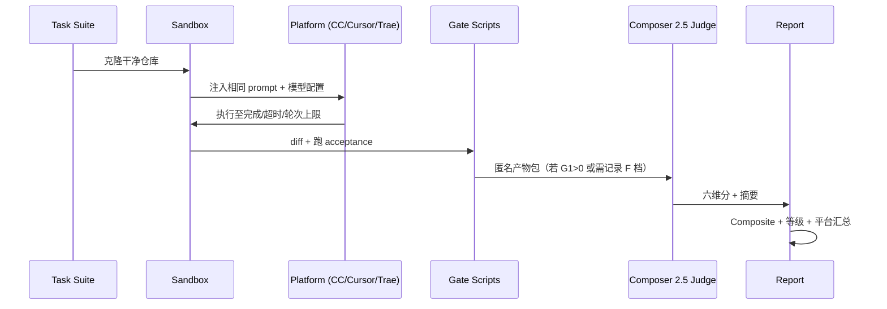

# 三平台同模对比评测与裁判评分体系

> **版本**：V0.1（设计稿）  
> **日期**：2026-05-22  
> **目标**：在 **同一模型（minimax-m2.5）** 与 **同一任务集** 下，对比 **Claude Code（CC）**、**Cursor**、**Trae** 的任务成功率与实现质量；以 **Cursor Composer 2.5** 作为最终裁判进行打分与分档。

---

## 1. 评测目的

| 维度 | 说明 |
|------|------|
| **控制变量** | 模型固定为 `minimax-m2.5`，任务、仓库、验收脚本一致 |
| **对比对象** | 平台运行时差异（Harness、工具链、监管、上下文管理） |
| **核心输出** | 成功率、实现内容摘要、综合得分与等级分档 |
| **裁判原则** | 客观门禁 + Composer 2.5 盲评，减少人工主观偏差 |

**不评测的内容**：模型本身能力差异（已通过同模控制）；UI 美观度；非任务相关的交互体验。

---

## 2. 参测平台定义

| 代号 | 平台 | 典型形态 | 记录字段 |
|------|------|----------|----------|
| **CC** | Claude Code | CLI / IDE 插件 | 版本号、会话 ID、轮次、工具调用日志 |
| **Cursor** | Cursor Agent | Composer / Agent 模式 | 同上 + `composerVersion` |
| **Trae** | Trae SOLO | Plan + 执行 | 同上 + Plan 审批是否人工介入（须标注） |

### 2.1 公平性约束（强制）

1. **模型**：三家均配置 `minimax-m2.5`（或 API 中等价路由名），温度、top_p、max_tokens 写入 `run-manifest.json`。
2. **任务提示词**： verbatim 相同，不含平台专属指令（如「用 Cursor 规则」）。
3. **环境**：同一 OS、Node 版本、依赖 lockfile；每 run 从干净 sandbox 克隆。
4. **时间盒**：单任务上限 **45 分钟** 或 **30 轮** model turn（先到先停）。
5. **人工介入**：默认 **零介入**；若 Trae 强制 Plan 审批，记为 `human_assist=true` 并在最终分档旁标注，不参与同档横向排名。
6. **网络 / MCP**：三家均关闭外部 MCP，或启用同一白名单 MCP 集合。

---

## 3. 任务集设计

### 3.1 任务分层

| 层级 | 代号 | 数量建议 | 说明 | 客观验收权重 |
|------|------|----------|------|--------------|
| L1 | `implement-*` | 4 | 从零实现小模块（API、工具函数） | 高（测试必须通过） |
| L2 | `edit-*` | 4 | 在现有代码库中定点修改 / 修 bug | 高 |
| L3 | `refactor-*` | 2 | 结构调整，行为不变 | 中高（回归测试） |
| L4 | `debug-*` | 2 | 给定失败日志，定位并修复 | 高 |
| L5 | `multi-file-*` | 2 | 跨 3+ 文件联动改动 | 中（部分需裁判） |

**合计 14 任务**；首批可只跑 L1+L2（8 任务）做 smoke。

### 3.2 单任务必备元数据

```yaml
task_id: edit-auth-bug-01
prompt: |
  （完整用户提示词，三家复制粘贴一致）
repo: benchmark/repos/edit-auth-bug-01
acceptance:
  commands:
    - npm test -- --run path/to/test.spec.ts
    - npm run build
  files_must_exist:
    - src/auth/fix.ts
  files_must_not_change:
    - package-lock.json  # 可选：禁止改依赖
timeout_minutes: 45
max_turns: 30
```

### 3.3 成功率（客观）定义

```
任务成功 = acceptance.commands 全部 exit 0
         AND files_must_exist 全部存在
         AND files_must_not_change 校验通过（若声明）
         AND 未触发 human_assist
```

记 **`SR_objective`** = 成功任务数 / 有效任务数。

---

## 4. 评分体系总览

采用 **「双轨制」**：**客观门禁（Gate）** + **裁判评分（Judge Score）** → 合成 **综合分** → 映射 **等级分档**。

```
                    ┌─────────────────┐
  产物 + 日志 ─────►│  Gate 客观门禁   │──► 未过 Gate → 最高 C 档
                    └────────┬────────┘
                             │ 通过
                             ▼
                    ┌─────────────────┐
                    │ Composer 2.5    │
                    │  六维盲评 0–100 │
                    └────────┬────────┘
                             ▼
                    ┌─────────────────┐
                    │ 综合分 + 等级   │
                    │  S / A / B / C / F │
                    └─────────────────┘
```

---

## 5. Gate 客观门禁（0–40 分）

Gate 分由脚本自动计算，**不经过 LLM**。

| 子项 | 分值 | 判定 |
|------|------|------|
| **G1 验收通过** | 25 | 全部 acceptance 命令通过 = 25；部分通过按比例；全失败 = 0 |
| **G2 范围合规** | 8 | 仅改动允许路径；越界每个文件 −2，下限 0 |
| **G3 可构建** | 4 | `build` 或等效命令 exit 0 |
| **G4 无致命泄漏** | 3 | 未提交 `.env`、密钥、超大二进制等（规则表扫描） |

**Gate 硬规则**：

- `G1 = 0`（验收全失败）→ **综合等级封顶 F**，Judge 仍可记录但不参与排名。
- `G1 < 15` → **综合等级封顶 C**，无论 Judge 多高。

---

## 6. Composer 2.5 裁判评分（0–60 分）

### 6.1 裁判角色

- **模型**：Cursor **Composer 2.5**（与参测 Agent 分离的独立会话）。
- **输入**：任务 prompt、验收结果摘要、**git diff**、关键文件片段、平台无关的执行摘要（轮次、耗时、重试次数）。
- **禁止输入**：平台品牌、会话 UI 截图、「这是 CC/Cursor/Trae 的产出」等标识 → **盲评**（run_id 匿名化）。

### 6.2 六维 rubric（每项 0–10，合计 60）

| 维度 | 代号 | 10 分 | 5 分 | 0–2 分 |
|------|------|-------|------|--------|
| **需求完成度** | D1 | 显式与隐含需求均覆盖 | 主路径完成，次要需求遗漏 | 偏离题意或只做一半 |
| **正确性** | D2 | 逻辑严谨，边界处理到位 | 主流程正确，边缘 case 弱 | 明显逻辑错误或隐患 |
| **代码质量** | D3 | 清晰、可维护、符合仓库风格 | 可读但冗余或命名一般 | 混乱、难维护 |
| **最小改动** | D4 | 改动精准，无无关 diff | 有少量无关改动 | 大范围无关修改 |
| **验证意识** | D5 | 主动跑测试/自检并修复 | 有验证行为但不完整 | 未验证即宣称完成 |
| **实现说明** | D6 | diff 与行为一致，易审查 | 基本能看懂做了什么 | 难以理解或前后矛盾 |

**Judge 输出 JSON  schema（强制）**：

```json
{
  "run_id": "anon-7f3a",
  "dimensions": {
    "D1": { "score": 8, "evidence": "..." },
    "D2": { "score": 7, "evidence": "..." },
    "D3": { "score": 6, "evidence": "..." },
    "D4": { "score": 9, "evidence": "..." },
    "D5": { "score": 5, "evidence": "..." },
    "D6": { "score": 7, "evidence": "..." }
  },
  "judge_total": 42,
  "one_line_verdict": "修复正确但缺少边界测试。",
  "implementation_summary": "在 auth 模块增加 token 过期校验并补 2 个单测。"
}
```

### 6.3 裁判一致性

- 每个 `(task_id, platform)` 跑 **2 次独立盲评**，取维度均分；若某维度两次差 ≥ 3 分，触发 **第三次仲裁评**。
- 固定 system prompt + rubric 全文版本号 `JUDGE_RUBRIC_v0.1`，写入结果目录。

---

## 7. 综合分与等级分档

### 7.1 综合分公式

```
Composite = Gate(0–40) + Judge_total(0–60)   →  0–100
```

| 综合分区间 | 等级 | 含义 |
|------------|------|------|
| **90–100** | **S** | 验收通过 + 实现优秀，可作为标杆 run |
| **80–89** | **A** | 验收通过 + 质量良好，少量可改进点 |
| **70–79** | **B** | 验收通过 + 可用但有明显瑕疵 |
| **60–69** | **C** | 勉强通过或 Gate 边缘；或 Judge 高但 G1 偏低（已封顶） |
| **0–59** | **F** | 验收失败或严重偏离 |

### 7.2 平台级汇总指标

| 指标 | 公式 | 用途 |
|------|------|------|
| **SR** | 客观成功任务数 / N |  headline 成功率 |
| **Avg Composite** | 各任务 Composite 均值 | 质量总览 |
| **S+A 占比** | 等级 ∈ {S,A} 的任务比例 | 高质量完成率 |
| **Avg Turns** | 平均 model 轮次 | 效率 |
| **Avg Duration** | 平均墙钟时间 | 效率 |
| **Fallback Rate** | 人工介入或超时 abort 比例 | 可靠性 |

### 7.3 分档可视化（单任务）

```
Composite
100 ┤ S ████████████
 90 ┤   ──────────── S/A 边界
 80 ┤ A ██████████
 70 ┤   ──────────── A/B 边界
 60 ┤ B ████████
     │   ──────────── B/C 边界（且 G1≥15）
 59 ┤ F ░░░░░░░░░░░░  （G1=0 或 Composite<60）
```

---

## 8. 「实现的内容」记录规范

每个 run 除分外，必须产出 **Implementation Record**（中/英均可，模板统一）：

```markdown
## Run: {platform} / {task_id} / {run_id}

### 实现摘要（≤150 字）
...

### 变更文件
| 文件 | 变更类型 | 一行说明 |
|------|----------|----------|

### 关键 diff 片段
（最多 3 处，每处 ≤30 行）

### 验收结果
- test: PASS/FAIL (exit code)
- build: PASS/FAIL

### 执行统计
- turns: N | duration: Xm | tool_calls: N

### 等级
Gate: xx/40 | Judge: xx/60 | **Composite: xx (等级 X)**
```

Composer 2.5 的 `implementation_summary` 字段应与此摘要交叉校验；人工 spot-check 时以 git diff 为准。

---

## 9. 评测执行流程



### 9.1 目录约定

```text
benchmark/
├── md/                          # 设计文档（本文）
├── repos/                       # 任务 sandbox 模板
├── tasks/                       # task yaml
├── runs/
│   └── 2026-05-22/
│       ├── CC/edit-auth-bug-01/run-001/
│       ├── Cursor/edit-auth-bug-01/run-001/
│       └── Trae/edit-auth-bug-01/run-001/
├── judge/
│   └── JUDGE_RUBRIC_v0.1.md
└── reports/
    └── 2026-05-22-summary.md
```

### 9.2 Run Manifest（每家每次必填）

```json
{
  "platform": "Cursor",
  "platform_version": "0.xx",
  "model": "minimax-m2.5",
  "model_params": { "temperature": 0, "max_tokens": 8192 },
  "task_id": "edit-auth-bug-01",
  "started_at": "ISO8601",
  "human_assist": false,
  "prompt_hash": "sha256:..."
}
```

---

## 10. 最终报告模板（跨平台对比）

| 平台 | SR | Avg Composite | S | A | B | C | F | Avg Turns | 备注 |
|------|-----|---------------|---|---|---|---|---|-----------|------|
| CC | | | | | | | | | |
| Cursor | | | | | | | | | |
| Trae | | | | | | | | | human_assist 次数 |

**结论段落（示例结构）**：

1. 同模下客观成功率 SR 差异主要来自 …
2. Judge 维度上 D4/D5 拉开差距最明显 …
3. 标杆 run：`{platform}/{task_id}` Composite xx (S) …

---

## 11. 风险与缓解

| 风险 | 缓解 |
|------|------|
| Composer 2.5 裁判漂移 | 固定 rubric 版本 + 双评 + 仲裁 |
| 平台默认 system prompt 不同 | 记录完整 system 快照；必要时剥离到「最小公共 prompt」 |
| Trae Plan 审批 | 标注 `human_assist`，单独列 SR' |
| 任务泄露 / 过拟合 | 任务集轮换；hold-out 集不参与调参 |
| 成本 | L1 smoke 8 任务先行；全量 14 任务按周批跑 |

---

## 12. 后续迭代（V0.2 候选）

- [ ] Gate 脚本落地：`benchmark/scripts/run-gate.ts`
- [ ] Judge prompt 模板：`benchmark/judge/JUDGE_RUBRIC_v0.1.md`
- [ ] 与 iceCoder `eval-runner` 指标（nodeScore、wastedSteps）可选对齐
- [ ] 增加 **同任务三平台 diff 三方盲评**（Judge 只看 diff，不知平台）
- [ ] 导出 CSV / JSONL 供看板

---

## 附录 A：Judge System Prompt 骨架

```text
你是独立代码审查裁判。你不知道产物来自哪个 IDE/Agent。
仅根据：任务描述、git diff、验收命令输出、执行统计，按 JUDGE_RUBRIC_v0.1 六维打分。
每项 0–10 整数，必须给出 evidence 引用具体文件或行。
输出必须是合法 JSON，无 markdown 包裹。
禁止因代码风格偏好某平台；禁止臆测未出现在材料中的行为。
```

## 附录 B：等级与发布门禁建议（iceCoder 自用）

| 场景 | 建议 |
|------|------|
| 回归 CI | 单任务 Composite ≥ 70 (B) 且 G1=25 |
| 发版对标 | SR ≥ 竞品最高 −5pp，且 Avg Composite 不低于竞品 −3 分 |
| 双模 strict 专项 | 仅跑 L2+L4，对比 adaptive/off |

---

*本文档为评分体系设计稿；首轮实测前须冻结 `tasks/` 与 `JUDGE_RUBRIC_v0.1.md`。*
