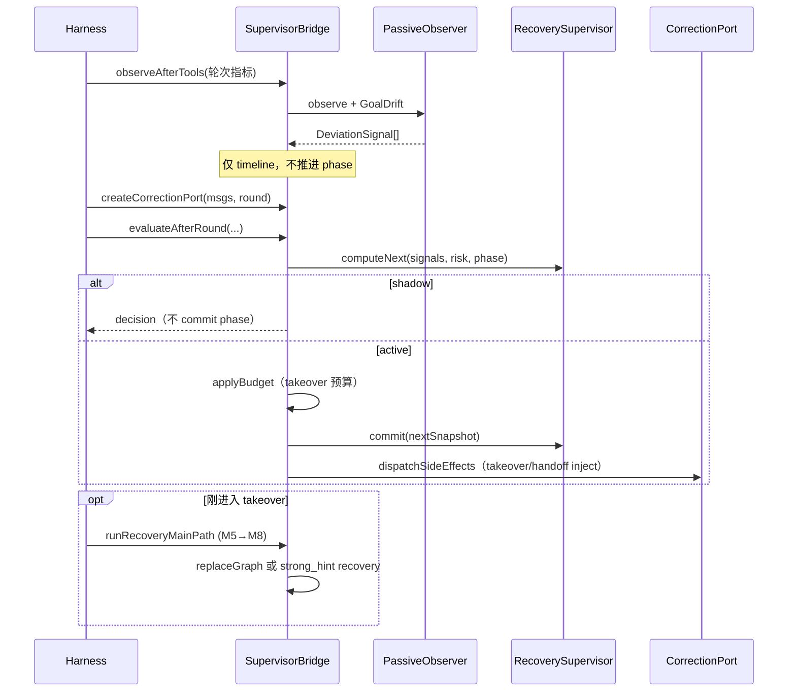
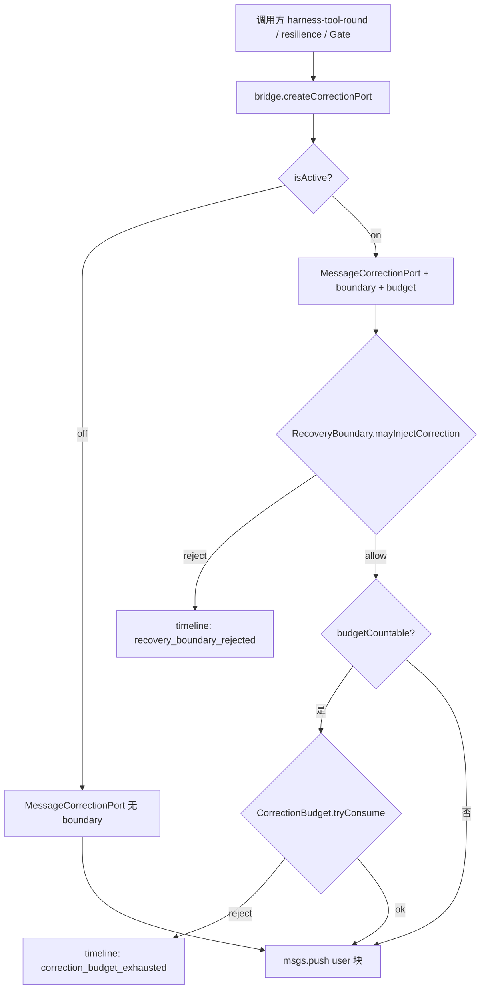

# L2 监管层（Runtime Supervisor）详解

> 版本：2026-06-04  
> 双模总览（含任务图 / 反构图）：[`双模机制详解.md`](./双模机制详解.md)  
> 权威规格：[`requirement/双模方案2-finish.md`](./requirement/双模方案2-finish.md) V1.3.7  
> 代码入口：[`src/harness/supervisor/`](../src/harness/supervisor/) · 统一门面 [`supervisor-bridge.ts`](../src/harness/supervisor/supervisor-bridge.ts)  
> Harness 接入：[`harness-supervisor-round.ts`](../src/harness/harness-supervisor-round.ts)

---

## 1. L2 是什么

**L2（Runtime Supervisor / 监管层）** 是叠在 Harness 主循环（L1）之上的**过程监管层**。它不替代 Planner，也不是验收 Gate。

| 维度 | L2 负责 | L2 不负责 |
|------|---------|-----------|
| 时机 | 每轮工具执行后、无工具轮后 | 不在「无 tool_calls 收尾」里替代 Verification Gate |
| 目标 | 发现偏离、必要时接管任务图、向模型注入纠偏文案 | 不判定「文件是否写后读确认」「npm test 是否通过」 |
| 停止 | `user_checkpoint`（预算/监管熔断） | 不用 L2 拦 `model_done` |

一句话定调：

> **L1 管「能不能收尾」；L2 管「执行过程有没有跑偏、要不要系统接管」。**

与 **L1 Execution Mode**（free / forced）的关系：

- **L1**：`ModeDecisionEngine` 根据 `ModeSignal` 切换 `executionMode`（工具门禁、step gate 等）。
- **L2**：`RecoverySupervisor` 维护 `supervisorPhase`（free / takeover / handoff / cooldown），在 adaptive 下满足条件时进入 **takeover** 并重建或提示任务图。
- 二者通过 **信号** 协作：L2 只 `submitModeSignal`（公理 **I5**），不直接写 `state.executionMode`。

---

## 2. 架构总览

```text
┌─────────────────────────────────────────────────────────────────┐
│ L0  mode-controller / supervisor-config                          │
│     解析 supervisorMode(off|adaptive|strict)、shadow、全局策略包    │
└────────────────────────────┬────────────────────────────────────┘
                             ▼
┌─────────────────────────────────────────────────────────────────┐
│ L2  SupervisorRuntimeBridge（唯一对外门面）                        │
│  ┌──────────────┐  ┌─────────────────┐  ┌──────────────────────┐ │
│  │ PassiveObserver│  │ GoalDriftDetector│  │ RecoverySupervisor   │ │
│  │ (偏离信号 B类) │  │ (goal_drift)     │  │ (相位机 C类决策)     │ │
│  └──────┬───────┘  └────────┬────────┘  └──────────┬───────────┘ │
│         │                   │                      │             │
│         └───────────────────┴──────────────────────┘             │
│                             ▼                                    │
│              CorrectionPort ← RecoveryBoundary + CorrectionBudget│
│                             ▼                                    │
│                    msgs（唯一 C 类写入口，公理 I1）                  │
│  ┌─────────────────────────────────────────────────────────────┐ │
│  │ §10 恢复主路径: M5→M6→M7→M8 → replaceGraph 或 §19.2 降级     │ │
│  └─────────────────────────────────────────────────────────────┘ │
│  EventTimeline → data/runtime/supervisor-events.jsonl            │
└─────────────────────────────────────────────────────────────────┘
```

### 2.1 干预分层（A / B / C）

规格 §2.7；实现时必须归类，避免 Harness 到处 `msgs.push`：

| 类型 | 含义 | 写 `msgs`？ | L2 示例 |
|------|------|-------------|---------|
| **A 生命周期** | 挡状态转移、挡单次工具 | 一般不写长文案 | Permission deny、Verification Gate block |
| **B 观测** | 只记 timeline / 指标 | **否** | `PassiveObserver.observe`、`recordExecutionModeSwitch` |
| **C 纠偏** | 教模型改策略 | **是，且仅经 CorrectionPort** | takeover / recovery / graph_hint |

### 2.2 实现公理（编码准绳）

| 公理 | 含义 |
|------|------|
| **I1** | C 类纠偏写 `msgs` 必须 `CorrectionPort.inject` + `RecoveryBoundary`，禁止旁路 `msgs.push` |
| **I3** | `adaptive` 关键 intent **首轮不** `initGraph`；takeover 后 `replaceGraph` 重建 |
| **I4** | free 段 supervisor 的 `recovery` / `graph_hint` 受 `CorrectionBudget.freeSegmentMaxPerTask` 约束 |
| **I5** | 仅 `execution-mode-constraints` 写 `executionMode`；其它模块只 `submitModeSignal` |
| **I6** | 档位/env 仅在 `mode-controller` 解析；业务读 `globalPolicy.supervisorMode` |
| **I10** | forced 退出前须达到 `forcedMinDwellRounds` 个 task-bearing round |

---

## 3. 运行档位（L0 → L2 行为）

配置：`data/config.json` → `supervisorMode`（Web 顶栏 / `PATCH /api/config/supervisor-mode`）。  
细参：`data/supervisor-config.json`（见 [`环境变量.md`](./环境变量.md)）。

| 档位 | 行为概要 |
|------|----------|
| **off** | `bridge.isActive() === false`：不跑 observe/evaluate 副作用；`createCorrectionPort` 无 boundary/budget；行为与旧 Harness 一致 |
| **adaptive**（默认） | 自由段默认无首轮图（I3）；风险高 + 偏离信号 → takeover；free/forced 由 L1 信号切换 |
| **strict** | 全程强约束；首轮 `task_graph_init`；forced 基线由 L1 维护；V1 **不在** RecoverySupervisor 走 §9 三条件 takeover |
| **shadow** | `ICE_SUPERVISOR_SHADOW=1`：完整跑 evaluate **但不 commit phase**、不 inject takeover；只写 `shadow_diagnostic` timeline |

---

## 4. 核心组件与职责

| 组件 | 文件 | 每一步干什么 |
|------|------|----------------|
| **SupervisorRuntimeBridge** | `supervisor-bridge.ts` | Harness 四钩子唯一入口；聚合配置、创建 CorrectionPort、串联 evaluate 与恢复主路径 |
| **PassiveObserver** | `passive-observer.ts` | 每工具轮末分析：重复失败、无进展、file_loop；**只累积信号 + timeline，不写 msgs** |
| **GoalDriftDetector** | `goal-drift-detector.ts` | 启发式 alignment；连续 N 轮低于阈值 → `goal_drift` signal |
| **RecoverySupervisor** | `recovery-supervisor.ts` | **核心相位机**：free→takeover→handoff→cooldown；决定 takeover/handoff/fail |
| **RecoveryBudgetManager** | `recovery-budget-manager.ts` | takeover 段轮数/token/重试三维预算；耗尽 → `fail{checkpoint}` |
| **CorrectionPort** | `correction-port.ts` | `inject()` 写 user 消息；串联 Boundary → Budget |
| **RecoveryBoundary** | `recovery-boundary.ts` | phase × source × kind 硬门禁（§19.6） |
| **CorrectionBudgetTracker** | `correction-budget.ts` | free 段可计数 inject 次数上限（I4） |
| **WorkspaceStateExtractor 等** | M5–M8 | takeover 后 §10 恢复主路径：快照 → 置信度 → 安全 → 回顾构图 |
| **EventTimeline** | `event-timeline.ts` | switch / recover / handoff / drift / failure 落 JSONL |

---

## 5. 一轮完整流程（逐步）

入口：`evaluateSupervisorAfterRound`（工具轮与无工具轮共用）。



### 5.1 步骤 1：`observeAfterTools`（观测，不决策）

**时机**：每轮 `runHarnessToolRound` 末尾（经 `harness-supervisor-round`）。

**输入**：连续工具失败次数、只读轮数、无 tool 轮数、重复签名、`topFileEdit`（file_loop）、branch recover 等。

**输出**：

1. 本轮 `DeviationSignal[]`（如 `tool_repeat_fail`、`no_progress`、`file_loop`）；
2. 写入 `EventTimeline`（failure/drift 类）；
3. 缓存到 `lastRoundDeviationSignals`（takeover 稳定窗口**只看本轮**）。

**核心**：此阶段 **不** 改变 `supervisorPhase`，**不** inject 纠偏块（B 类）。

### 5.2 步骤 2：`createCorrectionPort`（纠偏出口）

**行为**：

- `off`：裸 `MessageCorrectionPort`，保留历史 W7 抑制；
- `on`：挂 `RecoveryBoundary` + `CorrectionBudgetTracker`；拒绝时写 timeline（`recovery_boundary_rejected` / `correction_budget_exhausted`）。

**核心**：此后任何 C 类文案（Gate recovery、lifecycle、supervisor takeover）都应经此 port（I1）。

### 5.3 步骤 3：`evaluateAfterRound`（决策 + 相位推进）

内部顺序（`supervisor-bridge.ts`）：

1. **合并信号**  
   - `free`：用 `PassiveObserver` **累积**列表（含历史 no_progress 等）；  
   - `takeover` / `handoff_pending`：只用 **本轮** `lastRoundDeviationSignals`（稳定 handoff 不被旧信号污染）。

2. **`RecoverySupervisor.computeNext`** → `{ decision, nextSnapshot }`

3. **`applyBudget`**（非 shadow）  
   - 进入/停留在 takeover：tick 恢复轮数、token 占比；  
   - 耗尽且不可续段 → `decision = fail{ kind: 'checkpoint' }`；  
   - 可续段（`max_recovery_rounds` + soft checkpoint）→ `renewRecoverySegment`，下轮 inject Rebuild。

4. **`commit(nextSnapshot)`**（非 shadow）推进 `supervisorPhase`

5. **`applyDecision` + `dispatchSideEffects`**  
   - `takeover` → `applyTakeover` 经 port 注入 **唯一** `[System Recovery]` takeover 块（phase 须已为 takeover，故 free 段 boundary 拒绝 takeover kind）；  
   - `handoff` → `applyHandoff` 注入 graph_hint 说明交还。

6. **shadow**：跳过 3–5 的 commit/inject，仅 `recordShadowWouldTakeover` 类 diagnostic。

**Harness 侧**：`state.supervisorPhase = bridge.getSupervisorPhase()`。

### 5.4 步骤 4：`runRecoveryMainPath`（接管后恢复，仅 fresh takeover）

**时机**：`evaluate` 决策为 `takeover` 且 phase 刚从 free 进入 takeover（`applyTakeoverRecoveryMainPath`）。

**路径**（§10）：

```text
M5 WorkspaceStateExtractor.extract
  → M6 SnapshotConfidenceEvaluator.evaluate
      ├─ confidence < templateGraphMin → 二级降级
      └─ 满足阈值
          → M7 RecoverySafetyChecker.check
              ├─ !recoverable → 二级降级
              └─ recoverable
                  → M8 RetrospectiveGraphBuilder.build
                      ├─ 成功 + graphExecutor → 一级 replaceGraph + enterTakeover
                      └─ 失败 → 二级降级
```

| 层级 | 行为 | 对模型的影响 |
|------|------|----------------|
| **一级** `template_graph` | `GraphExecutor.replaceGraph` | **下一轮 prep** 注入新图节点上下文 |
| **二级** `strong_hint` | CorrectionPort 单条 `[System Recovery]` recovery 块 | 无新图，靠文案 + L1 forced 约束 |
| **off/shadow** | 只算路径写 timeline | 不改图、不 inject |

**时序要点**：进入 takeover **当轮**先跑完旧图 `evaluateRound`；`replaceGraph` 在 after-round 末尾执行；**新图从下一轮 `prepareHarnessRound` 开始生效**。

### 5.5 步骤 5：checkpoint 停止（可选）

`decision.action === 'fail' && kind === 'checkpoint'` → `loopController.stop('user_checkpoint')` → Harness 收尾，`stopReason: 'user_checkpoint'`。

来源：RecoveryBudget 耗尽、或监管判定需人工检查点（非 Verification Gate 熔断）。

---

## 6. RecoverySupervisor 相位机（核心状态机）

```text
                    §9 三条件（仅 adaptive + free）
free ──────────────────────────────────────────────► takeover
  ▲                                                    │
  │                                                    │ 稳定窗口内无 trigger signals
  │                                                    ▼
  │                                              handoff_pending
  │                                                    │
  │                              仍有 signals ─────────┤──► 回 takeover（清零稳定计数）
  │                              无 signals ───────────┘
  │                                                    ▼
  └──────── cooldownRemaining 递减 ─────────────── cooldown
```

### 6.1 各相位做什么

| 相位 | 核心行为 |
|------|----------|
| **free** | 观察；adaptive 下评估 §9 三条件；不满足则 `continue` |
| **takeover** | L1 通常 forced；注入 takeover 块 + 可能 replaceGraph；稳定轮数达标 → `handoff_pending` |
| **handoff_pending** | 再观察一轮：仍有偏离 → 回 takeover；否则 → handoff + 进入 cooldown |
| **cooldown** | 每轮 `cooldownRemaining--`；归零回 free；**强信号**可提前唤醒重评 takeover |

### 6.2 adaptive 进入 takeover 的三条件（§9）

须 **同时** 满足（`recovery-supervisor.ts` `tickFree`）：

1. **关键域**：`task.domain` 以 `critical_` 开头（`inferTaskDomain`）；
2. **风险分**：`riskScore >= adaptiveFree.riskThreshold`；
3. **触发信号**：本轮/累积存在 `DeviationSignal`（`tool_repeat_fail`、`no_progress`、`file_loop`、`goal_drift` 等，且 triggers 开启）。

**strict**：V1 不在此状态机 takeover；全程 forced + 首轮建图由 L1/L2-7 门禁保证。

### 6.3 稳定 handoff 与 cooldown 参数

来自 `supervisor-config.json` → `SupervisorParams`：

- `stabilityWindowRounds`：takeover 内连续无 trigger 信号轮数；
- `handoffCooldownRounds`：交还后冷却轮数。

adaptive 取 `adaptiveTakeover` 列，strict 取 `strict` 列。

### 6.4 cooldown 提前唤醒（调优 2026-05-26）

当 `tool_repeat_fail.count >= 5`、`no_progress.rounds >= 6` 或 `user_force_takeover` 时，跳过剩余 cooldown，立刻按 free 规则重评 takeover，避免 handoff 后「同签名反复失败但监管卡住」。

---

## 7. 纠偏机制详解

### 7.1 纠偏块类型（`CorrectionBlock.kind`）

| kind | 典型内容 | 主要 phase |
|------|----------|------------|
| `takeover` | `[System Recovery]` 接管说明 + 信号 + 证据 | takeover（inject 前 phase 已 commit 为 takeover） |
| `recovery` | `[System Recovery]` 二级强提示、Gate 续跑提示 | free / takeover |
| `graph_hint` | 强制步进/图节点提示 | forced 段经 `composeGraphHint` |
| `shadow_diagnostic` | shadow 审计用 | shadow 策略允许时 |

### 7.2 一次 inject 的闸门顺序



**RecoveryBoundary 规则摘要**：

- `free` + `supervisor` + `takeover` kind → **拒绝**（takeover 文案只能在 phase=takeover 后注入）；
- `takeover` + 非 `supervisor` source → **拒绝**；
- `handoff_pending` / `cooldown` + 非 supervisor 的 takeover/recovery → **拒绝**；
- `free` + supervisor + recovery/graph_hint → **允许且 budgetCountable**（交 I4 计数）。

**lifecycle 类 recovery**（如连续工具失败阶梯 `source=lifecycle`）：boundary 放行且 **不计** I4 budget（规格：不占 free 段配额）。

### 7.3 free 段「轻纠偏」与「重接管」策略（I4 + §9）

- free 段允许 **少量** supervisor `recovery` / `graph_hint`（预算内），避免刷屏；
- 超出预算 → inject 丢弃，**只累积 Observer 信号**，等待 takeover 一次性 C 类块；
- 避免 Harness resilience + GraphExecutor + Supervisor 三路同时 `msgs.push`（违反 I1「规则散」）。

### 7.4 `composeGraphHint`（forced 下图提示）

**入口**：`bridge.composeGraphHint`（`mode-gating.ts` 实现）；禁止直接 `port.inject({ kind: 'graph_hint' })`。

**路由**：

- `executionMode !== forced` → **drop**（free 段不注入图 hint）；
- `forced` → 经 CorrectionPort inject + timeline `recover:graph_hint`。

调用方：`harness-tool-round` 的 step warn/block、`evaluateRound` force_switch 等。

### 7.5 手动触发

`bridge.submitManualTrigger`：

- `scope_creep`：范围蔓延；
- `user_force_takeover`：用户/运维强制接管信号。

须 `supervisor-config` 对应 trigger 开启；成功后进入 Observer 累积，下轮 evaluate 可触发 takeover。

---

## 8. 偏离信号（DeviationSignal）

由 `PassiveObserver` / `GoalDriftDetector` / 手动触发产生，供 §9 条件三与 takeover 文案使用。

| 信号类型 | 典型触发条件（阈值见 `SupervisorTriggers`） |
|----------|---------------------------------------------|
| `tool_repeat_fail` | 同参重复失败、全工具失败、branch recover |
| `no_progress` | 连续只读轮、连续无 tool 轮、失败堆积 |
| `file_loop` | 单文件编辑次数 ≥ `fileLoopMin`（**strict 档更易触发**） |
| `goal_drift` | 连续 N 轮 alignment < `alignmentThreshold` |
| `scope_creep` / `user_force_takeover` | 手动 |

同 type 信号在 Observer 内 **滑窗保留最近 3 条**，防止长任务 takeover 理由过长。

---

## 9. Harness 四钩子（§14.1）

| 钩子 | 调用点 | 作用 |
|------|--------|------|
| **observeAfterTools** | 每工具轮末 | B 类观测 |
| **evaluateAfterRound** | 工具轮末 / 无工具轮末 | 相位机 + 预算 + C 类 inject |
| **runRecoveryMainPath** | takeover Fresh entry | §10 一级/二级恢复 |
| **createCorrectionPort** | Gate、resilience、evaluate 前 | 统一 C 类出口 |

其它门禁：

| 钩子 | 作用 |
|------|------|
| `shouldInitTaskGraphAtFirstRound` | adaptive 关键域首轮 **不** init；strict 首轮 init（I3） |
| `resetForNewTask` | 新任务清 observer/phase/budget |
| `snapshotForCheckpoint` / `restoreFromCheckpoint` | T08 phase、timeline tail、budget 续跑 |

---

## 10. L2 与 L1 Gate 的边界

| 场景 | L2 | Verification Gate |
|------|-----|-------------------|
| 写了文件未 `file_info` 确认 | 不拦 model_done | **拦** |
| npm test 失败但文件已确认 | 可 digest/纠偏，不拦 | 不拦 |
| 偏离/重复失败 | takeover / recovery inject | 不参与 |
| 停止原因 | `user_checkpoint` | `verification_exhausted` |

Gate 在 L2 活跃时 inject 也须 `createCorrectionPort`（`harness-round-no-tools.ts`），与 I1 一致。

更完整的 Harness + Gate 顺序见：[`harness/Harness-L2与Gate工作逻辑.md`](./harness/Harness-L2与Gate工作逻辑.md)（**本文档为 L2 专题；该文保留 Gate 与主循环**）。

---

## 11. 批次落地对照（L2-1～L2-8）

| 批次 | 交付能力 |
|------|----------|
| L2-1 | EventTimeline + bridge 骨架 + shadow 写 timeline |
| L2-2 | PassiveObserver 收口 free 段散落 inject |
| L2-3 | RecoverySupervisor evaluate/applyTakeover/applyHandoff |
| L2-4 | RecoveryBudgetManager + GoalDriftDetector + 手动 trigger |
| L2-5 | §10 主路径 M5→M8 + replaceGraph + §19.2 二级强提示 |
| L2-6 | Harness 四钩子 + checkpoint round-trip + I4 CorrectionBudget |
| L2-7 | RecoveryBoundary + composeGraphHint + firstRoundGraph 门禁 |
| L2-8 | DoD 自检 + off 回归 |

---

## 12. 配置、观测与测试

### 12.1 配置

- 档位：`data/config.json` → `supervisorMode`
- 参数：`data/supervisor-config.json`（riskThreshold、triggers、correctionBudget、takeover 窗口等）
- 加载：`loadHarnessSupervisorRuntime()`（chat / run / chat-ws）

### 12.2 观测

- 实时：WebSocket `execution_mode_enter/exit`；冰豆 `#status-turn` 显示 forced 与信号
- 历史：聊天 `~supervisor`；API `GET /api/supervisor/events?days=7&event=recover&limit=10`
- 落盘：`data/runtime/supervisor-events.jsonl`

### 12.3 测试

| 范围 | 文件 |
|------|------|
| RecoveryBoundary 64 矩阵 | `test/harness/recovery-boundary.test.ts` |
| 双模 6 场景 e2e | `test/e2e/dual-mode-scenarios.test.ts` |
| firstRoundGraph | `test/harness/harness-round-prep-first-graph.test.ts` |
| 手工场景 | [`requirement/L2测试过程.md`](./requirement/L2测试过程.md) |

回归命令（off 兼容）：

```bash
npx tsc --noEmit
npm test
# 配置 supervisorMode=off 后跑 harness / execution-mode 相关套件
```

---

## 13. 反模式（禁止）

- ❌ 在 `harness-tool-round` / `harness-resilience` 直接 `msgs.push('[System]...')` → 违反 I1  
- ❌ 子模块直接写 `state.executionMode = 'forced'` → 违反 I5  
- ❌ 业务代码读 `process.env.ICE_SUPERVISOR_MODE` → 已废弃，用 config  
- ❌ adaptive 关键 intent 首轮 `initGraph` → 违反 I3  
- ❌ 绕过 `createCorrectionPort` 另建 port 写 takeover → 绕过 boundary + budget  

---

## 14. 关键源码索引

| 主题 | 路径 |
|------|------|
| Bridge 门面 | `src/harness/supervisor/supervisor-bridge.ts` |
| 相位机 | `src/harness/supervisor/recovery-supervisor.ts` |
| 观测 | `src/harness/supervisor/passive-observer.ts` |
| 纠偏出口 | `src/harness/supervisor/correction-port.ts` |
| 门禁/预算 | `recovery-boundary.ts` · `correction-budget.ts` |
| Graph hint | `src/harness/supervisor/mode-gating.ts` |
| Harness 串联 | `src/harness/harness-supervisor-round.ts` |
| 恢复主路径 | `src/harness/harness-recovery-main-path.ts` |
| 类型定义 | `src/types/supervisor.ts` |

---

## 15. 相关文档

| 文档 | 用途 |
|------|------|
| [`requirement/双模方案2-finish.md`](./requirement/双模方案2-finish.md) | 规格权威 |
| [`requirement/双模落地缺口-finish.md`](./requirement/双模落地缺口-finish.md) | 批次 / DoD |
| [`harness/Harness-L2与Gate工作逻辑.md`](./harness/Harness-L2与Gate工作逻辑.md) | Harness 主循环 + Gate 顺序 |
| [`双模 L2 审计与优化清单.md`](./双模%20L2%20审计与优化清单.md) | P0–P3 优化项 |
| [`requirement/L2测试过程.md`](./requirement/L2测试过程.md) | 手工验收 prompt |
| [`环境变量.md`](./环境变量.md) | `ICE_SUPERVISOR_*` 与 config |

---

## 修订记录

| 日期 | 说明 |
|------|------|
| 2026-06-04 | 初版：L2 监管层专题文档（流程、相位机、纠偏、与 L1 边界） |
