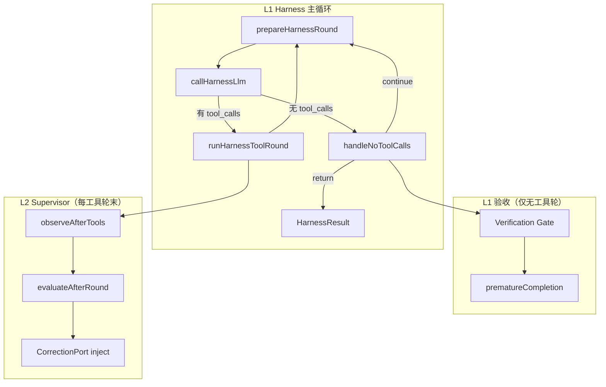
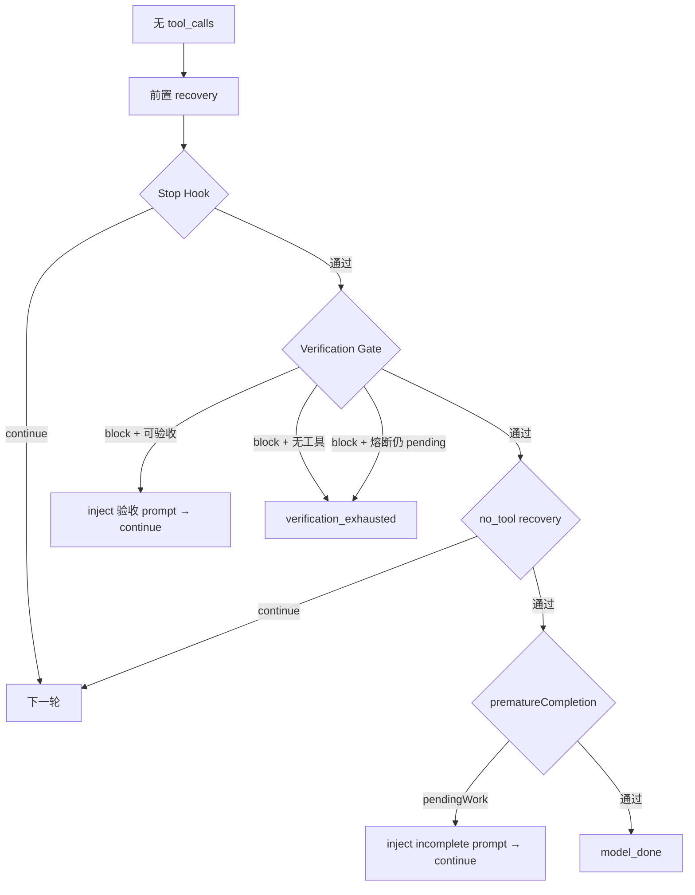

# Harness、L2 监管与 Gate 收尾工作逻辑

> 版本：2026-06-04  
> 适用范围：iceCoder Harness 主循环、Verification Gate / Acceptance Gate  
> **L2 监管层专题**（相位机、纠偏、takeover、公理 I1–I6）已迁至 [`../L2监管层详解.md`](../L2监管层详解.md)；本文 §4 保留精简索引。  
> 相关源码：`src/harness/harness.ts`、`harness-round-no-tools.ts`、`harness-tool-round.ts`、`supervisor/*`、`incomplete-completion.ts`、`document-deliverable.ts`

---

## 1. 架构总览

Harness 运行时分为 **三条并行线**，职责互不替代：

| 层级 | 名称 | 职责 | 典型停止原因 |
|------|------|------|--------------|
| **L1 主循环** | Harness Core | 消息预处理 → LLM → 工具执行 → 无工具收尾 | `model_done`、`max_output_tokens`、`user_abort` |
| **L1 验收** | Verification Gate + Acceptance Gate | **收尾硬门槛**：全部变更文件写后读确认、benchmark 多步命令 | `verification_exhausted`（熔断） |
| **L2** | SupervisorRuntimeBridge | **过程监管**：偏离检测、takeover/handoff、纠偏 inject | `user_checkpoint`（预算/监管） |

**定调（当前实现）：**

- **Gate** 只管收尾是否放行：**凡有 `filesChanged` 须写后读确认**；npm test / engineering 测试**不再**作为 Gate 硬条件。
- **L2** 只管执行过程是否跑偏；**不扩展**为验收层。
- `verificationStatus` 仍由工具结果更新，供 telemetry、checkpoint、L2 只读、执行期软约束使用。



---

## 2. Harness 主循环（L1 Core）

入口：`Harness.run()` → `while (true)` 迭代。

### 2.1 单轮流程

```
prepareHarnessRound
  ├─ 消息预算 / 压缩 / 记忆注入
  ├─ Runtime State / Workspace Anchor 注入
  ├─ 首轮 TaskGraph init（L2 门禁，见 §4.4）
  └─ ExecutionMode 评估

callHarnessLlm
  ├─ 调用 LLM（可流式）
  └─ 文本 tool_call 抢救（salvage）

分支：
  ├─ 有 tool_calls → runHarnessToolRound → continue
  └─ 无 tool_calls → handleNoToolCalls
        ├─ continue → 下一轮
        └─ return   → HarnessResult（结束）
```

### 2.2 工具轮要点（`runHarnessToolRound`）

| 阶段 | 行为 |
|------|------|
| 工具执行前 | Preflight（路径/dist/build diagnostic 等）、ExecutionMode 约束 |
| 工具执行 | 更新 `TaskState`、`RepoContext`；Acceptance Gate 进度；file 写后版本 Map |
| 工具执行后 | BranchBudget、rebuild escalation、verification digest inject（软提示） |
| **L2 接入** | `observeAfterTools` → `evaluateAfterRound`（见 §4） |
| 收尾 | 记忆注入；`verificationGateContinuationCount = 0`（有工具则重置 Gate 计数） |

工具轮 **不** 调用 Verification Gate；Gate 仅在「无 tool_calls」时触发。

### 2.3 执行期约束（非 Gate，不拦 model_done）

以下机制在**工具执行过程中**生效，与 Gate 独立：

| 机制 | 文件 | 作用 |
|------|------|------|
| Preflight dist 读拦截 | `harness-tool-preflight.ts` | `verificationStatus=required/failed` 时禁读 `dist/` |
| Build Diagnostic Gate | 同上 | build 失败后暂停 build 类 `run_command` |
| BranchBudget | `branch-budget.ts` | 限制重复失败命令/文件编辑 |
| verification digest | `harness-tool-round.ts` | 验收命令多次失败后 inject 摘要 |
| **连续工具失败阶梯** | `failure-evidence-recovery.ts` | 2~3 轻提示 / 4~6 证据包 / 7~9 强警告；**L2 开启时仍注入**（`source=lifecycle`，不占 I4 budget） |
| **write 截断恢复** | `harness-tool-truncation-recovery.ts` | `finishReason=length` 或 output 顶满且 write 缺 `path` 时 skip + 换策略提示 |
| step-review | `step-review.ts` | `verificationStatus=failed` 时不计为「有进展」 |

---

## 3. Gate 收尾逻辑

Gate 在 `handleNoToolCalls` 中运行，**每一轮** LLM 返回无 `tool_calls` 时都会评估（不限最后一轮）。

### 3.1 无工具轮完整顺序

```
1. 失忆恢复（压缩后）
2. max-output-tokens 恢复 / 停止
3. 空响应 / 仅 reasoning 重试
4. Stop Hook（模型自述未完成）
5. ★ Verification Gate（Acceptance + 写后读确认）
6. no_tool execution recovery（该调工具没调）
7. ★ prematureCompletionRecovery（pendingWork 第二道栏）
8. model_done 正常收尾
```



### 3.2 Verification Gate（硬验收）

**判定函数：** `TaskState.isVerificationBlockingFinal(acceptanceIncomplete)`

| 条件 | 是否 block |
|------|-----------|
| `acceptanceIncomplete === true` | ✅ |
| 存在未确认的 `filesChanged` 路径 | ✅ |
| 全部变更已 `file_info`/`read_file` 确认 | ❌ |
| `verificationStatus === failed`（npm test 失败） | ❌ |
| 无写文件 | ❌ |

**写后确认路径：** `writeConfirmationPaths(filesChanged)` = **全部** `filesChanged` 条目（含 `.ts`、`.py`、`.java`、`.md` 等）。

**交付物分类（仅 telemetry / 软提示）：** `fileDeliverablePaths(filesChanged)` = 变更列表中**非工程白名单扩展名**的路径（`.md`、`.json`、无扩展名等），**不**再单独决定 Gate 是否拦截。

**写后确认机制（版本 Map）：**

```
write_file / edit_file  → fileDeliverableWriteVersion[path]++
file_info / read_file   → fileDeliverableConfirmVersion[path] = writeVersion
全部 path 确认          → tryMarkFileDeliverablesVerified() → verificationStatus = passed
```

**共享查询（Gate / prematureCompletion / tool-planner / checkpoint 一致）：**

- `hasUnconfirmedFileDeliverables(filesChanged, writeVersions, confirmVersions)` — 基于 `writeConfirmationPaths`
- `snapshotHasUnconfirmedFileDeliverables(taskSnapshot)`

**工具可用性：** `canVerifyDeliverableKind(filesChanged, toolNames, acceptanceIncomplete)`

| pending 类型 | 需要工具 |
|--------------|----------|
| Acceptance Gate | `run_command` |
| 任一未确认变更 | `file_info` / `read_file` / `open_file` |

**Gate 注入：** L2 活跃时经 `CorrectionPort`（`kind: recovery`），否则裸 `msgs.push`。

**熔断：** `verificationGateContinuationCount >= MAX` → 尝试 `reconcileFileDeliverablesAfterWrite`；仍 pending → `verification_exhausted`。

### 3.3 Acceptance Gate（独立硬验收）

与 Verification Gate **并列**，用于 benchmark 等多步命令链（如 `npm ci → test → build`）。

| 项目 | 说明 |
|------|------|
| 管理器 | `TaskAcceptanceTracker` |
| pending 判定 | `hasPendingAcceptanceWork(acceptance)` |
| 同步 | `syncTaskVerificationFromAcceptance` → 写回 `TaskState.verificationStatus` |
| 拦截点 | Gate 的 `acceptanceIncomplete` + prematureCompletion 的 `hasPendingWork` |
| inject | `acceptance.buildAcceptancePrompt()` |

### 3.4 prematureCompletionRecovery（第二道收尾栏）

**判定：** `hasPendingWork(task, acceptance?)`

```typescript
// 三者任一成立 → pendingWork = true
hasPendingAcceptanceWork(acceptance)
hasUnfulfilledFileDeliverableGoal(goal, filesChanged, intent)  // goal 要求写文件但未写
snapshotHasUnconfirmedFileDeliverables(task)                     // 与 Gate 同标尺
```

Gate 通过后若仍 `pendingWork`，inject `buildIncompleteContinuationPrompt` → `continue`（有上限 `MAX_PREMATURE_COMPLETION_RECOVERY`）。

**注意：** npm test 失败、`verificationStatus=required` **不再**单独触发 pendingWork；但**未写后读确认**仍会。

### 3.5 Stop Hook 跳过条件

避免与写后读 Gate 叠层拦截：

1. casual 意图（question / inspect）
2. `filesChanged.length > 0`（凡有变更即进入写后读阶段，跳过 Stop Hook）
3. `!pendingWork && 本轮已调过工具`

Stop Hook 本身只识别模型回复中的**前向未完成承诺**（如「我还需要继续」「next step」）。

### 3.6 model_done 收尾

- `tryMarkFileDeliverablesVerified()` 最后一次同步
- TaskGraph `advanceOrComplete`（若有）
- checkpoint：`pendingWork ? 'paused' : 'completed'`
- `stopReason: 'model_done'`

---

## 4. L2 Supervisor 监管逻辑（精简）

> 完整说明见 [`../L2监管层详解.md`](../L2监管层详解.md)。

L2 由 `SupervisorRuntimeBridge` 承载；档位见 `data/config.json` 的 `supervisorMode`（`ICE_SUPERVISOR_MODE` 已废弃）。

### 4.1 核心组件

| 组件 | 职责 |
|------|------|
| **PassiveObserver** | 每轮采集偏离信号（重复失败、无进展、file_loop 等） |
| **GoalDriftDetector** | 目标漂移信号（`goal_drift`） |
| **RecoverySupervisor** | 相位机：free → takeover → handoff → cooldown |
| **CorrectionPort** | 唯一纠偏写消息入口（RecoveryBoundary + Budget） |
| **EventTimeline** | 决策与信号持久化 |

### 4.2 接入时机

| 时机 | 入口 | 行为 |
|------|------|------|
| **每工具轮末** | `observeAfterTools` | 累积 signal + timeline，**不直接拦 model_done** |
| **每工具轮末** | `evaluateAfterRound` | 相位机决策；takeover/handoff inject |
| **takeover 进入 / handoff 回退** | `applyTakeoverRecoveryMainPath` | §10 M5→M8；`replaceGraph` 或 §19.2 降级（新图下轮 prep 注入） |
| **工具轮内** | `composeGraphHint` | forced 模式下 graph hint |
| **无工具 continuation** | `createCorrectionPort` | Gate / recovery 消息走 CorrectionPort |
| **首轮 prep** | `shouldInitTaskGraphAtFirstRound` | adaptive 首轮不 init 图；strict 首轮 init |
| **新任务** | `resetForNewTask` | 复位 observer / phase / budget |

### 4.3 RecoverySupervisor 相位机

```
free ──(§9 三条件满足)──► takeover ──(稳定窗口)──► handoff_pending ──► cooldown ──► free
                              │
                              └── fail{checkpoint} → user_checkpoint 停止
```

| 相位 | 行为 |
|------|------|
| **free** | 观察 signal，满足条件则进入 takeover |
| **takeover** | inject `[System Recovery]`；**已**调用 `runRecoveryMainPath` → `replaceGraph` 或 strong_hint 降级 |

**时序说明：** 进入 takeover 当轮先跑完旧图 `evaluateRound`，`replaceGraph` 在 after-round 末尾执行；**新图节点上下文从下一轮 prep 注入**。
| **handoff_pending** | 准备交还 L1 执行权 |
| **cooldown** | 冷却若干轮后回 free |

**shadow 模式：** 只写 timeline，不 commit phase 变更、不 inject。

**停止：** `decision.action === 'fail' && kind === 'checkpoint'` → Harness `user_checkpoint`（监管停，非 Gate）。

### 4.4 PassiveObserver 信号类型（示例）

- 重复工具失败 / 连续无进展
- 只读循环（file_loop）
- branch recover 触发
- 手动 trigger：`scope_creep`、`user_force_takeover`
- `goal_drift`（GoalDriftDetector）

### 4.5 L2 与验收的关系

| 项目 | L2 行为 |
|------|---------|
| file Gate | **不参与** |
| npm test 是否通过 | **不拦** model_done |
| `verificationStatus` | **只读** → workspace snapshot / 置信度 / 图节点标 done |
| inject 路径 | CorrectionPort（`kind: takeover / recovery / graph_hint`） |

---

## 5. 行为速查表

| 场景 | Verification Gate | prematureCompletion | L2 | 能否 model_done |
|------|-------------------|---------------------|-----|-----------------|
| 写 `.md` 未 `file_info` | ✅ 拦 | ✅ 拦 | 旁观 | ❌ |
| 只改 `.ts` 未读确认 | ✅ 拦 | ✅ 拦 | 旁观 | ❌ |
| 只改 `.ts` 已读确认、未跑测 | ❌ | ❌ | 可能纠偏 | ✅ |
| npm test 失败想停（已读确认） | ❌ | ❌ | 可能 digest | ✅ |
| code + README，任一未确认 | ✅ 拦 | ✅ 拦 | 旁观 | ❌ |
| 全部已读确认，code 未测 | ❌ | ❌ | 旁观 | ✅ |
| Acceptance 只完成部分命令 | ✅ 拦 | ✅ 拦 | 旁观 | ❌ |
| 该调工具却只聊天 | no_tool recovery | 视 pending | 旁观 | 视情况 |
| L2 预算耗尽 | — | — | user_checkpoint | ❌ |

---

## 6. 停止原因一览

| stopReason | 来源 | 说明 |
|------------|------|------|
| `model_done` | Gate 通过后正常收尾 | 主成功路径 |
| `verification_exhausted` | Verification Gate 熔断 / 无验收工具 | file 或 Acceptance 无法继续 |
| `user_checkpoint` | L2 RecoverySupervisor | 监管/预算停止 |
| `stop_hook` | Stop Hook 连续干预超限 | |
| `max_output_tokens` | 输出 token 截断 recovery 耗尽 | |
| `user_abort` | 用户取消 | |

---

## 7. 关键源码索引

| 主题 | 文件 |
|------|------|
| 主循环 | `src/harness/harness.ts` |
| 轮次准备 | `src/harness/harness-round-prep.ts` |
| 工具轮 | `src/harness/harness-tool-round.ts` |
| 无工具轮 / Gate | `src/harness/harness-round-no-tools.ts` |
| pendingWork | `src/harness/incomplete-completion.ts` |
| file 路径 / 版本判定 | `src/harness/document-deliverable.ts` |
| Gate 判定 | `src/harness/task-state.ts` |
| Acceptance Gate | `src/harness/task-acceptance-tracker.ts` |
| L2 Bridge | `src/harness/supervisor/supervisor-bridge.ts` |
| L2 相位机 | `src/harness/supervisor/recovery-supervisor.ts` |
| L2 观察器 | `src/harness/supervisor/passive-observer.ts` |
| Stopping rules prompt | `src/prompts/sections.ts` |
| checkpoint 续跑建议 | `src/harness/checkpoint.ts` |
| tool-planner 软 hint | `src/harness/tool-planner.ts` |

---

## 8. 变更记录

| 日期 | 变更 |
|------|------|
| 2026-05-28 | 统一写后读：Gate / pendingWork / stop hook 均基于全部 `filesChanged`；engineering 测试仍非硬条件 |
| 2026-05-28 | 初版：弱化 Verification Gate（仅 file 验收 + Acceptance）；统一 `snapshotHasUnconfirmedFileDeliverables`；P3 stop hook / tool-planner 对齐 |
