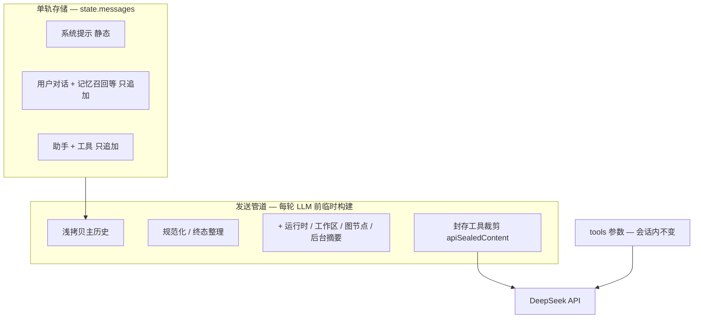

# 前缀缓存优化方案（单轨存储 + 发送管道 + 封存裁剪）

> 版本：2026-06-02  
> 状态：**设计文档（待实施）**  
> 适用范围：Harness 上下文组装、DeepSeek / OpenAI 兼容 API 的前缀缓存  
> 相关源码：`src/harness/context-assembler.ts`、`harness-round-prep.ts`、`harness-message-budget.ts`、`harness-compaction.ts`、`harness-runtime-inject.ts`、`workspace-anchor.ts`、`src/llm/openai-adapter.ts`

---

## 1. 背景与目标

DeepSeek（及 OpenAI 等）提供 **服务端前缀缓存**：当请求提示词的前缀与已持久化前缀 **字节级完全一致** 时，重叠部分按 **缓存命中（cache hit）** 计费，单价约为 **缓存未命中（cache miss）** 的 **1/50**（以官方定价为准）。

iceCoder 作为多轮工具调用型 Agent，单次任务常含 **15～30 次** LLM 调用，上下文随对话线性增长。若前缀稳定，后续每轮大部分输入 token 可走缓存命中，显著降低 API 成本。

**本方案目标：**

- 在 **少改现有 Harness** 的前提下，最大化 DeepSeek 前缀缓存命中率；
- **保留** 上下文压缩器、思考（thinking）模式多轮工具调用、记忆注入等现有能力；
- 将「三层提示词结构」收敛为本项目可落地的 **单轨存储 + 发送管道 + 封存裁剪** 方案（仅一份 `state.messages`，LLM 调用前经发送管道临时处理；**非**两套持久化存储）。

---

## 2. 参考模型：三层提示词结构

| 层级 | 名称 | 内容 | 约束 |
|------|------|------|------|
| 第一层 | **不可变前缀** | 系统提示词 + 工具定义 | 会话开始即冻结，每轮字节完全一致 |
| 第二层 | **只追加日志** | `[助手][工具][助手]…` 对话历史 | 只往后追加，不修改已发送字节 |
| 第三层 | **易失草稿** | 思维链（CoT）、临时运行时状态 | 每轮重置；理想情况下不进缓存前缀、也不发给服务器 |

**DeepSeek 机制要点（官方文档）：**

- 默认开启，无需额外 API 参数；
- 前缀匹配为 **尽力而为（best-effort）**，不保证 100% 命中；
- 缓存单元约 **64 个 token**，须完整单元匹配；
- 响应 `usage` 提供 `prompt_cache_hit_tokens` / `prompt_cache_miss_tokens`；
- 压缩或改写历史会导致旧前缀失效（开启新的 **缓存分段**）。

---

## 3. 现状诊断（本项目已做 / 未做）

### 3.1 已对齐第一层（不可变前缀）的部分

`ContextAssembler` 已将静态与动态分离：

```text
1. 系统提示词（跨轮次不变）
2. 动态上下文（环境 / 记忆 / 偏好 → 独立 user 消息，不污染 system 前缀）
3. 工具定义（会话内不变；tool-offering 已按 name 排序）
```

相关注释见 `src/harness/context-assembler.ts`。

### 3.2 破坏「只追加日志」的主要行为

| 行为 | 位置 | 影响 |
|------|------|------|
| `applyToolResultBudget` 就地修改旧工具结果正文 | `harness-round-prep.ts` 第 79 行、`harness-compaction.ts` 第 129 行 | **最大命中率杀手**：工具条数增加时裁剪窗口前移，旧消息字节变化 |
| `applySubAgentResultRetention` 修改工具正文 | `harness-round-prep.ts`（发送管道入口） | 与主历史共享引用时会污染持久历史 |
| `upsertRuntimeContextMessage` | `harness-runtime-inject.ts` | 删除旧块并写入主历史 |
| `upsertWorkspaceAnchorMessage` | `workspace-anchor.ts` | 同上 |
| `ContextCompactor` 硬压缩 / 微压缩 | `context-compactor.ts` | 整段重写 → **缓存分段清零**（可接受的边界） |
| ~~`reasoningContent` 写入 assistant 并回传 API~~ | — | **已调整（2026-06）**：不进 `state.messages`、不回传 API；当轮 `reasoning_stream_delta` 仅前端展示 |

### 3.3 第三层（易失草稿）在本项目的取舍

- **思维链**：`reasoning_content` **不进主历史、不发 API**（省 token；无 tool 多轮时官方可忽略）。流式经 `reasoning_stream` 仅 UI 展示。若使用 DeepSeek thinking + 多轮 tool，个别配置可能 400，需实测或按 provider 开关。
- **可行**：运行时状态 / 工作区锚点 / 图节点 / 后台摘要等 **易变块** 不进主历史，仅在 **发送管道** 末尾注入。

---

## 4. 最佳取舍：单轨存储 + 发送管道 + 封存裁剪

> **术语说明：** 本文曾用「双轨」指「主历史 vs 发给 API 的视图」之 **职责分离**，易被误解为两套持久化会话。实际落地为 **单轨**——唯一真相源仍是 `state.messages`；每轮 LLM 调用前经 **发送管道**（`buildMessagesForLlm`）浅拷贝并处理，结果 **仅用于当次 API 请求**，不落第二份会话文件。

### 4.1 核心原则



| 层次 | 职责 | 规则 |
|------|------|------|
| **主历史**（`state.messages`） | 唯一真相源（持久化、压缩、UI） | 只追加；**禁止**删除或改写旧正文 |
| **发送管道**（`buildMessagesForLlm`） | 当轮发给模型的消息列表 | 浅拷贝 → 易变注入 → 封存 → 规范化；**仅此处做 API 侧裁剪** |
| **压缩** | 上下文窗口保护 | 视为 **缓存分段边界**，接受一次冷启动 |

数据流（与现网 `prepareHarnessRound → callHarnessLlm` 一致，只是把「发送前处理」收拢到单一入口）：

```text
state.messages（单轨，只追加）
    ↓ 每轮 LLM 前
buildMessagesForLlm(messages, ephemeral)   ← 发送管道
    ↓
DeepSeek API
```

### 4.2 与三层参考模型的映射

| 参考层 | 本项目落地 |
|--------|------------|
| 不可变前缀 | 维持：`system` + `tools` 会话内冻结；动态上下文仍在首条 user，会话内稳定 |
| 只追加日志 | `state.messages` 只存对话追加；工具正文不因预算裁剪而改变 |
| 易失草稿 | **采纳**：易变块不进主历史、仅经发送管道注入；`reasoning_content` 仅当轮流式 UI，不进 API |

### 4.3 为何必须「主历史只追加 + 发送管道处理」，而非「主历史照旧、发送时再 patch 一遍」

「单轨 + 发送时单独处理」**可行**，且即本方案；但 **仅** 在发送管道里打补丁、而主历史仍 upsert/就地裁剪 **不够**：

| 做法 | 前缀缓存 | UI / 压缩 | 结论 |
|------|----------|-----------|------|
| 主历史继续 budget / upsert，发送时不处理 | ❌ | ❌ | 现网问题 |
| 主历史继续被污染，发送时再 patch | ❌ 封存若无跨轮记忆仍会每轮变 | ❌ 主历史已截断 | **不可行** |
| 主历史只追加 + 发送管道（封存 + 易变注入） | ✅ | ✅ | **本方案** |
| 两套持久化会话 | ✅ | ✅ | 过度设计，**不需要** |

要点：

1. **封存须跨轮稳定**：旧 tool 首次进入裁剪区时写入 `apiSealedContent` 后 **永不再改**；若每轮发送时重算截断，裁剪窗口仍会随 tool 条数前移（与现 `applyToolResultBudget` 同源问题）。
2. **易变块不能 upsert 进主历史**：删旧块 + 写新块会改变消息列表结构；runtime 等块在 prep 中常落在 assistant/tool **中间**，前缀从变动点起失效；应 **只** 在发送管道末尾追加。
3. **完整 `content` 须留在主历史**：UI 与压缩器依赖完整 tool 正文；API 侧裁剪只通过封存字段或发送管道映射，不污染 `content`。

---

## 5. 分阶段实施计划

### 阶段 0 — 零代码（团队约定）

- 会话内禁止热更新 `systemPrompt` / `tools`（`/compact`、`/clear` 时再重建）；
- 压缩后视为新缓存分段，不追求压缩后首轮高命中；
- 观测已有日志字段：`cache_hit/miss`（`src/harness/logger.ts`、`openai-adapter.ts`）。

### 阶段 1 — 最高投入产出比（约 3 个文件，约 1 人日）

**5.1 停止对主历史做工具结果预算裁剪**

删除：

- `harness-round-prep.ts` 中对 `state.messages` 的 `applyToolResultBudget(msgs)`；
- `harness-compaction.ts` 压缩前的 `applyToolResultBudget(messages)`。

压缩触发改基于 **完整工具正文** 估算 token（更准确）。

**5.2 引入 `apiSealedContent`（封存裁剪）**

在 `UnifiedMessage` 增加可选字段：

```typescript
/** 首次送入 API 时封存的正文；之后字节不变，保证前缀缓存 */
apiSealedContent?: string;
```

将 `applyToolResultBudget` 改造为 `sealToolResultsForApi`：

| 规则 | 说明 |
|------|------|
| 最近 N 条 tool（`TOOL_RESULT_KEEP_RECENT=6`） | 不封存，使用完整 `content` |
| 更早的 tool | **第一次**进入裁剪区时计算截断并写入 `apiSealedContent`，**永不再改** |
| 构建 API 请求 | 优先使用 `apiSealedContent ?? content` |

`applySubAgentResultRetention` 同样改为 **只写封存字段，不改 `content`**。

**5.3 统一发送管道入口**

新增 `buildMessagesForLlm(主历史, 易变注入)` 作为 **唯一发送管道**（建议放在 `context-assembler.ts` 或新建 `harness-api-messages.ts`）：

```typescript
function buildMessagesForLlm(
  canonical: UnifiedMessage[],
  ephemeral: EphemeralInjections,
): UnifiedMessage[] {
  let view = finalizeMessagesForApi(normalizeMessages(canonical.slice()));
  appendEphemeral(view, ephemeral);           // 阶段 2
  sealToolResultsForApi(view);                // 写回主历史中对应消息的封存字段
  return view.map(m => ({
    ...m,
    content: m.apiSealedContent ?? m.content,
  }));
}
```

`harness-round-prep.ts` 末尾改为调用 `buildMessagesForLlm`，不再对主历史与发送管道入口各裁剪一次。

### 阶段 2 — 中等投入产出比（约 2 个文件，约 0.5 人日）

将以下逻辑 **从 `state.messages` 挪到发送管道末尾追加**（不再 delete/upsert 主历史）：

| 模块 | 现状 | 改法 |
|------|------|------|
| `upsertRuntimeContextMessage` | 删旧 + 写入主历史 | 改为产出内容，由发送管道末尾追加 |
| `upsertWorkspaceAnchorMessage` | 同上 | 同上；内容哈希不变时可跳过 |
| `takeBgStatusForInjection` | 写入主历史 | 发送管道 |
| `graphExecutor.getCurrentNodeContext()` | 每轮 `push` 进主历史 | 发送管道（避免历史膨胀 + 前缀漂移） |
| 首轮 `formatToolPlan` | 写入主历史 | 发送管道 |

**保留在主历史的追加（对缓存友好）：**

- 用户真实消息、assistant、tool 结果；
- 记忆召回（已是 `messages.push`）；
- 任务切换系统提示（低频）。

### 阶段 3 — 可选加固（约 0.5 人日）

1. `maybeCompact` 完成后打 `[cache-segment] reset` 日志；
2. 按会话统计 `cache_hit / (hit+miss)` 均值；
3. `apiSealedContent` 可不落盘（新会话重建封存，仅首段略增未命中）；
4. 微压缩若修改保留段正文，长期可改为「微压缩也只写封存字段」（非必须）；
5. **API 请求参数确定性序列化**（见 §13，六项补充措施中 **唯一采纳** 的一项）。

---

## 6. 明确不做的事项

| 不做 | 原因 |
|------|------|
| 全量只追加且禁止压缩 | 100 万 context 下长任务必溢出 |
| ~~思维链必进 API~~ | **已调整**：默认不回传；DeepSeek thinking+tool 需单独评估 400 风险 |
| 重写 ContextCompactor | 改动面大，收益主要在阶段 1/2 |
| 会话中动态改 tools 列表 | 破坏不可变前缀 |
| 易变块写入主历史且每轮 upsert | 膨胀 + 破坏前缀 |
| 补充措施 #1～#5（见 §13） | 与本项目结构冲突或收益/风险比不佳；**仅采纳 #6** |

---

## 7. 压缩与缓存的边界策略

```text
[分段 0] system + user + 对话…     ← 阶段 1/2 高命中率（只追加）
        ↓ 触发硬压缩 / 微压缩
[分段 1] system + 摘要 + 近期消息… ← 冷启动，可接受
        ↓ 后续轮次命中率重新爬升
```

- **压缩前**：单轨只追加 + 发送管道封存把命中率拉满；
- **压缩后**：旧段缓存自然失效，不额外改压缩器逻辑；
- **紧急收缩 / 主动收缩**：与压缩同等，视为分段切换。

---

## 8. 涉及文件清单

| 文件 | 阶段 | 改动类型 |
|------|------|----------|
| `src/llm/types.ts` | 1 | 新增 `apiSealedContent?` |
| `src/harness/harness-message-budget.ts` | 1 | 封存逻辑 |
| `src/harness/harness-round-prep.ts` | 1～2 | 删主历史 budget；接入发送管道 |
| `src/harness/harness-compaction.ts` | 1 | 删压缩前 budget |
| `src/harness/context-assembler.ts` 或新建 `harness-api-messages.ts` | 1～2 | `buildMessagesForLlm`（发送管道） |
| `src/harness/harness-runtime-inject.ts` | 2 | 改为向管道提供易变内容，不 upsert 主历史 |
| `src/harness/workspace-anchor.ts` | 2 | 同上 |
| `src/llm/openai-adapter.ts` | 3 | API 参数确定性序列化（§13） |

预估总改动：**5～7 个文件，约 205～360 行**（含阶段 3 约 +5 行）。

---

## 9. 验收标准

1. 同一会话第 5、10、15 轮 LLM 调用：`cache_hit / (hit+miss)` **逐轮上升**，不应因工具变多而明显回落；
2. `state.messages` 里旧 tool 的 `content` **字节不变**（仅新增 `apiSealedContent`）；
3. 压缩后首轮未命中升高，**第二轮起**命中率恢复爬升；
4. 默认配置下多轮 tool **无因思维链回传导致的异常**；若启用 DeepSeek thinking+tool，单独记录是否 400；
5. UI、会话持久化、压缩恢复 **行为与现网一致**（主历史仍保留完整 tool 正文供压缩器使用）。

---

## 10. 附录：评估维度

### 10.1 实施难度

| 维度 | 评级 | 说明 |
|------|------|------|
| **总体难度** | **中** | 不涉及 Harness 主循环或 L2 重构；集中在消息组装路径 |
| **阶段 1** | **低～中** | 删 2 处 budget + 封存字段 + 统一发送管道入口；约 **1 人日** |
| **阶段 2** | **中** | 易变注入从主历史迁到发送管道；需回归压缩、记忆、任务图；约 **0.5 人日** |
| **阶段 3** | **低** | 日志与观测；约 **0.5 人日** |
| **测试成本** | **中** | 需 mock DeepSeek `usage` 或跑真实 API 对比命中/未命中；现有 harness 单测需补封存行为 |
| **风险点** | — | ① 封存字段与压缩器共用完整 `content` 的语义要一致；② 易变块不进主历史后，恢复会话时 runtime 由 state 重建，需确认 checkpoint 路径无回归 |

**与「理想三层全量落地」对比：** 全量只追加 + 禁止压缩 + 思维链不发 API 已与产品策略对齐（思考链仅 UI）；DeepSeek thinking+tool 的契约约束需按 provider 实测。本方案实施难度约为全量方案的 **30%～40%**。

---

### 10.2 用户体验

| 方面 | 影响 | 说明 |
|------|------|------|
| **聊天界面** | **无变化** | 主历史仍保留完整工具结果；UI 展示不受影响 |
| **模型行为** | **基本无变化** | 发送管道仍注入运行时状态、记忆、图节点；模型可见信息与现网一致 |
| **响应延迟** | **略降（间接）** | 缓存命中比例升高 → DeepSeek 侧重算减少 → 长任务平均首 token 延迟可能略降（非保证） |
| **会话恢复** | **无变化** | 结构化历史仍以主历史为准；`apiSealedContent` 可不持久化 |
| **压缩 / 断点续跑** | **无变化** | 压缩器仍读完整 `content`；压缩边界仍触发冷启动 |
| **调试可读性** | **略升** | 单轨主历史与发送管道输出可分开打日志，便于排查缓存未命中 |

**用户可感知收益：** 主要是 **API 成本下降**（若自付密钥）；终端用户 **不会** 看到功能开关或界面变化。

---

### 10.3 Token 缓存命中率（估算）

基准：**15～25 轮** Agent 任务，含多轮读/改/跑，0～1 次硬压缩。  
DeepSeek 前缀缓存为尽力而为；以下为 **输入 token 命中率**（`命中 / (命中+未命中)`）的工程估算，非官方保证值。

| 场景 | 现状（估算） | 阶段 1 后 | 阶段 1+2 后 | 主要增益来源 |
|------|-------------|-----------|-------------|--------------|
| 短会话（≤8 轮，无压缩） | 55%～70% | 70%～80% | **80%～90%** | 停止主历史 budget 突变 |
| 中等任务（15～25 轮，1 次压缩） | 45%～60% | 60%～75% | **75%～85%**（压缩前段） | 易变块不进主历史 |
| 长会话（频繁压缩） | 25%～45% | 40%～55% | **65%～75%**（段内平均） | 压缩仍清零，段内只追加 |
| 纯问答（无工具） | 75%～85% | 80%～90% | **85%～92%** | 本就接近只追加 |

**相对现状的典型提升：**

- 阶段 1：**+15～+25 个百分点**；
- 阶段 1+2：**+20～+30 个百分点**（中等长度 Agent 任务）。

**仍拉低命中率的因素（实施后仍存在）：**

- 硬压缩 / 微压缩 → 分段清零；
- ~~`reasoning_content` 随轮增长~~（已改为不回传 API，不再计入上下文膨胀）；
- 记忆召回、任务切换等 **追加** 注入（增量未命中，但旧前缀仍可命中）；
- DeepSeek 64 token 单元对齐与缓存构建延迟（首轮 / 压缩后 1～2 轮可能偏低）。

---

### 10.4 费用节约量（DeepSeek 估算）

**定价参考（官方，`deepseek-v4-flash`，2026-06）：**

| 类型 | 单价 / 百万 token |
|------|-------------------|
| 输入 · 缓存命中 | $0.0028（约 ¥0.02） |
| 输入 · 缓存未命中 | $0.14（约 ¥1.01） |
| 输出 | $0.28（约 ¥2.02） |

命中单价约为未命中的 **2%**（约 **50 倍** 便宜）。输出 token 不受缓存影响。

#### 单任务（重度 Agent 会话，估算）

假设：20 次 LLM 调用，累计输入约 80 万 token（各轮求和），输出约 1.2 万 token。

| 方案 | 输入成本 | 输出成本 | **合计** |
|------|----------|----------|----------|
| 无缓存（全未命中） | 约 $0.112（约 ¥0.81） | 约 $0.003（约 ¥0.02） | **约 $0.115（约 ¥0.83）** |
| **现状**（约 55% 命中） | 约 $0.031（约 ¥0.22） | 约 $0.003 | **约 $0.034（约 ¥0.24）** |
| **阶段 1+2 后**（约 82% 命中） | 约 $0.012～0.018（约 ¥0.09～0.13） | 约 $0.003 | **约 $0.015～0.021（约 ¥0.11～0.15）** |

**相对现状：单任务输入费用约再省 40%～55%**（约 **$0.013～0.019 / 任务，约 ¥0.09～0.14**）。  
**相对未做缓存优化：现状已省约 70% 输入费；本方案可再叠约一半输入成本。**

#### 按月用量（粗算）

| 月用量（同等重度会话） | 现状月费（输入+输出） | 优化后 | **月省** |
|------------------------|----------------------|--------|----------|
| 100 次 | 约 $3.4（约 ¥24） | 约 $1.5～2.1（约 ¥11～15） | **约 $1.3～1.9（约 ¥9～14）** |
| 500 次 | 约 $17（约 ¥122） | 约 $7.5～10.5（约 ¥54～76） | **约 $6.5～9.5（约 ¥47～68）** |
| 2000 次 | 约 $68（约 ¥490） | 约 $30～42（约 ¥216～302） | **约 $26～38（约 ¥190～270）** |

#### 日均用量（阶段 1+2，¥10/天口径）

以下按 **阶段 1+2 全部落地后**、命中率 **55% → 82%** 估算；适用于自付 DeepSeek 密钥、以 iceCoder Agent（多轮读/改/跑）为主的日常用量。

**输入平均单价（同累计输入 token，输出不变）：**

| 命中率 | 计算公式（¥ / 百万输入 token） | 平均单价 |
|--------|--------------------------------|----------|
| 现状 ~55% | 0.55×¥0.02 + 0.45×¥1.01 | **约 ¥0.47** |
| 阶段 1+2 ~82% | 0.82×¥0.02 + 0.18×¥1.01 | **约 ¥0.20** |

→ **输入部分费用约降为原来的 43%（约省 57%）**；总账单还需扣除不受缓存影响的输出 token。

**若当前日费约 ¥10（`deepseek-v4-flash`）：**

| 日费构成假设 | 优化后日费 | **每天约省** | **每月约省（30 天）** |
|--------------|------------|--------------|------------------------|
| 几乎全是输入（输入 ~95%） | 约 ¥4.3 | **约 ¥5.7** | **约 ¥170** |
| 典型 Agent（输入 ~85%，输出 ~15%） | 约 ¥5.1 | **约 ¥4.9** | **约 ¥145** |
| 输出偏多（输入 ~70%，输出 ~30%） | 约 ¥6.0 | **约 ¥4.0** | **约 ¥120** |

**实用结论（阶段 1+2）：**

- 以典型 Agent 用量计：**¥10/天 → 约 ¥5/天**，每天约省 **¥4～6**，每月约省 **¥120～170**。
- 短对话、本来命中率已高（≥80%）：节省偏少，约 **¥1～2/天**。
- 长任务、工具轮次多、压缩少（现状命中率可能 <55%）：节省偏多，有机会接近 **¥6～7/天**。

> 汇率按约 7.2 估算；实际以 DeepSeek 账单与 `prompt_cache_hit_tokens` 为准。  
> 若使用 `deepseek-v4-pro`（未命中单价更高），绝对金额约 **3 倍**，**节省比例类似**。

#### 投入产出比

| 项目 | 数值 |
|------|------|
| 开发投入 | 约 **2 人日**（阶段 1+2） |
| 单用户月省（500 次重度任务） | 约 **$7～10（约 ¥50～72）** |
| 回本（仅算 API 费） | 自付 DeepSeek 且高频使用下 **数天内**；团队共用密钥收益更显著 |

---

### 10.5 观测与验证方式

实施前后建议对比：

```text
# 日志中已有（openai-adapter / harness logger）：
cache_hit/miss=<命中>/<未命中> (<百分比>% 命中占 命中+未命中)

# 阶段 3 可选：
[cache-segment] reset after compaction round=<轮次>
```

**建议指标：**

| 指标 | 采集方式 | 目标 |
|------|----------|------|
| 命中率 = 命中 / (命中+未命中) | 每轮 LLM 响应 `usage` | 同会话内随轮次上升 |
| 输入成本（美元） | 命中×$0.0028 + 未命中×$0.14（按模型调整） | 阶段 1+2 后降 40% 以上 |
| 分段次数 | 压缩 / fork 日志 | 与现网持平（不增加压缩频率） |

---

## 13. 补充措施：六项择一（仅采纳第 6 项）

在主线方案之外，曾评估 6 条「低成本补丁」。经风险评审，**仅第 6 项纳入阶段 3**；第 1～5 项 **不实施**（不修改代码，亦不在路线图中排期）。

### 13.1 决策总表

| # | 措施 | 决策 | 主要原因 |
|---|------|------|----------|
| 1 | 工具定义按 `name` 排序 | **不实施** | `tool-registry.getDefinitions()` 与 `prepareToolsForChatCompletions()` **已实现**；重复改动无收益 |
| 2 | 动态上下文位置下沉（含写入 system 末尾） | **不实施** | 与 `ContextAssembler`「system 纯静态」设计 **直接冲突**；写入 system 会使日期/Git 等变化 **整段 system 前缀失效** |
| 3 | 记忆召回注入位置调整 | **不实施** | 当前已是 `messages.push` 尾部 append；改插到对话中间易 **破坏 tool 配对**（400/2013） |
| 4 | 空白符规范化（`\r\n`、trim 等） | **不实施** | 需动发送管道/规范化链路，与 tool 结果语义边界难界定；**回归风险 > 预估 +1～3 pp 收益** |
| 5 | 发送管道内重排消息块 | **不实施** | 对话须保持 assistant↔tool 时序，**不可**对调早期/近期历史；仅重排尾部亦与 Phase 2 易变注入 **叠加复杂** |
| 6 | **API 请求参数确定性序列化** | **✅ 采纳（阶段 3）** | 改动约 5 行、**行为面风险低**、与主方案正交 |

### 13.2 采纳项：API 请求参数确定性序列化

#### 问题

`openai-adapter.ts` 的 `buildRequestParams` 按条件拼装 `temperature`、`max_tokens`、`top_p`、`tools`、`stream_options` 等字段。若不同调用路径下：

- 同一语义有时写入字段、有时省略（`undefined` 与缺字段混用）；
- 或对象 key 的插入顺序因分支不同而变；

则 HTTP 请求体字节序列 **可能** 在网关或部分 provider 实现中与「消息前缀缓存」产生间接干扰。DeepSeek 官方计费口径主要统计 **messages 对应 input token** 的 `prompt_cache_hit_tokens`，故本项对命中率的 **直接提升有限**，但作为 **低风险的请求体 hygiene** 仍值得做。

#### 措施

在 `src/llm/openai-adapter.ts` 的 `buildRequestParams`（或提交 API 前的最后一环）对请求参数做 **确定性整理**：

1. **移除 `undefined` / `null` 字段**，避免「有时带 key、有时不带」；
2. **固定顶层 key 顺序**（建议：`model` → `messages` → `stream` → `tools` → `temperature` → `max_tokens` → `top_p` → 惩罚项 → `stream_options` → 其它扩展）；
3. **默认值与覆盖值合并后再序列化**，保证同配置多轮调用字段集合一致；
4. **不改动** 流式 / 非流式之间本就不同的字段（如 `stream`、`stream_options`）——二者 **不应** 共享缓存分段，无需强行统一。

示意（实施时参考，非最终代码）：

```typescript
// 伪代码：组装完 params 后
const ordered: Record<string, unknown> = {};
for (const key of FIXED_PARAM_KEYS) {
  if (params[key] !== undefined && params[key] !== null) {
    ordered[key] = params[key];
  }
}
return ordered as OpenAI.ChatCompletionCreateParams;
```

#### 实施位置与改动量

| 项目 | 说明 |
|------|------|
| 文件 | `src/llm/openai-adapter.ts` — `buildRequestParams` 返回前 |
| 改动量 | 约 **5 行**（或抽成小函数 ~15 行含单测） |
| 阶段 | **阶段 3**（可选加固），与主方案 Phase 1/2 **无依赖**，可单独先行 |

#### 预期效果

| 维度 | 评估 |
|------|------|
| 前缀缓存命中率 | **+0～1 pp**（边际；主要收益在请求一致性） |
| 用户体验 | **无感知** |
| 风险 | **低** — 不改变 messages 内容与模型行为 |
| 回归范围 | 流式/非流式、带 tools / 不带 tools 各跑一条 smoke |

#### 验收

1. 相同 `HarnessConfig`、相同轮次下，连续两次 LLM 请求的请求体 JSON（除 `messages` 增量外）**顶层 key 集合与顺序一致**；
2. `npm test` 中 `openai-adapter` 相关用例通过；
3. 现有 `cache_hit/miss` 日志 **不下降**（允许噪声波动）。

### 13.3 不采纳项摘要（供评审留档）

- **#1**：工具排序已在 `tool-registry.ts` L37-38 与 `tool-offering.ts` L26 实现；MCP 晚到导致的是 **工具数量变化**，排序无法解决。
- **#2**：动态上下文已在独立 user 块；挪入 system **弊大于利**。
- **#3**：记忆已在尾部；中间插入与 `finalizeMessagesForApi` **冲突**。
- **#4**：空白符差异真实存在，但需在发送管道统一处理，易与 tool 输出边界 case 纠缠。
- **#5**：只能重排 ephemeral 尾部，收益小且与 Phase 2 发送管道 **重复建设**。

---

## 11. 相关文档

| 文档 | 说明 |
|------|------|
| [Harness-L2与Gate工作逻辑](./Harness-L2与Gate工作逻辑.md) | 主循环与 `prepareHarnessRound` 流程 |
| [环境变量](../环境变量.md) | `ICE_CONTEXT_WINDOW`、压缩相关配置 |
| [项目介绍 §4 提示词系统](../项目介绍.md#4-提示词系统) | 静态 / 动态上下文分离 |

---

## 12. 变更记录

| 日期 | 说明 |
|------|------|
| 2026-06-02 | 初版：单轨存储 + 发送管道 + 封存裁剪方案；附录含实施难度、用户体验、命中率、费用估算 |
| 2026-06-02 | 全文改为中文表述（术语、阶段名、附录表格） |
| 2026-06-02 | 新增 §13：六项补充措施择一，**仅采纳 #6（API 参数确定性序列化，阶段 3）**；#1～#5 明确不实施 |
| 2026-06-02 | §10.4 新增「日均用量（阶段 1+2，¥10/天口径）」：输入单价换算与按日/月节省估算 |
| 2026-06-02 | 术语调整：「双轨上下文」→ **单轨存储 + 发送管道**；§4.3 补充「为何不能只在发送时 patch」 |
