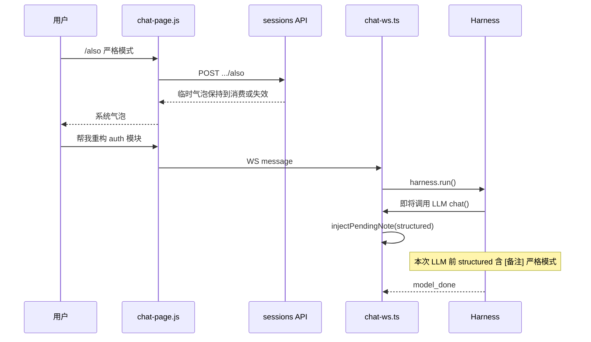
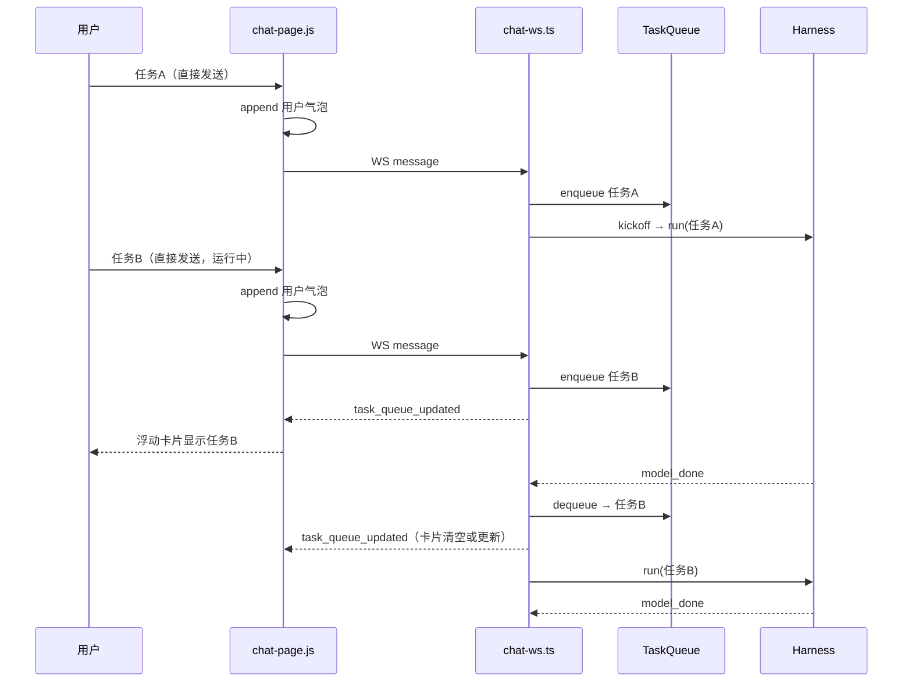
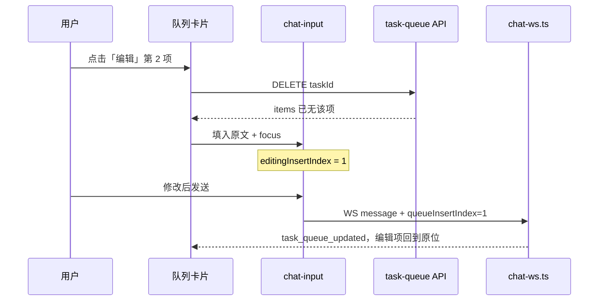

# `/also` 与 `/next` 斜杠指令 — 需求文档

> **状态**：待实现  
> **日期**：2026-07-13  
> **范围**：Web 聊天 · 浮动队列卡片 UI · CLI REPL · `chat-ws.ts` · Harness 消息注入 · 任务队列持久化  
> **关联模块**：`chat-page.js` · `chat-task-queue.js` · `chat-commands.js` · `chat-ws.ts` · `cli/commands/chat.ts` · Harness · 冰豆 · 执行计划 · Intent Checkpoint

---

## 0. 评审结论（相对初稿的修订）

初稿方向合理，但与现有代码库有几处需要对齐。本文档在保留原意的前提下做了以下**关键修订**：

| 初稿 | 修订 | 理由 |
|------|------|------|
| `StopReason` 含 `task_complete` | **仅 `model_done`** | 代码库无 `task_complete`；成功结束统一为 `model_done` |
| 全局 `data/sessions/task-queue.json` | **按会话** `{sessionId}.task-queue.json` | 项目已多会话；队列须与会话绑定 |
| 全局 `pendingNote` | **按会话** 进程内 `Map<sessionId, string>` | 与 `sessionPendingMessages`、structured cache 等同理 |
| 指令 `/` 与 `~` 双前缀 | **本功能仅 `/` 前缀** | 仅识别`/also`、`/next` |
| 备注注入到「对话消息列表」 | **仅注入 structured 消息**（LLM 上下文） | 不写入 UI `{sessionId}.json`；用户聊天区不可见 |
| 未说明是否走 Harness | **`/also` 本地处理；`/next` 只入队、不直接跑 Harness** | 避免命令本身触发 Intent Checkpoint；执行发生在队列 kickoff / 接力阶段 |
| 未限定自动出队条件 | **仅 `model_done` 自动出队** | `user_checkpoint` / `user_abort` / `max_rounds` 等不应自动接力 |
| 普通发送直接进 Harness | **默认发送 ≡ 隐式 `/next`（入队）** | 用户无需打 `/next` 前缀；输入框打字发送即入任务队列 |
| 未说明与并发发送队列关系 | **`sessionPendingMessages` 由任务队列取代** | 运行中连发也进同一 FIFO，不再用内存 WS 排队 |
| 未说明与 `session-notes.md` 关系 | **命名与文档区分** | 避免与 LLM 维护的会话记忆混淆 |
| `/next list/clear/remove` 子命令 | **Web 浮动队列卡片** | 队列管理改由输入框上方 UI 操作，不实现文字子命令 |
| 忙碌态发送按钮沿用 Stop | **输入内容决定按钮语义** | 输入框有内容时按钮为「发送/入队」；输入为空时才是「暂停」 |

---

## 1. 背景与目标

### 1.1 核心交互原则

**默认发送就是 `/next`。**

用户在输入框直接打字并点发送（不带 `/also` 等命令前缀）时，行为与 `/next <任务描述>` 相同：任务入 FIFO 队列，而非立刻 `harness.run()`。

| 发送方式 | 语义 | 用户气泡 | 队列卡片 |
|----------|------|----------|----------|
| 直接打字发送 `修一下登录页` | 隐式 `/next`（**默认**） | **立即展示**；执行时不得重复 append | 忙碌时卡片出现；空闲 kickoff 后该项出队，卡片同步更新 |
| 显式 `/next 修一下登录页` | 显式 `/next` | 入队时**不展示**；执行开始时按普通用户消息展示，便于历史与 checkpoint 对齐 | 同上 |
| `/also …` | 补充说明 | 不展示 | 不影响卡片 |
| 卡片内删除 / 编辑 | UI 队列管理 | — | 见 §4.2 |

**空闲时**：入队后若该会话无进行中的 Harness，**立即**取出队首并开跑（用户无感，等价于「发一条就开始干」）。

**忙碌时**：仅入队；当前任务 `model_done` 后自动接力下一项。

**发送按钮语义**：任务忙碌时不再固定把发送按钮变成 Stop。前端监听输入框：

- 输入框有非空内容（含 file ref / skill ref / 已选附件）→ 按钮显示「发送」，点击或回车表示**发送并入队**
- 输入框为空 → 按钮显示「暂停」，点击表示中断当前任务
- 回车只在按钮处于「发送」状态时触发；按钮为「暂停」时回车不触发 Stop

### 1.2 用户场景

| 场景 | 期望 |
|------|------|
| 输入框发一条任务 | 入队；空闲则马上执行，忙碌则等当前任务结束 |
| 连续发多条 | `任务 A` → `任务 B` → `任务 C`，按 FIFO 逐个执行，无需打 `/next` |
| 任务进行中补充约束 | `/also 别忘了用严格模式`，下次调 LLM 前自动带上 |
| 静默追加（不想立刻多一条用户气泡） | 显式 `/next 再写单元测试`；该项真正执行时再写入用户气泡 |
| 查看 / 删除 / 编辑排队任务 | 输入框上方**浮动队列卡片**（§4.2） |
| 刷新页面 / 重启进程 | 队列从磁盘恢复并刷新卡片；`/also` 内存暂存，重启丢失（可接受） |

### 1.3 非目标

- 不替代 `session-notes.md`（LLM 自动维护的会话叙事记忆）
- 不替代 TaskGraph / 执行计划（每项队列任务仍各自 `resetGraph()`）
- 不在 `user_checkpoint`、`verification_exhausted` 等异常结束时自动接力
- 不保留 `sessionPendingMessages` 作为并行机制（由任务队列统一承接，见 §4.7）
- **不实现** `/next list`、`/next clear`、`/next remove` 等文字子命令（队列管理走浮动卡片）

---

## 2. 消息路由与指令识别

### 2.1 路由优先级（服务端 `chat-ws.ts` 统一裁决）

收到 WS `message` 后，按以下顺序分类：

```
1. 本地命令：/also（仅 / 前缀；Web 可走 REST，WS 也需兜底识别）
2. 既有本地命令：~telemetry、~supervisor、~scan（与本功能无关，保持现状）
3. 既有 Harness 捷径：~open（保持现状，不入队）
4. 显式入队：/next <文本>（仅 / 前缀）
5. 默认：其余一切文本 / 附件 → 隐式 /next（入队）  ← 输入框普通发送走此分支
```

**注意**：`~also`、`~next` **不**作为本功能命令；会落入第 5 类，按普通消息隐式入队。

第 4、5 类统一由 `chat-ws.ts` 调用 `TaskQueueManager.enqueue()` 并负责 kickoff / 接力；**仅第 5 类**在入队前由前端写入 UI 用户消息，服务端执行时复用 `messageId`，不得重复 append。

### 2.2 前缀与解析

| 模式 | 识别条件 | 行为 |
|------|----------|------|
| `/also` | 以 `/also` 开头 | 设置 pendingNote；**不入队、不走 Harness** |
| `/next` 显式入队 | `/next <文本>` | 入队；入队时**不写 UI 用户消息**；执行开始时再写入用户消息；刷新队列卡片 |
| **默认发送** | 不满足以上，且非既有 `~open` 等例外 | **隐式 `/next`**；前端先写 UI 用户消息并带 `messageId` 入队；执行时复用该消息 |
| `~open` 等既有命令 | 以 `~` 开头的遗留命令 | 保持现状，**与本功能无关** |

**不实现** `/next list`、`/next clear`、`/next remove N`；`/next` 后若紧跟 `list`/`clear`/`remove` 视为任务描述正文的一部分入队（或按普通默认发送处理）。

前缀后参数 trim；允许无空格，如 `/also严格模式` 合法。

### 2.3 解析位置

| 入口 | 处理层 | 说明 |
|------|--------|------|
| Web `chat-page.js` | `handleSend()` / `executeLocalCommand()` | `/also` 走本地 REST 并展示系统反馈；显式 `/next` 不 append 用户气泡但仍发 WS，由服务端入队；普通发送走 WS，由服务端默认入队 |
| CLI `chat.ts` | REPL 内置命令分支 | `/also` 本地处理；普通输入与显式 `/next` 默认入队（无浮动卡片，队列变更由服务端回显） |
| WebSocket | `chat-ws.ts` | 统一路由 + 空闲 kickoff + `model_done` 接力 |

### 2.4 命令注册

在 `chat-commands.js` 的 `PC_LOCAL_COMMANDS` / `REMOTE_LOCAL_COMMANDS` 中新增（**`prefix: '/'`**，与既有 `~` 命令区分）：

- `also` — 为下次 LLM 调用附加补充说明
- `next` — 显式静默入队（入队时不展示用户气泡；**普通发送已默认入队，可不敲此前缀**）

命令面板需支持 `~` 与 `/` 两类 prefix 的过滤 / 展示；选中后插入 `/also ` 或 `/next `（不是 `~also`）。

---

## 3. `/also` 指令

### 3.1 行为

- 将参数文本存入 **会话级** 内存变量 `pendingNoteBySession: Map<string, string>`
- 同一会话重复 `/also` → **覆盖**上一条（只保留最新补充说明）
- 空参数 → 回复用法提示，不修改已有 `pendingNote`

### 3.2 用户反馈

- 成功：聊天区显示临时用户气泡 `/also {补充说明}`，不写入会话历史
- 空参数：`用法: /also <补充说明>`
- 未生效：若没有运行中的任务，显示系统提示；若当前任务结束前未消费，临时气泡在下一次用户发送时移除

反馈以 **系统/agent 气泡** 展示（同既有本地命令反馈），`role: 'agent'`，带 `statusTag: 'system'` 或项目现有系统消息约定。

### 3.3 注入时机

在 **下一次** 该会话即将发生的 LLM `chat()` 调用之前注入，包含两种情况：

- 当前 Harness 仍在运行，且后续还会再次调用 LLM：注入到当前 run 的下一次 `chat()` 前
- 当前无运行任务，或当前任务已结束：注入到下一条队列任务的首次 `chat()` 前

1. 读取 `pendingNoteBySession.get(sessionId)`
2. 若存在，向 **structured 消息列表**追加一条 `user` 消息：

   ```
   [备注] {pendingNote 文本}
   ```

3. 注入后 **立即清空** 该会话的 `pendingNote`
4. 不写入 `{sessionId}.json` UI 消息；不触发 Intent Checkpoint（备注附着于已有用户回合）

**注入点（实现参考）**：优先在 `chat-ws.ts` 包装传给 `harness.run()` 的 `chat` 函数：每次调用 LLM 前检查并消费 `pendingNote`，把 `[备注] ...` 追加到本次传入的 structured messages。这样运行中发送 `/also` 才能赶上当前任务的下一次 LLM 调用。仅在 `getCachedMessages()` 后、`harness.run()` 前注入只能覆盖首轮调用，不足以满足运行中补充约束。

### 3.4 边界：任务已结束且备注未注入

若某次 `harness.run()` 在 **注入发生前** 即以 `model_done` 结束（例如：用户在运行中发送 `/also`，但该轮在下一轮 LLM 调用前就结束了），则：

- 清理该 `pendingNote`
- 移除临时 `/also` 用户气泡

`/also` 仅绑定当前运行中的 Harness；不跨到下一次用户发起的新对话。

### 3.5 与 `/next` 自动接力的优先级

优先级按时间线理解：

1. 一条队列任务被 dequeue 并启动 `harness.run()`
2. 该 run 的下一次 LLM `chat()` 前消费并注入 `pendingNote`
3. 该 run 结束后，只有 `stopReason === 'model_done'` 才 dequeue 下一条任务并接力

即：备注服务于「下一次实际发生的 LLM 调用」；队列接力只发生在整轮成功结束之后。

---

## 4. 任务队列（`/next` 与默认发送）

### 4.1 入队

**两种入队方式，共用同一 FIFO：**

| 方式 | 触发 | UI 用户消息 | 队列卡片 |
|------|------|-------------|----------|
| **默认发送** | 输入框打字 → 发送 | 前端立即写入 `{sessionId}.json`，并把 `messageId` 交给服务端 | 入队后刷新；忙碌时可见 |
| **显式 `/next`** | `/next <任务描述>` | 入队时不写；执行开始时由服务端写入并广播 | 入队后刷新 |

- 任务描述：消息正文（含附件占位、file ref 行）；至少一个非空字符
- 空描述（仅 `/next`）→ `用法: /next <任务描述>` 或使用默认发送
- 入队项结构（**须含稳定 `id`**，供卡片删除 / 编辑）：

```ts
interface QueuedTask {
  id: string;           // UUID，持久化
  text: string;
  messageId?: string;   // 默认发送时携带客户端 id，执行时复用
  images?: string[];    // 已持久化后的 session image URL 或相对引用；不得存 data URL
  referencePaths?: string[];
  enqueuedAt: number;
  source: 'implicit' | 'explicit';
}
```

持久化文件：`QueuedTask[]`（JSON 数组，FIFO 顺序）。

附件处理要求：入队前应把上传图片 / 文件占位转换为可恢复的 session 资源引用；队列文件不存 base64 data URL，避免刷新或重启后队列不可执行、文件膨胀。

### 4.2 浮动队列卡片 UI（Web）

#### 4.2.1 位置与显隐

- **挂载位置**：`.chat-input-area` 内、`.chat-composer` **上方**（与 `pending-images-preview` 同级，在输入框正上方浮动）
- **显隐规则**：
  - 当前会话队列 **非空** → 展示卡片
  - 队列 **为空** → **不展示**（`display: none` 或 DOM 不渲染）
- **不展示**正在执行中的任务（已 dequeue 的队首）；卡片只列 **待执行** 项

#### 4.2.2 卡片结构

```
┌─ Next 队列 (2) ─────────────────────────────┐
│ 1. 修一下登录页          [编辑] [删除]      │
│ 2. 补充单元测试          [编辑] [删除]      │
└─────────────────────────────────────────────┘
        ↓ 下方为 chat-composer 输入框
```

- 标题：`Next 队列` + 可选数量角标
- 列表：按 FIFO 顺序，1-based 序号 + 任务摘要（过长 `text-overflow: ellipsis`）
- 每项右侧两个按钮：**编辑**、**删除**（图标按钮 + `aria-label`）

#### 4.2.3 删除

1. 用户点击某项 **删除**
2. 前端 `DELETE /api/sessions/:id/task-queue/:taskId`
3. 服务端从队列移除该项并写盘
4. 广播 `task_queue_updated`（见 §6.2）；各端刷新卡片
5. **不**影响正在执行的 Harness

#### 4.2.4 编辑

1. 用户点击某项 **编辑**
2. **立即**从队列移除该项（同删除 API，卡片中该项消失）
3. 将该任务 `text` **填入** `#chat-input` 输入框，并 `focus()`
4. 客户端记录 `editingInsertIndex`（被删项的原 FIFO 位置，0-based），供发送时插回
5. 用户修改内容后 **发送**（走默认发送 / 入队流程）：
   - 若存在 `editingInsertIndex`：仍通过 WS `message` 发送，但附带 `queueInsertIndex`
   - 服务端路由为隐式 `/next` 后调用 `TaskQueueManager.insertAt(sessionId, queueInsertIndex, task)`，而不是队尾 `enqueue`
   - 发送后清空 `editingInsertIndex`
6. 刷新卡片

**编辑中取消**：用户清空输入或不发送而改点其他操作 → 丢弃 `editingInsertIndex`（该项已从队列移除，不自动恢复；用户需重新发送以入队）

#### 4.2.5 状态同步

| 时机 | 卡片刷新来源 |
|------|----------------|
| 页面加载 / 切换会话 | `GET /api/sessions/:id/task-queue` |
| 入队（发送 / `/next`） | WS `task_queue_updated` |
| 删除 / 编辑移除 | API 响应 |
| 服务端 dequeue（kickoff / 接力） | WS `task_queue_updated` |
| 多端同会话 | `broadcastToSession` 推送 `task_queue_updated` |

#### 4.2.6 样式要点

- 浮动卡片：`border-radius`、`box-shadow`、与 `--chat-bg` / `--bg-input` 协调
- `max-height` + 内部滚动（队列很长时）
- 窄屏（≤768px）全宽；不遮挡 `composer-toolbar` 发送按钮
- 新增 `src/public/css/chat-task-queue.css`、`src/public/js/chat-task-queue.js`

#### 4.2.7 输入框与发送 / 暂停按钮

现有前端在 workload active 时点击发送按钮会直接 Stop，且回车会被吞掉。为支持运行中继续入队，需改为**按钮状态由输入内容决定**：

| 条件 | 按钮状态 | 点击 | 回车 |
|------|----------|------|------|
| 当前忙碌，输入框有非空内容或已选附件 | 发送 | 发送并入队 | 发送并入队 |
| 当前忙碌，输入框为空且无附件 | 暂停 | Stop 当前任务 | 不触发 |
| 当前空闲 | 发送 | 发送并入队，随后立即 kickoff | 发送并入队，随后立即 kickoff |

实现建议：

- 新增 `getComposerHasSendableContent()`，同时检查 textarea、file ref、skill ref、uploaded files、pending images
- `syncComposerActionState()` 在 input / file selection / workload status 变化时更新按钮 icon、title、`data-action`
- `handleSend()` 根据按钮 `data-action` 分派：`send` 走入队，`stop` 才调用 `handleStop()`
- keydown Enter 复用同一状态判断；只有 `data-action === 'send'` 才调用 `handleSend()`

### 4.3 持久化

**文件路径**：`data/sessions/{sessionId}.task-queue.json`

**格式**：`QueuedTask[]` JSON 数组，例如：

```json
[
  { "id": "a1b2c3", "text": "修一下登录页", "enqueuedAt": 1716800000000, "source": "implicit" },
  { "id": "d4e5f6", "text": "补充单元测试", "enqueuedAt": 1716800001000, "source": "explicit" }
]
```

**同步时机**：每次 `enqueue` / `dequeue` / `remove` / `insert` 后立即写盘。

**启动恢复**：进程启动 / 会话首次访问时，若文件存在则读入内存；不存在则从 `[]` 开始。

**删除会话**：`DELETE /api/sessions/:id` 时一并删除 `{id}.task-queue.json`（注册到现有 `registerSessionCleanupHook`）。

### 4.4 内存结构

建议独立模块 `src/session/task-queue.ts`（或 `src/web/task-queue-manager.ts`）：

```ts
interface TaskQueueManager {
  enqueue(sessionId: string, task: Omit<QueuedTask, 'id' | 'enqueuedAt'> & { text: string }): Promise<QueuedTask>;
  dequeue(sessionId: string): Promise<QueuedTask | undefined>;
  list(sessionId: string): Promise<QueuedTask[]>;
  removeById(sessionId: string, id: string): Promise<QueuedTask | undefined>;
  insertAt(sessionId: string, index: number, task: { text: string; source: QueuedTask['source']; messageId?: string; images?: string[]; referencePaths?: string[] }): Promise<QueuedTask>;
  load(sessionId: string): Promise<void>;
}
```

进程内 `Map<string, QueuedTask[]>` 与文件双向同步。

### 4.5 启动与自动执行（服务端）

#### 4.5.1 空闲 Kickoff（入队后立即开跑）

当 `enqueue` 完成且 `!sessionProcessing.has(sessionId)`：

1. `dequeue()` 队首
2. 调用 `runSessionMessageLoop(sessionId, task)`
3. 对 **默认发送** 项：UI 用户消息已在入队时写入，执行阶段**复用** `messageId`，避免重复 append
4. 对 **显式 `/next`** 项：执行前写入 UI 用户消息，并广播 `user_message_appended`

#### 4.5.2 `model_done` 后自动接力

当一次 `handleChatMessage` → `harness.run()` **正常结束**且 `result.loopState.stopReason === 'model_done'` 时：

1. 检查队列是否非空
2. 若非空：`dequeue()` 队首，启动下一轮 `handleChatMessage`
3. 实现位置：`runSessionMessageLoop` 循环末尾，或 `handleChatMessage` 的 `model_done` 分支

**接力时**：

- 走完整 Harness 流程（checkpoint、执行计划重置、冰豆 thinking）
- 广播 `info`：`📋 正在执行排队任务：{描述}`（显式入队项；默认发送项若已有气泡可省略）

**不自动接力**的 `StopReason`（原则：非成功完成）：

- `user_abort` / `user_checkpoint`
- `max_rounds` / `token_budget` / `max_output_tokens` / `task_recovery` / `timeout`
- `verification_exhausted` / `circuit_breaker` / `error` / `stop_hook`

队列保留，用户可在**浮动卡片**中查看 / 删除 / 编辑，或继续默认发送追加。

### 4.6 `runSessionMessageLoop` 改造

现有逻辑：

```
收到 WS message → 若 busy 则 sessionPendingMessages → 否则 handleChatMessage
```

改为：

```
收到 WS message → 路由（§2.1）→ enqueue（默认/显式 next）
                → 若 !busy 则 kickoff（§4.5.1）
                → 若 busy 则仅反馈「已排队」

runSessionMessageLoop:
  while (dequeue() 或 外部 kickoff 传入首项) {
    stopReason = handleChatMessage(task)
    if stopReason !== model_done: break
    // 否则继续 while，取下一项
  }
```

`handleChatMessage` 需要从 `Promise<void>` 改为返回本轮 `StopReason | undefined`，供循环判断是否接力。

**移除**对普通消息的 `sessionPendingMessages` 依赖；该 Map 可删除或仅保留兼容期兜底。`stop` / `switch_session` 只停止当前正在运行的任务，默认**保留**该会话持久化队列中尚未执行的项，交由卡片删除 / 编辑；且由于 stop reason 不是 `model_done`，不会自动接力。

### 4.7 与 `sessionPendingMessages` 的关系

| 机制 | 改造前 | 改造后 |
|------|--------|--------|
| 运行中连发普通消息 | `sessionPendingMessages` 内存 FIFO | **任务队列**持久化 FIFO |
| 忙碌提示 | `已排队，当前任务完成后自动处理` | 队列卡片展示待执行项 |
| 刷新 / 重启 | 排队丢失 | **队列保留**（磁盘恢复） |

用户连发 `A`、`B`、`C` 时，三条均立即显示用户气泡并入队；执行顺序 A → B → C。

---

## 5. 与现有模块的兼容

### 5.1 冰豆（`chat-pet-bridge.js`）

| 情况 | 处理 |
|------|------|
| `model_done` 且队列非空、即将自动接力 | 不展示「已完成 / success」，或瞬时切到 `thinking`；避免 success → thinking 闪烁 |
| 自动接力开始 | 与普通用户消息一致：`thinking` |
| `/also` / `/next` 本地命令 | 不改变冰豆状态 |

实现建议：`chat-ws.ts` 在 `final` 事件广播时，若 `stopReason === 'model_done'` 且队列非空，设置 `petState: 'thinking'`，`petBubble: '排队任务接力中…'`。

### 5.2 执行计划（TaskGraph）

- 每次 `harness.run()`（含 `/next` 自动接力）仍执行现有 `graphExecutor.resetGraph()`
- 一项排队任务 = 一张新任务图；**不**跨队列项共享 TaskGraph
- 前端 `ChatExecutionPlan.clear()` 在 session 切换 / restore 时已有；自动接力时由新一轮 `task_graph_init` 自然覆盖

### 5.3 Intent Checkpoint（检查点）

| 操作 | Checkpoint |
|------|------------|
| `/also`、显式 `/next` 入队 | **不** capture（显式入队无 UI 消息） |
| 默认发送入队 | **不在入队时 capture**；前端已有 UI 用户消息，但 Harness 尚未运行 |
| 队列项开始执行 | **要** capture；默认发送复用已有 `messageId`，显式 `/next` 先写入用户消息再 capture |
| `/also` 注入 structured 消息 | **不**单独 capture；附属于该轮已有 `userMsgId` 的 structured 快照 |

### 5.4 会话记忆 `session-notes.md`

- 无交叉；`/also` 为 ephemeral LLM 上下文补丁，不写入 `session-notes.md`
- 文档与 UI 文案使用「备注」「排队任务」，避免「笔记」「记忆」字样

---

## 6. API 设计

### 6.1 REST（Web 本地命令调用）

在 `src/web/routes/sessions.ts` 或新路由 `session-commands.ts` 增加：

| 方法 | 路径 | 说明 |
|------|------|------|
| `POST` | `/api/sessions/:id/also` | body: `{ text: string }` → 设置 pendingNote |
| `GET` | `/api/sessions/:id/task-queue` | 返回 `{ items: QueuedTask[] }` |
| `DELETE` | `/api/sessions/:id/task-queue/:taskId` | 按 id 删除一项 |

task queue 响应统一 `{ ok: true, items: QueuedTask[] }`；`/also` 返回 `{ ok: true, message: string }`。

入队不走 REST：默认发送、显式 `/next`、编辑后插回都通过 WS `message` 进入 `chat-ws.ts`，因为只有 WS 侧持有 `sessionProcessing`、订阅会话、kickoff 与自动接力上下文。REST 只做查询和队列管理，不直接启动 Harness。

### 6.2 WebSocket 同步

除 REST 外，队列变更时服务端 `broadcastToSession`：

```ts
{ type: 'task_queue_updated', sessionId: string, items: QueuedTask[] }
```

触发时机：`enqueue` / `dequeue` / `remove` / `insert`、会话切换后可选推送。前端 `chat-task-queue.js` 监听并重绘卡片。

`/also` 仍可由 REST 返回 message 后 `appendMessageEl` 展示系统气泡。

编辑插回时，前端发送：

```ts
{ type: 'message', content: string, messageId?: string, queueInsertIndex?: number, images?: string[], referencePaths?: string[] }
```

`queueInsertIndex` 只影响入队位置；是否立即 kickoff 仍由服务端在插入后根据 `sessionProcessing.has(sessionId)` 决定。

### 6.3 CLI

在 `chat.ts` 增加 `/also`；**普通 REPL 输入默认入队**（无 Web 卡片，可通过日志或 `GET task-queue` 查看队列）。**不实现** `/next list` 等子命令。

---

## 7. 实现清单

### 7.1 新增文件

| 文件 | 职责 |
|------|------|
| `src/session/pending-note.ts` | 会话级 pendingNote 读写 / 注入辅助 |
| `src/session/task-queue.ts` | 队列 CRUD + 文件持久化 |
| `test/session/pending-note.test.ts` | `/also` 单元测试 |
| `test/session/task-queue.test.ts` | 队列 CRUD + 持久化测试 |
| `src/public/js/chat-task-queue.js` | 浮动卡片渲染、删除 / 编辑、与 API / WS 同步 |
| `src/public/css/chat-task-queue.css` | 卡片样式 |
| `test/web/task-queue-auto-run.test.ts` | `model_done` 后自动出队集成测试（可 mock harness） |

### 7.2 修改文件

| 文件 | 改动摘要 |
|------|----------|
| `src/public/js/chat-commands.js` | 以 `prefix: '/'` 注册 `also` / `next`，并支持 `~` / `/` 两类命令提示 |
| `src/public/js/chat-page.js` | 拦 `/also`、显式 `/next`；挂载队列卡片；编辑态发送附带 `queueInsertIndex`；忙碌态按钮按输入内容切换发送 / 暂停 |
| `src/web/chat-ws.ts` | 消息路由、默认入队、空闲 kickoff、`task_queue_updated`、pendingNote 注入、`handleChatMessage` 返回 `StopReason` |
| `src/web/routes/sessions.ts` | note / task-queue REST；删除会话时清理 queue 文件 |
| `src/cli/commands/chat.ts` | CLI `/also` + 普通输入默认入队（无卡片） |
| `src/public/js/chat-pet-bridge.js` |（按需）success 抑制 |
| 聊天页 HTML/CSS 入口 | 引入 `chat-task-queue.css` / `.js` |

### 7.3 实现顺序建议

1. `task-queue.ts` + `pending-note.ts` + 单元测试  
2. REST API（`GET` / `DELETE` / also）+ CLI `/also`  
3. `chat-ws.ts` 注入、kickoff、接力、`queueInsertIndex` + `task_queue_updated`  
4. Web 浮动卡片 UI（显隐 / 删除 / 编辑 / 多端同步）+ 发送 / 暂停按钮状态机  
5. 冰豆打磨 + 集成测试  

---

## 8. 测试要求

### 8.1 单元测试

**`/also`（`pending-note.test.ts`）**

- [ ] 设置 / 覆盖 / 读取 / 清空 pendingNote
- [ ] `injectPendingNote(messages, sessionId)` 在 structured 列表末尾追加 `[备注] …` 并清空
- [ ] 无 pendingNote 时 inject 为 no-op
- [ ] `discardIfRunEnded(sessionId)` 在 run 结束未注入时清空并返回提示文案

**`/next`（`task-queue.test.ts`）**

- [ ] enqueue ×3 → list 顺序正确，每项有稳定 `id`
- [ ] dequeue 返回队首并缩短队列
- [ ] `removeById` 移除指定项；非法 id 返回 undefined / 错误
- [ ] `insertAt(index)` 插入原位置；越界钳制或报错
- [ ] 每次变更后 JSON 文件内容与内存一致
- [ ] 从不存在文件启动 → 空队列
- [ ] 进程重启模拟：新 manager 实例从文件恢复

### 8.2 集成测试

- [ ] 默认发送（无命令前缀）→ enqueue，空闲立即 kickoff
- [ ] 忙碌时连发两条默认消息 → 队列顺序执行，第二条不丢
- [ ] 忙碌时输入框有内容 → 按钮为发送，点击 / 回车均入队；输入为空 → 按钮为暂停，回车不触发 Stop
- [ ] `model_done` 后自动 dequeue 并触发下一轮；广播 `task_queue_updated`
- [ ] `user_checkpoint` 结束 **不** 自动 dequeue
- [ ] `/also` 在下一次 LLM `chat()` 前出现在 structured messages 中；运行中发送且后续仍有 LLM 调用时能被当前 run 消费
- [ ] `executeLocalCommand('/also x')` 不调用 `WS.sendMessage`
- [ ] `~also x` **不**触发 also 逻辑，按默认发送入队
- [ ] 显式 `/next` 入队时不入 UI 消息，执行开始时写入用户消息；默认发送入队时已有 UI 消息且执行时不重复写
- [ ] 队列非空时卡片可见；清空后卡片隐藏
- [ ] 删除按钮调用 API 后卡片与磁盘同步
- [ ] 编辑：项从卡片移除 → 填入 input → 发送后按原 index 插回

### 8.3 回归

- [ ] `npm test` 全量通过

---

## 9. 验收标准

| # | 验收项 |
|---|--------|
| 1 | 输入框直接发送 `修登录页`（无命令）→ 空闲时立即开跑；聊天区**有**用户气泡 |
| 2 | 任务运行中再发 `写测试` → 入队，**浮动卡片出现**并列出该项；不打断当前任务；`model_done` 后自动执行 |
| 3 | 忙碌时输入框有内容则按钮为发送，点击 / 回车都入队；输入为空时按钮为暂停，回车不触发 Stop |
| 4 | `/also foo` → 系统反馈，无用户气泡；下一次 LLM 调用时 structured 含 `[备注] foo` |
| 5 | 运行中 `/also` 后任务在下一轮 LLM 前结束 → 临时 `/also` 气泡随后被移除，不带到下次对话 |
| 6 | 显式 `/next A` + 默认发送 `B` → 卡片按 FIFO 显示；逐项自动执行 |
| 7 | `user_checkpoint` 停止后队列保留，卡片仍可见，不自动执行 |
| 8 | 卡片 **删除**：该项消失，磁盘同步；队列空则卡片隐藏 |
| 9 | 卡片 **编辑**：项移入输入框并从卡片移除；改完发送后插回原位置并刷新卡片 |
| 10 | 重启后卡片仍显示未完成任务；`/also` 不保留 |
| 11 | 删除会话后 `.task-queue.json` 删除 |
| 12 | 冰豆自动接力时不长时间停留 success |
| 13 | CLI 普通输入默认入队；**无** `/next list` 等子命令 |
| 14 | 输入 `~also` / `~next` 不触发本功能，按普通消息处理 |

---

## 10. 流程图

### 10.1 `/also` 生命周期



### 10.2 默认发送 + 队列接力



### 10.3 卡片编辑流程



---

## 11. 附录：与初稿差异对照

初稿中下列描述**保持不变**：

- `/also` 临时气泡、注入后移除、任务结束未注入则不带到下次对话
- `/next` FIFO 队列与持久化
- 单元测试覆盖暂存、注入、入队、出队

初稿中下列描述**本文已修订**：

- `task_complete` → `model_done`；全局队列 → 按会话；pendingNote 按会话
- **`/also`、`/next` 仅 `/` 前缀**；备注仅注入 structured
- **默认发送 ≡ 隐式 `/next`**；空闲立即 kickoff
- **`sessionPendingMessages` 由任务队列取代**
- **不做 `/next list/clear/remove` 子命令**；改用输入框上方浮动卡片（删除 / 编辑）
- 显式 `/next` 入队时静默、执行时补用户气泡；默认发送立即展示用户气泡并刷新卡片
- 忙碌态按钮由输入内容决定：有内容为发送 / 入队，空内容为暂停
- 优先级：`pendingNote` 服务于下一次 LLM 调用；队列接力只在 `model_done` 后发生
