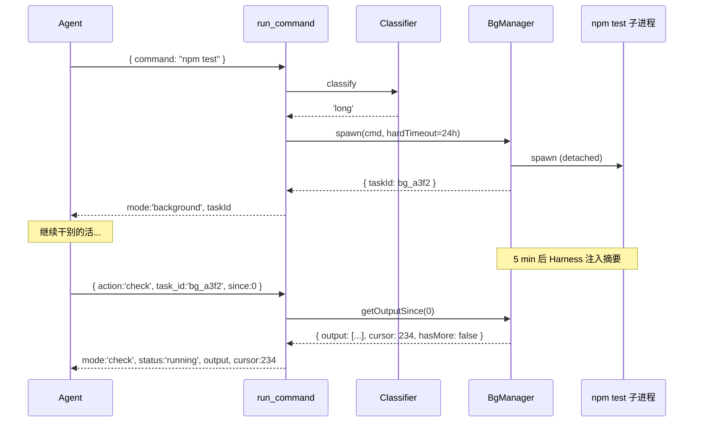
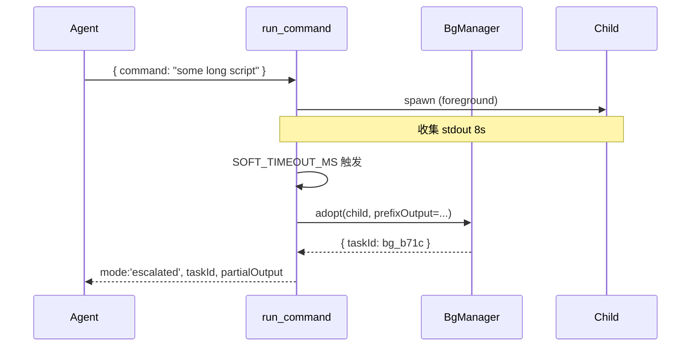
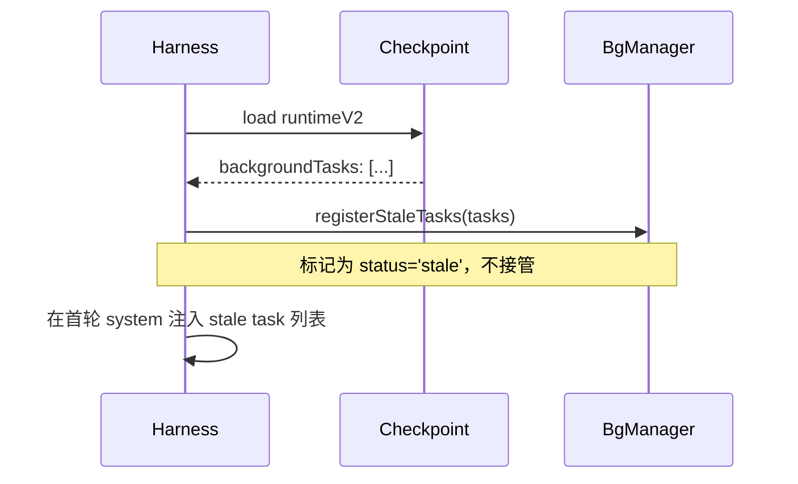

# Shell 双轨执行与长任务支持 — 需求文档

> **状态**：待实现
> **版本**：v1.0
> **日期**：2026-05-26
> **范围**：`run_command` 分流决策 · `BackgroundTaskManager` 加固 · 长命令支持 · 后台进度回流 · 与 Supervisor / BranchBudget / Checkpoint 联动

---

## 1. 目标

让 `run_command` 在**不引入任何配置项**的前提下，做到：

1. **长命令自动后台** — `npm test`、`npm run dev`、`docker build`、`git clone` 等长命令默认不阻塞主循环；
2. **短命令仍走前台** — `git status`、`ls`、`tsc --noEmit` 等秒级命令仍同步返回；
3. **超时不丢进度** — 前台到 8s 仍在跑时**自动转后台**，已收集输出不丢、不重 spawn；
4. **真正能跑几小时** — 后台 task 默认 hard timeout = **24h**（而不是当前的 5 分钟），避免长任务被误杀；
5. **进度可回流** — Agent 主动 `action:"check"` 拿增量输出；Harness 每 5 分钟给模型一条「仍在跑的后台任务摘要」，自然驱动 poll；
6. **物理隔离贯穿子进程** — 子进程拿到 `ICE_AGENT_SESSION`、kill 走进程树、输出按 session 落盘。

### 1.1 为什么做

| 现状 | 问题 |
|------|------|
| 前后台分流靠 LLM 决策 | `npm test` 被丢前台 → 30s SIGKILL → 重跑 → BranchBudget 拦截 → 卡死 |
| 后台 hard timeout = **300 秒** | 长任务（compile、benchmark、long-running build）**5 分钟就被杀** |
| 前台超时直接 SIGKILL | 已跑 28s 的产物全丢，没有 task_id 可续观察 |
| `kill('SIGTERM')` 不杀进程树 | 派生的 worker / 子 shell 变孤儿 |
| `BackgroundTaskManager` 进程级单例 | 多 session 切换后 `list` 串会话；与多会话方案物理隔离目标冲突 |
| 后台输出仅在内存 500 行环形缓冲 | 进程重启 / `~clear` 丢失全部历史 |
| `action:"check"` 每次全量返回 tail | 模型重复消费同一段输出，浪费 token |
| 任务结束/失败无任何主动信号 | 模型不主动 poll 就永远不知道结果 |

### 1.2 非目标

- **不做沙箱**（Bubblewrap / Seatbelt / Landlock / WSL2 一概不做，明确放弃 Codex / Cursor 那条路线）；
- **不引入任何 JSON / env 配置项**（所有阈值与白名单**写死在 `.ts` const**）；
- **不做系统级桌面通知 / 浏览器原生 Notification API**（仅在聊天页 DOM 内推 ephemeral 状态条）；
- **不持久化 UI 推送内容到聊天历史**（刷新即消失，不进 `{id}.json`、不进 LLM structured 历史）；
- **不做命令白名单文件**（不做 Cursor 风格的 `permissions.json`）；
- **不实现「跨进程持久 cwd」**（CC 那种 persistent bash session，本期不做）。

---

## 2. 现有架构分析

### 2.1 「物理隔离」当前实际是什么

项目里**没有沙箱**。所谓「物理隔离」是**按 sessionId 分文件 + 按工作目录锁定 + 宿主进程保护**三层组合。

#### 已支持

| 层 | 实现 | 代码位置 |
|----|------|----------|
| **Session 文件隔离** | `data/sessions/{sessionId}.*` 分族（checkpoint / workspace / structured） | `src/harness/checkpoint.ts`、`src/harness/session-workspace-store.ts` |
| **Workspace 路径锁** | 从 user 消息识别工作目录锁定，越权写入拦截 | `src/harness/workspace-lock.ts`、`src/harness/workspace-path-guard.ts` |
| **HostGuard L1** | run_command 字面量扫描，拦 `taskkill /IM node` 等 | `src/tools/shell-host-guard.ts` |
| **HostGuard L2** | `node script.cjs` 执行前读文件扫描 | 同上 |
| **HostGuard L3** | write/edit/patch 写入内容扫描 | `src/harness/harness-tool-preflight.ts` |
| **Inline 脚本拦截** | Windows 下 `node -e` 复杂内联脚本拒绝 | `src/tools/shell-inline-script-advisory.ts` |
| **危险命令黑名单** | `rm -rf /`、`mkfs`、`shutdown` 等 | `src/tools/shell-host-guard.ts` |

#### 不支持（本需求要补的）

| 层 | 缺口 | 代码位置 |
|----|------|----------|
| **Shell 子进程身份** | `buildShellChildEnv()` 接受 sessionId 但**没人传** → `ICE_AGENT_SESSION` 永远空 | `src/tools/shell-host-guard.ts:178` |
| **后台 Manager 按 session 隔离** | 进程级单例，与多会话目标冲突 | `src/tools/background-task-manager.ts:297-304` |
| **进程树 kill** | 只 `child.kill('SIGTERM')`，派生子进程变孤儿 | `background-task-manager.ts:234-248` |
| **长命令支持** | hard timeout 300s 写死 | `shell-tool.ts:108`、`background-task-manager.ts:177-192` |
| **进度回流** | 无主动信号、无定时摘要、`check` 不增量 | — |

### 2.2 当前前后台分流的薄弱环节

```37:38:src/tools/builtin/shell-tool.ts
'Execute shell commands (foreground or background). Pass command as a top-level argument [...] Foreground: waits for result (default 30s timeout). Background: set background:true for long commands, returns task_id immediately.'
```

```130:136:src/prompts/sections.ts
- Independent tools in parallel; dependent tools in order.
- Do not repeat tool calls unless data may have changed.
- Background run_command → continue work; poll with action:"check" and task_id.
```

**完全靠 LLM 自己决定** `background:true`，常见失败：
- 模型把 `npm test` 丢前台 → 30s 后被杀 → 重跑 → BranchBudget 拦截
- 反过来 `git status` 丢后台 → 多一次 `check` 浪费一轮

---

## 3. 横向对比：CC / Codex / Cursor 怎么做

| 维度 | Claude Code | Codex CLI | Cursor (v3.0+) |
|---|---|---|---|
| 沙箱 | ✗（裸跑宿主） | ✓（Seatbelt / Bubblewrap+Landlock+seccomp / Win 受限 token） | ✓（可选；本机 native + 云 VM） |
| 长/短分流 | **显式 `run_in_background`** + 模型决策 | 不分流（每次新 sandbox spawn） | 推到 **Background Agent 云 VM** |
| 后台增量输出 | **`BashOutput` diff-only + filter 正则** | — | — |
| 完成时通知模型 | ✓（system-reminder，但 issue #11716 / #13061 有 stale bug） | — | — |
| 定时通知用户 | ✗ | ✗ | ✗（只在任务完成开 PR） |
| 持久 shell 状态 | cwd 跨调用保留 | 无 | 无 |
| 命令审批 | IDE 弹窗 | approval policy（`suggest`/`auto-edit`/`full-auto`） | 弹窗 + `permissions.json` 三层 |
| destructive 默认 | 弹审批 | sandbox deny | 默认审批（rm/DROP/force-push） |
| 已知大坑 | 后台 stale reminder 烧光 token | apply_patch 早期 symlink 绕过（已修） | — |

**iceCoder 当前最接近 CC**（裸跑 + 显式后台参数），但**没有 BashOutput 的增量模型**、**没有完成时通知**、**进程树未隔离**。

### 3.1 可以学的

| 来源 | 借鉴点 |
|---|---|
| **CC** | `BashOutput` 的 **diff-only + filter** 是省 token 的关键 |
| **CC 的反例** | 后台 stale reminder（#11716）说明：**任务状态变更必须 invalidate 旧快照**，不能反复注入「仍在跑」的旧消息 |
| **Codex** | **写入路径与执行路径共用 hook**（apply_patch 改走 shell 走同一沙箱）——iceCoder 的 `commandPolicyGate` 应当是一处统一闸口 |
| **Cursor** | 长命令**推到独立 Agent** 跑完通知——与 iceCoder 已有的 `delegate_to_subagent` 哲学一致；本期不做，但记入未来扩展 |

### 3.2 明确不学的

| 来源 | 不学的原因 |
|---|---|
| Codex 沙箱（三平台） | 工程量极大，与 iceCoder「自托管 + 轻量」定位冲突 |
| Cursor `permissions.json` | 增加用户认知负担，与「开箱即用」原则冲突 |
| CC 持久 bash session | 本期不需要跨调用 cwd 状态；workspace lock 已经覆盖大部分场景 |
| CC system-reminder 推送 | 已知会导致 token 烧光（#11716）；改用 Harness 5min 摘要 |

---

## 4. 设计原则

| 原则 | 落实 |
|------|------|
| **零配置** | 所有阈值与正则**写死 const**；不读 `data/*.json`、不读 env |
| **合理默认** | 用户什么都不传，行为最优；`background:true` 仍然有效 |
| **协议向后兼容** | `run_command` 字段名全保留；新增字段一律可选 |
| **不破治理层** | BranchBudget / Supervisor / Checkpoint 接入点保留，只**扩展信号源** |
| **模型零认知负担** | 模型不需要知道 classifier 存在；它只看到「同步返回」「立刻返回 taskId」「8s 后被 escalate」三种情况 |

---

## 5. 写死的规则

### 5.1 唯一新增的常量文件 — `src/tools/shell-runtime-classifier.ts`

整个文件 ≈ 60 行，零对外配置：

```typescript
/** 软超时：前台到此时长仍在跑 → 自动转后台 */
export const SOFT_TIMEOUT_MS = 8000;

/** 后台 hard timeout：long 类任务 24h；其它后台沿用 5min（兼容现状） */
export const HARD_TIMEOUT_LONG_MS = 24 * 60 * 60 * 1000;
export const HARD_TIMEOUT_DEFAULT_MS = 5 * 60 * 1000;

/** Harness 后台任务摘要注入间隔 */
export const BG_SUMMARY_INTERVAL_MS = 5 * 60 * 1000;

/** 长命令特征 — 直接后台启动 */
const LONG_RUNNING: RegExp[] = [
  /^(npm|pnpm|yarn|bun)\s+(test|t\b|run\s+(test|dev|start|serve|preview|watch|build))/,
  /^(vitest|jest|playwright|cypress)\b(?!\s+--?(version|help))/,
  /^tsc\s+(--watch|-w)\b/,
  /^docker\s+(build|run|compose\s+up)\b/,
  /^(pip|poetry|conda)\s+install\b/,
  /^git\s+clone\b/,
  /^curl\s+.*-[oO]\s/,
];

/** 短命令特征 — 前台短超时（10s 即可） */
const SHORT_FAST: RegExp[] = [
  /^git\s+(status|diff(?!\s+--stat)|log(\s+|$)|branch(\s+|$)|show\s+--stat|rev-parse|config\s+--get)/,
  /^(ls|dir|pwd|cd|cat|type|head|tail|wc|echo|which|where|whoami|hostname)\b/,
  /^tsc\s+--noEmit\b/,
  /^(node|npm|pnpm|yarn|tsc|git|python|pip)\s+--version\b/,
  /^(node|npm|pnpm|yarn)\s+-v\b/,
];

export type ShellClass = 'short' | 'long' | 'auto';

export function classifyShellCommand(command: string): ShellClass {
  const c = command.trim();
  if (LONG_RUNNING.some(re => re.test(c))) return 'long';
  if (SHORT_FAST.some(re => re.test(c))) return 'short';
  return 'auto';
}
```

**就这一个文件、几个常量数组、一个函数。没有 JSON、没有 env、没有热加载、没有 schema 校验。**

### 5.2 阈值速查

| 阈值 | 值 | 含义 |
|------|----|----|
| `SOFT_TIMEOUT_MS` | 8 秒 | 前台 → 后台 escalate 阈值 |
| `HARD_TIMEOUT_DEFAULT_MS` | 5 分钟 | 后台默认 hard timeout（兼容现状） |
| `HARD_TIMEOUT_LONG_MS` | **24 小时** | classifier 判定为 `long` 时的 hard timeout（**新**） |
| `BG_SUMMARY_INTERVAL_MS` | 5 分钟 | Harness 注入后台摘要的最小间隔 |
| `MAX_CONCURRENT` | 8（沿用现值） | 后台并发上限 |
| `MAX_OUTPUT_LINES` | 500（沿用现值） | 环形缓冲行数 |
| 短命令前台 timeout 上限 | 10 秒 | classifier 判 `short` 时强制 `min(args.timeout, 10000)` |

---

## 6. 协议变更（极简）

`run_command` 工具参数只新增 **1 个字段**：

```typescript
{
  // ── 不变 ──
  command?: string; cmd?: string;
  timeout?: number;
  background?: boolean;
  task_id?: string;
  action?: 'check' | 'stop' | 'list';
  label?: string;

  // ── 新增 ──
  since?: number;   // action:'check' 用：从此行号开始返回新输出（diff-only）
}
```

**没有 `auto`、没有 `soft_timeout`、没有 `filter`、没有任何策略字段。**

### 6.1 返回结构

模型可见的 `mode` 增加 `'escalated'`，其它沿用：

```typescript
type RunCommandResult =
  | { mode: 'foreground'; exitCode: number; output: string; truncated: boolean }
  | { mode: 'background'; taskId: string; label: string; timeout: string }
  | { mode: 'escalated';  taskId: string; partialOutput: string; reason: 'soft_timeout'; hint: string }
  | { mode: 'check';      taskId: string; status: TaskStatus; exitCode: number | null;
                          output: string; cursor: number; hasMore: boolean }
  | { mode: 'list';       tasks: TaskStatusSummary[] }
  | { mode: 'stop';       taskId: string; ok: boolean };
```

`cursor` 是 `check` 应回传的 `since` —— 学 CC 的 diff-only 增量模型，但**不引入新参数**（cursor 在返回里给）。

---

## 7. 决策流（写死，无开关）

```
run_command 进入
  ↓
inlineAdvisory / hostGuard / dangerousPattern → 拦截（不变）
  ↓
isDestructiveCommand(cmd) && background === true → 拒绝后台（强制前台）
  ↓
explicit background:true        → 后台启动（hard timeout = 5min）
explicit background:false       → 前台（按 args.timeout 走，无 escalate）
否则：
  classifyShellCommand(cmd):
    'long'  → 后台启动（hard timeout = 24h，label = 命令前 40 字）
    'short' → 前台 + timeout = min(args.timeout ?? 30000, 10000)，无 escalate
    'auto'  → 前台 + 软超时 8s → 仍在跑则自动 escalate 到后台（hard timeout = 24h）
```

**模型完全无需理解这一层** —— 它只看到三种结果：
1. 同步返回 `mode: 'foreground'`
2. 立刻返回 `mode: 'background', taskId`
3. 约 8s 后返回 `mode: 'escalated', taskId`（视同 background）

---

## 8. 软超时 escalate（核心机制）

只在 `'auto'` 分支启用：

```
前台 spawn(child) + setTimer(SOFT_TIMEOUT_MS = 8s)
  ├─ 8s 内 close:
  │     resolve { mode:'foreground', exitCode, output, truncated }
  │
  └─ 8s 仍跑：
        BackgroundTaskManager.adopt(child, {
          command, label,
          prefixOutput: alreadyCollected,    // 已收集的 stdout/stderr
          reason: 'soft_timeout',
          hardTimeoutMs: HARD_TIMEOUT_LONG_MS,
        })
        resolve {
          mode: 'escalated', taskId,
          partialOutput: alreadyCollected.slice(-2000),  // 限长
          hint: 'Still running after 8s, moved to background. Poll with action:"check".'
        }
        ── 之后 child 继续跑，stdout 切到 bg manager 的环形缓冲 + 落盘 ──
```

### 8.1 实现要点

| 要点 | 做法 |
|---|---|
| 不重 spawn | 同一个 `ChildProcess` 引用 transfer 给 `adopt()` |
| 已收集的 stdout/stderr | 作为 prefix 灌入环形缓冲 + 写入日志，**不丢历史** |
| listener 切换 race | `child.stdout.pause()` → `removeAllListeners('data')` → re-bind → `resume()`，切换前的 buffer chunks 拼回 |
| 限长 | `partialOutput` 最多 2000 字，避免一上来吃 token |
| 失败兜底 | adopt 抛错 → 退回旧行为（前台 hard SIGTERM），不阻塞 |

---

## 9. 长命令支持（7～8 小时也能跑）

### 9.1 hard timeout 分级

| 路径 | hard timeout | 触发 |
|------|-------------|------|
| 显式 `background:true` | **5 分钟**（沿用现状，兼容） | 模型显式调用 |
| classifier = `long` | **24 小时** | `npm test` / `docker build` / `vitest` 等 |
| classifier = `auto` 且被 escalate | **24 小时** | 任何前台跑过 8s 的命令 |
| 显式 `background:true` 且 classifier = `long` | **24 小时**（取大值） | 二者并用时 |

### 9.2 不设「永不超时」

明确**不**给 `0 = 不杀` 选项 —— 24h 已经远超合理使用场景，长期挂死的任务必须有上限以防资源泄漏。**用户真要更长可以 `action:"check"` 看到结果后手动重启**。

### 9.3 与多会话方案的协同

- 后台任务**按 sessionId 隔离**（见 §11）；
- 切换会话**不**杀其它 session 的后台任务；
- Checkpoint 序列化时记录每个 session 仍在跑的 task 列表（见 §13）。

---

## 10. 后台进度回流（双通路）

### 10.1 问题与策略

跑 5~8 小时的命令，期间用户 / Agent 怎么知道还在不在跑？两条独立通路解决：

| 路径 | 现状 | 改进 | 通路 |
|------|------|------|------|
| 模型主动 `check` | 可用，但要消耗一轮工具调用，模型常常忘 | **保留**；返回值改成 diff-only + cursor | — |
| Harness 定时给模型注入摘要 | 无 | **做**（每轮工具循环前；写死 5 分钟节流） | **LLM 通路** |
| 任务完成/失败时主动注入到 LLM | 无 | **做**（状态变更立刻 invalidate） | LLM 通路 |
| WebSocket 推送到聊天框 ephemeral 状态条 | 无 | **做**（5 分钟心跳 + 状态变更立刻推） | **UI 通路** |
| 系统级桌面通知 / 浏览器 Notification | 无 | **不做** | — |
| 持久化到聊天历史 `{id}.json` | — | **不做**（ephemeral，刷新即消失） | — |

**两条通路独立**：LLM 不知道用户看到了什么，用户也不会看到注入给 LLM 的内容污染聊天历史。

### 10.2 LLM 通路 — Harness 后台摘要注入

每轮工具循环 **before LLM call** 时，Harness 扫描当前 session 仍 `running` 的后台任务：

```
对于每个 running task:
  if (now - task.lastSummaryAt) >= BG_SUMMARY_INTERVAL_MS:
    在 user role 消息前插入一条短 system-style 提示（不进 system prompt 池）：
      [Background Task Status]
      - bg_a3f2 (npm test, elapsed 12m): running, 234 new lines since last check
      - bg_b71c (docker build, elapsed 47m): running, 0 new lines
      [/Background Task Status]
    更新 task.lastSummaryAt = now
```

**关键约束（避免 CC 那种 stale reminder）：**

1. **只在 status === 'running' 时注入** — 任务一旦 `completed/failed/timeout/killed`，**立即停止**注入，并在**下一轮**注入一次「最终状态摘要」后清零；
2. **状态变更立即 invalidate** — task 状态切换时调用 `markSummaryDirty(taskId)`，确保下一轮一定能注入到最新状态；
3. **占用预算硬上限** — 摘要总长 ≤ 600 字（约 8 个 task 行），超过则截断 + 提示「更多用 `action:"list"`」；
4. **可被 context-compactor 压掉** — 摘要不进 system prompt 池，属于动态 user-side 注入，压缩时正常处理。

### 10.3 UI 通路 — WebSocket ephemeral 推送（方案 B）

#### 触发时机

| 事件 | 推送时机 |
|------|----------|
| 5 分钟心跳 | 仍 `running` 的任务，每 `BG_SUMMARY_INTERVAL_MS` 推一次 |
| 状态变更 | `completed / failed / timeout / killed` **立刻**推（不等下个 tick） |
| Hang 检测 | `running` 但 `lastOutputAt` 距今 > 30 分钟 → 推一次「可能 hang」提示 |
| 新任务启动 | 在常规 agent 消息「任务已转后台」之后**不**额外推 ephemeral；下一个心跳再出现 |

#### WebSocket 协议（`src/web/chat-ws.ts` 扩展）

```typescript
// 服务端 → 客户端
{
  type: 'bg_task_update',
  sessionId: string,
  timestamp: string,      // ISO 8601
  tasks: Array<{
    taskId: string;
    label: string;        // 命令前 40 字
    status: 'running' | 'completed' | 'failed' | 'timeout' | 'killed';
    elapsed: string;      // "12m04s"
    newLines: number;     // 距上次推送的新增行数（completed 时为总行数）
    exitCode?: number | null;
    isTerminal: boolean;  // true = 终态推送（状态变更触发）
    isHang?: boolean;     // true = hang 检测推送
  }>;
}
```

后端实现（与 §10.2 共用同一个 timer，复用 `getRunningSummary()`）：

```typescript
const BG_UI_PUSH_INTERVAL_MS = 5 * 60 * 1000;  // 与 BG_SUMMARY_INTERVAL_MS 一致

setInterval(() => {
  const mgr = getBackgroundTaskManagerFor(activeSessionId, workDir);
  const running = mgr.getRunningSummary();
  if (running.length === 0) return;
  broadcastBgUpdate(running.map(t => ({ ...t, isTerminal: false })));
}, BG_UI_PUSH_INTERVAL_MS);

mgr.on('taskStatusChanged', (task) => {
  if (task.status !== 'running') {
    broadcastBgUpdate([{ ...task, isTerminal: true }]);
  }
});
```

#### 前端渲染（`src/public/js/chat-websocket.js` + `chat-page.js`）

新增 `bg_task_update` 分支，渲染为 ephemeral message：

```javascript
case 'bg_task_update': {
  if (msg.sessionId !== ChatSession.getActiveId()) break;  // 非当前 session 忽略
  for (const task of msg.tasks) {
    appendOrReplaceEphemeralChip({
      role: 'bg_status',
      taskId: task.taskId,
      label: task.label,
      status: task.status,
      elapsed: task.elapsed,
      newLines: task.newLines,
      isTerminal: task.isTerminal,
      isHang: task.isHang,
    });
  }
  break;
}
```

#### Ephemeral 规则（关键）

| 行为 | 实现 |
|------|------|
| 不进消息流持久化 | 不调 `Session.appendMessages`、不写 `localStorage`、不进 `{id}.json` |
| 同 `taskId` 只保留最新一条 | 用 `data-task-id` 索引；新推送**替换**前一条而不是追加 |
| 终态推送特殊样式 | `isTerminal: true` 时改用「完成」样式（绿色 / 红色），保留 5 分钟后淡出 |
| Hang 提示 | `isHang: true` 时用警示样式，建议用户检查或 stop |
| 切换 session | 清空当前所有 ephemeral chips（与 §15.3 切换流程对齐） |
| 刷新页面 | 全部消失；下一个 tick 重新收到当前活跃任务的状态 |
| 多浏览器 tab | 都收到推送各自渲染；无去重需求（因为不持久化） |

#### CSS 样式（写死，外观区别于 user/agent/tool_trace）

```css
.message-bg_status {
  opacity: 0.7;
  font-size: 0.85em;
  border-left: 2px solid var(--accent-muted, #888);
  padding: 6px 10px;
  margin: 4px 0;
}
.message-bg_status.is-terminal-success { border-left-color: var(--accent-success, #4caf50); }
.message-bg_status.is-terminal-error   { border-left-color: var(--accent-error, #f44336); }
.message-bg_status.is-hang             { border-left-color: var(--accent-warn, #ff9800); }
```

### 10.4 模型行为预期（LLM 通路侧）

模型看到 §10.2 摘要后**自然会**：
- 在合适的时候发 `action:"check"` 拿增量输出；
- 任务报失败/timeout 时切换策略（重启、报错给用户、调整命令）；
- 任务长时间无新输出（hang）时主动 `action:"stop"`。

**不强制模型必须 check**，只是给它「知情权」。UI 通路与此独立——即使模型完全不 check，用户在聊天框里照样能看到任务进度。

### 10.5 用户视角（5 小时跑 `npm test` 完整体验）

```
[14:00] user: 跑 npm test 看看
[14:00] agent: 我来跑测试
        [run_command → mode:'background', taskId: bg_a3f2]
[14:00] agent: 任务已转后台 bg_a3f2，我先看下其它代码

  ────  以下是 ephemeral，不进历史  ────
[14:05] ⏳ npm test (bg_a3f2) · 仍在跑 · 5m02s · 新增 134 行
[14:10] ⏳ npm test (bg_a3f2) · 仍在跑 · 10m04s · 新增 287 行     （替换上一条）
[14:15] ⏳ npm test (bg_a3f2) · 仍在跑 · 15m06s · 新增 432 行     （替换）
... 每 5 分钟替换一次 ...
[18:43] ⏳ npm test (bg_a3f2) · 仍在跑 · 4h43m · 新增 12834 行    （替换）
[18:47] ✅ npm test (bg_a3f2) · completed · 4h47m · exit=0       （终态推送）
  ────  ephemeral 结束  ────

[18:47] agent: 测试跑完了，exit code 0，期间共输出 13002 行...
        [其间 Harness 5 分钟一次给 LLM 注入摘要，模型某些回合主动 check 过]
```

**聊天历史里只留**：开始的 agent 启动消息 + 最终结论。中间 5 小时的 57 条 5min 心跳全部是 ephemeral，刷新即消失。

---

## 11. 物理隔离贯穿子进程

### 11.1 BackgroundTaskManager 按 session 拆开

```typescript
// 当前：进程级单例
let globalManager: BackgroundTaskManager | null = null;

// 改为：按 sessionId 拆
const managersBySession = new Map<string, BackgroundTaskManager>();

export function getBackgroundTaskManagerFor(
  sessionId: string,
  workDir: string,
): BackgroundTaskManager {
  let m = managersBySession.get(sessionId);
  if (!m) {
    m = new BackgroundTaskManager(workDir, sessionId);
    managersBySession.set(sessionId, m);
  }
  return m;
}
```

`BackgroundTaskManager` 构造改为 `(workDir, sessionId)`，与多会话方案 §5.3 `structuredCache` Map 同模式。

### 11.2 子进程身份注入

```typescript
const child = spawn(shell, shellArgs, {
  cwd: this.workDir,
  env: buildShellChildEnv(this.sessionId),  // ← 传 sessionId
  stdio: ['ignore', 'pipe', 'pipe'],
  detached: !isWindows,                      // POSIX 进程组首
  windowsHide: true,
});
```

子进程拿到：
- `ICE_AGENT_ROOT_PID` — 宿主 PID（已有）
- `ICE_AGENT_SESSION` — 当前 sessionId（**新**）
- `NODE_ENV=production`（已有）

### 11.3 进程树 kill

```typescript
private killTree(child: ChildProcess): void {
  if (!child.pid) return;
  if (process.platform === 'win32') {
    spawn('taskkill', ['/pid', String(child.pid), '/T', '/F'], { windowsHide: true });
  } else {
    try { process.kill(-child.pid, 'SIGTERM'); } catch { /* ignore */ }
    setTimeout(() => {
      try { process.kill(-child.pid!, 'SIGKILL'); } catch { /* ignore */ }
    }, 2000);
  }
}
```

替换现有所有 `child.kill('SIGTERM')` / `child.kill('SIGKILL')` 调用（包括 timeout、`kill()`、`dispose()`）。

### 11.4 输出按 session 落盘

每个 task 一份 append-only 日志（路径写死，不开配置）：

```
data/sessions/{sessionId}/bg/{taskId}.log
```

- 环形缓冲 500 行（沿用，用于 `getOutput(tail)`）；
- 同步追加全量到 `.log` 文件（`createWriteStream`）；
- `action:"check"` 带 `since` 时，**优先**从环形缓冲读；缓冲被淘汰的部分从 `.log` 文件读偏移。

---

## 12. `BackgroundTaskManager` API 增量

| 方法 | 状态 | 说明 |
|------|------|------|
| `spawn(command, timeout, label)` | 修改 | 新增 `hardTimeoutMs` 可选参（来自 classifier） |
| `adopt(child, opts)` | **新增** | 接 §8 escalate；transfer 已 spawn 的 child |
| `getStatus(taskId)` | 不变 | — |
| `getOutput(taskId, tail)` | 保留 | 兼容旧调用 |
| `getOutputSince(taskId, since)` | **新增** | diff-only 增量输出 + cursor |
| `kill(taskId)` | 修改 | 内部改用 `killTree()` |
| `list()` | 修改 | 仅返回**本 manager（本 session）** 的任务 |
| `getRunningSummary()` | **新增** | 供 Harness §10.2 摘要注入使用，返回 `{ taskId, label, elapsed, newLinesSinceLast }[]` |
| `markSummaryDirty(taskId)` | **新增** | 状态变更时立即标记 |
| `dispose()` | 不变 | — |

---

## 13. 与治理层联动

| 治理层 | 接入点 | 配置项 |
|---|---|---|
| **BranchBudget** | 同命令前台失败 2 次 → 第 3 次强制 `long` 路径走后台 + label = 命令前 40 字 | 无 |
| **BranchBudget** | 同 label spawn 3 次 → 拦截，提示「上一个任务尚未确认结果」 | 无 |
| **L2 passive-observer** | 后台任务 `status === 'failed' \| 'timeout' \| 'killed'` → 计入 `commandFailureSignals`，触发漂移检测 | 无 |
| **L2 passive-observer** | task 状态变更 broadcast，老快照失效（防 CC #11716） | 无 |
| **CheckpointEngine v2** | 活跃后台任务清单（`{taskId, label, command, startedAt, sessionId, status}[]`）写进 `runtimeV2.backgroundTasks` | 无 |
| **Checkpoint resume** | 启动时读 `runtimeV2.backgroundTasks`，每条标记 `status: 'stale'`（不接管，仅展示给 LLM） | 无 |
| **HostGuard L1/L2/L3** | 不变；写入路径继续走 `checkHostGuardWritePreflight` | 无 |
| **Harness** | 每轮工具循环前调 `getRunningSummary()`，按 §10.2 注入 | 无 |

---

## 14. Prompt 段落变更

`src/prompts/sections.ts` 的 `## Principles` 段落，把现有：

```
- Background run_command → continue work; poll with action:"check" and task_id.
```

替换为：

```
## Shell execution
- run_command auto-picks foreground/background by command shape. Long jobs
  (npm test/build/dev, vitest, tsc -w, docker build, git clone) → background,
  returns taskId immediately.
- If a foreground command returns mode:'escalated' with a taskId, it has been
  moved to background after ~8s. Do NOT retry; poll later with action:'check'.
- Polling: { action:'check', task_id, since:<prev cursor> } returns only new
  output. Always pass back the returned `cursor` next time.
- The harness will inject a [Background Task Status] block every ~5 minutes
  for any running task. Treat it as ground truth; don't echo it to the user
  verbatim.
- Never set background:true for destructive commands (rm/del/git push -f ...).
```

---

## 15. 运行时流程

### 15.1 长命令路径（`npm test`）



### 15.2 自动 escalate 路径（`auto` 命令跑过 8s）



### 15.3 Checkpoint 恢复



---

## 16. 实施分期

### Phase 1 — 分类器 + 协议接通（独立 PR，零回归）

| 改动 | 文件 | 代码量 |
|------|------|--------|
| 新增 classifier | `src/tools/shell-runtime-classifier.ts` | ~80 行 |
| 接通 shell-tool 决策 | `src/tools/builtin/shell-tool.ts` | ~40 行 |
| 单测 | `test/tools/shell-runtime-classifier.test.ts` | 15~20 case |
| 集成测试 | `test/tools/shell-tool.classifier.test.ts` | 5 case |

**验收**：`npm test` 全绿；`background:true` / `background:false` 路径行为 100% 兼容；`auto` 路径短命令前台、长命令后台。

### Phase 2 — 软超时 escalate + 24h hard timeout

| 改动 | 文件 | 代码量 |
|------|------|--------|
| `BackgroundTaskManager.adopt()` | `background-task-manager.ts` | ~60 行 |
| shell-tool 前台路径加 soft timer | `shell-tool.ts` | ~50 行 |
| classifier `long` → hardTimeout=24h 接通 | `shell-tool.ts` / `background-task-manager.ts` | ~10 行 |
| 测试：模拟 12s 命令验证 escalate；24h timeout 不误杀 | `test/tools/shell-soft-timeout-escalate.test.ts` | 6~8 case |

**验收**：跑 12s 的脚本被 escalate；前台已收集输出无丢失；模拟 30min 跑的 `long` 任务不被杀。

### Phase 3 — 进程树 kill + sessionId 注入 + Manager 按 session 拆

| 改动 | 文件 | 代码量 |
|------|------|--------|
| `killTree()` Windows / POSIX 分支 | `background-task-manager.ts` | ~30 行 |
| Manager 构造加 sessionId，单例改 Map | `background-task-manager.ts` | ~30 行 |
| `buildShellChildEnv(sessionId)` 调用处补传参 | `shell-tool.ts` / `background-task-manager.ts` | ~10 行 |
| 测试：spawn 父+子 → kill 后无残留；多 session list 不串 | `test/tools/background-process-tree-kill.test.ts` | 5 case |

**验收**：派生子进程的命令 kill 后 `tasklist` / `ps -ef` 无残留；session A 的 `list` 看不到 session B 的 task。

### Phase 4a — diff-only check + 日志落盘 + LLM 通路摘要注入

| 改动 | 文件 | 代码量 |
|------|------|--------|
| `getOutputSince(since)` + `.log` 落盘 | `background-task-manager.ts` | ~70 行 |
| `shell-tool` action:'check' 加 `since`/`cursor` 返回 | `shell-tool.ts` | ~30 行 |
| `getRunningSummary()` + `markSummaryDirty()` | `background-task-manager.ts` | ~40 行 |
| Harness 每轮前注入 `[Background Task Status]` | `src/harness/harness.ts` 或新文件 `harness-bg-summary.ts` | ~60 行 |
| Prompt 段落更新 | `src/prompts/sections.ts` | ~10 行 |
| 测试：连续 check 不重复；摘要注入时序；状态变更 invalidate | `test/tools/background-incremental-output.test.ts` + `test/harness/harness-bg-summary.test.ts` | 10~12 case |

**验收**：模型连续两次 `check` 不返回重复输出；任务状态变更后下一轮摘要立刻反映；任务完成后摘要停止注入。

### Phase 4b — UI 通路（WebSocket ephemeral 推送）

| 改动 | 文件 | 代码量 |
|------|------|--------|
| BgManager 增加 `EventEmitter` 接口（`taskStatusChanged` 事件） | `background-task-manager.ts` | ~20 行 |
| chat-ws 加 5min timer + 状态变更订阅 + `bg_task_update` 广播 | `src/web/chat-ws.ts` | ~50 行 |
| 多端广播过滤：仅当前 session 的连接收到 | `src/web/chat-ws.ts` | ~10 行 |
| Hang 检测（`lastOutputAt` > 30min） | `background-task-manager.ts` | ~15 行 |
| 前端 `bg_task_update` 分支 + `appendOrReplaceEphemeralChip` | `src/public/js/chat-websocket.js` + `chat-page.js` | ~60 行 |
| CSS ephemeral 样式 | `src/public/css/style.css` | ~20 行 |
| 切换 session 清空 ephemeral chips | `src/public/js/chat-page.js`（与多会话方案 §3.4 联动） | ~10 行 |
| 测试：5min tick 广播；状态变更立刻推；非当前 session 不渲染；刷新后无残留 | `test/web/chat-ws-bg-push.test.ts` | 8~10 case |

**验收**：
- 跑 30min 后台任务期间，聊天框每 5min 看到 ephemeral 状态条
- 任务完成立刻看到最终状态（绿色 / 红色）
- 刷新页面后 ephemeral 消失，`{id}.json` 无相关条目
- 切换到其它 session 不弹
- 远程移动端跟随 PC 当前 session（与多会话方案 §6.4 方案 A 对齐）

### Phase 5 — Checkpoint resume + Supervisor 联动（可选 v0.2）

| 改动 | 文件 | 代码量 |
|------|------|--------|
| `runtimeV2.backgroundTasks` 字段 + 序列化 | `src/types/runtime-checkpoint.ts` + `checkpoint-engine.ts` | ~30 行 |
| `passive-observer` 订阅 task 状态变更 | `src/harness/supervisor/passive-observer.ts` | ~40 行 |
| BranchBudget 后台 spawn 节流 | `src/harness/branch-budget.ts` 或等价位置 | ~30 行 |
| 测试 | `test/harness/supervisor-bg-task-signal.test.ts` | 6 case |

**验收**：后台 task 失败触发漂移信号；checkpoint 恢复后列出 stale tasks；同 label 第 3 次被节流。

**累计**：~660 行代码（含 Phase 4b 的 ~180 行前后端推送）、~60 个测试 case、**0 个配置文件、0 个环境变量**。

---

## 17. 风险与对策

| 风险 | 对策 |
|------|------|
| escalate 时 child.stdout listener 切换有 race | adopt 内部 `pause()` → `removeAllListeners('data')` → re-bind → `resume()`；切换前的 buffer chunks 拼回 |
| Windows `taskkill /T /F` 偶尔失败（权限） | fallback 到 `child.kill()` + 标记 `error: 'kill_partial'`；不阻塞 |
| 24h timeout 期间宿主进程崩溃 → 后台进程变孤儿 | 子进程已 `detached`，宿主死后仍在跑；Checkpoint resume 时标记 stale，让用户决定是否手动收 |
| `data/sessions/{sid}/bg/*.log` 长期占盘 | 任务完成 30min 后归档为 `.gz`；7 天后删除（与现 `AUTO_CLEANUP_DELAY` 对齐） |
| Harness 摘要注入挤占上下文 | 总长硬上限 600 字；可被 context-compactor 压掉 |
| 模型不传 `since` | 默认返回最近 50 行（兼容旧行为），但每次 check 都把 cursor 写进返回值里反复强调 |
| 多 escalate 短时间堆积 | `MAX_CONCURRENT=8` 已有；超限时拒绝 escalate 直接 SIGTERM + 提示「太多后台任务」 |
| classifier 误判 | 模型可显式 `background:true/false` 覆盖；不引入配置文件维护成本 |
| CC #11716 类 stale reminder | §10.2 三条约束（状态变更 invalidate、completed 后停止注入、压缩可压掉） |
| WebSocket 断线期间错过 ephemeral 推送 | 不补推；前端重连后等下一个 5min tick 自然恢复；终态推送丢失由模型主动 `check` 兜底 |
| 多 tab 看到重复 ephemeral 条 | 不去重（ephemeral 不持久化，各 tab 独立渲染）；同 tab 内 `data-task-id` 替换避免堆叠 |
| ephemeral chip 任务结束后污染界面 | 终态推送后保留 5 分钟自动淡出移除；用户也可手动关闭 |
| 用户期望桌面通知 | 明确放进 §1.2 非目标；如有强需求作为单独需求处理（涉及 Notification API 权限） |

---

## 18. 验收标准

### 18.1 功能

- [ ] 不传 `background` 时，`npm test` 自动后台启动，立刻返回 taskId
- [ ] 不传 `background` 时，`git status` 同步前台返回，10s 内必完成
- [ ] 不传 `background` 时，`node script.js` 跑 10s → 8s 时返回 `mode:'escalated'`，taskId 可继续 check
- [ ] `mode:'escalated'` 的命令继续后台跑完，最终 status 正确
- [ ] `action:"check"` 第二次传 `since=cursor` 后不返回重复输出
- [ ] 跑 30 分钟的后台任务不被默认 5min timeout 杀（因为 classifier 判 long → 24h）
- [ ] 后台任务派生子进程被 `kill` 时一并杀掉（无孤儿）
- [ ] 切换 session 后 `action:"list"` 仅显示当前 session 任务
- [ ] 后台任务 stdout 与 `data/sessions/{sid}/bg/{taskId}.log` 内容一致
- [ ] Harness 在 5min/10min/15min 注入 `[Background Task Status]`；任务结束后不再注入
- [ ] 子进程 `process.env.ICE_AGENT_SESSION` 与当前 sessionId 一致
- [ ] 显式 `background:true` 仍按现有 5min timeout（兼容）
- [ ] destructive 命令拒绝后台（即使 `background:true`）

#### UI 通路（Phase 4b）

- [ ] 跑 30min 后台任务期间，聊天框每 5min 出现一条 ephemeral 状态条
- [ ] 同 taskId 的更新**替换**前一条，不堆叠
- [ ] 任务 completed → 立刻推送，绿色样式
- [ ] 任务 failed/timeout/killed → 立刻推送，红色样式
- [ ] 任务 `lastOutputAt` > 30min → 推送 hang 警示
- [ ] 刷新页面后 ephemeral chips 全部消失
- [ ] `data/sessions/{sid}.json` 不包含任何 `bg_status` 类消息
- [ ] 切换到其它 session 后**不**看到原 session 的 ephemeral 推送
- [ ] WS 断线期间错过的推送不补推；重连后下一个 5min tick 恢复
- [ ] 远程移动端跟随 PC `activeSessionId` 收到推送

### 18.2 治理

- [ ] 同命令前台连续失败 2 次后，第 3 次被分流到后台
- [ ] 后台任务 `failed/timeout/killed` 被 passive-observer 计入 commandFailureSignals
- [ ] Checkpoint resume 后，旧 backgroundTasks 标记 stale 并展示给 LLM
- [ ] 多 session 切换不杀其它 session 的后台任务

### 18.3 非回归

- [ ] `npm test` 全绿（含现有 1,372 个 case）
- [ ] CLI `iceCoder run` 行为不变（默认 `background:false` 时无 escalate；待开放问题确认是否改默认）
- [ ] 现有 `shell-tool.test.ts` 全部通过
- [ ] HostGuard L1/L2/L3 拦截行为不变

---

## 19. 参考代码位置

| 关注点 | 路径 |
|--------|------|
| 当前 shell 工具 | `src/tools/builtin/shell-tool.ts` |
| 当前后台管理 | `src/tools/background-task-manager.ts` |
| HostGuard | `src/tools/shell-host-guard.ts` |
| Inline 脚本拦截 | `src/tools/shell-inline-script-advisory.ts` |
| 工具元数据 / destructive 判定 | `src/tools/tool-metadata.ts` |
| Prompt 段落 | `src/prompts/sections.ts:124-180` |
| Supervisor passive-observer | `src/harness/supervisor/passive-observer.ts` |
| Checkpoint runtimeV2 | `src/types/runtime-checkpoint.ts` |
| Harness 主循环 | `src/harness/harness.ts` |
| 多会话方案（同期推进） | `docs/requirement/多会话-web侧栏.md` |
| Workspace 锁 | `src/harness/workspace-lock.ts` |
| Chat WebSocket | `src/web/chat-ws.ts` |
| 前端 WS 处理 | `src/public/js/chat-websocket.js` |
| 前端聊天页 | `src/public/js/chat-page.js` |
| 前端 chat session | `src/public/js/chat-session.js` |
| 前端样式 | `src/public/css/style.css` |

---

## 20. 开放问题（实现前确认）

1. **CLI 是否启用 auto-escalate** — CLI 单次运行（`iceCoder run`）没有「continue with other work」语义，escalate 后 LLM 难以利用。**建议 CLI 默认禁用 escalate**（即 CLI 上下文里强制 `auto -> 'short'` 退化），Web / WebSocket 默认启用。
2. **destructive 命令在 strict supervisor 下** — 是否要求 ExecutionPlan 显式声明节点？**建议是**，与 TaskGraph 完成条件机制一致；本期可先沿用现状，记入未来扩展。
3. **24h hard timeout 上限** — 是否需要给「永不超时」选项？**建议不给**，避免资源泄漏；真有需求由用户重启任务。
4. **Phase 4b（UI 通路）与 Phase 4a 是否合并 PR** — 建议**拆开**：4a 不动前端，可独立合入；4b 需要前后端联调，单独 PR 便于回滚。
5. **Phase 5（Supervisor 联动）是否合到主 PR** — 建议**拆开**，Phase 1-4 一个 PR 即可独立验证。
6. **ephemeral chip 终态淡出时长** — 默认 5 分钟。是否要用户可手动关闭？建议**是**，前端加 × 按钮即可。
7. **远程 / 移动端是否同样收到 ephemeral** — 与多会话方案 §6.4 方案 A 一致，跟随 PC `activeSessionId` 自动收到，无需单独配置。
8. **`session-notes.md` 隔离**（来自多会话方案 Phase 5）与本需求**正交** — 互不阻塞。

---

## 21. 一句话总结

**写死分类器 + 软超时 escalate + 24h 长任务 + 双通路进度回流（LLM 摘要 + UI ephemeral 推送）+ 进程树 kill + session 物理隔离 —— 零配置、不做沙箱、不做桌面通知、不污染聊天历史，把治理层延伸到 shell 子进程。**

---

*本文档为实现规格，编码前若有 API 变更请回写本节。*
