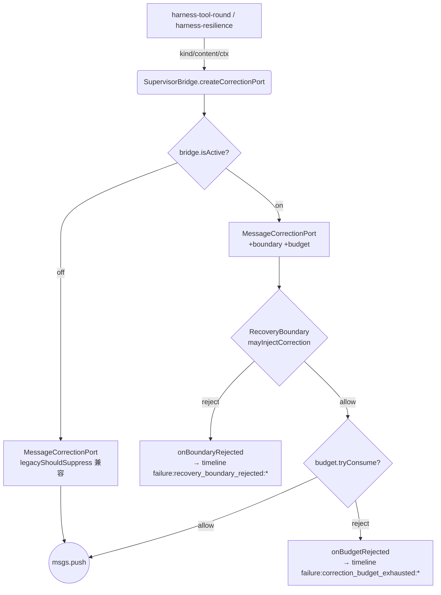
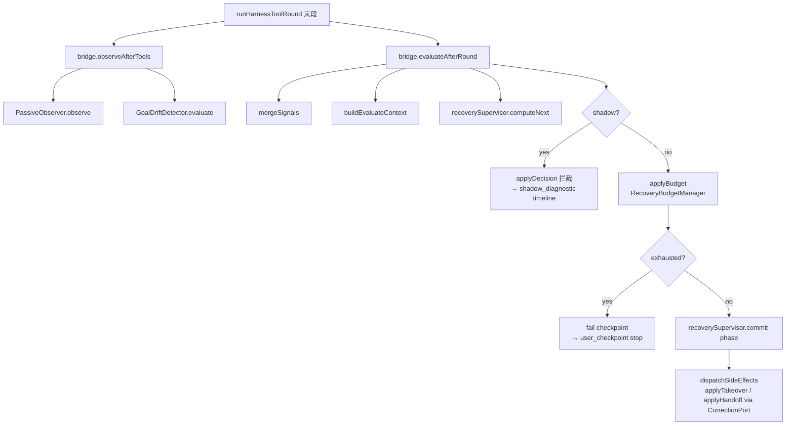
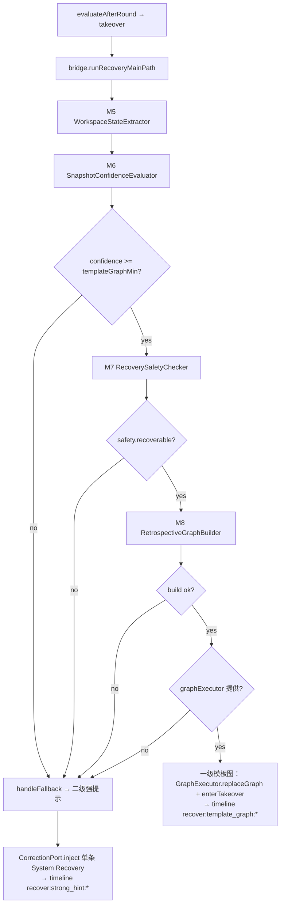
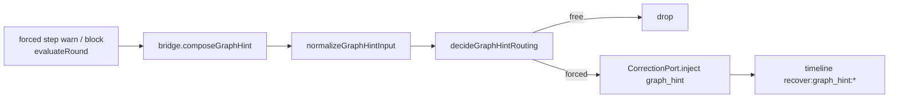

# 双模 L2 流程图

> P2-3 交付物：一次 inject / 一轮 after-round / takeover 主路径的可视化说明。  
> 权威规格：[`双模方案2.md`](./双模方案2.md) V1.3.7；代码入口：[`src/harness/supervisor/`](../src/harness/supervisor/)。

---

## 1. 一次 inject 的完整路径

**要点：**

- off 模式：`createCorrectionPort` 不挂 boundary/budget，保留历史 W7 静默 drop。
- on 模式：boundary 在前、budget 在后；仅 `budgetCountable=true` 的 inject 消耗 I4 配额。
- timeline 的 `round` 来自 `ctx.round ?? bridge.currentRound`（P1-1）。

---

## 2. 一轮 after-round 决策路径

**要点：**

- `observeAfterTools` 只累积 signal + timeline，不推进 phase 机。
- `evaluateAfterRound` 是唯一 after-round 决策入口；shadow 段只记 diagnostic，不真正 takeover。
- `fail{checkpoint}` 经 Harness `loopController.stop('user_checkpoint')` 串联停止。

---

## 3. takeover 主路径（§10）

---

## 4. graph hint 收口（§14.0 / L2-7）

---

## 相关测试

| 项 | 测试文件 |
|----|----------|
| RecoveryBoundary 64 矩阵 | `test/harness/recovery-boundary.test.ts` |
| 6 场景 e2e | `test/e2e/dual-mode-scenarios.test.ts` |
| firstRoundGraph 集成 | `test/harness/execution-mode-harness.test.ts` |
