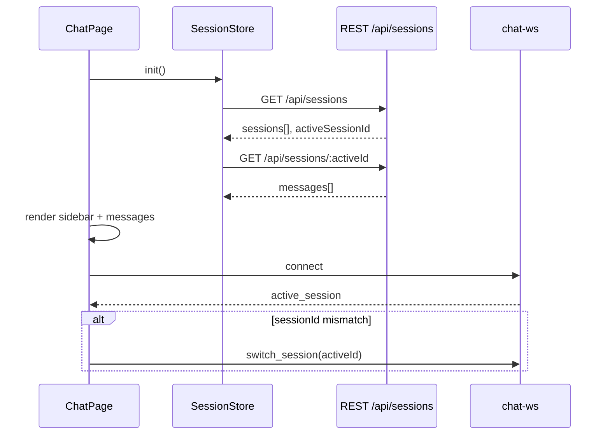
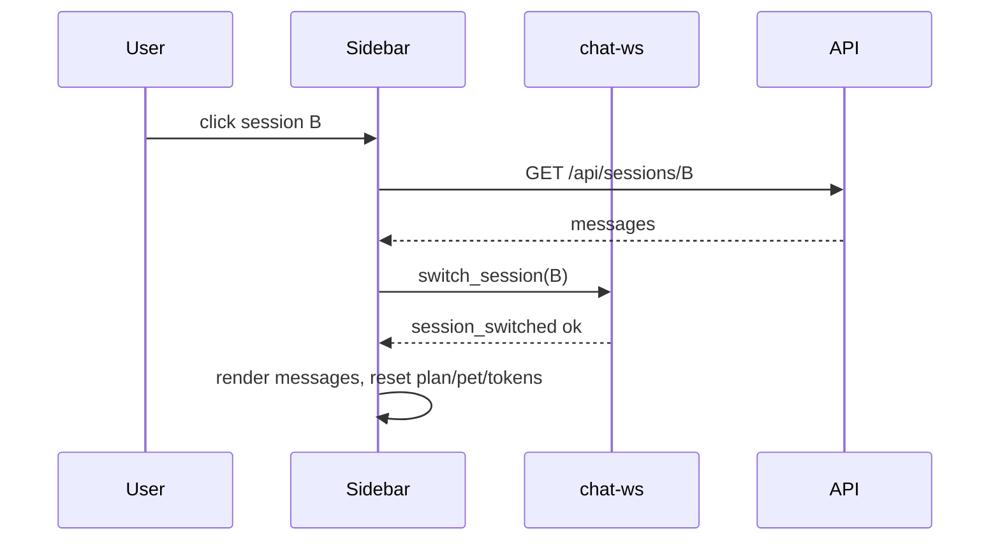

# Web 多会话与侧栏导航 — 需求文档

> **状态**：已实现（v0.3，2026-05-27）  
> **版本**：v0.3  
> **日期**：2026-05-27（原 v0.2 编写于 2026-05-26）  
> **范围**：Web 聊天页 · 会话 API · WebSocket 会话切换 · 移除 `~clear` · 桌面折叠 + 窄屏抽屉 · session-notes 按 session 隔离

---

## 0. 实际实现摘要（v0.3 现状，**与下文 v0.2 设计的差异点**）

下文 §1–§14 保留 v0.2 设计 + §14 代码审查记录，本节列出与设计偏离 / 收敛后的最终行为。

### 0.1 `~clear` 与 `clear_session`

- **彻底移除**（非「保留 deprecated no-op」）：
  - `chat-page.js` 不再特殊处理 `~clear`，与普通文本同等对待（会被当成消息发给模型，建议用户用侧栏 ＋ / ×）；
  - `chat-commands.js` 命令列表已无 `clear` / `handleClear` / `clearMessages`；
  - `chat-websocket.js` 已删除 `sendClearSession`；
  - `chat-session.js` 已删除 `clearMessages` / `clear_session` 发送；
  - `chat-ws.ts` 已删除 `clear_session` 处理分支与 `clearSessionFile` 函数；
  - CLI `/clear` **保留**（无侧栏）。

### 0.2 默认会话可删

- `DELETE /api/sessions/default` 不再返回 400，与其它会话同等可删；
- 侧栏所有项（含 default）都显示 ×；
- 删除当前会话时前端 `ChatSessionStore.deleteSession` 的 fallback 算法：
  1. 列表中尚有其它会话 → 先 `switch_session` 到首项，再删；
  2. 列表中仅剩当前 → 自动 `POST /api/sessions` 新建并切过去再删；
- 仅当 `GET /api/sessions` 时**列表完全为空**才会自动写入 `default` 引导条目（保留旧装兼容；用户主动删完后不会自动回退）。

### 0.3 顶栏侧栏切换按钮

- **位置**：`.nav-brand` 内、IceCoder **左侧**（不是右侧）；
- **形态**：两枚 SVG（展开 / 收起），不再是「三个 `<span>` 短横」；
- **id / class**：`#nav-sidebar-toggle` / `.nav-sidebar-toggle`（不是 `.chat-sidebar-toggle`）；
- **双模行为**：
  - 桌面（>768px）：切换 `.chat-session-sidebar.collapsed`（宽度→0），状态持久化到 `localStorage` 键 `ice-chat-sidebar-panel-visible`；
  - 窄屏（≤768px）：保留抽屉 + backdrop；
- 非聊天页：`body:not([data-page="chat"]) .nav-sidebar-toggle { display: none }`。

### 0.4 `index.json` 简化 schema

实际持久化为**扁平数组**（无 `version`、无 `activeSessionId`）：

```jsonc
[
  { "id": "default", "title": "默认会话", "createdAt": 1716800000000, "updatedAt": 1716800000000, "messageCount": 0 }
]
```

- `createdAt` / `updatedAt`：**毫秒数**（`Date.now()`），不是 ISO；
- 无 `preview` 字段；
- `messageCount`：创建时填 `0`，**当前不会随消息累积更新**（侧栏未使用，可后续补）；
- session id：`randomUUID().slice(0, 8)`（8 字符 hex 前缀）。

### 0.5 localStorage 键

- 前端按会话缓存：`ice-chat-messages:{sessionId}`（**冒号**分隔，不是连字符；旧 `ice-chat-messages` 自动迁到 `:default`，保留原键以便降级）；
- 侧栏桌面折叠状态：`ice-chat-sidebar-panel-visible`。

### 0.6 WS 协议简化

- 连接建立时 `connected` 包内夹带 `activeSessionId`（替代独立的 `active_session` 推送）；
- `session_switched` 的 `reason` 实际枚举：
  - `'flush_failed'`（旧会话刷盘失败 → 中止切换）
  - `'processing'`（任务进行中拒绝切换）
  - `'supervisor_reset_failed'`（`ok: true` 时附带，作为降级警告）
- `active_session` / `get_active_session` **未实现**；前端已不依赖。

### 0.7 断点恢复隔离（v0.3 关键修复）

- `session-notes.md` 改为 `**{sessionId}.session-notes.md`** 按会话隔离：
  - `src/memory/file-memory/session-memory.ts` 新增 `sessionNotesPath(dir, id)`，`initSessionMemoryState` 接受 `sessionId` 参数（缺省回退 `default`）；
  - `src/harness/harness-memory.ts` `HarnessMemoryConfig.sessionId` 传递；
  - `src/harness/harness.ts` 在构造 `HarnessMemoryIntegration` 时透传；
  - `src/web/routes/sessions.ts` `readSessionPlan` 改读 `{id}.session-notes.md` 而非全局共享；
- **迁移**：首次 `GET /api/sessions` 时若发现旧的全局 `data/sessions/session-notes.md`，自动 rename 为 `default.session-notes.md`（幂等，目标存在则跳过）；
- **删除清理**：`DELETE /api/sessions/:id` 一并删除 `{id}.session-notes.md`，并通过 `registerSessionCleanupHook` 回调通知 `chat-ws.purgeSessionRuntimeCaches` 清理进程内 `structuredCache` / `fileBrowserStateBySession` / `saveTimerMap`；
- 这是 v0.2 §5.4 / Phase 5 标注的「v0.2 推迟」项目，**v0.3 提前完成**，因为它是断点恢复正确性的核心。

### 0.8 切换会话时的运行时一致性

- **同步刷盘**：`switch_session` 调用 `flushStructuredMessagesNow(oldId)` 在切之前 `await` 写盘（取消防抖 timer 后直写），不再依赖 1s 防抖；提取到 `src/web/session-structured-io.ts`；
- **Supervisor reset**：切换前调用 `resetSupervisorRuntimeCache()`；失败不阻塞，回包附带 `reason: 'supervisor_reset_failed'`；
- `**activeAbortController`**：策略 A — **不 abort 旧任务**；当前 streaming 时拒绝切换（返回 `processing`），由用户先停止或等待；
- **fileBrowser 状态**：已迁到 `fileBrowserStateBySession: Map<sessionId, ...>`，切换不串。

### 0.9 单测覆盖（v0.3 新增）


| 测试文件                                             | 覆盖                                                                     |
| ------------------------------------------------ | ---------------------------------------------------------------------- |
| `test/web/sessions-api.test.ts`                  | CRUD、`:id` 动态路径、default 引导、删除 default                                  |
| `test/web/sessions-isolation.test.ts`            | session-notes 按 id 隔离、旧文件迁移、DELETE 清理文件族 + runtime hook、`/plan` 不跨会话泄漏 |
| `test/web/session-structured-io.test.ts`         | 结构化历史读写、`flushStructuredSessionToDisk` 同步落盘与 timer 取消                  |
| `test/memory/file-memory/session-memory.test.ts` | `notesPath` 默认 `default.session-notes.md` 与按 id 隔离                     |


### 0.10 未做 / 已知限制

- **多 Tab 竞态**（§14 Issue-5）：仍未实现「踢旧连接」策略 A；当前进程级单例 `activeSessionId` 多 Tab 共享，最后操作生效。
- `**index.json` 并发写**（§14 Issue-6）：仍为 read-modify-write，无文件锁。
- `**messageCount` / `preview`**（§4.1 / §9.1）：侧栏未使用，未在 PUT / append 时增量更新。
- **resize 跨断点**（§9.1）：未做 `matchMedia('change')` 监听强制清抽屉。
- `**active_session` 独立推送**：见 §0.6，用 `connected` 包替代，未单独发。

---

## 1. 目标

在 Web 聊天页左侧增加**会话导航栏**，使用户可以：

1. **新建会话** — 空白对话，独立 Harness 运行时上下文；
2. **编辑会话** — 修改会话标题（显示名）；
3. **切换会话** — 点击某会话后加载其完整聊天历史并展示；
4. **不再需要 `~clear`** — 「新建会话」取代「清空当前会话再开新任务」的手动流程。

### 1.1 为什么做


| 现状                                         | 问题                                |
| ------------------------------------------ | --------------------------------- |
| 全局仅 `default` 单会话                          | 多任务并行或切换上下文必须 `~clear`，易误删历史      |
| `~clear` 清前端 + 后端缓存 + checkpoint/workspace | 操作隐蔽、不可恢复、与「保留历史」诉求冲突             |
| Harness 已验证 **217 轮**稳定                    | 长任务更需要「另开新会话」而非清空                 |
| `data/sessions/` 已按 `{sessionId}.`* 分文件    | 后端 schema 已预留 `sessionId`，缺索引与 UI |


### 1.2 非目标（本阶段不做）

- CLI 交互式 `/clear` 命令（保留，CLI 无侧栏）；
- 跨设备会话云同步（仍为本机 `data/sessions/`）；
- 会话内分支 / fork；
- 会话级 LLM 提供者配置（仍用全局 `data/config.json`）；
- 会话删除的批量管理 UI（见 §7.3 可选 P2）。

---

## 2. 现有架构分析

### 2.1 前端（`src/public/`）


| 模块                       | 现状                                                                   | 多会话影响                                  |
| ------------------------ | -------------------------------------------------------------------- | -------------------------------------- |
| `chat-session.js`        | `SESSION_ID = 'default'` 硬编码；`localStorage` 键 `ice-chat-messages` 单份 | 须改为「当前 sessionId + 按 session 缓存」       |
| `chat-page.js`           | 单列布局 `.chat-page`；`~clear` 分支调用 `Session.clearMessages`              | 增加侧栏布局；移除 `~clear`                     |
| `chat-commands.js`       | 命令列表含 `~clear`                                                       | 移除 Web 端 `clear` 命令                    |
| `chat-websocket.js`      | 无 session 切换协议                                                       | 增加 `switch_session` / `session_list` 等 |
| `chat-execution-plan.js` | 按 `default` 拉 `/api/sessions/:id/plan`                               | 随当前 sessionId 切换                       |
| `memory-page.js`         | 已有 `.memory-sidebar` 侧栏样式可参考                                         | 复用布局/token，不共用业务逻辑                     |


### 2.2 后端 API（`src/web/routes/sessions.ts`）

- `GET /api/sessions/:id` — 读 `{id}.json`（**但实现 bug**：`GET` 始终读 `default.json`，`:id` 未生效）
- `PUT /api/sessions/:id` — 写 `{id}.json`
- `GET /api/sessions/:id/plan` — 读 `{id}.checkpoint.json` 或共享 `session-notes.md`
- **缺失**：会话列表、创建、重命名、删除（metadata CRUD）

### 2.3 WebSocket（`src/web/chat-ws.ts`）

- 进程级单例 `cachedMessages` — 仅支持一个活跃结构化上下文；
- `SESSION_ID = 'default'` 传入 Harness `sessionDir` + `sessionId`；
- `clear_session` 消息 — 清空缓存 + `default.json` + `default.structured.json` + workspace；
- `broadcastSessionUpdated` — 多端同步拉取 `default.json`。

### 2.4 磁盘布局（`data/sessions/`）

每个 `sessionId` 已有独立文件族（Harness 已支持）：

```
data/sessions/
  index.json                    ← 新增：会话索引
  {sessionId}.json              ← UI 展示消息（user/agent/tool_trace）
  {sessionId}.structured.json   ← LLM 结构化历史（chat-ws 缓存持久化）
  {sessionId}.checkpoint.json   ← TaskCheckpoint + runtimeV2
  {sessionId}.workspace.json    ← 工作区锁定状态
  session-notes.md              ← 当前全局共享（本阶段仍共享，见 §5.4）
```

### 2.5 移动端 / 远程（`src/web/remote-ws.ts`）

- 同样硬编码 `default`；
- 扫码远程页 `#/chat?token=xxx` 本阶段**跟随 PC 端当前活跃 session**，或固定绑定创建 token 时的 sessionId（实现时二选一，见 §6.4）。

### 2.6 架构就绪度结论

**总评：Harness / 磁盘层「半支持」；Web + WebSocket + 前端「不支持」。**

多会话**不需要推倒 Harness 重来**，主要是 Web 层接线，并处理少量全局单例与共享文件。整体属于**中等工程量**。

#### 已支持（Harness / 持久化层）

以下能力**从设计上已按 `sessionId` 分文件**，换 id 即可隔离，217 轮长任务所依赖的 checkpoint / 压缩 / 恢复逻辑可直接复用：


| 能力                              | 文件 / 配置                                   | 代码位置                                            |
| ------------------------------- | ----------------------------------------- | ----------------------------------------------- |
| TaskCheckpoint v1               | `{sessionId}.checkpoint.json`             | `src/harness/checkpoint.ts`                     |
| CheckpointEngine v2 / runtimeV2 | 合并写入同上 checkpoint 文件                      | `src/harness/checkpoint-engine.ts`              |
| BranchBudget / Supervisor 快照    | checkpoint `runtimeV2` 字段                 | `src/types/runtime-checkpoint.ts`               |
| Workspace 锁定                    | `{sessionId}.workspace.json`              | `src/harness/session-workspace-store.ts`        |
| 结构化 LLM 历史                      | `{sessionId}.structured.json`             | `src/web/chat-ws.ts`（持久化路径已按 id，但内存仅一份）         |
| UI 展示消息                         | `{sessionId}.json`                        | `src/web/routes/sessions.ts`                    |
| Harness 运行时                     | `HarnessConfig.sessionId`                 | `src/harness/harness.ts`、`src/harness/types.ts` |
| 运行时遥测                           | `RuntimeTelemetry(sessionDir, sessionId)` | `src/harness/runtime-telemetry.ts`              |


Harness 构造示例（已支持动态 id，调用方写死 `'default'` 是问题所在）：

```typescript
// src/harness/harness.ts
this.sessionId = config.sessionId ?? 'default';
this.checkpointManager = new TaskCheckpointManager(config.sessionDir, config.sessionId);
this.checkpointEngine = new CheckpointEngine(config.sessionDir, config.sessionId);
```

#### 不支持（Web / 连接 / 前端层）


| 层级            | 现状                                               | 后果                     |
| ------------- | ------------------------------------------------ | ---------------------- |
| **WebSocket** | 进程单例 `cachedMessages` + `SESSION_ID = 'default'` | 内存里只有一份 LLM 上下文，切换会话必串 |
| **WebSocket** | `clear_session` 清空而非切换                           | 与「保留历史、另开会话」目标相反       |
| **WebSocket** | `broadcastSessionUpdated` 无 `sessionId`          | 多端 tab 可能误刷非当前会话 UI    |
| **REST**      | `GET /api/sessions/:id` 始终读 `default.json`       | 路由有 `:id` 但未生效         |
| **REST**      | 无 `index.json`、无列表/创建 API                        | 前端无法管理多会话              |
| **前端**        | `chat-session.js` 硬编码 `SESSION_ID = 'default'`   | 无法按 id 拉历史             |
| **前端**        | `localStorage` 单键 `ice-chat-messages`            | 与服务端多文件模型不一致           |
| **前端**        | 无侧栏 UI                                           | 用户无法新建/切换会话            |
| **远程**        | `remote-ws.ts` 硬编码 `default`                     | 手机端与 PC 会话不一致          |
| **CLI**       | `chat.ts` / `run.ts` 固定 `sessionId: 'default'`   | CLI 不在本需求范围，保持即可       |


WebSocket 单例（改造核心）：

```typescript
// src/web/chat-ws.ts — 当前
let cachedMessages: UnifiedMessage[] | undefined;
const SESSION_ID = 'default';
```

#### 全局共享、不按 session 隔离


| 资源                           | 路径 / 形态                                | 多会话影响                                               | 本阶段策略                                                                          |
| ---------------------------- | -------------------------------------- | --------------------------------------------------- | ------------------------------------------------------------------------------ |
| `**session-notes.md**`       | `data/sessions/session-notes.md`（全局一份） | TaskState / plan fence / 压缩恢复可能**串会话** — **实质隔离缺口** | v0.1 仍共享 + 文档标注；切换时 ExecutionPlan.clear；v0.2 改为 `{sessionId}.session-notes.md` |
| **FileMemoryManager**        | 进程单例                                   | 长期记忆全局共享                                            | 可接受（记忆本就不按会话切）                                                                 |
| **Supervisor runtime cache** | 进程级                                    | 切换 session 须 reset                                  | `switch_session` 时调用 `registerSupervisorRuntimeReset`                          |
| **fileBrowser 模式**           | `chat-ws.ts` 进程变量                      | `~open` 目录浏览状态串会话                                   | 改为 `Map<sessionId, state>`（见 §5.3）                                             |


`session-notes.md` 引用链（隔离时需一并改）：

- `src/harness/harness-memory.ts` — 快照恢复、plan fence 读写
- `src/memory/file-memory/session-memory.ts` — `notesPath: sessionDir/session-notes.md`
- `src/web/routes/sessions.ts` — plan API fallback
- `src/harness/context-compactor.ts` / `compaction-strategy.ts` — 压缩提示中的路径

#### 运行时约束（产品层，非架构缺陷）

- **同一时刻仅一个 WebSocket 连接在执行 Harness** — 多会话是「切换上下文」，不是「并行跑多个 Agent」；
- 切换 session 时若任务仍在 streaming → 须禁止切换或先 abort，否则 structured 缓存可能写入错误 session；
- 新建会话 = 空白上下文 + 新 checkpoint 路径，**不**删除其它 session 磁盘文件。

### 2.7 实现难度分级


| 难度     | 工作项                                                           | 说明                                                                                |
| ------ | ------------------------------------------------------------- | --------------------------------------------------------------------------------- |
| **低**  | `index.json` + migration（`default` → 首条会话）                    | 纯数据层，无 Harness 改动                                                                 |
| **低**  | 修复 `GET /api/sessions/:id` 读错文件                               | 单行级 bug                                                                           |
| **低**  | `GET/POST/PATCH /api/sessions` CRUD                           | Express router 扩展                                                                 |
| **中**  | `chat-ws` 多 session：`activeSessionId` + `structuredCache` Map | 改造核心；须处理刷盘顺序与 `switch_session` 协议                                                 |
| **中**  | Harness 调用处 `sessionId` 动态化                                   | 参数已存在，替换硬编码即可                                                                     |
| **中**  | Web 侧栏 + `chat-session-store.js`                              | UI + 与 API/WS 编排                                                                  |
| **中**  | streaming 互斥（切换/新建时禁止）                                        | 前后端双重校验                                                                           |
| **中**  | 多端 `session_updated` 带 `sessionId` 过滤                         | 避免 tab 间误刷                                                                        |
| **中**  | 远程端跟随 PC `activeSessionId`（方案 A）                              | `remote-ws.ts` 对齐                                                                 |
| **中高** | `session-notes.md` 按 session 隔离                               | 动 `harness-memory`、`session-memory`、compaction、plan API；**若 v0.1 不做，须在验收中标注已知限制** |
| **低**  | 移除 Web 端 `~clear`                                             | 删除分支 + 命令列表项                                                                      |
| **低**  | CLI `/clear` 保持不变                                             | 不在本需求范围                                                                           |


**最难的三块（按优先级）：**

1. `**chat-ws` 单例缓存改造** — 从「一份 `cachedMessages`」到「按 sessionId 切换 + 刷盘」；
2. `**session-notes.md` 全局共享** — 不隔离则 plan / 会话记忆可能串；隔离则触及 Harness 记忆子系统；
3. **切换时的 streaming 互斥与多端同步** — 产品正确性，实现量适中。

**相对容易、可先做（Phase 1）：** API 修复 + index + migration，与 Harness 无耦合，可独立 PR 验证。

**一句话：** 磁盘与 Harness **已 ready**；Web 运行时 **未 ready**；主要工作量在 **WebSocket 接线 + 前端侧栏**，`session-notes` 隔离是唯一的 **Harness 侧中高难项**（可延后 v0.2）。

---

## 3. 产品行为

### 3.1 布局

**桌面（宽屏）**

```
┌─────────────────────────────────────────────────────────┐
│  [IceCoder]  （聊天 | 配置 | …）              连接状态   │  ← 顶栏无汉堡
├──────────────┬──────────────────────────────────────────┤
│ 会话侧栏      │  聊天主区域                               │
│              │  ┌─────────────────────────────────────┐ │
│ [+ 新建会话]  │  │ messages                           │ │
│              │  └─────────────────────────────────────┘ │
│ ● 修复订单流水线│  冰豆 + 输入框                          │
│   订单模块     │                                          │
│ ○ 记忆系统调整  │                                          │
│ ○ 未命名会话   │                                          │
└──────────────┴──────────────────────────────────────────┘
```

**窄屏（≤768px）— 侧栏默认隐藏，顶栏汉堡切换**

```
┌─────────────────────────────────────────────────────────┐
│  [IceCoder] [≡]  （聊天 | 配置 | …）         连接状态   │  ← 汉堡在品牌名右侧
├─────────────────────────────────────────────────────────┤
│  聊天主区域（全宽）                                       │
│  ┌───────────────────────────────────────────────────┐ │
│  │ messages                                           │ │
│  └───────────────────────────────────────────────────┘ │
│  冰豆 + 输入框                                           │
└─────────────────────────────────────────────────────────┘

点击 [≡] 后侧栏自左侧滑入（抽屉 + 遮罩）：

┌─────────────────────────────────────────────────────────┐
│  [IceCoder] [≡]  …                                       │
├──────────────┬──────────────────────────────────────────┤
│▓会话侧栏▓    │▓▓▓▓ 遮罩（点击可关闭）▓▓▓▓▓▓▓▓▓▓▓▓▓▓▓▓▓│
│ [+ 新建会话]  │                                          │
│ ● 当前会话    │  （主区域仍可点遮罩关闭侧栏）               │
└──────────────┴──────────────────────────────────────────┘
```

#### 3.1.1 响应式断点


| 视口宽度              | 侧栏                                     | 顶栏汉堡                                             |
| ----------------- | -------------------------------------- | ------------------------------------------------ |
| **> 768px**       | 固定显示，宽度 **240px**，与主区域并排               | **隐藏**（`.chat-sidebar-toggle { display: none }`） |
| **≤ 768px**       | **默认隐藏**；不占主区域宽度                       | **显示**（仅聊天页激活时，见 §3.1.2）                         |
| **≤ 768px 且侧栏打开** | 抽屉 overlay，宽 **min(280px, 85vw)**，自左滑入 | 汉堡保持可见，再次点击关闭                                    |


断点 **768px** 与现有 `@media (max-width: 640px)` 顶栏样式可并存；侧栏逻辑以 **768px** 为准。

#### 3.1.2 顶栏汉堡按钮（三短横）

- **位置**：全局顶栏 `#top-nav` 内，**紧挨 `IceCoder` 品牌文字右侧**（`.nav-brand` 内，`logo-text` 之后）。
- **结构**：使用 **三个 `<span>`** 绘制短横线，不用 SVG / 图标字体：

```html
<!-- index.html — 仅聊天页需要时由 chat-page 挂载或默认 hidden -->
<button
  type="button"
  class="chat-sidebar-toggle"
  id="chat-sidebar-toggle"
  aria-label="切换会话侧栏"
  aria-expanded="false"
  aria-controls="chat-session-sidebar"
  hidden
>
  <span class="chat-sidebar-toggle-bar"></span>
  <span class="chat-sidebar-toggle-bar"></span>
  <span class="chat-sidebar-toggle-bar"></span>
</button>
```

- **样式要点**（`style.css`）：
  - `.chat-sidebar-toggle`：无边框按钮，`display: inline-flex; flex-direction: column; gap: 4px; padding: 6px;`
  - `.chat-sidebar-toggle-bar`：块级 span，`width: 18px; height: 2px; background: var(--text-secondary); border-radius: 1px;`
  - 打开态可选 `.chat-sidebar-toggle.is-open` 做轻微动画（P2，首版可静态三横）。
- **可见性**：
  - 非聊天页（配置、记忆等）：汉堡 **始终 hidden**；
  - 聊天页 + 视口 **> 768px**：hidden；
  - 聊天页 + 视口 **≤ 768px**：visible。

#### 3.1.3 切换交互


| 操作                     | 行为                                                                                            |
| ---------------------- | --------------------------------------------------------------------------------------------- |
| 点击汉堡（侧栏关闭 → 打开）        | 侧栏滑入；显示 `.chat-sidebar-backdrop` 遮罩；`aria-expanded="true"`；`body` 可选 `overflow: hidden` 防背景滚动 |
| 再次点击汉堡（侧栏打开 → 关闭）      | 侧栏滑出；移除遮罩；`aria-expanded="false"`                                                             |
| 点击遮罩                   | 等同「关闭侧栏」                                                                                      |
| 在侧栏内选中某会话              | **自动关闭**抽屉（窄屏），便于阅读主区域                                                                        |
| 视口从窄变宽（resize > 768px） | 强制关闭抽屉态；侧栏恢复为固定列布局；隐藏汉堡                                                                       |


- 侧栏位于**聊天页内部**（`.chat-layout`），顶栏汉堡为**全局 nav 与聊天页的桥接控件**；不影响「配置 / 记忆图谱」等其它页面布局。
- **桌面**：侧栏固定宽度 **240px**；可折叠为 **48px** 图标条（P2，首版可不做折叠）。

### 3.2 新建会话

1. 用户点击「+ 新建会话」；
2. 若当前会话有未保存的 streaming 任务 → 提示「请先停止或等待当前任务完成」；
3. 调用 `POST /api/sessions` 创建记录，生成 UUID `sessionId`；
4. 默认标题：**「未命名会话」** + 短 id 后缀（如 `未命名会话 a3f2`），避免列表重复；
5. 切换为活跃会话：清空主区域消息、重置 token 用量与 ExecutionPlan 面板、重置冰豆 forced 状态；
6. 通过 WebSocket 发送 `{ type: 'switch_session', sessionId }`，后端切换 `cachedMessages` 上下文；
7. 侧栏高亮新会话，**不**删除其它会话数据。

**等价关系**：`新建会话` = 旧版 `~clear` + 保留旧会话历史。

### 3.3 编辑会话

1. 侧栏项 hover 显示「编辑」图标，或双击标题进入 inline 编辑；
2. 仅修改 **title**（显示名），不改 `sessionId`；
3. `PATCH /api/sessions/:id` 更新 `index.json` 中对应项；
4. 标题约束：1–64 字符，trim 后非空；非法字符过滤 `<>`。

### 3.4 切换会话

1. 用户点击侧栏某会话；
2. 若点击的已是当前会话 → 无操作；
3. 若有 streaming 任务 → 阻止切换并 toast 提示；
4. 流程：
  - 前端：`GET /api/sessions/:id` 拉取 `{id}.json`；
  - 分离 `tool_trace`、渲染消息列表；
  - `GET /api/sessions/:id/plan` 刷新 ExecutionPlan；
  - WebSocket：`switch_session` 通知后端加载 `{id}.structured.json`；
  - 更新 `localStorage` 当前 sessionId；
  - 重置 token 计数；冰豆状态随新会话 telemetry 更新。
5. 切换后输入框 focus，滚动到底部锚点。

### 3.5 废弃 `~clear`


| 位置                           | 变更                                                           |
| ---------------------------- | ------------------------------------------------------------ |
| `chat-page.js`               | 删除 `text === '~clear'` 分支                                    |
| `chat-commands.js`           | 从 Web 命令列表移除 `clear`                                         |
| `chat-ws.ts`                 | 删除或标记 deprecated `clear_session` WS 类型（保留 1 版本兼容 no-op + 日志） |
| `friendly-errors.ts`         | 错误提示改为「请新建会话或切换会话」                                           |
| `docs/requirement/L2测试过程.md` | 后续手工测试改为「新建会话」（文档同步，非本 PR 阻塞）                                |


用户在输入框输入 `~clear` 时：**不再执行任何操作**，可显示一行 agent 提示「已支持多会话，请使用左侧「新建会话」」。

CLI `/clear` **保留**。

---

## 4. 数据模型

### 4.1 会话索引 — `data/sessions/index.json`

```typescript
/** 会话索引文件 schema v1 */
export interface SessionIndexFile {
  version: 1;
  /** 按 updatedAt 降序展示 */
  sessions: SessionMeta[];
  /** 最近一次 Web 端活跃 session（PC 无 token 时使用） */
  activeSessionId?: string;
}

export interface SessionMeta {
  id: string;           // UUID v4
  title: string;
  createdAt: string;    // ISO 8601
  updatedAt: string;    // ISO 8601 — 最后一条消息或标题变更
  /** 最后一条 user 消息摘要，侧栏副标题，可选 */
  preview?: string;
  /** 消息条数（user+agent，不含 tool_trace），侧栏展示用 */
  messageCount?: number;
}
```

### 4.2 消息文件 — 不变

沿用现有 `{sessionId}.json` 数组格式：

```typescript
interface PersistedChatMessage {
  role: 'user' | 'agent' | 'tool_trace';
  content: string;
  id?: string;
  parentId?: string;      // tool_trace
  toolName?: string;
  detail?: string;
  status?: string;
}
```

### 4.3 前端 localStorage


| 键                       | 值                               |
| ----------------------- | ------------------------------- |
| `ice-active-session-id` | 当前 sessionId                    |
| ~~`ice-chat-messages`~~ | **废弃** — 改由服务端 `{id}.json` 为权威源 |


可选：`ice-sidebar-collapsed` boolean。

---

## 5. API 设计

### 5.1 REST — `src/web/routes/sessions.ts` 扩展


| 方法       | 路径                       | 说明                                                      |
| -------- | ------------------------ | ------------------------------------------------------- |
| `GET`    | `/api/sessions`          | 返回 `{ sessions: SessionMeta[] }`，读 `index.json`         |
| `POST`   | `/api/sessions`          | Body: `{ title?: string }` → 创建 session + 空 `{id}.json` |
| `GET`    | `/api/sessions/:id`      | 返回 `{ messages: [] }` — **修复为按 `:id` 读文件**              |
| `PUT`    | `/api/sessions/:id`      | 全量覆盖 messages（前端防抖保存，逻辑不变）                              |
| `PATCH`  | `/api/sessions/:id`      | Body: `{ title: string }` — 仅更新 metadata                |
| `DELETE` | `/api/sessions/:id`      | **P2 可选** — 删除 session 全套文件                             |
| `GET`    | `/api/sessions/:id/plan` | 已有，确保 `:id` 正确                                          |


**创建 session 时服务端须：**

1. 写入 `index.json`；
2. 初始化 `{id}.json` 为 `[]`；
3. 初始化 `{id}.structured.json` 为 `[]`（可选，首次消息时再建亦可）；
4. **不**预创建 checkpoint（首次 Harness.run 时创建）。

**更新 preview / messageCount：**

- 在 `appendMessages` / `PUT` 成功时异步更新 `index.json` 对应项的 `preview`（最后 user 消息前 80 字）与 `updatedAt`。

### 5.2 WebSocket 协议扩展 — `chat-ws.ts`

#### 客户端 → 服务端

```typescript
/** 切换活跃会话（替代 clear_session 的核心路径） */
{ type: 'switch_session', sessionId: string }

/** 可选：拉取当前后端绑定的 sessionId */
{ type: 'get_active_session' }
```

#### 服务端 → 客户端

```typescript
{ type: 'active_session', sessionId: string }

{ type: 'session_switched', sessionId: string, ok: boolean, reason?: string }

/** session_updated 增加 sessionId 字段 */
{ type: 'session_updated', sessionId: string, reason: string }
```

#### 后端 `switch_session` 行为

1. 将当前 `cachedMessages` 刷盘到**旧** session 的 `.structured.json`（若有脏数据）；
2. 从 `{newId}.structured.json` 加载到 `cachedMessages`（不存在则 `[]`）；
3. 更新进程内 `activeSessionId`；
4. 重置 `fileBrowserModeActive` / `fileBrowserLastBrowsedPath`（与旧 `clear_session` 一致，**按 session 隔离** — 见 §5.3）；
5. 回复 `session_switched`；
6. **不**清空任何 session 文件。

#### 废弃

```typescript
{ type: 'clear_session' }  // deprecated → 等价于 switch 到一个全新 POST 创建的 session，或 no-op + warn
```

### 5.3 进程内状态改造

`chat-ws.ts` 单例改为：

```typescript
let activeSessionId: string;
const structuredCache = new Map<string, UnifiedMessage[]>();
const fileBrowserStateBySession = new Map<string, { active: boolean; lastPath: string | null }>();
```

Harness 调用处：

```typescript
sessionDir: SESSIONS_DIR,
sessionId: activeSessionId,  // 替代硬编码 'default'
```

### 5.4 共享资源说明


| 资源                       | 策略                                                                                              |
| ------------------------ | ----------------------------------------------------------------------------------------------- |
| `session-notes.md`       | **v0.1 仍全局共享**；ExecutionPlan fallback 可能串会话 — 已知限制，文档标注；v0.2 可改为 `{sessionId}.session-notes.md` |
| `data/memory-files/`     | 全局共享（长期记忆不按 session 切分）                                                                         |
| FileMemoryManager        | 进程单例，不按 session 隔离                                                                              |
| Supervisor runtime cache | `switch_session` 时调用已有 `registerSupervisorRuntimeReset` 或等价 reset                               |


---

## 6. 前端模块设计

### 6.1 新增文件

```
src/public/js/
  chat-session-sidebar.js   # 侧栏 DOM、列表渲染、新建/编辑/选中
  chat-session-store.js     # session 列表 CRUD、activeSessionId、与 API 通信
```

### 6.2 修改文件


| 文件                       | 变更                                                                                                                 |
| ------------------------ | ------------------------------------------------------------------------------------------------------------------ |
| `index.html`             | `.nav-brand` 内 `logo-text` 后增加 `#chat-sidebar-toggle`（三 `<span>` 短横）                                               |
| `chat-page.js`           | 布局改为 flex 双栏；挂载 sidebar；切换时 orchestrate；**窄屏抽屉开/关**；resize 监听                                                      |
| `chat-session.js`        | 接受动态 sessionId；移除 clearMessages 对 clear_session 的依赖                                                                |
| `chat-commands.js`       | 移除 `~clear`                                                                                                        |
| `chat-execution-plan.js` | plan API 使用当前 sessionId                                                                                            |
| `chat-websocket.js`      | 处理 `active_session` / `session_switched`                                                                           |
| `css/style.css`          | `.chat-layout`、`.chat-session-sidebar`、`.chat-sidebar-toggle`、`.chat-sidebar-backdrop`、`@media (max-width: 768px)` |
| `main.js` 或路由            | 进入聊天页时显示汉堡（窄屏）；离开聊天页时 hidden 并关闭抽屉                                                                                 |


### 6.3 侧栏交互细节

- **选中态**：`.chat-session-item.active` 左边框高亮 + 背景色；
- **排序**：默认 `updatedAt` 降序；
- **空列表**：首次启动 migration 后至少 1 条（原 `default`）；
- **键盘**：↑↓ 切换选中 session（P2）；Enter 编辑标题（P2）。

#### 6.3.1 窄屏抽屉与汉堡（v0.2）

`chat-session-sidebar.js` 或 `chat-page.js` 须提供：

```javascript
/** 侧栏抽屉状态（仅 ≤768px 有效） */
function isSidebarDrawerMode() {
  return window.matchMedia('(max-width: 768px)').matches;
}

function openSidebarDrawer() { /* 添加 .is-open 到 sidebar + backdrop；aria-expanded */ }
function closeSidebarDrawer() { /* 移除 .is-open；aria-expanded=false */ }
function toggleSidebarDrawer() {
  if (sidebarEl.classList.contains('is-open')) closeSidebarDrawer();
  else openSidebarDrawer();
}
```

- `#chat-sidebar-toggle` 点击 → `toggleSidebarDrawer()`；
- `.chat-sidebar-backdrop` 点击 → `closeSidebarDrawer()`；
- 侧栏内「切换会话」成功回调 → 窄屏下 `closeSidebarDrawer()`；
- `window.matchMedia('(max-width: 768px)')` 的 `change` 事件：变为宽屏时 `closeSidebarDrawer()` 并移除 overlay 类名。

**localStorage（可选）**：不持久化抽屉开/关；每次进入窄屏默认 **关闭**，避免遮挡主区域。

### 6.4 远程 / 移动端

**推荐方案 A（简单）**：远程 token 连接时使用 PC 当前 `activeSessionId`，PC 切换 session 后 broadcast `session_switched`，移动端跟随刷新。

**方案 B**：每个 remote token 绑定独立 sessionId（扫码时创建）— 工作量大，本阶段不采用。

---

## 7. 迁移与兼容

### 7.1 首次启动 migration

若 `data/sessions/index.json` 不存在：

1. 若存在 `default.json` 或 `default.structured.json` 有内容 → 保留 `id = 'default'` 作为首条 session，`title = '默认会话'`；
2. 否则创建 `id = 'default'` 空会话；
3. 写入 `index.json`，`activeSessionId = 'default'`。

**不删除**现有 `default.`* 文件。

### 7.2 旧 localStorage

- 若存在 `ice-chat-messages` 且服务端 `default.json` 为空 → 一次性 PUT 到 `default` 并清除 localStorage 键；
- 之后仅以服务端为准。

### 7.3 可选 P2：删除会话

- 侧栏项右键 / 更多菜单 → 删除；
- 确认对话框；
- 删除 `{id}.json`、`{id}.structured.json`、`{id}.checkpoint.json`、`{id}.workspace.json`；
- 若删的是当前 session → 自动切换到 index 中下一项或新建空会话。

---

## 8. 运行时流程

### 8.1 页面加载




### 8.2 用户发送消息

与现有一致，但 `appendMessages` / Harness 使用 `activeSessionId` 写 `{id}.json` 与 `{id}.checkpoint.json`。

### 8.3 切换会话




---

## 9. 验收标准

### 9.1 功能

- 侧栏展示所有会话，含标题、preview、相对时间（如「3 分钟前」）；
- **宽屏（>768px）**：侧栏常显，顶栏汉堡隐藏；
- **窄屏（≤768px）**：侧栏默认隐藏；顶栏 `IceCoder` 右侧显示三横线汉堡（三个 `<span>`）；
- 窄屏下点击汉堡 → 侧栏滑出；再次点击汉堡 → 侧栏隐藏；
- 窄屏下点击遮罩或切换会话后，侧栏自动关闭；
- 窗口由窄拉宽超过 768px 时，侧栏恢复固定列、抽屉态清除；
- 新建会话后主区域为空，旧会话历史可在侧栏点击恢复；
- 编辑标题后刷新页面仍保留；
- 切换会话后消息、tool_trace、ExecutionPlan 与对应 session 一致；
- 会话 A 跑 Harness 到一半，切换到 B 再切回 A，可继续对话（structured 缓存正确）；
- checkpoint / workspace 按 sessionId 隔离，切换后 resume 行为正确；
- 输入 `~clear` 不再清空会话，并给出引导文案；
- `~` 命令列表中无 `clear`；
- 多端（两个浏览器 tab）切换 session 后 `session_updated` 不误刷其它 session 的 UI。

### 9.2 迁移

- 现有 `default.json` 历史无损出现在侧栏「默认会话」；
- 无 `index.json` 时首次启动自动 migration。

### 9.3 测试


| 类型  | 要求                                              |
| --- | ----------------------------------------------- |
| 单元  | `sessions` router CRUD、index 读写、migration       |
| 单元  | `chat-ws` switch_session 加载/刷盘 structured cache |
| 集成  | 创建 2 session → 各发 1 条消息 → 切换 → 消息不串             |
| 手工  | L2 测试文档场景：「新建或清空会话」改为「新建会话」                     |


建议新增：

```
test/web/sessions-router.test.ts
test/web/chat-ws-switch-session.test.ts
```

### 9.4 非回归

- CLI `iceCoder:cli` 的 `/clear` 仍可用；
- `npm test` 全绿；
- 远程扫码页在 PC 切换 session 后消息同步（方案 A）。

---

## 10. 实施分期

### Phase 1 — 数据层与 API（可独立 PR）

- `index.json` schema + migration
- 修复 `GET /api/sessions/:id` 读错文件
- `GET/POST/PATCH /api/sessions`
- 单元测试

### Phase 2 — WebSocket 多 session

- `activeSessionId` + `structuredCache` Map
- `switch_session` / `active_session`
- Harness `sessionId` 动态化
- deprecated `clear_session`

### Phase 3 — Web UI 侧栏

- `chat-session-sidebar.js` + `chat-session-store.js`
- 布局 CSS（含 **768px 断点**、抽屉、遮罩）
- 顶栏 `#chat-sidebar-toggle`（三 `<span>` 短横）+ 开/关逻辑
- 移除 `~clear`
- 手工验收（含窄屏 / 桌面双模式）

### Phase 4 — 文档与清理（可选）

- 更新 `L2测试过程.md`、`PACKAGE_USAGE.md`
- P2 删除会话、侧栏折叠（48px 图标条）、汉堡 open 动画

### Phase 5 — session-notes 按 session 隔离（可选 v0.2）

- `{sessionId}.session-notes.md` 路径改造
- `harness-memory.ts` / `session-memory.ts` / plan API / compaction 引用更新
- 验收：两 session 交替写入 notes，互不影响

---

## 11. 风险与对策


| 风险                                 | 对策                                                                     |
| ---------------------------------- | ---------------------------------------------------------------------- |
| 切换 session 时 streaming 未结束         | 前端禁止切换 + 后端拒绝 `switch_session`                                         |
| `session-notes.md` 全局共享导致 plan 串会话 | v0.1 文档标注；切换时 ExecutionPlan.clear + 按 checkpoint 读 plan；v0.2 见 Phase 5 |
| `cachedMessages` 竞态写错 session      | switch 前先 await 刷盘；单线程 Node 内串行化                                       |
| 远程端与 PC session 不一致                | `session_updated` 带 sessionId，前端忽略非当前 session 事件                       |
| index.json 并发写损坏                   | 写 tmp + rename；或用 append-only log（首版 tmp 足够）                           |


---

## 12. 参考代码位置


| Concern            | 路径                                                                            |
| ------------------ | ----------------------------------------------------------------------------- |
| 单 session 硬编码      | `src/web/chat-ws.ts:52`, `src/public/js/chat-session.js:12`                   |
| clear 逻辑           | `src/web/chat-ws.ts:417-427`, `src/public/js/chat-page.js:136-147`            |
| Sessions API       | `src/web/routes/sessions.ts`                                                  |
| Harness sessionId  | `src/harness/types.ts` (`HarnessConfig.sessionId`)                            |
| Checkpoint 路径      | `src/harness/checkpoint.ts` — ``${sessionId}.checkpoint.json``                |
| 侧栏样式参考             | `src/public/css/style.css` — `.memory-sidebar`                                |
| 顶栏品牌区              | `src/public/index.html` — `.nav-brand` / `.logo-text`                         |
| 响应式断点参考            | `src/public/css/style.css` — `@media (max-width: 640px)`（顶栏）；侧栏以 **768px** 为准 |
| ExecutionPlan      | `src/public/js/chat-execution-plan.js`                                        |
| session-notes 全局共享 | `src/harness/harness-memory.ts`, `src/memory/file-memory/session-memory.ts`   |
| Supervisor reset   | `src/harness/supervisor/supervisor-runtime-cache.ts`                          |


---

## 13. 开放问题（实现前确认）

1. **默认 session id** — 迁移保留 `default` 还是统一 UUID？**建议保留 `default`** 兼容已有 checkpoint 路径。
2. **会话数量上限** — 是否限制 50 / 100？首版可不限制，仅 UI scroll。
3. **删除会话** — Phase 1 是否一并做？**建议 P2**，避免误删无 undo。
4. **session-notes 隔离** — v0.1 接受已知限制，还是 Phase 1 即做 per-session notes？**建议 v0.2（Phase 5）**，降低首期范围；若并行长任务多，可提前。

---

*本文档为实现规格，编码前若有 API 变更请回写本节。*

---

## 14. 代码审查：已确认 Bug 与改进建议

> **审查日期**：2026-05-27
> **审查方法**：对照 `src/web/`、`src/public/` 实际代码逐项验证文档断言

### 14.1 已确认 Bug（需修复）

#### Bug-1：`GET /api/sessions/:id` 忽略 `:id` 参数

- **位置**：`src/web/routes/sessions.ts:75-81`
- **现象**：`router.get('/:id', ...)` 内部始终读取 `SESSION_FILE`（即 `default.json`），`req.params.id` 从未被使用
- **文档 §2.2 已正确识别此 bug** ✅
- **修复建议**：handler 内用 `req.params.id` 动态拼路径：
  ```typescript
  const file = path.join(SESSIONS_DIR, `${String(req.params.id || 'default')}.json`);
  const data = await fs.readFile(file, 'utf-8');
  ```

#### Bug-2：`PUT /api/sessions/:id` 同样忽略 `:id` 参数（文档未提及）

- **位置**：`src/web/routes/sessions.ts:87-92`
- **现象**：`router.put('/:id', ...)` 内部始终写入 `SESSION_FILE`（`default.json`），`:id` 被忽略
- **影响**：当前单会话无影响；多会话后前端 PUT 其他 session 会全部写进 default.json，数据覆盖丢失
- **修复建议**：同 Bug-1，用 `req.params.id` 动态拼路径

#### Bug-3：`remote-ws.ts` 同样硬编码 `SESSION_ID = 'default'`

- **位置**：`src/web/remote-ws.ts:37`
- **现象**：与 `chat-ws.ts` 完全相同的硬编码问题
- **文档 §2.5 提到了此问题但 §4.3 和 §6.2 的改造计划中没有 remote-ws.ts 的具体方案**
- **建议**：在 §4.3 WebSocket 改造和 §6.2 修改文件表中补充 `remote-ws.ts` 的改造条目（remote 端绑定 PC 端当前活跃 session，或 token 绑定 sessionId）

### 14.2 设计遗漏（建议补充）

#### Issue-1：前端 IIFE 模式未说明

- **现状**：前端所有模块使用 IIFE + `window.XXX` 模式（如 `window.ChatSession = (function() { ... })()`），**不是** ES Module
- **文档 §6.1** 列出新增 `chat-session-sidebar.js` 和 `chat-session-store.js`，但未说明应遵循 IIFE 模式
- **建议**：§6.1 新增一行说明，新模块应使用 `(function() { 'use strict'; ... window.XXX = ... })()` 模式，与现有 `chat-session.js`、`chat-commands.js` 保持一致

#### Issue-2：`switch_session` 刷盘失败可导致数据丢失

- **位置**：§5.2 后端 `switch_session` 行为步骤 1-2
- **风险**：步骤 1 将 `cachedMessages` 刷盘到旧 session，步骤 2 加载新 session。若步骤 1 失败（磁盘满、权限错误），步骤 2 仍会执行并覆盖 `cachedMessages`，旧 session 的未持久化数据永久丢失
- **建议**：步骤 1 失败时应中止切换，回复 `session_switched { ok: false, reason: 'flush_failed' }`，不执行步骤 2

#### Issue-3：`activeAbortController` 在切换时未处理

- **位置**：`src/web/chat-ws.ts:92` — `let activeAbortController: AbortController | null = null`
- **风险**：用户在 Harness 任务执行中切换 session，旧 session 的任务仍在后台运行。文档 §5.2 未说明是否 abort 旧任务
- **建议**：§5.2 补充说明 — 切换 session 时是否 `activeAbortController?.abort()`。两种策略：
  - **策略 A**（推荐）：不 abort，让旧任务继续完成，仅切换 UI 和 `cachedMessages`；任务结果写入旧 session 文件
  - **策略 B**：abort 旧任务（等价于旧 session 的"暂停"），用户切回时需手动恢复

#### Issue-4：WebSocket 断线重连后 session 状态不明确

- **问题**：客户端 WS 断线重连后，服务端 `activeSessionId` 可能仍是正确的，但客户端侧可能丢失当前 session 上下文
- **文档未涉及**：重连后客户端是否需要重新发送 `switch_session`，还是依赖服务端推送 `active_session`
- **建议**：§5.2 补充 — 服务端在 WS 连接建立时**主动推送** `active_session { sessionId }`，客户端据此同步状态，无需客户端主动 re-switch

#### Issue-5：多 Tab 同一 Session 竞态

- **风险**：用户在多个浏览器 Tab 打开同一 session，同时发消息或切换 session：
  - 多个 Tab 同时发送 `switch_session` → 服务端单例 `activeSessionId` 被覆盖
  - 多个 Tab 的 `cachedMessages` 写入互相覆盖
- **文档完全未涉及**
- **建议**：两种处理策略：
  - **策略 A**（简单，推荐 v0.1）：服务端仅允许一个 WS 连接活跃，新连接踢掉旧连接（已有类似机制可复用）
  - **策略 B**（复杂）：每个 WS 连接独立 `activeSessionId`，但需要改 `cachedMessages` 为 per-connection（与当前进程级单例架构冲突较大）

#### Issue-6：`index.json` 并发写入风险

- **位置**：§4.2 `POST /api/sessions` 创建流程
- **风险**：多标签或 PC + Remote 同时创建 session，`index.json` 的 read-modify-write 序列可能丢失条目
- **建议**：v0.1 使用简单的文件锁（`proper-lockfile`）或原子写（write-tmp + rename）。或者接受极低概率丢失的风险，在文档中标注为已知限制

#### Issue-7：`memory-page.js` 侧栏描述不准确

- **文档 §2.1** 说 `memory-page.js` "已有 `.memory-sidebar` 侧栏样式可参考"
- **实际**：`.memory-sidebar` 的 CSS 在 `style.css:1359-1403`，但 `memory-page.js` 中没有 sidebar 相关 JS 逻辑 — 侧栏是纯 HTML + CSS 实现
- **建议**：改为"侧栏 **CSS** 可参考 `style.css` 中的 `.memory-sidebar` 系列样式"

#### Issue-8：§4.1 REST API 缺少 DELETE endpoint 占位

- **文档 §7.3** 提到删除是 P2，但 §4.1 REST API 表格没有预留 `DELETE /api/sessions/:id`
- **建议**：§4.1 表格补充一行 `DELETE /api/sessions/:id`，标注 `(P2)`，保持 API 设计完整性

#### Issue-9：汉堡按钮的页面级显示/隐藏

- **文档 §6.3** 提到在 `index.html` 的 `.nav-brand` 中增加 `#chat-sidebar-toggle` 汉堡按钮
- **未说明**：非聊天页（config / memory / pet 等）该按钮应隐藏
- **建议**：§6.3 补充 — 汉堡按钮默认 `hidden`，仅在进入聊天页时 `classList.remove('hidden')`，离开时重新隐藏。或用 CSS 控制：`body:not(.page-chat) #chat-sidebar-toggle { display: none; }`

#### Issue-10：Supervisor reset 失败无 fallback

- **文档 §5.4** 提到 `switch_session` 时调用 `registerSupervisorRuntimeReset` 或等价 reset
- **未说明**：如果 reset 本身抛异常怎么办
- **建议**：补充 — reset 失败不应阻塞 session 切换，catch 后 warn log 即可，回复 `session_switched { ok: true, reason?: 'supervisor_reset_failed' }`

### 14.3 小问题 / 文案修正


| #   | 位置                       | 问题                                                                                                          | 建议                                                                                                                     |
| --- | ------------------------ | ----------------------------------------------------------------------------------------------------------- | ---------------------------------------------------------------------------------------------------------------------- |
| S1  | §2.1 `chat-session.js`   | 说 `localStorage` 键 `ice-chat-messages` 是"单份" — 准确，但未说明迁移策略                                                  | 补充：多会话后 localStorage 键改为 `ice-chat-messages-{sessionId}`，旧 `ice-chat-messages` 数据在首次加载时迁移到 `ice-chat-messages-default` |
| S2  | §2.1 `chat-websocket.js` | 说"无 session 切换协议" — 准确                                                                                      | 无需修改                                                                                                                   |
| S3  | §5.3 进程内状态               | `structuredCache` 用 `Map<string, UnifiedMessage[]>`，但当前是 `let cachedMessages: UnifiedMessage[] | undefined` | 建议说明：Map 的 value 类型沿用现有 `UnifiedMessage[]`，只从单变量升级为 Map                                                                |
| S4  | §6.2 修改文件表               | `main.js 或路由"进入聊天页时显示汉堡（窄屏）；离开聊天页时 hidden"` — 用词模糊                                                          | 明确：在 `app.js`（路由入口）的页面切换回调中控制汉堡按钮可见性                                                                                   |
| S5  | §11.3 Step 8             | 说"CSS 写在 style.css 顶部注释区块" — 项目现有 CSS 是按功能区块排列，没有"顶部注释区块"的惯例                                                | 建议改为"CSS 写在 `style.css` 末尾，用 `/* === Chat Session Sidebar === */` 注释分隔"                                                |


### 14.4 总结


| 类别      | 数量  | 说明                                                                        |
| ------- | --- | ------------------------------------------------------------------------- |
| 已确认 Bug | 3   | Bug-1/2 是同一个 pattern（sessions.ts GET/PUT 忽略 :id），Bug-3 是 remote-ws.ts 硬编码 |
| 设计遗漏    | 10  | Issue-2（刷盘失败丢数据）和 Issue-5（多 Tab 竞态）优先级最高                                  |
| 文案/小问题  | 5   | 均为澄清性修改，不影响架构                                                             |


**整体评价**：文档质量**较高**，架构分析（§2）准确，磁盘布局和 Harness 就绪度判断正确，API + WS 协议设计合理。主要缺失在**错误处理**（刷盘失败、reset 失败）和**并发安全**（多 Tab、index.json）两个维度，补充后即可进入实现阶段。