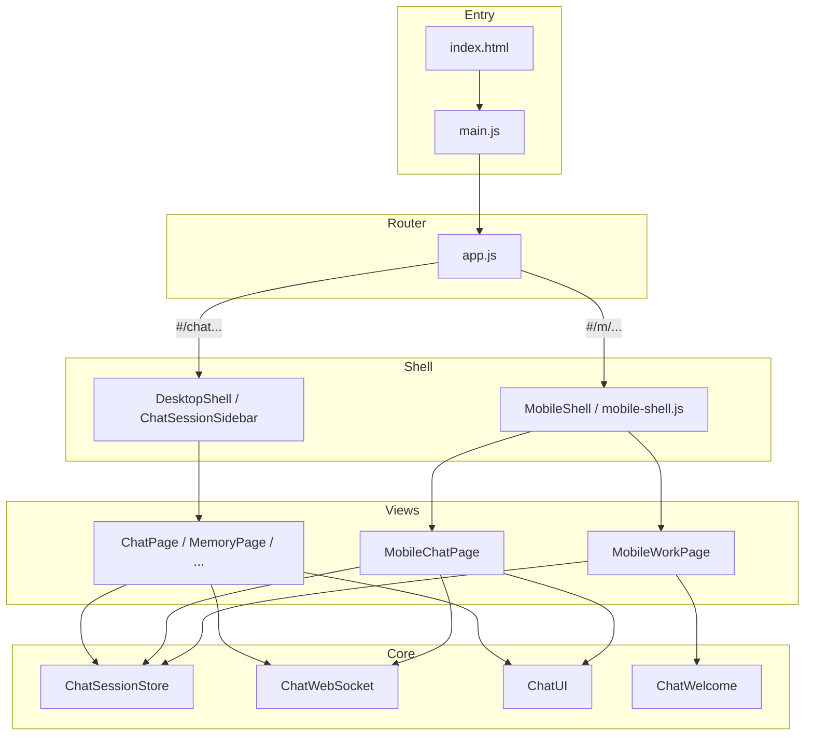

# iceCoder 移动端 H5 Shell 方案

> **状态**：待实现  
> **版本**：v1.0  
> **日期**：2026-06-26  
> **范围**：Web 前端 · 同一套 JS Core · 独立 Mobile Shell UI · Hash 路由 `#/m/*` · 非原生 App（浏览器 H5）

---

## 0. 执行摘要

### 0.1 目标

| 项 | 说明 |
|----|------|
| **用户价值** | 手机浏览器打开 iceCoder，获得与设计稿一致的移动端体验（底栏导航、工作首页、聊天栈、子 Tab） |
| **技术路线** | **同一 `index.html` + 同一 `main.js` 模块树**；桌面与 H5 仅 **Shell（导航壳）与 Page View（DOM 布局）** 不同 |
| **不改写** | WebSocket、会话 API、Harness、记忆、技能、配置 API 等后端与 Core 模块保持原样 |
| **路由区分** | 桌面：`#/chat`、`#/memory`、`#/skills`、`#/config`；H5：`#/m/work`、`#/m/work/:sessionId` 等 |
| **维护原则** | 业务逻辑只写一份；禁止复制 `chat-websocket.js`、`chat-session-store.js` 等 Core 文件 |

### 0.2 非目标（V1 不做）

- 不做原生 App（React Native / Flutter / 小程序）
- 不做独立 `mobile.html` 二次引入全量脚本（除非后续 SEO/短链需要，仍应指向同一 bundle）
- 不做 PWA 离线能力（可留扩展点）
- 不在 V1 一次性重构完整个 `chat-page.js`（采用渐进式抽 Core）
- 桌面端 UI 行为不因 H5 开发而回归（Shell 隔离）

### 0.3 验收标准（全部满足即 V1 完成）

1. 访问 `/#/m/work` 在移动端视口下展示：顶栏（IceCoder + 状态）、Dashboard 卡片、快捷上手、建议开始、底栏四 Tab、底部输入区。
2. 点击会话或新建会话进入 `/#/m/work/:sessionId`，展示聊天详情（返回、标题、对话/文件/技能子 Tab、消息流、输入框）。
3. 底栏切换 `#/m/memory`、`#/m/skills`、`#/m/config` 正常，且 **WebSocket / 当前会话 / 流式输出状态不因切 Tab 丢失**（keep-alive 与桌面一致）。
4. 桌面路由 `/#/chat` 等行为与现网一致，左栏 Shell 不受影响。
5. 从 H5 发消息、收流式回复、切换模型（`chat-model-picker`）、@ 引用、# 技能、附件上传与桌面能力对齐（允许 V1 部分子 Tab 为占位，但对话主链路必须通）。
6. iOS Safari / Android Chrome 下底栏与输入框不被 Home 条遮挡（`safe-area-inset`）。
7. `npm test` 与现有 E2E（若有）不因 Shell 扩展而失败。

---

## 1. 背景与动机

### 1.1 现状

当前 Web 为 **桌面优先 SPA**：

- 入口：`src/public/index.html` → `src/public/js/main.js` → `app.js`
- 导航：`ChatSessionSidebar` 左栏固定常驻（品牌 + 工作/记忆/技能/配置 + 会话列表 + 底部控制）
- 路由：`#/chat` | `#/config` | `#/memory` | `#/skills`（`app.js` 内 hash 解析）
- 响应式：仅有 `@media (max-width: 640px)` 等 padding/网格微调（`shell.css`、`chat.css`），**无移动端信息架构**

### 1.2 设计稿差异（信息架构级，非纯 CSS）

| 维度 | 桌面（现状） | 移动端 H5（目标） |
|------|-------------|------------------|
| 主导航 | 左侧竖栏 | **底部 Tab 栏**（工作 / 记忆 / 技能 / 配置） |
| 工作区 | 侧栏会话列表 + 右侧聊天 | **栈式导航**：Dashboard 首页 → 会话列表/入口 → 聊天详情 |
| 聊天页 | 与侧栏并排 | 独立全屏页：顶栏（返回 + 标题 + ⋯）+ 子 Tab（对话 / 文件 / 技能） |
| 欢迎态 | `ChatWelcome` 嵌在聊天消息区 | Dashboard 独立首页（状态卡片 + 快捷上手 + 建议开始） |
| 输入框 | 聊天页底部 | **工作 Tab 首页也保留输入框**（设计稿：首页即可开聊） |

结论：**不能**仅靠 `@media` 缩放实现，需要 **Mobile Shell + Mobile Page View**，但 **Core JS 共用**。

---

## 2. 总体架构

### 2.1 分层模型

```
index.html（唯一入口）
└── main.js（唯一 bundle 入口）
    ├── Core 层（Shell 无关，桌面 / H5 共用）
    │   ├── chat-session-store.js    会话列表、切换、持久化
    │   ├── chat-websocket.js        WS 连接、流式、session 切换
    │   ├── chat-ui.js               消息渲染、工具 trace、diff 等
    │   ├── chat-welcome.js          欢迎页数据与 prompt（可被 Mobile 复用）
    │   ├── chat-model-picker.js     模型选择
    │   ├── chat-commands.js / chat-file.js / chat-skills.js / ...
    │   └── memory-page.js / skills-page.js / config-page.js 的数据与 render 能力
    │
    ├── Shell 层（UI 分叉）
    │   ├── DesktopShell             现有 chat-session-sidebar.js（左栏）
    │   └── MobileShell              新增 mobile-shell.js（底栏 + 顶栏槽位）
    │
    ├── Page View 层（DOM 布局分叉）
    │   ├── Desktop                  ChatPage / MemoryPage / SkillsPage / ConfigPage（现状）
    │   └── Mobile                   MobileWorkPage / MobileChatPage / Mobile*Wrapper
    │
    └── app.js（路由中枢）
         解析 hash → 选择 Shell → keep-alive 挂载对应 Page View
```

### 2.2 核心原则

1. **Core 不感知 Shell**：Core 模块通过 `document` 上由 Page View 提供的容器节点工作，或通过 `bind(root)` 注入，禁止在 Core 内写死 `.chat-session-sidebar` 等桌面选择器。
2. **Shell 不承载业务**：Shell 只负责导航 chrome（底栏/侧栏、顶栏占位、返回键），不直接发 WS 消息。
3. **路由是唯一分流开关**：是否 H5 由 `#/m/` 前缀决定，而非仅 UA；UA/视口宽度仅用于「首次访问推荐跳转」。
4. **keep-alive 延续**：与 `app.js` 现有 `pages` 对象策略一致，H5 切 Tab 隐藏 DOM 不 destroy 聊天 WS 状态（见 `docs/requirement/聊天页状态保活与断点恢复-finish.md`）。

### 2.3 架构示意



---

## 3. 路由设计

### 3.1 路由表

| 路由 | Shell | Page View | 说明 |
|------|-------|-----------|------|
| `#/chat` | Desktop | `ChatPage` | 现有默认页 |
| `#/memory` | Desktop | `MemoryPage` | 现有 |
| `#/skills` | Desktop | `SkillsPage` | 现有 |
| `#/config` | Desktop | `ConfigPage` | 现有 |
| `#/m/work` | Mobile | `MobileWorkPage` | H5 工作首页（Dashboard + 会话入口 + 输入框） |
| `#/m/work/:sessionId` | Mobile | `MobileChatPage` | H5 聊天详情（栈顶） |
| `#/m/memory` | Mobile | `MobileMemoryPage` | 记忆（V1 可 wrapper 复用 MemoryPage render 到移动容器） |
| `#/m/skills` | Mobile | `MobileSkillsPage` | 技能 |
| `#/m/config` | Mobile | `MobileConfigPage` | 配置 |

**Setup Gate**：若 `setupRequired`，H5 统一 `replace` 到 `#/m/config`（与桌面 `#/config` 对称）。

**远程控制**：现有 `?token=xxx` 模式优先；V1 可继续直进聊天 View（`MobileChatPage` 或现有 `ChatPage`，按产品决定，默认保持现有 `ChatPage` 以减少风险）。

### 3.2 Hash 解析（`app.js` 扩展）

```javascript
/**
 * @returns {{
 *   shell: 'desktop' | 'mobile',
 *   page: string,
 *   sessionId?: string
 * }}
 */
function parseRoute(hash) {
  var h = hash || window.location.hash || '';
  if (h.startsWith('#/m/')) {
    var rest = h.slice(4); // "#/m/" -> "/work/..."
    if (rest.startsWith('/work/')) {
      var id = rest.slice('/work/'.length).split('/')[0];
      if (id) return { shell: 'mobile', page: 'workChat', sessionId: decodeURIComponent(id) };
    }
    if (rest.startsWith('/work')) return { shell: 'mobile', page: 'work' };
    if (rest.startsWith('/memory')) return { shell: 'mobile', page: 'memory' };
    if (rest.startsWith('/skills')) return { shell: 'mobile', page: 'skills' };
    if (rest.startsWith('/config')) return { shell: 'mobile', page: 'config' };
    return { shell: 'mobile', page: 'work' };
  }
  if (h.startsWith('#/config')) return { shell: 'desktop', page: 'config' };
  if (h.startsWith('#/memory')) return { shell: 'desktop', page: 'memory' };
  if (h.startsWith('#/skills')) return { shell: 'desktop', page: 'skills' };
  return { shell: 'desktop', page: 'chat' };
}
```

### 3.3 导航 API（供 Shell / Page 调用）

```javascript
window.AppRouter = {
  // 现有 ...
  getShell: function () { return currentShell; },
  navigate: function (page, opts) { /* 统一入口，自动补 #/m 前缀 */ },
  navigateWorkChat: function (sessionId) {
    if (currentShell === 'mobile') {
      history.pushState(null, '', '#/m/work/' + encodeURIComponent(sessionId));
    } else {
      /* 桌面：切 chat + ChatSessionStore.switchSession */
    }
    handleRouteChange();
  },
  back: function () {
    if (currentShell === 'mobile' && currentMobilePage === 'workChat') {
      history.replaceState(null, '', '#/m/work');
      handleRouteChange();
    } else {
      history.back();
    }
  },
};
```

### 3.4 首次访问与互跳

| 场景 | 行为 |
|------|------|
| 用户打开 `/` 无 hash | 桌面默认 `#/chat`；可选：`matchMedia('(max-width: 768px)')` 时 `replace` 到 `#/m/work` |
| 用户手动输入桌面链 | 尊重路由，不强制改 H5 |
| 分享会话链接 | H5 用 `#/m/work/{id}`；桌面用 `#/chat` + Store 切 session（V2 可统一 query） |
| 从 H5 进配置再返回 | `#/m/config` → 返回 `#/m/work` |

---

## 4. Mobile Shell 规格

### 4.1 DOM 结构

```html
<div id="app">
  <div class="mobile-shell" data-shell="mobile">
    <header class="mobile-top-bar"><!-- 随路由变化 --></header>
    <main class="mobile-main">
      <div id="page-container"><div class="page-root">...</div></div>
    </main>
    <nav class="mobile-bottom-nav" role="tablist">
      <!-- 工作 / 记忆 / 技能 / 配置 -->
    </nav>
  </div>
</div>
```

桌面 Shell 保持现有：

```html
<div id="app">
  <div class="app-shell">
    <aside class="chat-session-sidebar">...</aside>
    <div class="app-main">
      <div id="page-container">...</div>
    </div>
  </div>
</div>
```

**互斥**：同一时刻只挂载一种 Shell；切换 shell 类型需 `location.reload()` 或完整 teardown（V1 建议 **不同 shell 用不同 URL 前缀，不做运行时 shell 热切换**）。

### 4.2 底栏 Tab（`mobile-shell.js`）

| Tab | `data-page` | 路由 | 图标 |
|-----|-------------|------|------|
| 工作 | `work` | `#/m/work` | 与侧栏「工作」SVG 一致 |
| 记忆 | `memory` | `#/m/memory` | 同上 |
| 技能 | `skills` | `#/m/skills` | 同上 |
| 配置 | `config` | `#/m/config` | 同上 |

- 在 `workChat`（聊天详情）页：**隐藏底栏**或降低 z-index（设计稿聊天页无底栏，仅顶栏返回）。
- Active 态：`.mobile-bottom-nav-btn.is-active`。

### 4.3 顶栏模式

| 路由 | 顶栏内容 |
|------|----------|
| `#/m/work` | 左：IceCoder logo；右：通知（可选 V1 占位）、连接状态/宠物指示 |
| `#/m/work/:id` | 左：返回；中：会话标题（可编辑）；右：⋯ 菜单 |
| `#/m/memory` 等 | 左：标题文字；右：与 work 首页类似 |

### 4.4 安全区与视口

`index.html` 增加（若尚未设置）：

```html
<meta name="viewport" content="width=device-width, initial-scale=1.0, viewport-fit=cover">
```

CSS 变量（`mobile-shell.css`）：

```css
.mobile-bottom-nav {
  padding-bottom: env(safe-area-inset-bottom, 0);
}
.chat-input-area {
  padding-bottom: calc(12px + env(safe-area-inset-bottom, 0));
}
```

---

## 5. Mobile Page View 规格

### 5.1 MobileWorkPage（`#/m/work`）

**职责**：工作 Tab 首页，对应设计稿左屏。

**区块**：

1. **状态行**：「IceCoder 已就绪」+ 宠物/连接指示（复用 `AppShell.getConnectionState`、`ChatPetBridge` 可选）
2. **状态卡片 2×2**：模式 / 记忆条数 / Harness / L2 Gate（数据来自 `/api/config` + `ChatWelcome` 已有 fetch 逻辑）
3. **快捷上手 2×2**：命令面板、@ 引用、# 技能、附件（复用 `ChatWelcome` 的 `TIPS` 数据）
4. **建议开始**：三条 prompt（复用 `ChatWelcome` 的 `PROMPTS`）
5. **会话列表**：精简列表项（标题 + 更新时间），点击 → `#/m/work/:id`
6. **底部输入区**：与聊天页相同的 input row（模型选择 + 发送）；在首页发送时：**若无 active 会话则先 POST 新建会话**，再 `navigateWorkChat(id)` 并发送

**实现策略**：

- 优先 **调用 `ChatWelcome` 的渲染函数或导出 build 函数**，避免复制 HTML 字符串。
- 会话列表调用 `ChatSessionStore` 已有 API。

### 5.2 MobileChatPage（`#/m/work/:sessionId`）

**职责**：聊天详情，对应设计稿右屏。

**区块**：

1. 顶栏由 `MobileShell` 驱动
2. **子 Tab**：对话 | 文件 | 技能（V1 对话必选；文件/技能可先占位或复用 `chat-file` / `chat-skills` 面板）
3. **消息区**：`.chat-messages` — 调用 `ChatUI` 绑定
4. **输入区**：与桌面相同组件行为

**Core 绑定（目标 API，实施时可渐进落地）**：

```javascript
// mobile-chat-page.js
function render(root, sessionId) {
  root.innerHTML = buildMobileChatTemplate();
  ChatSessionStore.switchSession(sessionId).then(function () {
    ChatUI.mount({
      root: root,
      messagesEl: root.querySelector('.chat-messages'),
      inputEl: root.querySelector('.chat-input-area'),
    });
    ChatWebSocket.ensureConnected();
    ChatPage.onActivate && ChatPage.onActivate(); // V1 过渡：复用激活钩子
  });
}
```

**V1 过渡方案**（减少大 refactor）：

- `MobileChatPage` 内部调用 `ChatPage.render(innerRoot)` 到 **mobile 专用容器**，再用 CSS 隐藏桌面专属元素（快捷但略脏）。
- Phase 3 再将 `ChatPage.render` 拆为 `ChatCore.mount` + `DesktopChatView` / `MobileChatView`。

### 5.3 MobileMemoryPage / MobileSkillsPage / MobileConfigPage

V1 推荐 **Wrapper 模式**：

```javascript
function render(root) {
  root.className = 'page-root page-root-memory mobile-page-root';
  MemoryPage.render(root); // 复用现有 render
}
```

外层 `mobile-page-root` 用 CSS 做全宽、字号、图表面板纵向滚动适配。

---

## 6. 文件与目录规划

### 6.1 新增文件

| 路径 | 职责 |
|------|------|
| `src/public/js/shell/mobile-shell.js` | H5 底栏、顶栏、路由 Tab 同步 |
| `src/public/js/pages/mobile/mobile-work-page.js` | 工作首页 |
| `src/public/js/pages/mobile/mobile-chat-page.js` | 聊天详情 |
| `src/public/js/pages/mobile/mobile-memory-page.js` | 记忆 wrapper（可选 V1） |
| `src/public/js/pages/mobile/mobile-skills-page.js` | 技能 wrapper |
| `src/public/js/pages/mobile/mobile-config-page.js` | 配置 wrapper |
| `src/public/css/mobile-shell.css` | Shell 布局、底栏、安全区 |
| `src/public/css/mobile-work.css` | Dashboard 卡片、会话列表 |
| `src/public/css/mobile-chat.css` | 聊天详情、子 Tab |

### 6.2 修改文件

| 路径 | 变更 |
|------|------|
| `src/public/js/app.js` | 扩展 `parseRoute`、`pages` 注册 mobile 页、Shell 初始化分支 |
| `src/public/js/main.js` | import mobile 模块 |
| `src/public/index.html` | 引入 mobile CSS；`viewport-fit=cover` |
| `src/public/js/chat-welcome.js` | 导出可复用 render 片段（小改） |
| `src/public/js/chat-page.js` | 渐进抽取 `mount/unmount` 或暴露 `bindToContainer`（Phase 3） |

### 6.3 不新增

- 不新增 `mobile.html`
- 不复制 `chat-websocket.js`、`chat-session-store.js`

---

## 7. `app.js` 改造要点

### 7.1 页面 keep-alive 扩展

```javascript
var pages = {
  // desktop
  chat:    { shell: 'desktop', root: null, mounted: false },
  config:  { shell: 'desktop', root: null, mounted: false },
  memory:  { shell: 'desktop', root: null, mounted: false },
  skills:  { shell: 'desktop', root: null, mounted: false },
  // mobile
  work:     { shell: 'mobile', root: null, mounted: false },
  workChat: { shell: 'mobile', root: null, mounted: false },
  mMemory:  { shell: 'mobile', root: null, mounted: false },
  mSkills:  { shell: 'mobile', root: null, mounted: false },
  mConfig:  { shell: 'mobile', root: null, mounted: false },
};
```

### 7.2 init 分支

```javascript
function init() {
  var route = parseRoute(window.location.hash);
  currentShell = route.shell;

  if (currentShell === 'mobile') {
    document.documentElement.setAttribute('data-shell', 'mobile');
    MobileShell.create();
  } else {
    document.documentElement.setAttribute('data-shell', 'desktop');
    ensureSessionSidebar();
  }

  // hashchange → parseRoute → navigate
}
```

### 7.3 renderPage 分发

```javascript
function renderPage(route) {
  document.body.dataset.page = route.page;
  document.body.dataset.shell = route.shell;
  // display 切换 + 首次 mount
  if (route.shell === 'mobile' && route.page === 'work') {
    MobileWorkPage.render(root);
  } else if (route.shell === 'mobile' && route.page === 'workChat') {
    MobileChatPage.render(root, route.sessionId);
  }
  // ...
}
```

---

## 8. 样式策略

### 8.1 断点

| 断点 | 用途 |
|------|------|
| **768px** | 文档 / 侧栏抽屉参考断点（`docs/requirement/多会话-web侧栏-finish.md`） |
| **路由 `#/m/`** | H5 Shell 的主开关（**优先于纯视口**） |

不在 H5 路由下依赖 `@media` 隐藏桌面侧栏，而是 **根本不创建 Desktop Shell**。

### 8.2 CSS 隔离

```css
/* 桌面样式默认 */
[data-shell="desktop"] .mobile-shell { display: none; }

/* H5 */
[data-shell="mobile"] .app-shell,
[data-shell="mobile"] .chat-session-sidebar { display: none !important; }

[data-shell="mobile"] .mobile-shell {
  display: flex;
  flex-direction: column;
  height: 100dvh; /* 动态视口，避免地址栏跳动 */
}
```

### 8.3 设计 token

复用 `src/public/css/tokens.css` 中 `--accent`、`--bg-secondary` 等，H5 不另起一套色板，保证品牌一致。

---

## 9. 分阶段实施计划

### Phase 1 — 路由与 Shell 骨架（1–2 天）

- [ ] `parseRoute` + `#/m/*` hash 监听
- [ ] `mobile-shell.js`：底栏四 Tab + 空 `page-container`
- [ ] `mobile-shell.css` + `data-shell` 互斥
- [ ] 四个 Tab 可切换到占位页（「Mobile Memory 占位」）
- [ ] 验收：桌面 `#/chat` 无回归；`/#/m/work` 见底栏

### Phase 2 — 工作首页（2–3 天）

- [ ] `MobileWorkPage`：Dashboard + 复用 `ChatWelcome` 数据
- [ ] 会话列表 + 新建会话
- [ ] 首页输入框：新建会话并跳转
- [ ] 验收：首页 UI 对齐设计稿主结构

### Phase 3 — 聊天详情（3–4 天）

- [ ] `MobileChatPage`：子 Tab + 消息 + 输入
- [ ] 绑定 `ChatSessionStore` / `ChatWebSocket` / `ChatUI`
- [ ] 返回 `#/m/work` 保持 WS 不断
- [ ] 验收：完整对话闭环

### Phase 4 — 记忆 / 技能 / 配置（1–2 天）

- [ ] Wrapper 页面 + 移动 CSS 适配
- [ ] Setup Gate → `#/m/config`

### Phase 5 — 打磨（1–2 天）

- [ ] safe-area、100dvh、iOS 键盘顶起
- [ ] 首次访问可选自动跳转 `#/m/work`
- [ ] 文档更新 `docs/使用文档.md` 增加 H5 入口说明

---

## 10. 风险与对策

| 风险 | 对策 |
|------|------|
| `chat-page.js` 与 DOM 强耦合，Mobile 难以复用 | V1 过渡：`ChatPage.render` 嵌入 mobile 容器；并行抽 `ChatUI.mount` |
| 首页 + 详情页双输入框状态不同步 | 共用 `ChatSessionStore` 与同一 input 状态机；或详情页 mount 后首页 input 只负责「创建会话并跳转」 |
| iOS 软键盘遮挡输入框 | `visualViewport` resize 监听，调整 `mobile-main` padding |
| keep-alive 内存占用 | 与桌面一致；仅 mount 过的 page-root 保留 |
| H5 / 桌面同时改 Core 引入回归 | Core 改动需手动测两条路由；后续补 smoke 测试 |

---

## 11. 测试清单

### 11.1 手工测试

- [ ] `#/m/work` Dashboard 数据与 `/api/config` 一致
- [ ] 新建会话 → 发消息 → 流式显示 → 刷新页面会话仍在
- [ ] 切 `#/m/memory` 再回 `#/m/work/:id`，消息不丢、WS 不断
- [ ] 模型切换在 H5 生效
- [ ] `@` / `#` / 附件 / 命令面板可用
- [ ] `#/chat` 桌面左栏、会话切换正常
- [ ] iOS Safari + Android Chrome 各测一轮

### 11.2 自动化（V2）

- 可选 Playwright：`page.goto('/#/m/work')` 断言底栏存在
- 现有 `npm test` 不覆盖前端 DOM，Shell 变更以手工 + 后续 E2E 为主

---

## 12. 与现有文档关系

| 文档 | 关系 |
|------|------|
| `docs/requirement/多会话-web侧栏-finish.md` | 桌面 Shell 规范；H5 **不采用**左栏，但 **共用** `ChatSessionStore` / WS 协议 |
| `docs/requirement/聊天页状态保活与断点恢复-finish.md` | keep-alive 策略 extends 到 mobile pages |
| `docs/requirement/Electron桌面GUI方案finish.md` | 桌面打包仍加载同一 SPA；Electron 内可用 UA 或默认 `#/chat` |
| `docs/使用文档.md` | Phase 5 补充 H5 访问方式 |

---

## 13. 附录：设计稿 ↔ 模块映射

| 设计稿元素 | 实现来源 |
|-----------|----------|
| 底栏 工作/记忆/技能/配置 | `mobile-shell.js` |
| 状态卡片四宫格 | `ChatWelcome` + `/api/config` |
| 快捷上手四宫格 | `ChatWelcome.TIPS` |
| 建议开始列表 | `ChatWelcome.PROMPTS` |
| 输入框 + 模型下拉 + 发送 | `chat-model-picker.js` + 现有 input row |
| 聊天消息气泡 | `chat-ui.js` |
| 对话/文件/技能子 Tab | `MobileChatPage`（文件/技能对接 `chat-file.js` / `chat-skills.js`） |
| 会话标题编辑 | 复用侧栏 rename 逻辑（`ChatSessionSidebar` 内 API 可抽至 Store） |

---

## 14. 修订记录

| 版本 | 日期 | 说明 |
|------|------|------|
| v1.0 | 2026-06-26 | 初稿：H5 Shell 方案、路由、分层、分阶段计划 |
