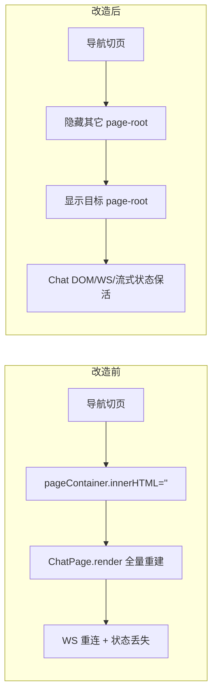
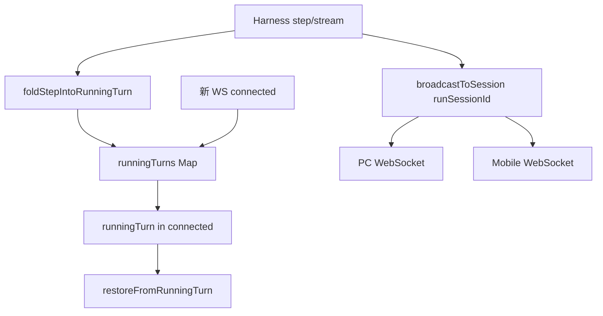

# 聊天页状态保活与断点恢复 — 需求与验收文档

> **状态**：已实现（待人工验收）  
> **日期**：2026-05-27  
> **范围**：Web SPA 页面切换 · F5 刷新 · 移动端扫码 · 多会话 · 多端 confirm  
> **关联模块**：`app.js` · `chat-page.js` · `chat-websocket.js` · `chat-ws.ts` · `chat-session-store.js` · `chat-session-sidebar.js`

---

## 1. 背景与问题

### 1.1 用户现象

聊天页任务进行中（宠物、Stop 按钮、流式内容均有状态）时：

- 切换到**配置页**再切回 → 聊天页 UI 全部重置（宠物 idle、Send 按钮、消息区空白）
- 后端 **harness 仍在运行**，直到任务完成才通过 `session_updated` 拉取快照展示结果

用户期望：**任意切换页面**，聊天页保持切换前的状态、推送与交互态。

### 1.2 延伸场景

| 场景 | 改造前 | 期望 |
|------|--------|------|
| 切配置页 / 记忆页再回来 | UI 全丢，等任务结束才刷新 | 零丢失，实时续推 |
| F5 刷新 | 空白直到任务结束 | 立即看到当前流式进度 |
| 移动端扫码（`~scan`） | 连上看不到 PC 正在跑的进度 | 实时镜像 PC 状态 |
| PC + 手机双端 | 一端有进度一端没有 | 两端同步 |
| 网络抖动重连 | 漏掉断线期间事件 | 重连后从快照恢复 |

### 1.3 根因摘要

1. **P0 — SPA 销毁重建**：`app.js` 的 `renderPage()` 使用 `pageContainer.innerHTML = ''`，切页销毁整个聊天 DOM 与 `ChatPage` 闭包状态。
2. **P0 — 单 WS 定向推送**：`chat-ws.ts` 中 harness 事件只 `sendJSON(ws, ...)` 给发起连接，F5 / 新 tab / 扫码后新 WS 收不到实时事件。
3. **P1 — 无运行中快照**：`connected` 包不含 `isProcessing`、累积流式文本、冰豆态、工具时间线等，新连接无法还原 UI。

---

## 2. 方案设计

### 2.1 方案 A — 前端页面 keep-alive（切页保活）

**思路**：三个页面各自独立 `page-root` 子容器，切换时只改 `display`，不销毁聊天 DOM。

| 项 | 说明 |
|----|------|
| 改动文件 | `src/public/js/app.js` |
| 行为 | `chat` / `config` / `memory` 各 mount 一次；离开 memory 仍调用 `MemoryPage.destroy()`（图谱需 teardown） |
| 聊天侧栏 | 不再因切页调用 `ChatSessionSidebar.destroy()` |
| ChatPage | `mounted` 守卫 + `onActivate()` 切回时轻量同步 |

**收益**：覆盖日常「切配置页再回来」约 95% 痛点，风险极低。

### 2.2 方案 B — 后端按 session 广播 + 运行时快照

**B1 — sessionSubscribers**

- `Map<sessionId, Set<WebSocket>>` + `subscribeWsToSession` / `unsubscribeWsFromAll` / `broadcastToSession`
- WS 连上默认订阅 `activeSessionId`；`switch_session` 时换订阅；close 时清理
- harness 实时事件改为 `broadcastToSession(runSessionId, ...)`，不再单 ws 发送

**B2 — runningTurn 快照**

- 每 session 内存维护 `RunningTurnSnapshot`：流式文本、轮次、token、冰豆、工具时间线、planEvents 等
- 每个 `step` / `stream_delta` fold 进快照；任务 `finally` 中 `clearRunningTurn`

**B3 — connected / session_switched 附带 runningTurn**

- 新连接 / 切 session 时下发快照
- 前端 `restoreFromRunningTurn()` 还原 UI

**B4 — 多端 confirm（first-win）**

- `confirm` 广播给 session 所有订阅者，带 `confirmId`
- 任意端 `confirm_reply` 一次即生效，广播 `confirm_resolved`
- 60s 超时统一 deny

**收益**：F5、扫码、双端、断线重连无感同步。

---

## 3. 工作清单（实现项）

### 3.1 方案 A

| ID | 任务 | 状态 | 说明 |
|----|------|------|------|
| A1 | `app.js` 改为 page-root keep-alive | ✅ | 三个 `page-root` + display 切换 |
| A2 | 移除切页时对 `ChatSessionSidebar.destroy()` 的依赖 | ✅ | 聊天页不再 destroy 侧栏 |
| A3 | `ChatPage.render` 增加 `mounted` 守卫 + `onActivate()` | ✅ | 避免重复 mount / 重复绑事件 |

### 3.2 方案 B — 后端

| ID | 任务 | 状态 | 说明 |
|----|------|------|------|
| B1a | 引入 `sessionSubscribers` + `broadcastToSession` | ✅ | `chat-ws.ts` |
| B1b | connect / switch_session / close 维护订阅 | ✅ | |
| B1c | 实时任务事件改广播（约 15 处） | ✅ | step/stream/stream_end/response/pulse/tokenUsage/info/memory_notice 等 |
| B2a | `RunningTurnSnapshot` + `runningTurns` Map | ✅ | |
| B2b | step/stream fold + lifecycle clear | ✅ | handleChatMessage finally + finalizeDirectBrowserTurn |
| B3 | `connected` / `session_switched` 附带 runningTurn | ✅ | |
| B4 | onConfirm 多端 first-win | ✅ | confirmId + confirm_resolved |
| B5 | `cleanupChatResources` 清理新集合 | ✅ | sessionSubscribers / runningTurns / pendingConfirms |

### 3.3 方案 B — 前端

| ID | 任务 | 状态 | 说明 |
|----|------|------|------|
| FE1 | `restoreFromRunningTurn()` + `onWsConnected` 调用 | ✅ | `chat-page.js` |
| FE2 | `confirm_resolved` / `confirm_timeout` 路由 | ✅ | `chat-websocket.js` |
| FE3 | `onSessionSwitched(sessionId, runningTurn)` | ✅ | store + sidebar + chat-page |
| FE4 | `sendConfirmReply(approved, confirmId)` | ✅ | |
| FE5 | planEvents 重放经 `ChatExecutionPlanBridge.handleStep` | ✅ | |

### 3.4 附带修复

| 项 | 说明 |
|----|------|
| `broadcastSessionUpdated('turn_complete', ws)` 参数错位 | 改为 `(..., undefined, ws)`，修复预存 tsc 报错 |

---

## 4. 改动文件一览

| 文件 | 改动概要 |
|------|----------|
| `src/public/js/app.js` | keep-alive 路由；memory 离开仍 destroy |
| `src/public/js/chat-page.js` | mounted/onActivate/restoreFromRunningTurn/confirm 多端 |
| `src/public/js/chat-websocket.js` | confirm_resolved/confirm_timeout；sendConfirmReply 带 confirmId |
| `src/public/js/chat-session-store.js` | switchSession callback 透传 runningTurn |
| `src/public/js/chat-session-sidebar.js` | selectSession 透传 runningTurn |
| `src/web/chat-ws.ts` | sessionSubscribers、runningTurns、broadcast、confirm first-win |

**规模（参考）**：6 文件，约 +527 / -66 行。

---

## 5. 架构示意

### 5.1 切页（方案 A）



### 5.2 实时推送（方案 B）



### 5.3 事件广播 vs 全局通知

| 类型 | 通道 | 示例 |
|------|------|------|
| 按 session 广播 | `broadcastToSession(sessionId)` | step, stream, status, confirm, tokenUsage |
| 全员广播 | `sendToAllChatClients` / `broadcastSessionUpdated` | mcp_ready, tunnel_ready, session_updated |

---

## 6. RunningTurn 快照字段

前端 `restoreFromRunningTurn(runningTurn)` 使用字段：

| 字段 | 用途 |
|------|------|
| `isProcessing` | 是否任务进行中；false 则复位 idle |
| `streamingText` | 累积流式文本，重建 `#streaming-msg` |
| `toolTimeline[]` | `{ toolName, detail, status }` 重绘工具行 |
| `iteration` | 轮次 → 冰豆 foot |
| `petState` / `petBubble` / `petStatusText` | 冰豆表情与气泡 |
| `lastInputTokens` / `lastOutputTokens` | token 圆环 |
| `planEvents[]` | 执行计划 / 任务图 step 重放 |

---

## 7. 人工测试清单

> **前置**：修改 `chat-ws.ts` 后需**重启** `npm run iceCoder`。  
> **顺序**：第 0 类通过后再测 1、2；1、2 通过后再测 3–8。  
> **建议**：开两个浏览器窗口（或 PC + 手机）便于观察多端。

### 7.0 基础冒烟（必跑）

| # | 操作 | 期望 |
|---|------|------|
| 0.1 | 发「你好」，观察流式回复 | 流式正常；Stop ↔ Send 切换正常 |
| 0.2 | 发需工具调用的指令（如「列一下当前目录」） | 工具时间线、冰豆 working、token 圆环更新 |
| 0.3 | 任务进行中点 Stop | 任务终止；冰豆 idle；按钮回 Send |

### 7.1 方案 A — 切页面 keep-alive

| # | 操作 | 期望 |
|---|------|------|
| 1.1 | 长任务跑到一半 → 切配置页 → 等几秒 → 切回 | 流式文本、冰豆、工具线、Stop 钮**全部保持**，推送继续 |
| 1.2 | 同 1.1，但切「记忆图谱」再回来 | 同上 |
| 1.3 | 长任务期间在配置 / 记忆 / 聊天间来回切 5 次 | 不卡顿；每次回聊天页见实时进度 |
| 1.4 | 拖动冰豆到自定义位置 → 切配置 → 回来 | 冰豆位置保留 |
| 1.5 | 记忆页拖拽/缩放后离开再进 | 记忆页重新加载（预期：memory 仍 destroy） |

### 7.2 F5 刷新 — 断点恢复（方案 B3）

| # | 操作 | 期望 |
|---|------|------|
| 2.1 | 长流式任务跑到一半 **F5** | 刷新后立即见：累积流式文本、Stop、冰豆 read/working、轮次、token |
| 2.2 | 工具调用阶段 F5（如 list → read 中途） | 已发生的工具时间线可见（含 pending 态） |
| 2.3 | 任务**完成后** F5 | 无「运行中」假象；Send + idle；历史消息正常 |
| 2.4 | F5 后等 10s | pulse / 后续 step 正常推送 |

### 7.3 多会话切换

| # | 操作 | 期望 |
|---|------|------|
| 3.1 | session A 长任务中途切到 B | A 被 abort 并写入 A 文件；B 显示 B 历史；idle + Send |
| 3.2 | A 长任务中途切 B，再切回 A | A 为 abort 后已落盘历史，无 running 残留 |
| 3.3 | A 跑任务时 F5，再侧栏切 B 再切 A | 若 A 仍跑则 runningTurn 还原；若已结束则见落盘历史 |
| 3.4 | A 跑任务切 B，在 B 发新任务，再切 A | 两 session 状态不互相污染 |
| 3.5 | 新建 / 重命名 / 删除 active session | 侧栏与 active 高亮正确；删 active 有 fallback |

### 7.4 移动端扫码（远程同步）

| # | 操作 | 期望 |
|---|------|------|
| 4.1 | PC 输入 `~scan` | 二维码正常 |
| 4.2 | **PC 先发起长任务**，跑到一半手机扫码 | 手机一连上即见：流式文本、工具线、冰豆（**关键项**） |
| 4.3 | 双端连上后 PC 继续推 | 两端文字同步增长 |
| 4.4 | 手机连上后发长任务，PC 中途 F5 | PC 见 runningTurn；手机继续 |
| 4.5 | 双端任一点 Stop | 两端均终止；idle |

### 7.5 多端 confirm（方案 B4）

| # | 操作 | 期望 |
|---|------|------|
| 5.1 | 双端在线，触发需 confirm 的 fs 操作 | 两端均弹 confirm |
| 5.2 | 手机先点「允许」 | first-win 生效；PC 后点结果被丢弃 |
| 5.3 | PC 先点「拒绝」 | 同上 |
| 5.4 | 均不点，等 60s | 超时 deny；任务按拒绝继续 |

### 7.6 网络 / 连接边界

| # | 操作 | 期望 |
|---|------|------|
| 6.1 | 长任务中断网 2s 再恢复 | WS 重连；runningTurn 还原进度 |
| 6.2 | 长任务中关 PC tab，手机仍开 | 手机继续收 broadcast |
| 6.3 | 切配置页 5 分钟再回聊天 | WS 仍连；onActivate 触发 sync |

### 7.7 执行计划 / 任务图（若触发）

| # | 操作 | 期望 |
|---|------|------|
| 7.1 | 复杂任务触发 execution_plan，中途 F5 | planEvents 重放，面板/foot 还原 |
| 7.2 | 同 7.1，切配置再回 | 方案 A 保活 + 计划 UI 仍在 |

### 7.8 回归

| # | 操作 | 期望 |
|---|------|------|
| 8.1 | `~scan` / `~telemetry` / `~supervisor` / `~memory` / `~open` | 正常 |
| 8.2 | 文件上传 / 图片粘贴 / 拖拽 | 正常 |
| 8.3 | 主题切换、监管模式切换 | 正常且不丢聊天态 |
| 8.4 | `?token=xxx` 远程独占页 | 正常 |

---

## 8. 浏览器 Console 辅助脚本

每类测试后可 dump 状态对比：

```javascript
(function () {
  var msgs = window.ChatSession && window.ChatSession.getMessages && window.ChatSession.getMessages();
  var streamEl = document.getElementById('streaming-msg');
  var sendBtn = document.querySelector('.btn-send');
  console.log('--- ICE state dump ---');
  console.log('messages.length =', msgs ? msgs.length : 'n/a');
  console.log('last role/streaming =', msgs && msgs.length
    ? msgs[msgs.length - 1].role + '/' + !!msgs[msgs.length - 1]._streaming : 'n/a');
  console.log('streaming-msg DOM exists =', !!streamEl);
  console.log('send btn classes =', sendBtn ? sendBtn.className : 'n/a');
  console.log('ws connected =', window.ChatWebSocket && window.ChatWebSocket.isConnected());
  console.log('ws processing =', window.ChatWebSocket && window.ChatWebSocket.isProcessing());
  console.log('active session =', window.ChatSession && window.ChatSession.getActiveId && window.ChatSession.getActiveId());
})();
```

---

## 9. 已知风险与局限

| 风险 | 症状 | 说明 / 缓解 |
|------|------|-------------|
| 流式双重显示 | F5 后两段相同流式文本 | localStorage 半截 + runningTurn 重建可能撞车；restore 前会 finalizeStream |
| 工具时间线重复 | F5 后同一工具两条 | appendToolAction 无去重；重放 + 后续 step 可能重复 |
| Stop 未回 Send | 任务结束按钮仍 Stop | 查 WS 是否收到 `status: idle` |
| confirm 另一端关不掉 | A 点允许 B 仍卡 confirm | `window.confirm` 同步阻塞，无法 programmatic 关闭；后续可改自定义模态 |
| switch 后旧 session 无人订阅 | 切走后收不到 A 的 stream_end | by design；结果写盘，切回 A 时 fetch |
| token 模式订阅 | 手机未 switch 仍订旧 session | 扫码镜像 PC 当时 active；PC 切 session 后手机视图可能滞后 |

---

## 10. 验收标准

**通过条件（最低）**：

- [X] 7.0 全部通过  
- [X] 7.1 全部通过（方案 A）  
- [X] 7.2 的 2.1、2.3、2.4 通过（方案 B 核心）  
- [X] 7.3 的 3.1、3.2 通过（多会话不串台）  

**完整验收**：

- [X] 7.0 – 7.8 全部勾选  
- [X] 无 P0/P1 级回归（8.1–8.4）

---

## 11. 后续可选优化（未纳入本次）

| 项 | 说明 |
|----|------|
| 方案 C — 事件 seq + ring buffer | 极端断网续传；当前 runningTurn 已覆盖大部分场景 |
| 自定义 confirm 模态 | 替代 `window.confirm`，支持 confirm_resolved 关窗 |
| runningTurn 持久化到磁盘 | 进程重启后仍可恢复；当前仅内存 |
| execution_plan REST 与 planEvents 竞态 | notifyConnected 的 fetchAndApply 与重放时序可再收敛 |

---

## 12. 变更记录

| 日期 | 说明 |
|------|------|
| 2026-05-27 | 初版：方案 A+B 实现清单、需求、人工测试与验收标准 |
