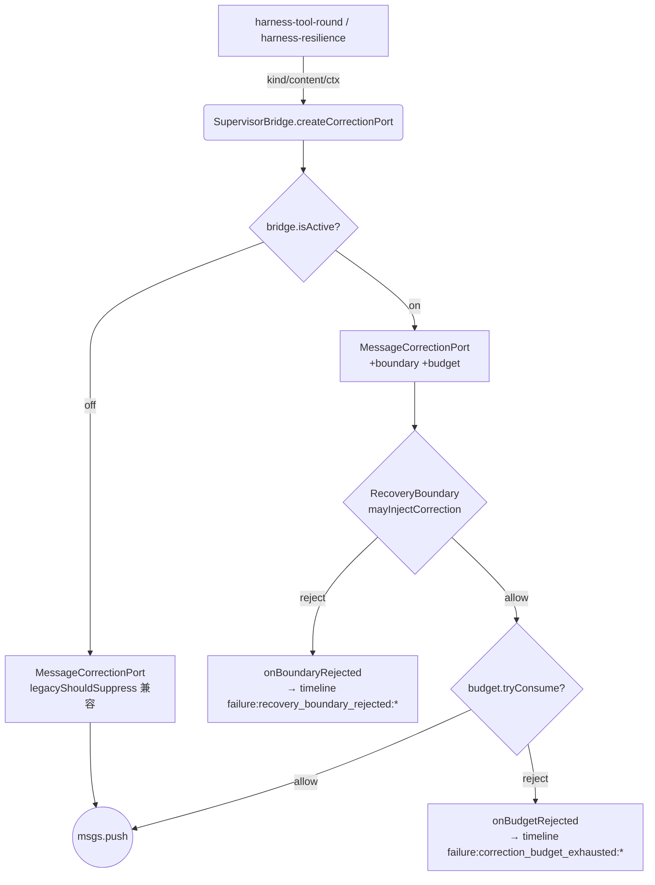

# 双模 L2 审计与优化清单

> **背景**：双模方案 V1.3.7 经 L2-1 → L2-8 八批落地后，功能完备 DoD 已勾。本文档对完整 L2 实现做一次**完整审计**，列出仍不合理 / 仍可优化的点，并给出**优化方案 / 文件设计 / 代码骨架**。
>
> **配套**：
>
> - 设计权威：[`双模方案2.md`](./双模方案2.md) V1.3.7
> - 落地缺口：[`双模落地缺口.md`](./双模落地缺口.md)（与本文档相同时间窗）
>
> **现状基线**：
>
> - `src/harness/supervisor/` 22 个文件，合计 ~130KB
> - 测试 85 文件 / 1068 用例全绿；`npx tsc --noEmit` 0 error
> - `ICE_SUPERVISOR_MODE=off` harness 集成 88 用例零回归
> - L2 自检勾选完毕（§11 DoD 全 ☑）

---

## 0. 总评

| 维度 | 现状 | 评分 |
|------|------|------|
| **规格一致性**（§8/§9/§14/§17/§19/附录 B） | M1–M10 + RecoveryBoundary + composeGraphHint + firstRoundGraph 全落地；M4 RiskEvaluator V2 留白 | 9 / 10 |
| **测试覆盖** | 1068 用例；L2-7 新增 20；6 场景 / boundary 完整矩阵 / strict 集成有缺 | 7 / 10 |
| **代码质量** | 模块边界清晰；但 `supervisor-bridge.ts` 36KB 单文件 godclass 风险高；`boundary` × `budget` 职责小重叠 | 6 / 10 |
| **可观测性** | timeline JSONL 完整；UI 端 enteredBy/primaryReasonHuman 未端到端验收；JSONL 反查工具缺 | 7 / 10 |
| **可维护性** | 拆分历史清晰（按批次 commit 粒度）；但跨文件 `?? 'free'` 等不变量未类型化 | 7 / 10 |

**结论**：可宣称「双模功能完备」（V1 目标完成）；进入产品化 / 规格验收（附录 B / 6 场景）阶段前建议先做 **P0 + P1** 优化（约 1.5–2 人日），可显著降低后续维护成本。

---

## 1. 不合理点清单（按严重度 P0 → P3）

> **P0**：影响正确性 / 可维护性陡变，**强烈建议** L3 阶段前修；
> **P1**：影响可读性 / 可观测性，**应当**修；
> **P2**：覆盖率 / 文档增强，**最好**修；
> **P3**：可选 / V2 留白。

### P0-1 · `supervisor-bridge.ts` 36KB 单文件 godclass

**现象**：

```text
36036 supervisor-bridge.ts   ← 最大
 9951 recovery-supervisor.ts
 7843 goal-drift-detector.ts
 7756 supervisor-config.ts
 ...
```

`SupervisorRuntimeBridge` 类已聚合 13+ 个职责：observe / drift / evaluate / dispatch / boundary / budget / hint / firstRound / checkpoint / restore / reset / mainPath / shadow。测试文件 `supervisor-bridge.test.ts` 1261 行；任何一处改动都要 grep 整个类。

**影响**：

- 新需求（L3 / V2）继续向这一个文件涌入；
- 单元测试粒度太粗，回归噪声大；
- AI 编程辅助效果下降（context 过大）。

### P0-2 · `RecoveryBoundary` 与 `CorrectionBudget` 职责小重叠

**现象**：

| 字段 | RecoveryBoundary | CorrectionBudgetTracker |
|------|-----------------|-------------------------|
| 看 `phase` | ✅ | ✅（`isCountable`） |
| 看 `source` | ✅ | ✅ |
| 看 `block.kind` | ✅ | ✅ |
| 决定 allow/reject | ✅ | ✅（部分 — 仅次数超限拒绝） |

两者在 `MessageCorrectionPort.inject` 内**串行调用**，第二段 `tryConsume` 内部又自己判一遍 phase × source × kind。boundary 已经允许后，budget 重新算一次 isCountable 是冗余。

**影响**：

- 任何 phase / source / kind 规则改变都要改两处；
- 调用顺序敏感（boundary 在前，budget 在后），新人易踩。

### P1-1 · `createCorrectionPort` 的 timeline `round: -1` 是 magic number

**现象**：`supervisor-bridge.ts:194 / 206 / 280` 三处写：

```ts
this.eventTimeline.recordTyped('failure', {
  round: -1,
  ...
});
```

因为 boundary / budget 回调被触发时 bridge 不知道当前 round（port 自己也不知道）。

**影响**：JSONL 反查时 `round=-1` 是 sentinel，跨工具 / UI 显示需要特判。

### P1-2 · `composeGraphHint(action)` 类型联合过宽

**现状**：

```ts
action: RoundEvalResult['action'] | 'warn' | 'block';
// RoundEvalResult['action'] = 'none' | 'inject_hint' | 'block' | 'force_switch'
// 但 buildGateContext 内 step warn / block 不属于 RoundEvalResult
```

`'block'` 在两个联合里都有，调用方传 `'block'` 时含义不同（一种来自 graph contract、一种来自 step gate）。维护者不易察觉。

### P1-3 · `HarnessRunState.supervisorPhase` 是 optional，到处 `?? 'free'`

**现象**：

```ts
// harness-run-state.ts:95
supervisorPhase?: SupervisorPhase;
```

`harness-tool-round` / `harness-resilience` / 其它 5+ 处都写 `state.supervisorPhase ?? 'free'`。`harness.ts:423` 已经在 `run()` 中赋初值 `'free'`，但 TS 类型仍 optional → 多余防御。

### P1-4 · 缺口文档 §1 ASCII 图未提到 RecoveryBoundary / composeGraphHint

**现象**：[`双模落地缺口.md`](./双模落地缺口.md) §1 的两层图只画了 L1 ModeDecisionEngine 与 L2 RecoverySupervisor + PassiveObserver + EventTimeline；`RecoveryBoundary` 与 `composeGraphHint`（L2-7 关键产出）未在图中可见。

### P2-1 · `RecoveryBoundary` 完整 `phase × source × kind` 矩阵覆盖不全

**现状**：`recovery-boundary.test.ts` 12 个用例覆盖关键路径；完整矩阵 4 × 4 × 4 = 64 用例缺失。

**风险**：未来新增 `phase` / `source` / `kind` 时，回归测试可能漏。

### P2-2 · 任务执行文档 6 场景（A 纯读取 / B 小编辑 / C 新增模块 / D 多文件重构 / E checkpoint 恢复 / F graph fail）未自动化

**现状**：[`任务执行文档.md`](./任务执行文档.md) 末段 6 个建议 prompt，全部需要手工跑；本仓库无对应 e2e fixture。

### P2-3 · 缺「L2 流程图」型文档

**现状**：一次 inject 经过哪些门禁？要读 `harness-tool-round.ts` → `supervisor-bridge.ts` → `correction-port.ts` → `recovery-boundary.ts` → `correction-budget.ts` 才能完整理解。

### P2-4 · `shouldInitTaskGraphAtFirstRound` 集成测试不全

**现状**：bridge 层单测齐全；`harness-round-prep.ts` 真实接入路径只有间接覆盖（依赖 `harness.test.ts` 中开 supervisor 的少数用例）。

### P3-1 · M4 RiskEvaluator（LLM 灰区）未做

**现状**：规格标记 V2 可选；`goalDrift.llmGrayZoneLow/High` 字段已有但无消费者。

### P3-2 · `enteredBy` / `primaryReasonHuman` 前端端到端遥测未验收

**现状**：[`双模落地缺口.md`](./双模落地缺口.md) §4.8 「⚠️ 决策内有；前端 / JSONL 端到端未验收」。

### P3-3 · rollback 走 confirm 串联未与 Supervisor 接通

**现状**：[`双模落地缺口.md`](./双模落地缺口.md) §4.4 「❌ 未与 Supervisor 串联」。规格 §19.5 要求 rollback 走 `run_command` 或专用工具 + confirm 权限。

### P3-4 · `EventTimeline` `FileTimelineSink` Promise chain 单调累积

**现状**：`event-timeline.ts:142-152` `this.pending` 一直 chain 下去；测试场景因为生命周期短无影响，长跑场景（cli daemon / web server）可能出现 chain length 增长。

### P3-5 · timeline JSONL 反查 / 可视化工具缺

**现状**：`data/runtime/supervisor-events.jsonl` 落盘后没有 CLI 工具直接观看 / 过滤。

### P3-6 · `composeGraphHint` 的 `reasonTag` 是字符串字面量，无枚举

**现状**：调用方传 `'evaluate_round'` / `'forced_step_warn'` / `'forced_step_block'`，拼错 TS 不报。

---

## 2. 优化方案（含文件设计 / 代码骨架）

> 实施顺序：**P0-1 → P0-2 → P1-* → P2-* → P3-***。
> 每个优化包含：**目标 / 文件设计 / 代码骨架 / 测试新增**。

### 2.1 P0-1 · 拆分 `supervisor-bridge.ts`

**目标**：把 36KB godclass 拆成「主类 + 6 个职责模块」，每个 ≤ 6KB，主类只做编排。

**文件设计**（新建 `src/harness/supervisor/bridge/` 子目录，共 **7 个文件**）：

```text
src/harness/supervisor/
├── bridge/
│   ├── index.ts                    # 主类骨架 + factory + 公共字段（~6KB）
│   ├── observe-hooks.ts            # observeAfterTools + submitManualTrigger + evaluateGoalDrift（~4KB）
│   ├── round-evaluator.ts          # evaluateAfterRound + applyBudget + dispatchSideEffects + applyDecision（~6KB）
│   ├── recovery-main-path.ts       # runRecoveryMainPath + handleFallback + formatStrongHintMessage（~6KB）
│   ├── correction-factory.ts       # createCorrectionPort + boundary/budget 回调（~3KB）
│   ├── checkpoint-bridge.ts        # snapshotForCheckpoint + restoreFromCheckpoint + resetForNewTask（~3KB）
│   └── mode-gating.ts              # composeGraphHint + shouldInitTaskGraphAtFirstRound + routingActionFromRoundOrGate（~3KB）
└── supervisor-bridge.ts            # 保留为 re-export shim（向后兼容），内容 ~30 行
```

**代码骨架**（每个职责模块导出**纯函数**接收 bridge 实例；主类只做注入与组合）：

```ts
// bridge/index.ts
import { EventTimeline } from '../event-timeline.js';
import { PassiveObserver } from '../passive-observer.js';
import { RecoverySupervisor } from '../recovery-supervisor.js';
// ... 其它依赖

import { runObserveAfterTools, runSubmitManualTrigger } from './observe-hooks.js';
import { runEvaluateAfterRound } from './round-evaluator.js';
import { runRecoveryMainPath } from './recovery-main-path.js';
import { buildCorrectionPort } from './correction-factory.js';
import {
  buildCheckpointSnapshot,
  applyCheckpointSnapshot,
  resetTaskState,
} from './checkpoint-bridge.js';
import { runComposeGraphHint, computeFirstRoundGraph } from './mode-gating.js';

export class SupervisorRuntimeBridge {
  readonly config: ResolvedSupervisorConfig;
  readonly globalPolicy: GlobalModePolicy;
  readonly eventTimeline: EventTimeline;
  readonly passiveObserver: PassiveObserver;
  readonly recoverySupervisor: RecoverySupervisor;
  // ... 其它字段，仅持有依赖

  constructor(config: ResolvedSupervisorConfig, options: SupervisorRuntimeBridgeOptions = {}) {
    this.config = config;
    this.globalPolicy = config.globalPolicy;
    this.eventTimeline = new EventTimeline(config.eventTimeline, options);
    // ... 注入
  }

  isActive(): boolean { return this.globalPolicy.recoverySupervisorEnabled; }
  getSupervisorPhase(): SupervisorPhase { ... }

  // 钩子方法：纯转发到对应模块
  observeAfterTools(ctx: ObserveAfterToolsContext) { return runObserveAfterTools(this, ctx); }
  submitManualTrigger(signal: ManualTriggerSignal, round: number) { return runSubmitManualTrigger(this, signal, round); }
  evaluateAfterRound(ctx: EvaluateAfterRoundContext) { return runEvaluateAfterRound(this, ctx); }
  runRecoveryMainPath(ctx: RecoveryMainPathContext) { return runRecoveryMainPath(this, ctx); }
  createCorrectionPort(messages: UnifiedMessage[]) { return buildCorrectionPort(this, messages); }
  snapshotForCheckpoint() { return buildCheckpointSnapshot(this); }
  restoreFromCheckpoint(state) { return applyCheckpointSnapshot(this, state); }
  resetForNewTask() { return resetTaskState(this); }
  composeGraphHint(args) { return runComposeGraphHint(this, args); }
  shouldInitTaskGraphAtFirstRound(intent: TaskIntent) { return computeFirstRoundGraph(this, intent); }
}

export function createSupervisorRuntimeBridge(...) { ... }
```

```ts
// bridge/correction-factory.ts
import type { UnifiedMessage } from '../../../llm/types.js';
import type { CorrectionPort } from '../../../types/supervisor.js';
import { MessageCorrectionPort } from '../correction-port.js';
import type { SupervisorRuntimeBridge } from './index.js';

export function buildCorrectionPort(
  bridge: SupervisorRuntimeBridge,
  messages: UnifiedMessage[],
): CorrectionPort {
  if (!bridge.isActive()) return new MessageCorrectionPort(messages);
  return new MessageCorrectionPort(messages, {
    budget: bridge.correctionBudget,
    recoveryBoundary: bridge.recoveryBoundary,
    onBudgetRejected: ({ block, ctx }) => bridge.eventTimeline.recordTyped('failure', {
      round: bridge.currentRound,  // ← P1-1 修复点
      mode: bridge.globalPolicy.supervisorMode,
      reason: `correction_budget_exhausted:${block.kind}`,
      payload: { phase: ctx.phase, source: ctx.source, budget: bridge.correctionBudget.snapshot() },
    }),
    onBoundaryRejected: ({ block, ctx, reason }) => bridge.eventTimeline.recordTyped('failure', {
      round: bridge.currentRound,
      mode: bridge.globalPolicy.supervisorMode,
      reason: `recovery_boundary_rejected:${reason}`,
      payload: { phase: ctx.phase, source: ctx.source, kind: block.kind },
    }),
  });
}
```

```ts
// supervisor-bridge.ts（兼容 shim，原文件位置不变）
export {
  SupervisorRuntimeBridge,
  createSupervisorRuntimeBridge,
  type SupervisorRuntimeBridgeOptions,
  type ObserveAfterToolsContext,
  type EvaluateAfterRoundContext,
  type ManualTriggerSignal,
  type RecoveryMainPathContext,
  type RecoveryMainPathResult,
  type RecoveryMainPathTier,
} from './bridge/index.js';
```

**测试新增**：每个职责模块对应一个 test 文件，原 `supervisor-bridge.test.ts` 拆成 6–7 个聚焦文件（每个 ≤ 200 行）：

```text
test/harness/bridge/
├── observe-hooks.test.ts        # ~120 行
├── round-evaluator.test.ts      # ~250 行
├── recovery-main-path.test.ts   # ~300 行
├── correction-factory.test.ts   # ~150 行（boundary/budget 集成）
├── checkpoint-bridge.test.ts    # ~120 行
└── mode-gating.test.ts          # ~180 行
```

---

### 2.2 P0-2 · 收敛 `RecoveryBoundary` + `CorrectionBudget` 的判定权

**目标**：把 phase × source × kind 的硬规则**完全收口到 RecoveryBoundary**；CorrectionBudget 只负责「次数」。

**文件设计**（修改 **2 个文件**，零新增）：

```text
src/harness/supervisor/
├── recovery-boundary.ts        # 扩 BoundaryDecision，增 budgetCountable 字段
└── correction-budget.ts        # 删除 isCountable，tryConsume 不再判 phase/source/kind
```

**代码骨架**：

```ts
// recovery-boundary.ts（扩展返回类型）
export type BoundaryDecision =
  | { allowed: true; budgetCountable: boolean }
  | { allowed: false; reason: BoundaryRejectReason };

export class RecoveryBoundary {
  mayInjectCorrection(args: RecoveryBoundaryMayInjectArgs): BoundaryDecision {
    if (
      args.phase === 'free'
      && args.source === 'supervisor'
      && args.blockKind === 'takeover'
    ) {
      return { allowed: false, reason: 'free_phase_rejects_takeover_block' };
    }
    if (args.phase === 'takeover' && args.source !== 'supervisor') {
      return { allowed: false, reason: 'takeover_phase_requires_supervisor_source' };
    }
    if (
      (args.phase === 'handoff_pending' || args.phase === 'cooldown')
      && args.source !== 'supervisor'
      && (args.blockKind === 'takeover' || args.blockKind === 'recovery')
    ) {
      return { allowed: false, reason: 'handoff_phase_rejects_non_supervisor_recovery' };
    }
    // 允许；并告知是否计预算（freeSegmentMaxPerTask 仅作用于 free × supervisor × recovery/graph_hint）
    const budgetCountable = args.phase === 'free'
      && args.source === 'supervisor'
      && (args.blockKind === 'recovery' || args.blockKind === 'graph_hint');
    return { allowed: true, budgetCountable };
  }
}
```

```ts
// correction-budget.ts（删 isCountable，签名简化）
export class CorrectionBudgetTracker {
  /**
   * 直接消费一个预算单位；调用方负责传 budgetCountable=false 时不调本方法。
   * 简化：不再内部判定 phase/source/kind。
   */
  tryConsume(): boolean {
    if (this.used >= this.maxPerTask) {
      this.rejected += 1;
      return false;
    }
    this.used += 1;
    return true;
  }
  // snapshot / restoreUsed / reset / remaining 保留
}
```

```ts
// correction-port.ts（简化 inject）
inject(block: CorrectionBlock, ctx: { phase: SupervisorPhase; source: CorrectionSource }): void {
  if (this.recoveryBoundary) {
    const decision = this.recoveryBoundary.mayInjectCorrection({
      phase: ctx.phase,
      source: ctx.source,
      blockKind: block.kind,
    });
    if (!decision.allowed) {
      this.onBoundaryRejected?.({ block, ctx, reason: decision.reason });
      return;
    }
    if (decision.budgetCountable && this.budget && !this.budget.tryConsume()) {
      this.onBudgetRejected?.({ block, ctx });
      return;
    }
  } else if (legacyShouldSuppress(block, ctx)) {
    return;
  }
  this.messages.push({ role: 'user', content: block.content });
}
```

**测试新增**：

- `recovery-boundary.test.ts`：原 12 用例 + 4 新用例覆盖 `budgetCountable` 标记的 4 种组合（free × supervisor × recovery / graph_hint / shadow_diagnostic / takeover）；
- `correction-budget.test.ts`：原用例签名调整（去掉 phase/source/kind 参数），新增 2 用例验证「不传参数也能计数」。

---

### 2.3 P1-1 · 消除 `round: -1` magic number

**目标**：boundary / budget 失败 timeline 携带真实 round。

**文件设计**（修改 **2 个文件**）：

```text
src/harness/supervisor/
├── supervisor-bridge.ts        # 新增 currentRound 字段，evaluateAfterRound 时更新
└── correction-port.ts          # inject ctx 增加可选 round 字段（保兼容）
```

**代码骨架**：

```ts
// bridge/index.ts（或 supervisor-bridge.ts 内）
export class SupervisorRuntimeBridge {
  /** L2-* — 当前轮号缓存；observeAfterTools / evaluateAfterRound 入口写入，supplied to boundary/budget callbacks. */
  private currentRound = 0;

  observeAfterTools(ctx: ObserveAfterToolsContext): DeviationSignal[] {
    this.currentRound = ctx.round.round;
    // ...
  }

  async evaluateAfterRound(ctx: EvaluateAfterRoundContext): Promise<SupervisorDecision> {
    this.currentRound = ctx.round.round;
    // ...
  }
}
```

```ts
// correction-port.ts（ctx 加 round 可选字段，向后兼容）
inject(
  block: CorrectionBlock,
  ctx: { phase: SupervisorPhase; source: CorrectionSource; round?: number },
): void { ... }
```

```ts
// bridge/correction-factory.ts（用 bridge.currentRound 替换 -1）
onBudgetRejected: ({ block, ctx }) => bridge.eventTimeline.recordTyped('failure', {
  round: ctx.round ?? bridge.currentRound,
  ...
}),
```

**测试新增**：1 用例验证 `failure:correction_budget_exhausted:*` 的 round 与触发 round 一致。

---

### 2.4 P1-2 · `composeGraphHint` 类型联合收敛

**目标**：把 `action` 类型联合换成 **discriminated union**，调用方意图清晰。

**文件设计**（修改 **2 个文件**）：

```text
src/harness/supervisor/
├── bridge/mode-gating.ts          # 拆 composeGraphHint 输入为 discriminated union
└── src/harness/harness-tool-round.ts  # 调用方分两类显式传入
```

**代码骨架**：

```ts
// bridge/mode-gating.ts
export type GraphHintReasonTag =
  | 'evaluate_round'        // GraphExecutor.evaluateRound 产出
  | 'forced_step_warn'      // forced 段 step gate warn
  | 'forced_step_block';    // forced 段 step gate 全 block

export type GraphHintInput =
  | {
      origin: 'evaluate_round';
      action: RoundEvalResult['action'];   // 'none' | 'inject_hint' | 'block' | 'force_switch'
      message: string | undefined;
    }
  | {
      origin: 'forced_step';
      kind: 'warn' | 'block';
      message: string;
    };

export interface ComposeGraphHintArgs {
  round: number;
  executionMode: ExecutionMode;
  port: CorrectionPort;
  phase: SupervisorPhase;
  input: GraphHintInput;
}

export function runComposeGraphHint(
  bridge: SupervisorRuntimeBridge,
  args: ComposeGraphHintArgs,
): GraphHintRoutingDecision {
  const { message, action, reasonTag } = normalizeInput(args.input);
  const routing = decideGraphHintRouting({
    executionMode: args.executionMode,
    action,
    message,
  });
  if (routing.injectToCorrectionPort && message) {
    args.port.inject(
      { kind: 'graph_hint', content: message },
      { phase: args.phase, source: 'supervisor', round: args.round },
    );
    if (bridge.isActive()) {
      bridge.eventTimeline.recordTyped('recover', {
        round: args.round,
        mode: bridge.globalPolicy.supervisorMode,
        reason: `graph_hint:${reasonTag}`,
        payload: { phase: args.phase, origin: args.input.origin },
      });
    }
  }
  return routing;
}

function normalizeInput(input: GraphHintInput): {
  message: string | undefined;
  action: RoundEvalResult['action'];
  reasonTag: GraphHintReasonTag;
} {
  if (input.origin === 'evaluate_round') {
    return { message: input.message, action: input.action, reasonTag: 'evaluate_round' };
  }
  return {
    message: input.message,
    action: input.kind === 'warn' ? 'inject_hint' : 'block',
    reasonTag: input.kind === 'warn' ? 'forced_step_warn' : 'forced_step_block',
  };
}
```

```ts
// harness-tool-round.ts（调用方按 origin 区分）
composeGraphHint(deps, {
  round, executionMode: gateContext.executionMode, port: correctionPort, phase: gateContext.phase,
  input: { origin: 'forced_step', kind: 'warn', message: hint.message },
});

const evalResult = deps.graphExecutor.evaluateRound(executableToolCalls.length);
composeGraphHint(deps, {
  round, executionMode: gateContext.executionMode, port: correctionPort, phase: state.supervisorPhase ?? 'free',
  input: { origin: 'evaluate_round', action: evalResult.action, message: evalResult.message },
});
```

**测试新增**：5 用例覆盖两种 `origin` × 三种 `action/kind` 组合。

---

### 2.5 P1-3 · `HarnessRunState.supervisorPhase` 收紧为必填

**目标**：消除散落 `?? 'free'`，让类型反映「run() 入口已赋值」的不变量。

**文件设计**（修改 **3 个文件**）：

```text
src/harness/
├── harness-run-state.ts                # supervisorPhase 改为必填
├── harness-tool-round.ts               # 删 `?? 'free'`
└── harness-resilience.ts               # 删 `?? 'free'`
src/types/runtime-checkpoint.ts         # supervisorPhase 仍 optional（checkpoint 兼容旧版）
```

**代码骨架**：

```ts
// harness-run-state.ts
export interface HarnessRunState {
  // ...
  /** Supervisor 运行时相位；run() 入口必填，子模块直接读取无需兜底。 */
  supervisorPhase: SupervisorPhase;   // ← 删 ?
  // ...
}
```

```ts
// harness-tool-round.ts（举例）
// 旧：state.supervisorPhase ?? 'free'
// 新：state.supervisorPhase
```

**测试新增**：复用现有测试；TS 编译保证 `?? 'free'` 全删除（grep verify）。

---

### 2.6 P1-4 · 缺口文档 §1 ASCII 图补 L2-7 模块

**文件设计**（修改 **1 个文件**）：

```text
docs/双模落地缺口.md
```

**代码骨架**（替换 §1 ASCII 图）：

```text
  用户任务
      │
      ▼
┌──────────────────────────────────────────┐
│ L2 RecoverySupervisor                    │  takeover / handoff / drift
│   PassiveObserver · GoalDriftDetector     │
│   RecoveryBudgetManager · EventTimeline   │
│   ┌──────────────────────────────────┐    │
│   │ RecoveryBoundary（§11 / §19.6）  │    │   phase × source × kind 单一硬门禁
│   │ composeGraphHint（§14.0）        │    │   graph_hint 收口 → CorrectionPort
│   └──────────────────────────────────┘    │
└──────────────────────────────────────────┘
      │ 仅 L1 时：supervisorPhase ≈ 恒 free
      ▼
┌──────────────────────────────────────────┐
│ L1 ModeDecisionEngine                    │  free ↔ forced · ToolGate · I10 dwell
└──────────────────────────────────────────┘
      ▼
  Harness 主循环（工具 / 记忆 / TaskGraph）
```

---

### 2.7 P2-1 · `RecoveryBoundary` 完整矩阵覆盖

**文件设计**（新增 **0 个**，扩 **1 个**）：

```text
test/harness/recovery-boundary.test.ts   # 新增 it.each 表驱动 64 用例
```

**代码骨架**：

```ts
describe('RecoveryBoundary - full 4×4×4 matrix (P2-1)', () => {
  const phases: SupervisorPhase[] = ['free', 'takeover', 'handoff_pending', 'cooldown'];
  const sources: CorrectionSource[] = ['supervisor', 'lifecycle', 'memory', 'compaction'];
  const kinds: CorrectionBlock['kind'][] = ['takeover', 'recovery', 'graph_hint', 'shadow_diagnostic'];

  const expectations: Record<string, { allowed: boolean; reason?: BoundaryRejectReason }> = {
    // 自动用规则函数生成 expected，下方表手写关键反例 + 抽样
    'free|supervisor|takeover':            { allowed: false, reason: 'free_phase_rejects_takeover_block' },
    'takeover|lifecycle|recovery':         { allowed: false, reason: 'takeover_phase_requires_supervisor_source' },
    'handoff_pending|memory|recovery':     { allowed: false, reason: 'handoff_phase_rejects_non_supervisor_recovery' },
    // ... 其它由 forEach 自动算 expected
  };

  it.each(
    phases.flatMap(p => sources.flatMap(s => kinds.map(k => [p, s, k] as const)))
  )('phase=%s source=%s kind=%s 对齐 §19.6', (phase, source, blockKind) => {
    const expected = computeExpected(phase, source, blockKind);
    expect(new RecoveryBoundary().mayInjectCorrection({ phase, source, blockKind }))
      .toEqual(expected);
  });
});
```

---

### 2.8 P2-2 · 6 场景自动化

**目标**：把 [`任务执行文档.md`](./任务执行文档.md) 末段 6 个建议 prompt 落成 e2e fixture。

**文件设计**（新增 **2 个文件**）：

```text
test/e2e/dual-mode-scenarios.test.ts        # 6 场景主测试文件
test/e2e/_fixtures/dual-mode-mocks.ts        # 共享的 chatFn / tool mocks
```

**代码骨架**：

```ts
// test/e2e/dual-mode-scenarios.test.ts
import { describe, expect, it } from 'vitest';
import { Harness } from '../../src/harness/harness.js';
import { mockChatFn, mockTools } from './_fixtures/dual-mode-mocks.js';

describe('Dual-mode 6 scenarios (任务执行文档.md)', () => {
  it('A · 纯读取：execution mode 全程 free', async () => {
    const harness = buildHarness({ supervisorMode: 'adaptive' });
    const result = await harness.run('请分析 src/harness/harness.ts 的架构', mockChatFn(/* read_file 序列 */));
    expect(result.loopState.executionMode).toBe('free');
  });

  it('B · 小编辑：可保持 free', async () => { ... });
  it('C · 新增模块：应进入 forced', async () => { ... });
  it('D · 多文件重构：应进入 forced 且 modeLock', async () => { ... });
  it('E · checkpoint 恢复：必须 forced（checkpoint_resumed signal）', async () => { ... });
  it('F · graph 构建失败：degraded forced（forcedDegradedTier=graph）', async () => { ... });
});
```

**测试新增**：6 个 e2e 用例，每个 ~50 行。

---

### 2.9 P2-3 · 「L2 流程图」文档

**文件设计**（新增 **1 个文件**）：

```text
docs/双模 L2 流程图.md
```

**代码骨架**（mermaid）：

```markdown
# 双模 L2 流程图

## 1. 一次 inject 的完整路径



## 2. 一轮 after-round 决策路径

```mermaid
flowchart TD
  A[runHarnessToolRound 末段] --> B[bridge.observeAfterTools]
  B --> B1[PassiveObserver.observe]
  B --> B2[GoalDriftDetector.evaluate]
  A --> C[bridge.evaluateAfterRound]
  C --> C1[mergeSignals]
  C --> C2[buildEvaluateContext]
  C --> C3[recoverySupervisor.computeNext]
  C --> C4{shadow?}
  C4 -->|yes| C5[applyDecision 拦截<br>→ shadow_diagnostic timeline]
  C4 -->|no| C6[applyBudget<br>RecoveryBudgetManager]
  C6 --> C7{exhausted?}
  C7 -->|yes| C8[fail{checkpoint}<br>→ user_checkpoint stop]
  C7 -->|no| C9[recoverySupervisor.commit phase]
  C9 --> C10[dispatchSideEffects<br>applyTakeover / applyHandoff via CorrectionPort]
```

## 3. takeover 主路径（§10）

```mermaid
flowchart TD
  A[evaluateAfterRound → takeover] --> B[bridge.runRecoveryMainPath]
  B --> M5[M5 WorkspaceStateExtractor]
  M5 --> M6[M6 SnapshotConfidenceEvaluator]
  M6 --> Q1{confidence >= templateGraphMin?}
  Q1 -->|no| F[handleFallback → 二级强提示]
  Q1 -->|yes| M7[M7 RecoverySafetyChecker]
  M7 --> Q2{safety.recoverable?}
  Q2 -->|no| F
  Q2 -->|yes| M8[M8 RetrospectiveGraphBuilder]
  M8 --> Q3{build ok?}
  Q3 -->|no| F
  Q3 -->|yes| Q4{graphExecutor 提供?}
  Q4 -->|no| F
  Q4 -->|yes| R[一级模板图：GraphExecutor.replaceGraph + enterTakeover<br>→ timeline recover:template_graph:*]
  F --> S[CorrectionPort.inject 单条 [System Recovery]<br>→ timeline recover:strong_hint:*]
```
```

---

### 2.10 P2-4 · `shouldInitTaskGraphAtFirstRound` 集成测试

**文件设计**（扩 **1 个文件**）：

```text
test/harness/execution-mode-harness.test.ts   # 新增 2 个用例
```

**代码骨架**：

```ts
describe('execution-mode-harness · firstRoundGraph integration (L2-7)', () => {
  it('strict + edit intent: emits task_graph_init at round 1', async () => {
    const events: HarnessStepEvent[] = [];
    const harness = buildHarness({ supervisorMode: 'strict' });
    await harness.run('新增一个 logger 工具', /* chatFn */, (ev) => events.push(ev));
    const initEvents = events.filter(e => e.type === 'task_graph_init');
    expect(initEvents).toHaveLength(1);
  });

  it('adaptive + edit intent: no task_graph_init at round 1 (§I3)', async () => {
    const events: HarnessStepEvent[] = [];
    const harness = buildHarness({ supervisorMode: 'adaptive' });
    await harness.run('新增一个 logger 工具', /* chatFn */, (ev) => events.push(ev));
    const initEvents = events.filter(e => e.type === 'task_graph_init');
    expect(initEvents).toHaveLength(0);
  });
});
```

---

### 2.11 P3 · 后续可选优化（每条仅给方向）

| ID | 文件设计 | 工作量 |
|----|----------|--------|
| **P3-1** M4 RiskEvaluator | 新建 `src/harness/supervisor/risk-evaluator.ts`（LLM 灰区 alignment 评分）+ 接入 GoalDriftDetector V2 | 1 人日 |
| **P3-2** 前端遥测端到端 | 改 `src/harness/types.ts` `task_graph_init` payload 加 `enteredBy/primaryReasonHuman`；前端 `chat-page.js` / `chat-execution-plan-bridge.js` 展示 reason chip | 0.5 人日 |
| **P3-3** rollback × Supervisor 串联 | RecoveryBudgetManager 耗尽前给 confirm 入口；新建 `src/tools/rollback-workspace.ts` 工具；改 `recovery-supervisor.ts` 判定 | 1 人日 |
| **P3-4** EventTimeline chain 收敛 | 改 `event-timeline.ts:FileTimelineSink` 用「最近 N 条 + flush 间隔」 batch 写盘；新增 `flush(intervalMs)` API | 0.3 人日 |
| **P3-5** timeline JSONL 反查工具 | 新建 `scripts/dump-supervisor-events.ts`（npm script `npm run dump:events -- --since=10m --event=recover`） | 0.5 人日 |
| **P3-6** `reasonTag` 枚举化 | 已在 P1-2 一并完成（导出 `GraphHintReasonTag`） | 复用 |

---

## 3. 实施计划

| 阶段 | 内容 | 工作量 | 优先级 |
|------|------|--------|--------|
| **第 1 批** | P0-1 拆分 bridge（7 文件）+ P0-2 boundary/budget 收敛（2 文件） | 1.5 人日 | 强烈建议 |
| **第 2 批** | P1-1 ~ P1-4（4 项 / ~6 文件） | 0.8 人日 | 应当 |
| **第 3 批** | P2-1 ~ P2-4（4 项 / ~5 文件） | 1.2 人日 | 最好 |
| **第 4 批** | P3-1 ~ P3-5（5 项） | 3 人日（可分摊） | 可选 |

**总文件改动估算**：

- **新增**：~14 个（bridge 子目录 7 + e2e 2 + 流程图 1 + 测试 4）
- **修改**：~8 个（types / boundary / budget / port / harness-tool-round / harness-run-state / harness-resilience / 缺口文档）
- **删除**：0 个（保留 shim 兼容）

**全套测试预计**：1068 → ~1150 用例（新增 ~80）；耗时 +5s 以内。

---

## 4. 验收标准

每批完成后必须满足：

1. `npx tsc --noEmit` 0 error
2. `npm test` 全绿（无回归 / 新增用例全过）
3. `ICE_SUPERVISOR_MODE=off` 跑 `harness/execution-mode-harness/execution-mode-acceptance` 三套零回归
4. 缺口文档 [`双模落地缺口.md`](./双模落地缺口.md) §10 批次表对应行勾选 + §14 修订记录追加
5. 若涉及配置字段，[`data/supervisor-config.example.json`](../data/supervisor-config.example.json) 同步更新

---

## 5. 修订记录

| 日期 | 说明 |
|------|------|
| 2026-05-21 | 初版：L2-7 / L2-8 落地后，对照规格 + 实现 + 测试做完整审计；列出 P0/P1/P2/P3 共 18 条优化项 + 文件设计 + 代码骨架 |
