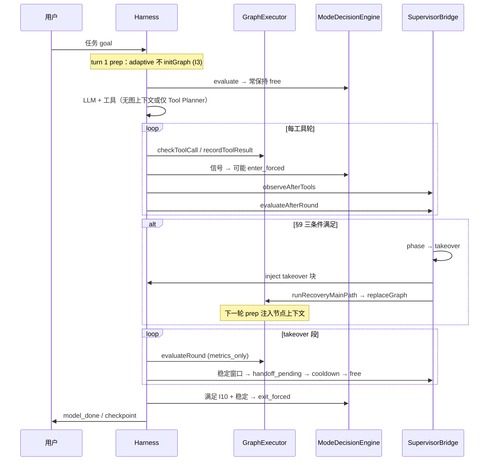
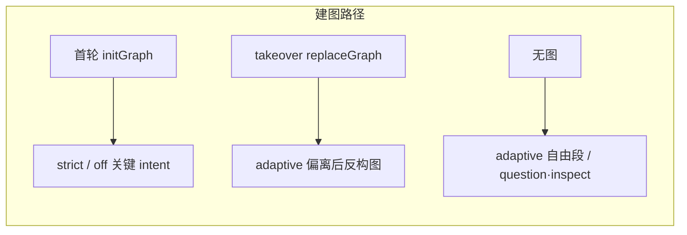

# iceCoder 双模机制详解

> 版本：2026-06-04  
> 规格权威：[`requirement/双模方案2-finish.md`](./requirement/双模方案2-finish.md) V1.3.7  
> L2 专题：[`L2监管层详解.md`](./L2监管层详解.md) · 任务图设计：[`requirement/任务图规划-设计文档-finish.md`](./requirement/任务图规划-设计文档-finish.md)

---

## 1. 双模是什么

iceCoder 的「双模」不是两个互斥的运行时，而是 **同一 Harness 主循环上的两层约束**，在不同阶段以不同强度叠加：

| 口语 | 代码概念 | 含义 |
|------|----------|------|
| **模型主导 / 自由段** | `executionMode = free`，`supervisorPhase = free` | 信任模型自主规划；系统以观测为主，少写策略文案 |
| **图引导 / 强约束段** | `executionMode = forced`，且/或 `supervisorPhase = takeover` | 工具门禁、节点合约、BranchBudget 等规则层生效；必要时由监管重建任务图 |

设计原则（弹性信任）：

1. **默认信任模型** — 不预置全流程 workflow，只在关键工程任务上启用图与监管。  
2. **被动观察** — 偏离先记信号（B 类），不立刻刷屏纠偏。  
3. **按需接管** — adaptive 下满足风险 + 域 + 信号三条件才 L2 takeover。  
4. **状态优先恢复** — takeover 后用工作区快照 **反构图**，把已完成步骤标为 `done`，而不是从零重跑模板。  
5. **安全交还** — 稳定窗口 + cooldown 后 handoff，L1 forced 在满足 I10 最小驻留后再退出。

> 双模内核 **不是** Planner，也 **不是** 验收 Gate；它是 **Runtime Supervisor + Execution Mode + TaskGraph** 的组合。

---

## 2. 反构图：三层如何叠在 Harness 上

```text
                         ┌──────────────────────────────┐
                         │  用户消息 · TaskState.intent   │
                         └──────────────┬───────────────┘
                                        ▼
┌──────────────────────────────────────────────────────────────────────────┐
│ Harness 主循环 (L1 Core)                                                  │
│   prepareHarnessRound → callHarnessLlm → tool_round / no_tool_round        │
└──────────────────────────────────────────────────────────────────────────┘
          ▲                    ▲                           ▲
          │                    │                           │
   ┌──────┴──────┐    ┌────────┴────────┐        ┌────────┴────────┐
   │ L0 档位      │    │ L1 执行模式      │        │ L2 监管相位      │
   │ supervisorMode│    │ executionMode    │        │ supervisorPhase  │
   │ off/adaptive/ │    │ free ↔ forced    │        │ free/takeover/   │
   │ strict        │    │ ModeDecisionEngine│        │ handoff/cooldown │
   └──────────────┘    │ ToolGate · Graph  │        │ Observer ·       │
                       │ Executor · Budget │        │ RecoverySupervisor│
                       └───────────────────┘        └──────────────────┘
          │                    │                           │
          └────────────────────┴───────────────────────────┘
                               ▼
                    TaskGraph (可选 · 规则模板图)
                    GraphExecutor.init / replace / evaluateRound
```

### 2.1 三层职责对照

| 层 | 配置/状态 | 谁写状态 | 主要影响 |
|----|-----------|----------|----------|
| **L0** | `data/config.json` → `supervisorMode` | `mode-controller.ts` | 是否启用 L2 链、strict 是否全程 forced、首轮是否 init 图（I3） |
| **L1** | `HarnessRunState.executionMode` | **仅** `applyExecutionModeConstraints`（I5） | 工具 allow/warn/block、BranchBudget、forced 最小驻留（I10） |
| **L2** | `HarnessRunState.supervisorPhase` | `RecoverySupervisor` + bridge commit | takeover 文案、反构图、`user_checkpoint` 停止 |

**关键分离**：L1 的 free/forced 与 L2 的 free/takeover **不同步同名**。例如 adaptive 下可以 `executionMode=forced` 而 `supervisorPhase=free`（仅 L1 强约束）；也可以 takeover 时两者同时收紧。

### 2.2 与 TaskGraph 的关系

- **TaskGraph** 是 L1 侧的 **结构化执行上下文**（节点、游标、合约）。  
- **是否建图** 由 `shouldUseTaskGraph(intent)` + L2 首轮门禁 `shouldInitTaskGraphAtFirstRound` 共同决定。  
- **反构图** 是 L2 takeover 后调用 `RetrospectiveGraphBuilder` + `GraphExecutor.replaceGraph`，用 **当前工作区事实** 回填已完成节点。

---

## 3. 端到端：一次关键任务如何走完双模

以下以 **adaptive + edit/debug 类 intent** 为例（`shouldUseTaskGraph=true`）。



### 3.1 strict 档差异（简表）

| 环节 | adaptive | strict |
|------|----------|--------|
| 首轮 | **不** `initGraph`（I3） | **首轮** `initGraph` + 面板 `task_graph_init` |
| L1 | 按信号进入 forced | `explicit_impl` 等 floor，倾向长期 forced |
| L2 takeover | §9 三条件 | V1 不在 RecoverySupervisor 走 takeover；靠 L1 + graph hint |
| file_loop 信号 | 需 triggers + 档位 | 文档验收常要求 **strict** |

### 3.2 off 档

`bridge.isActive() === false`：L2 观测/相位/反构图主路径关闭；TaskGraph 仍可按历史逻辑在首轮 init（等同 `shouldUseTaskGraph`），与升级前行为兼容。

---

## 4. L1 执行模式（Execution Mode）

### 4.1 free 与 forced

| 模式 | 模型侧感受 | 系统侧 |
|------|------------|--------|
| **free** | 自主选工具、自主多步 | ToolGate 宽松；Graph `evaluateRound` 可 inject hint（非 takeover 段） |
| **forced** | 收到 step/graph 提示、工具可能被 block | ToolGate 收紧；BranchBudget 启用；Graph 合约 warn/block |

切换 **唯一入口**：`ModeDecisionEngine.evaluate` → `applyExecutionModeConstraints`（公理 I5）。其它模块只 `submitModeSignal`。

### 4.2 进入 forced 的信号（ModeSignal）

信号来源：运行态派生 + 各模块 `submitSignal`。

| 信号 | 典型来源 | 含义 |
|------|----------|------|
| `checkpoint_resumed` | CheckpointEngine | 会话从 checkpoint 恢复 |
| `task_graph_active` | 运行态 | 当前有活跃任务图 |
| `branch_switched` | Graph / BranchBudget | 本轮回退/切换分支 |
| `pending_steps` | 图上游标 | 待执行节点数超阈 |
| `tool_failure` | StepGate / 运行态 | 工具失败 |
| `multi_write` | 运行态 | 单轮多写目标 |
| `large_diff` | 运行态 | 累计 diff 过大 |
| `explicit_impl` | 图节点 | 存在 pending 的 `edit` 节点（strict floor） |

优先级见 `MODE_SIGNAL_PRECEDENCE`（`src/types/supervisor.ts`）。

### 4.3 退出 forced（I10）

须同时满足（`shouldExitForcedMode`）：

- mode lock 轮次耗尽；
- **forcedMinDwellRounds** 个 task-bearing round（成功执行工具 / 图步进 / 写文件变更）；
- 无 pending steps、无计划写、稳定轮数达标、无 `recovery_pending`、branchDebt=0。

防止「刚进 forced 下一轮就 exit」的闪跳。

### 4.4 forced 退化层（ForcedDegradedTier）

图初始化失败或 forced 下执行受阻时，可能标记 `graph` → `step_queue` → `write_intent`，在 UI/telemetry 中可见当前退化层级，对应 §19.7 二级强提示路径。

---

## 5. L2 监管层（摘要）

L2 负责 **过程监管**：偏离检测、takeover/handoff、纠偏 inject、恢复预算。

- 详细逐步说明见 **[`L2监管层详解.md`](./L2监管层详解.md)**。
- 与 L1 协作：L2 **不**写 `executionMode`；takeover 后 L1 往往因 `recovery_pending` 等保持 forced，直到 handoff + I10 条件允许退出。

**adaptive takeover 三条件**（须同时）：

1. `critical_*` 域（`inferTaskDomain` + 长任务 goal）；  
2. `riskScore >= adaptiveFree.riskThreshold`；  
3. 存在 DeviationSignal（`tool_repeat_fail` / `no_progress` / `file_loop` / `goal_drift` 等）。

---

## 6. 任务图（TaskGraph）长什么样

### 6.1 数据结构（逻辑模型）

任务图是 **带主分支 + 可选 fallback 分支的有向步骤图**，运行时由 **游标** 指向当前节点。

```text
TaskGraph
├── graphId, goal, intent
├── nodes: Record<nodeId, TaskNode>     # 如 node-01 .. node-05, node-fb01
├── edges: TaskEdge[]                   # normal | fallback
├── mainBranch: { nodeIds: [...] }      # 主路径顺序
├── fallbackBranches: [...]             # 失败后的后备支路
├── cursor: { branchId, nodeId, nodeIndex, completedNodeIds, ... }
├── status: ready | running | paused | done | failed
└── progress: 0..100
```

### 6.2 节点类型（TaskNodeType）

| type | 典型 title（edit 模板） | phase | 作用 |
|------|-------------------------|-------|------|
| `inspect` | 理解目标 | intent | 澄清范围，可无工具 |
| `search` | 查阅相关内容 | context | 读代码/搜仓库 |
| `edit` | 编写或修改代码 | editing | 写文件 |
| `verify` | 运行验证命令 | verification | `run_command` / 测试 |
| `summarize` | 总结变更 | final | 收尾说明 |
| `delegate` | 仓库探索 | context | 子代理探索（复杂任务） |
| `fallback` | 后备方案 N | editing | 主路径失败后切换 |

节点状态：`pending` → `running` → `done` | `failed` | `skipped`。

### 6.3 示例：标准 edit 模板（5 步主链）

由 `task-graph-builder.ts` 的 `intentTemplates('edit')` 生成，节点 id 连续编号：

```text
node-01 [inspect]  理解目标
   ↓
node-02 [search]   查阅相关内容
   ↓
node-03 [edit]     编写或修改代码
   ↓
node-04 [verify]   运行验证命令
   ↓
node-05 [summarize] 总结变更
```

**复杂度调整**：

- `trivial`：压缩为 edit → verify → summarize 三步；  
- `hard`：在链首插入 `delegate`「仓库探索」；  
- 按 `suggestedFallbackCount` 追加 `node-fb01`… fallback 节点。

**模板选型**：`rankTemplates` 根据 `RepoShape`（package.json 推断测试框架、monorepo 等）、`TaskComplexity` 在 `BUILTIN_TEMPLATES` 中排序，例如「无测试框架」→ `tpl-edit-no-test` 去掉 verify 节点。

### 6.4 模型看到的「当前步骤」

每轮 `prepareHarnessRound` 若 `graphExecutor.hasGraph()`，向 `msgs` 注入：

```text
[TaskGraph] 当前步骤: 编写或修改代码 (edit)
进度: 42% | 状态: running
建议工具: run_command
参考文件: src/...
```

来源：`GraphExecutor.getCurrentNodeContext()` — **唯一**结构化执行计划正文（UI 冰豆/侧栏用 `toView()` 渲染步骤列表）。

### 6.5 图内每轮发生什么（GraphExecutor）

| 阶段 | 方法 | 行为 |
|------|------|------|
| 工具前 | `checkToolCall` | ContractValidator：工具是否符合节点合约；偏离检测 → warn/block |
| 工具后 | `recordToolResult` | 记录 OutputSignal（file_written、test_passed 等） |
| 轮末 | `evaluateRound` | 合约轮末检查、升级/回退 fallback；`force_switch` 时 `attemptFallback` |
| 推进 | `advanceCursor` / `completeCurrentNode` | 节点 done 后移动游标，更新 progress |

**takeover 段**（§19.3）：`enterTakeover()` 后 `evaluationMode = metrics_only` — `evaluateRound` **不再**向 msgs inject hint，C 类文案只走 L2 `CorrectionPort`（I1）。

**forced 下 graph hint**：step warn/block、`force_switch` 等经 `bridge.composeGraphHint` → `kind: graph_hint` inject（仅 forced 段，free 段 drop）。

---

## 7. 任务图的三种生命周期



### 7.1 路径 A：首轮 `initGraph`（`buildGraph`）

- **调用**：`harness-round-prep.ts` 在 `turnCount === 1` 且 `shouldInit === true`。  
- **strict**：`shouldInitTaskGraphAtFirstRound` → `strict.firstRoundGraph === true`。  
- **off**：bridge 不活跃时，等同 `shouldUseTaskGraph(intent)`。  
- **结果**：`GraphExecutor.initGraph({ goal, intent })` → 推送 `task_graph_init` 事件 + 侧栏计划。

### 7.2 路径 B：不 init，takeover 后 **反构图**（RetrospectiveGraphBuilder）

- **adaptive 关键域默认路径**（I3）：首轮 **不** init，模型自由执行若干轮。  
- L2 进入 takeover → `runRecoveryMainPath`：  
  1. **M5** `WorkspaceStateExtractor` — 从 RepoContext/TaskState 抽快照；  
  2. **M6** `SnapshotConfidenceEvaluator` — 是否够格走模板图（≥ templateGraphMin）；  
  3. **M7** `RecoverySafetyChecker` — 是否允许换图；  
  4. **M8** `RetrospectiveGraphBuilder.build` — **再调一次** `buildGraph(goal, intent)` 得到模板图，然后按快照 **回填进度**。

**反构图规则（V1）** — `applyKnownProgress`：

| 节点类型 | 标为 done 的条件 |
|----------|------------------|
| `inspect` / `search` | 工作区已有 `filesAdded` 或 `filesModified` |
| `verify` | `snapshot.testSummary === 'passed'` |

然后 `advanceCursorPastDone` 把游标推到第一个未完成节点，必要时 `startCurrentNode`。

**一级成功**：`GraphExecutor.replaceGraph(graph)` + `enterTakeover()`，timeline `recover:template_graph`。  
**二级降级**：置信度/安全/构图失败 → 仅 inject 一条 `[System Recovery]` recovery 块（`strong_hint`），无 replace。

### 7.3 路径 C：始终无图

`question` / `inspect` 等不在 `TASKGRAPH_INTENTS`；或 adaptive 自由段尚未 takeover。此时仅 L1 信号与 resilience 阶梯提示，无节点合约。

---

## 8. 任务域（TaskDomain）与谁用

`inferTaskDomain(intent, goal)` 映射监管用域（**不**直接切 ExecutionMode）：

| intent + goal | domain |
|---------------|--------|
| 长周期实现类 goal + edit/debug/test/refactor | `critical_edit` / `critical_debug` / … |
| docs | `non_critical_docs` |
| inspect | `non_critical_read` |
| question | `non_critical_explain` |

L2 §9 条件一要求 `critical_*` 才考虑 takeover；L1 的 `shouldUseTaskGraph` 只看 intent 是否在 `{ edit, debug, test, refactor }`。

---

## 9. 干预分层与双模的配合（A / B / C）

| 类型 | 双模中的例子 | 写 msgs？ |
|------|--------------|-----------|
| **A** | Verification Gate block、ToolGate block、权限拒绝 | 短流程说明 |
| **B** | PassiveObserver、ExecutionMode switch timeline、graph metrics | 否 |
| **C** | takeover 块、recovery 强提示、graph_hint | 是，仅 CorrectionPort |

**冲突规避**：

- free 段：少 C，多 B 累积 → 一次 takeover C；  
- takeover 段：GraphExecutor 只 metrics，L2 统一 C；  
- I4：free 段 supervisor recovery/graph_hint 有次数上限。

---

## 10. 配置与观测

| 项 | 位置 |
|----|------|
| 监管档位 | `data/config.json` → `supervisorMode` |
| 风险阈、takeover 窗口、triggers、budget | `data/supervisor-config.json` |
| L2 事件 | `data/runtime/supervisor-events.jsonl` |
| 聊天报告 | `~supervisor` · `GET /api/supervisor/events` |
| 影子对照 | `ICE_SUPERVISOR_SHADOW=1` |

环境变量说明：[`环境变量.md`](./环境变量.md)。

---

## 11. 源码索引

| 主题 | 路径 |
|------|------|
| 双模档位加载 | `src/harness/supervisor/mode-controller.ts` |
| L1 模式决策 | `src/harness/supervisor/mode-decision-engine.ts` |
| L1 模式应用 | `src/harness/supervisor/execution-mode-constraints.ts` |
| L2 门面 | `src/harness/supervisor/supervisor-bridge.ts` |
| 轮次串联 | `src/harness/harness-supervisor-round.ts` |
| 首轮建图门禁 | `src/harness/harness-round-prep.ts` |
| 图执行器 | `src/harness/task-graph-executor.ts` |
| 规则构图 | `src/harness/task-graph-builder.ts` |
| 反构图 | `src/harness/supervisor/retrospective-graph-builder.ts` |
| 图类型 | `src/types/task-graph.ts` |
| intent 门控 | `src/harness/task-graph-config.ts` |
| 任务域 | `src/harness/task-domain.ts` |

---

## 12. 相关文档

| 文档 | 用途 |
|------|------|
| [`L2监管层详解.md`](./L2监管层详解.md) | L2 逐步流程、相位机、纠偏闸门 |
| [`harness/Harness-L2与Gate工作逻辑.md`](./harness/Harness-L2与Gate工作逻辑.md) | Harness 主循环 + Verification Gate |
| [`requirement/双模方案2-finish.md`](./requirement/双模方案2-finish.md) | 实现规格全文 |
| [`requirement/任务图规划-设计文档-finish.md`](./requirement/任务图规划-设计文档-finish.md) | 节点合约、升级、模板体系 |
| [`requirement/双模落地缺口-finish.md`](./requirement/双模落地缺口-finish.md) | 批次 DoD |
| [`项目介绍.md`](./项目介绍.md) §3.6 | 产品级简述 |

---

## 修订记录

| 日期 | 说明 |
|------|------|
| 2026-06-04 | 初版：双模 L0/L1/L2 反构图、执行模式、任务图与反构图生命周期 |
