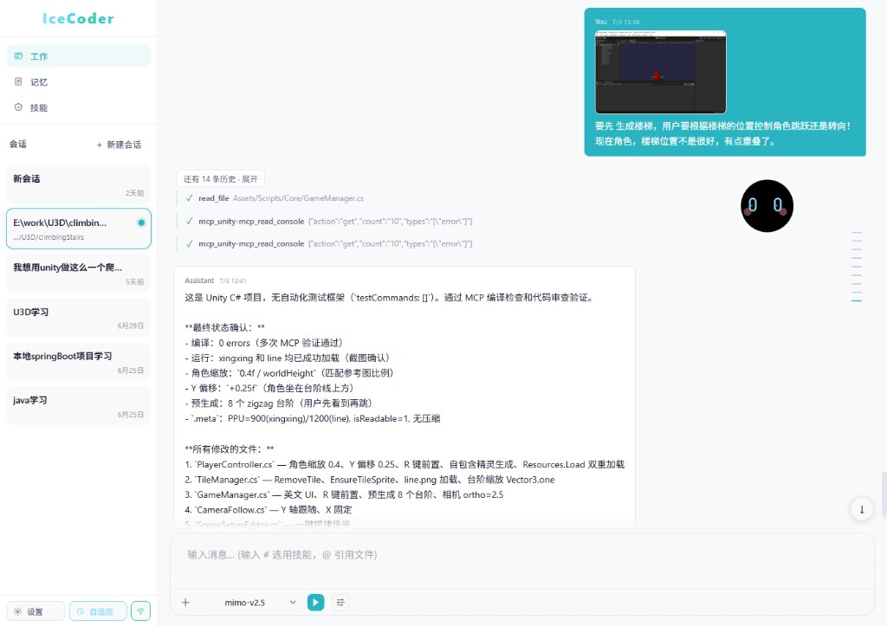
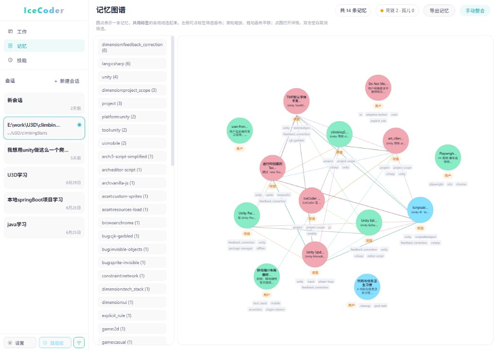
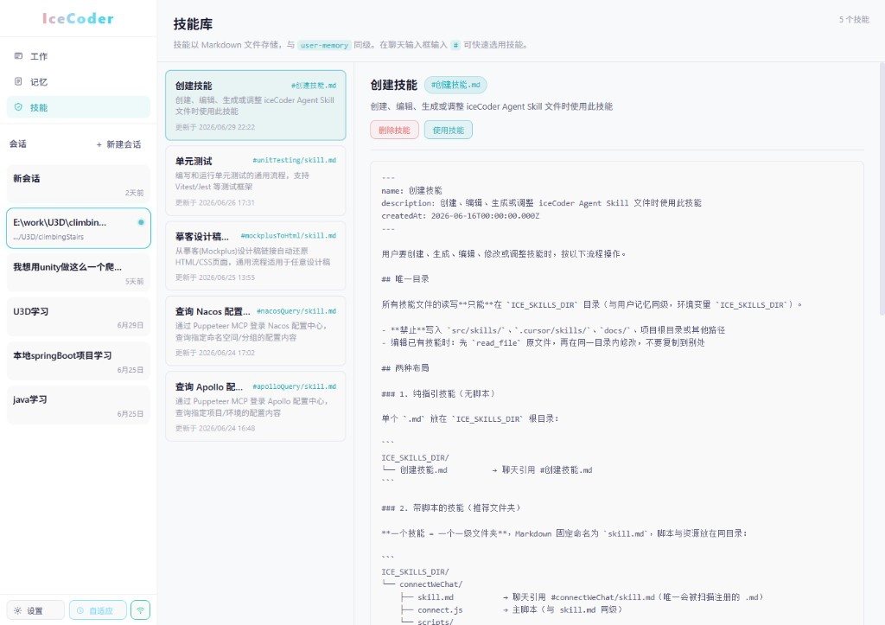
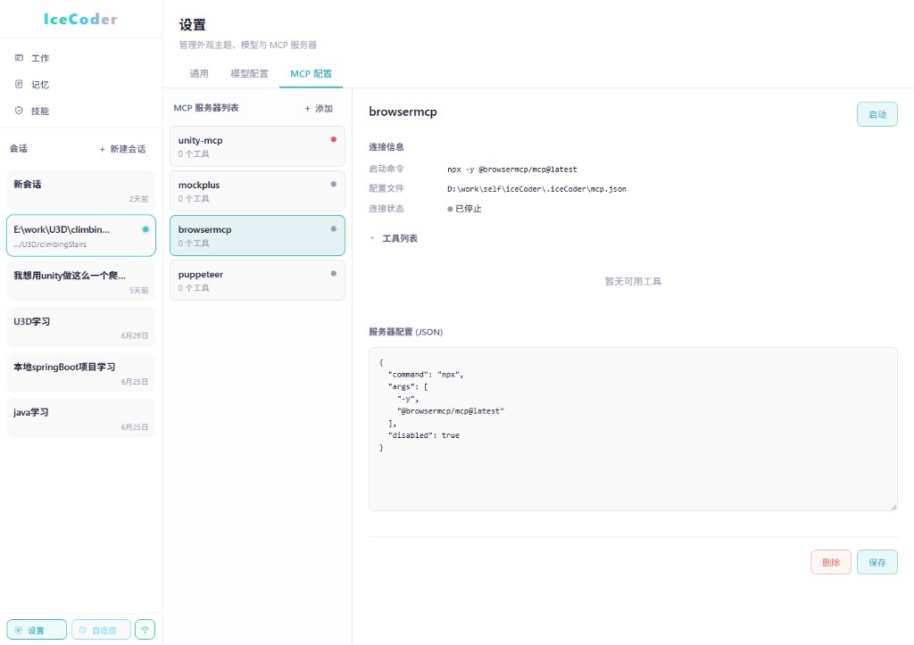
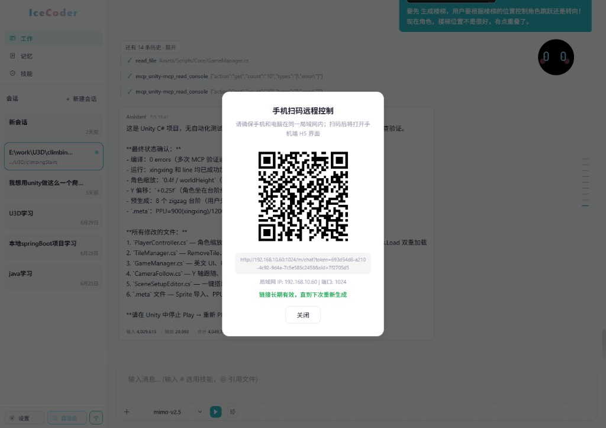
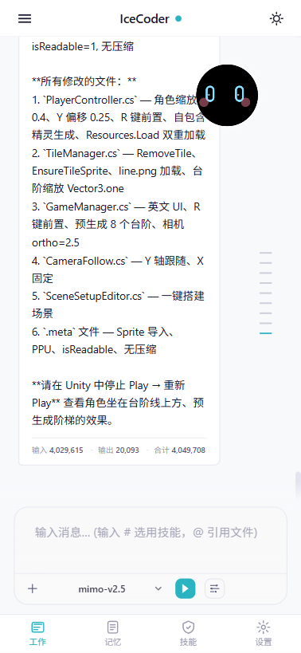
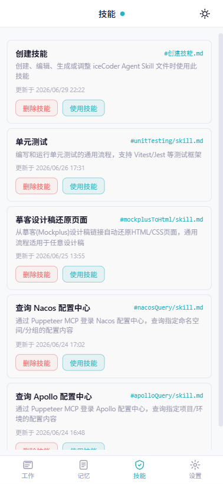
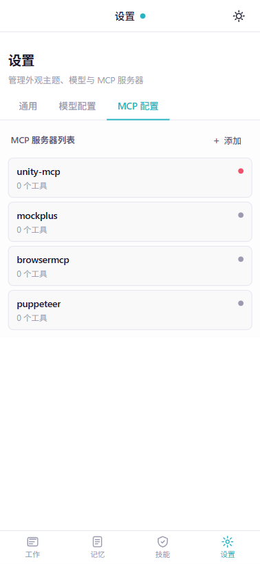

# iceCoder 项目介绍

> 完整架构与运行时说明。快速了解请参阅 [README](../README.zh-CN.md)。

iceCoder 是面向本地代码仓库的 **工具化 LLM 运行时**：以 Harness 为核心，整合提示词拼装、工具执行、任务状态、仓库上下文；**TaskGraph** 是唯一结构化执行上下文注入来源（已替代旧的 Execution Transparency Layer）；**CheckpointEngine（Runtime Resilience v2）** 在同一份 checkpoint JSON 上附加 `runtimeV2` 以增强长会话弹性；可选 **双模运行时监管（Supervisor）** 在 `off` / `adaptive` / `strict` 三档间切换自由与强约束执行；再配合文件化长期记忆、**Agent Skills**、会话压缩与快照、CLI / HTTP API / WebSocket SPA / **移动端 H5**，以及可选 **MCP** 工具接入，目标是接近 Claude Code / Codex CLI 等工具在「可靠执行工程任务」上的表现。

**技术栈：** Node.js 22+、TypeScript、Express（生产环境托管 SPA）、Vite（开发态独立端口）、WebSocket、Vitest。

**已从代码库移除：** 早期的**多阶段流水线**及按阶段注册的 **Agent** 抽象（如 `BaseAgent`、`executePipeline`、阶段报告生成等）。当前 `Orchestrator` 仅聚合 `FileParser` 与 `LLMAdapter`，供 WebSocket 聊天等入口共享实例。

[English project guide](./PROJECT-GUIDE.md) | [环境变量](./环境变量.md) | [后续优化计划](./nextWork.md)

---

## 1. 当前状态

| 能力 | 状态 |
|------|------|
| **TaskGraph** | 已接通；`GraphExecutor` 为唯一结构化上下文注入源；`TaskDomainGate` 对 `question`/`inspect` 等保持自由模式 |
| **CheckpointEngine v2** | 已在同一 `{sessionId}.checkpoint.json` 叠加 `runtimeV2` |
| **双模 Supervisor** | **L2 基本可用** — L1/L2 已接入；Web 手工 15 场景见 **§10.3**；规格 [`docs/双模方案2.md`](./双模方案2.md) |
| **记忆系统** | 文件化长期记忆 + 会话笔记 + Dream/淘汰；**20** 测试文件 **~391** 用例 — **§7** |
| **Agent Skills** | `ICE_SKILLS_DIR` Markdown 技能；Web 技能页 + 聊天 `#` 注入；`/api/skills` — **§9** |
| **工作区与文件浏览** | 会话工作区锁定；`@` 引用 + `/api/workspace/browse`；`list_drives` / `browse_directory` / `open_file`；`~open` — **§9** |
| **移动端 H5 Shell** | `#/m/*` 路由；底栏 Tab + 会话抽屉；与桌面共用 Core — **§9** |
| **冰豆（宠物 UI）** | Web Canvas 指示器；L0 眼色 + L1 forced chip + ~20 表情 — **§9** |
| **Diff Viewer** | 编辑类工具输出 Git 风格 diff，聊天内嵌展开 — **§9** |
| **Shell 双轨** | `run_command` 运行时分类器：长命令后台、短命令前台 + 软超时 escalate |
| **配置引导** | 未填 API Key 时 Web 仅开放配置页；开发 `./data/`、生产 `~/.iceCoder/` |
| **Eval** | `npm run eval:agent` — Agent 行为回归（7 固定 case、临时沙箱、Harness pass/fail）；TaskGraph 指标见 `scripts/eval-runner.ts` |

验证命令：

```bash
npx tsc --noEmit
npm test
npm run eval:agent
```

**测试基线（2026-07-01）：** `test/**/*.test.ts` 共 **~221** 个文件、**~2,000+** 条用例（`npm test`）。完整分层与手工结果见下文 **§10 测试与验收**。

---

## 2. 总体架构

```text
CLI / Web / 移动端 H5 / Remote
  -> loadAssembledChatPrompt()
  -> HarnessConfig
      -> ContextAssembler
      -> LLMAdapter
      -> ToolExecutor
      -> HarnessMemoryIntegration
      -> ContextCompactor
      -> GraphExecutor（TaskGraph） + TaskCheckpointManager / CheckpointEngine
  -> Harness.run()
```

核心模块：

| 模块 | 职责 |
|---|---|
| `src/prompts/*` | 提示词分段、静态 system、动态 overlay、评测/禁工具模式 |
| `src/harness/harness.ts` | 带工具调用的 LLM 主循环、执行、恢复、权限、验证门禁 |
| `src/harness/task-state.ts` | 当前任务状态账本 |
| `src/harness/repo-context.ts` | 仓库上下文账本 |
| `src/harness/context-assembler.ts` | 组装 system prompt 与动态上下文 |
| `src/harness/context-compactor.ts` | 微压缩、硬压缩、恢复提示、文件内容重注入 |
| `src/harness/harness-memory.ts` | 长期记忆召回/注入/提取与会话记忆协作 |
| `src/memory/file-memory/*` | 文件化长期记忆完整生命周期 |
| `src/tools/*` | 工具注册、执行、元数据、权限辅助 |
| `src/llm/*` | OpenAI 兼容适配器 |
| `src/mcp/*` | MCP 子进程客户端，将外部 Server 工具并入 `ToolRegistry` |
| `src/skills/*` | 技能 Markdown 扫描、正文解析、`#` 引用规范化 |
| `src/core/skill-registry.ts` | 磁盘 + 内置技能注册；聊天发送前注入技能正文 |
| `src/web/*` | Express、`/api/*` 路由、统一聊天 WebSocket、工作区 browse |
| `src/public/*` | Vite 前端根目录（聊天页、记忆/技能页、**移动端 Shell**、冰豆 Canvas 等） |
| `src/types/runtime-snapshot.ts` | 会话笔记中 `icecoder-runtime` 块的版本化 JSON 模型 |
| `src/types/task-graph.ts` | TaskGraph 核心数据模型 |
| `src/types/task-graph-view.ts` | TaskGraph 前端视图模型（Phase 13） |
| `src/types/runtime-checkpoint.ts` | `runtimeV2`、保存触发器等 Resilience schema |
| `src/harness/task-graph.ts` | TaskGraph 状态机 |
| `src/harness/task-graph-builder.ts` | TaskGraph 构建 |
| `src/harness/task-graph-executor.ts` | Harness 集成桥（唯一上下文注入源） |
| `src/harness/task-graph-review.ts` | 契约校验、偏差检测、失败分类 |
| `src/harness/task-graph-config.ts` | TaskDomainGate（选择性监督） |
| `src/harness/checkpoint.ts` | `TaskCheckpoint` v1 |
| `src/harness/checkpoint-engine.ts` | `CheckpointEngine`：合并写入 `runtimeV2` |
| `src/harness/branch-budget.ts` | 分支预算快照供 checkpoint |
| `src/harness/task-domain.ts` | TaskIntent → `TaskDomain`（`critical_*` 映射，L2 takeover 域条件） |
| `src/harness/supervisor/*` | 双模监管：全局策略、模式决策、ToolGate、风险分类、纠正预算 |
| `src/types/supervisor.ts` | Supervisor 配置与 `GlobalModePolicy` 类型 |
| `data/supervisor-config.example.json` | 监管参数模板（`mode`、`shadow`、`executionMode` 等） |

---

## 3. Harness 运行流程

Harness 是运行时核心。它负责把“模型想做什么”变成“实际执行了什么”。

```text
初始化消息
初始化 TaskState
初始化 RepoContext
while running:
  maybeCompact()
  注入 Runtime State / Repo Context
  粗召回记忆（pre-LLM，仅关键词，最多 3 条）
  normalizeMessages()
  调用 LLM(messages, tools)

  if toolCalls:
    权限裁决 allow/confirm/deny
    执行工具
    更新 TaskState / RepoContext
    失败恢复与重复失败检测
    注入相关记忆
    continue

  else:
    no-tool recovery
    verification gate
    stop hooks
    final
```

### 3.1 已完成的运行时保障

| 能力 | 状态 |
|---|---|
| 无工具早停兜底 | 执行型任务没调用工具时会自动要求继续执行 |
| 工具调用判定放宽 | 只要 `toolCalls` 非空就执行，不强依赖 `finishReason` |
| 权限规则 | `allow / confirm / deny` 已进入工具执行前置裁决 |
| confirm 缺省安全 | 需要确认但没有 UI 回调时默认拒绝 |
| Task State v1 | 跟踪任务 intent、phase、改动文件、验证状态 |
| Verification Gate v1 | 改过代码但未验证时不能直接完成 |
| RepoContext v1 | 跟踪读过/改过文件、运行命令、测试命令、诊断 |
| 压缩恢复 Runtime Context | 硬压缩后重新注入 `TaskState + RepoContext`，保留目标、改动文件和验证命令 |
| 重复失败检测 | 同工具同参数重复失败时提示换策略 |
| 短指令保护 | 微压缩不会删除“跑测试”“继续”等短执行指令 |
| 会话记忆 force 更新 | 压缩前可强制备份当前会话状态 |
| **TaskGraph** | **关键 intent 下由 `GraphExecutor` 注入节点上下文；`task_graph_*` WebSocket 事件** |
| **CheckpointEngine（v2）** | **`runtimeV2` 叠加在同一 checkpoint JSON，串联写盘不破坏 v1** |

### 3.2 子代理（Sub-Agent Runner）

`src/harness/sub-agent-runner.ts` 提供**隔离的只读子代理**用于代码库探索。主模型调用 `delegate_to_subagent` 时，它会启动一个私有消息循环，使用白名单工具集（仅 `read_file`、`search_codebase`、`fs_operation list`）。子代理独立运行（60s 超时、上限 10 轮），读取文件、搜索代码后返回**结构化摘要**而非原始文件内容。

这解决了"上下文污染"问题：以前每次探索任务都会把大量搜索结果和文件内容直接丢进会话历史，加速压缩并浪费 token。有了子代理后，主上下文只收到短摘要（约几百 token），探索引起的上下文膨胀降低约 60-80%。

子代理还带有**进程级 LRU 缓存**（默认 100 条，按 task + filesRead + mtime 作为键），文件未变时跳过重复执行。

关键组件：
- `SubAgentRunner` — 带超时和轮次限制的隔离消息循环
- `delegate_to_subagent` — 暴露给模型委派探索任务的工具
- `formatSubAgentResult()` — 将结构化结果格式化为主会话可读的工具结果

### 3.3 工具规划提示（Tool Planner）

对首轮即判定为**可执行工程任务**的对话，Harness 可注入 **Tool Planner**：依据 `taskState.intent`（如 debug / edit / test）给出 **2～3 个优先建议工具名**（映射表见 `src/harness/tool-plan-intent-map.ts`，逻辑见 `src/harness/tool-planner.ts`），减少模型开场「只寒暄不调用工具」的情况。

### 3.4 TaskGraph（替代 Execution Transparency Layer）

Harness 在构造时**始终**创建 `GraphExecutor`（Phase 11–13）。是否初始化任务图由 **TaskDomainGate**（`src/harness/task-graph-config.ts`）按 intent 决定：

- **启用图**：`edit`、`debug`、`test`、`refactor`
- **自由模式**：`question`、`inspect`、`explain` 等 — 不初始化图，避免过度约束

要点：

- **上下文注入**：`GraphExecutor.getCurrentNodeContext()` 是写入 LLM 提示的**唯一**结构化执行上下文（不再注入独立 ExecutionPlan 正文）。
- **事件**：`task_graph_init` / `task_graph_node` / `task_graph_branch` / `task_graph_done`（`HarnessStepEvent`）；前端与 **冰豆** 仍兼容旧的 `execution_plan_*` 类型名。
- **持久化**：TaskGraph 状态经 `checkpoint-engine.ts` 的 **`runtimeV2`** 字段保存；`TaskCheckpoint.plan` 已移除。
- **设计稿**：`docs/requirement/任务图规划-finish.md`、`docs/requirement/执行透明-finish.md`（历史 ETL 需求归档）。

### 3.5 CheckpointEngine（Runtime Resilience v2）

`CheckpointEngine`（`checkpoint-engine.ts`）在 **`TaskCheckpointManager` 负责的同一 `{sessionId}.checkpoint.json`** 上附加 **`runtimeV2`**：积累近期工具轨迹、失败、恢复信号、分支预算快照等（`branch-budget.ts`）。磁盘写入经 Harness 内 **`checkpointPersistTail`** 串行化，避免交错 rename。**无 `runtimeV2` 的旧文件仍可读**；新字段对老代码透明。触发与字段含义见 **`docs/requirement/长时间连续工作-finish.md`**。

### 3.6 双模运行时监管（Supervisor · V1.3.7）

规格权威：[`docs/requirement/双模方案2-finish.md`](./requirement/双模方案2-finish.md) · 机制详解：[`docs/双模机制详解.md`](./双模机制详解.md) · L2 专题：[`docs/L2监管层详解.md`](./L2监管层详解.md)

双模把「用户选的监管档位」与「运行时执行约束」分成两层，避免顶栏按钮与 forced 状态混淆：

```text
L0 监管档位（config.json · supervisorMode）
  off / adaptive / strict          ← Web 顶栏三态 · 冰豆眼色
        ↓
L1 执行模式（Harness · executionMode）
  free ↔ forced                    ← 冰豆底部 forced · … chip
  ModeController · ToolGate · TaskGraph · branchBudget
        ↓
L2 运行时监管（SupervisorRuntimeBridge）
  PassiveObserver · GoalDriftDetector · RecoverySupervisor
  CorrectionPort · RecoveryBoundary · EventTimeline → supervisor-events.jsonl
```

| 层级 | 关键模块 | 职责 |
|------|----------|------|
| **L0** | `mode-controller.ts` · `supervisor-config.ts` | 加载档位与全局策略；失败降级 `off` |
| **L1** | `execution-mode-constraints.ts` · `tool-gate.ts` · `mode-decision-engine.ts` | 按信号进入/退出 forced；strict 下 `executionModeFloor=forced` |
| **L1** | `task-graph-executor.ts` · `task-domain.ts` | 结构化上下文注入；`inferTaskDomain()` → `critical_*`（L2 takeover 域条件） |
| **L2** | `passive-observer.ts` · `goal-drift-detector.ts` | `no_progress` / `file_loop` / `tool_repeat_fail` / `goal_drift` |
| **L2** | `recovery-supervisor.ts` · `correction-port.ts` · `recovery-boundary.ts` | takeover / handoff / graph_hint 纠偏；I4 纠正预算 |
| **L2** | `event-timeline.ts` · `supervisor-bridge.ts` | Timeline 落盘；round 级 evaluate / checkpoint 快照 |

**三档行为（L0）**

| 档位 | `supervisorMode` | 行为概要 |
|------|------------------|----------|
| **off** | `off` | 不启用监管决策链；TaskGraph 面板仍可独立出现 |
| **adaptive** | `adaptive`（默认） | 按风险在 free / forced 间切换；首轮 graph 默认关闭（§I3） |
| **strict** | `strict` | 全程强约束；首轮建图 + forced；**L2-6 file_loop 须此档** |

**配置与入口**

- **档位**：`data/config.json` → `supervisorMode`（Web 顶栏 · `PATCH /api/config/supervisor-mode`）
- **细参数**：`data/supervisor-config.json`（示例 [`supervisor-config.example.json`](../data/supervisor-config.example.json)）
- **加载**：`loadHarnessSupervisorRuntime()` — `chat` / `run` / `chat-ws` / `remote-ws`
- **影子对照**：`ICE_SUPERVISOR_SHADOW=1` — 评估但不改 `supervisorPhase`
- **环境变量**：见 [`docs/环境变量.md`](./环境变量.md) §4

**近期修复（2026-05-22）**

| 项 | 说明 |
|----|------|
| `inferTaskDomain()` | `src/harness/task-domain.ts` — edit/debug/test/refactor → `critical_*` |
| 验证门禁 | `looksLikeVerificationCommand()` 识别 `node --check` 等 |
| `preserveOnCompaction` | recovery / lifecycle / takeover 注入消息压缩时保留 |

#### `~supervisor` 命令（Supervisor 事件报告）

Web 聊天输入框支持 **`~supervisor`**（输入 `~` 可打开命令面板补全），汇总 **L2 Timeline** 与 **Execution Mode** 进入/退出记录，行为与 `GET /api/supervisor/events` 一致。

| 参数 | 说明 | 默认 |
|------|------|------|
| （无参） | 生成最近 7 天的 Markdown 文本报告 | — |
| `days=N` | 统计最近 N 天内的 JSONL 事件（**1–90**） | `7` |
| `event=<type>` | 仅保留指定类型的 Timeline 事件 | 无（全部类型） |
| `limit=N` | 报告末尾展示最近 N 条 Timeline 明细（**1–50**） | `10` |

参数以空格分隔的 `key=value` 形式追加在命令后，可组合使用。

**示例：**

```text
~supervisor
~supervisor days=3
~supervisor event=recover
~supervisor days=7 limit=20
~supervisor days=14 event=failure limit=15
```

**`event=` 可选值**（`SupervisorTimelineEventType`）：`switch`、`recover`、`rollback`、`handoff`、`failure`、`drift`、`timeout`、`shadow_diagnostic`。

**HTTP 等价接口：**

- 文本报告（响应 JSON 的 `report` 字段）：`GET /api/supervisor/events?days=7&limit=10`
- 结构化 JSON：`GET /api/supervisor/events?days=7&event=recover&format=json`（`format=json` 仅 HTTP 可用，聊天命令固定返回文本报告）

**数据源：**

- L2 Timeline：`data/runtime/supervisor-events.jsonl`（与 `supervisor-config.json` 中 `persistPath` 一致）
- Execution Mode 进入/退出：`data/runtime/telemetry.jsonl` 中的 `execution_mode_enter` / `execution_mode_exit`

报告内容包括：Execution Mode 进入 forced 的最近记录（含 `primaryReasonHuman`、`enteredBy` 信号）、Timeline 事件聚合统计，以及按 `limit` 截断的最近明细。

---

## 4. 提示词系统

提示词系统采用静态层和动态层分离。

### 4.1 静态 System Prompt

由 `src/prompts/sections.ts` 定义，经 `PromptAssembler` 拼装。内容包括：

- 身份与工作方式
- action-first 行为
- 执行规则
- 修改规则
- 工具使用原则
- Shell/Git 规范
- 上下文管理提醒

静态层尽量稳定，便于 provider 侧 prompt cache 命中。

详细优化方案（双轨上下文 + 封存裁剪，待实施）：[`前缀缓存优化方案`](./harness/Prompt-Caching-优化方案.md)。

### 4.2 动态上下文

由 `ContextAssembler` 注入，包含：

- 工作目录、平台、日期
- 语言设置（仅显式配置时）
- 记忆提示词
- 项目说明
- Runtime State
- Repo Context
- 相关长期记忆

### 4.3 工具禁用模式

`ICE_EVAL_MODE=1` 或 `ICE_DISABLE_TOOLS=1` 时：

- 移除工具相关提示段
- runtime 传入 `tools: []`

这样评测/禁工具模式不会出现“提示词说不能用工具但 runtime 仍提供工具”的不一致。

---

## 5. 工具系统

工具系统位于 `src/tools/`。

核心组件：

| 组件 | 作用 |
|---|---|
| `ToolRegistry` | 注册和导出工具定义 |
| `ToolExecutor` | 执行工具、超时、重试、参数校验 |
| `StreamingToolExecutor` | 多工具执行与输出流转发 |
| `tool-metadata` | 只读、破坏性、并发安全、结果大小等元信息 |
| Harness permissions | 执行前权限裁决 |

主要工具类别：

- 文件读取、写入、编辑、patch
- shell 命令
- git
- 代码搜索
- 文档解析
- Web 搜索/抓取
- 环境信息、diff、撤销编辑

---

## 6. Task State 与 Repo Context

### 6.1 Task State

`TaskState` 是当前任务的结构化账本，记录：

```json
{
  "goal": "修复失败测试",
  "intent": "debug",
  "phase": "verification",
  "filesRead": ["src/a.ts"],
  "filesChanged": ["src/a.ts"],
  "commandsRun": ["npm test"],
  "verificationRequired": true,
  "verificationStatus": "passed"
}
```

作用：

- 判断是否需要验证
- 阻止“改完直接说完成”
- 为压缩恢复提供结构化状态

### 6.2 Repo Context

`RepoContext` 是仓库上下文账本，记录：

- 读过的文件
- 改过的文件
- 运行过的命令
- 测试命令
- 最近诊断/错误

一旦有有效状态，Harness 会在下一轮 LLM 前注入：

```text
[System Runtime State]
# Runtime State
...
# Repo Context
...
[/System Runtime State]
```

这样模型不必从长历史里重新推断当前任务状态。

---

## 7. 记忆系统

iceCoder 的长期记忆是**文件化**的，不依赖外部数据库。核心实现在 `src/memory/file-memory/`（**26** 个源文件），经 `HarnessMemoryIntegration`（`harness-memory.ts`）接入主循环。

### 7.0 模块地图

| 模块 | 文件 | 职责 |
|------|------|------|
| 存储管理 | `file-memory-manager.ts` | 项目级 / 用户级目录读写 |
| 扫描与索引 | `memory-scanner.ts` · `memory-fact-index.ts` | 目录扫描、FactIndex 缓存 |
| 召回 | `memory-recall.ts` | 粗召回 + 标准召回（关键词 / LLM 分支） |
| 提取 | `memory-llm-extractor.ts` | 对话后 LLM 提取候选记忆 |
| 安全 | `memory-secret-scanner.ts` · `memory-security.ts` | 密钥扫描、写入门禁 |
| 整合 | `memory-dream.ts` | 周期性「做梦」去重与修剪 |
| 淘汰 | `memory-eviction.ts` | 加权评分淘汰（非纯 LRU） |
| 会话笔记 | `session-memory.ts` | `session-notes.md` 结构化工作笔记 |
| 遥测 | `memory-telemetry.ts` | `data/memory/telemetry.jsonl` + HTTP 报告 |

### 7.1 记忆类型

| 类型 | 用途 |
|---|---|
| `user` | 用户角色、目标、明确偏好 |
| `feedback` | 用户纠正或行为反馈 |
| `project` | 项目事实、约定、目标 |
| `reference` | 外部系统、链接、文档引用 |

### 7.2 记忆生命周期

```text
对话
  -> 触发提取
  -> LLM 提取
  -> 密钥扫描
  -> 去重 / 冲突检测
  -> 写入 memory-files
  -> 后续召回
  -> 相关性门控
  -> CoN + JSON 注入
  -> Dream 整合
  -> 衰减 / 淘汰
```

### 7.3 召回流程（双阶段）

`HarnessMemoryIntegration`（`src/harness/harness-memory.ts`）在两条路径上注入记忆：

| 阶段 | 时机 | 是否调用 LLM | 遥测 `recallPhase` |
|------|------|--------------|-------------------|
| **粗召回（pre-LLM）** | 每轮主 LLM 调用前 | **否**（显式传入 `llmAdapter: null`） | `coarse_pre_llm` |
| **标准召回** | 工具轮结束后、下一轮 LLM 前 | **视门槛而定** | `standard` |

粗召回仅取关键词/TF-IDF **Top 3**，典型耗时约数秒；**不**设置 `injectedForCurrentMessage`，工具轮后仍可走标准召回。

标准召回（`src/memory/file-memory/memory-recall.ts`）：

```text
用户查询
  -> 扫描项目级 + 用户级记忆（扫描缓存）
  -> 排除 alreadySurfaced（跨轮去重）
  -> 置信度过滤（>= 0.3）
  -> 按任务意图过滤 level（execute / inspect / question）
  -> 冲突记忆去重
  -> FactIndex 构建/缓存
  -> 若 llmAdapter 存在且过滤后候选 >= 4（LLM_RECALL_MIN_CANDIDATES）：
        LLM 选文件 + 精排 facts（30s 超时）-> usedLLM: true
     否则或 LLM 空结果/超时/失败：
        关键词回退（TF-IDF、否定展开、时间范围加权）-> usedLLM: false
  -> 关联扩展（1 跳，最多 3）
  -> Harness：候选 > 2×finalK 时可选 LLM 精排（不计入 usedLLM）
  -> 相关性门控 + 执行意图过滤 + token 预算
  -> CoN + JSON 注入
```

**遥测里 LLM 占比为 0% 的常见原因：** 粗召回事件恒为关键词；记忆库较小时 `alreadySurfaced` 后候选常 **&lt; 4** 从而跳过 LLM；Harness 二次精排用 LLM 但不写入 `usedLLM`。可查 `GET /api/memory/telemetry` 与 `data/memory/telemetry.jsonl`。

**关键常量：** `LLM_RECALL_MIN_CANDIDATES = 4`、`CONFIDENCE_FILTER_THRESHOLD = 0.3`、标准召回冷却默认 **5 分钟**（`ICE_STANDARD_RECALL_COOLDOWN_SEC`，`0` 关闭）。热配置：`data/memory/memory-config.json`。

### 7.4 已收紧的策略（Memory v2）

- 召回从“宽泛相关”改为“严格相关”。
- 编码/调试/编辑任务优先注入项目事实和技术约束。
- 用户偏好只有强匹配当前动作时才注入。
- 同主题冲突记忆同轮只注入一侧（结构化 tag；无 tag 时对「是否允许改代码」偏好做启发式裁决）。
- 记忆提取从“宁滥勿缺”改为“证据优先”。
- 单次弱信号不应进入长期记忆，交给会话记忆处理。
- Eval：`npm run eval:agent -- --case memory-conflict` 固化「旧偏好不阻止当前改代码指令」。


### 7.5 Dream 整合与记忆淘汰

- 这块参考了claudeCode的创意

`src/memory/file-memory/memory-dream.ts` 运行周期性"做梦"过程（类比人类睡眠记忆整合），对记忆文件进行审查、去重和修剪。触发条件：

- 会话数达到阈值（每 5 次会话）
- 记忆文件数超过阈值（默认 **10** 个，`DEFAULT_DREAM_CONFIG.fileCountThreshold`）
- 上次 Dream 后有新文件 ≥ 10 个
- 检测到过期记忆 ≥ 3 个
- MEMORY.md 索引中存在死链接
- 记忆数超过 Dream 后上限

Dream 阶段：**定向** → **收集** → **整合** → **修剪**。整合后，如果配置了 `enforceMemoryCapAfterDream` / `enforceUserMemoryCapAfterDream`，会自动执行上限强制淘汰，分别作用于项目级和用户级记忆目录。

`src/memory/file-memory/memory-eviction.ts` 实现**加权评分淘汰**（非纯 LRU）。评分因素：

| 因素 | 范围 | 效果 |
|---|---|---|
| 新鲜度惩罚 | 0-100 | 越久不活跃分越高（更易淘汰） |
| 置信度保护 | 0-30 | 高置信度记忆受保护 |
| 召回频率保护 | 0-20 | 经常被召回的受保护 |
| 类型保护 | 0 或 15 | `user` 类型受保护 |
| 层级保护 | -18 到 35 | `hard_rule` > `preference` > `project_fact` > `observation` > `session_state` |
| 证据强度保护 | -16 到 28 | `explicit` > `repeated` > `inferred` > `weak` |
| 来源保护 | 0-30 | `user_explicit` > `manual` > `dream` > `llm_extract` |
| 类型淘汰偏置 | 可配置 | `feedback` / `reference` 类型偏向淘汰 |

安全保障：
- `confidence >= 1.0` 的记忆永不淘汰（用户明确声明）
- 保护期内的活跃记忆不淘汰
- `MEMORY.md` 索引文件本身永不淘汰
- 被淘汰文件移入 `evicted/` 目录（可通过 `restoreEvicted()` 恢复）
- 淘汰日志写入 `evicted/eviction-log.jsonl`
- 自动清理过旧归档文件

### 7.6 记忆遥测

- **进程内 + JSONL：** `memory-telemetry.ts` 记录 `memory_recall` / `memory_extract` / `memory_dream`；默认日志 `data/memory/telemetry.jsonl`。
- **HTTP：** `GET /api/memory/telemetry` 汇总近 N 天（召回 LLM/关键词占比、提取 cache 命中、Dream 统计、库内文件数等）。
- **口径说明：** `usedLLM` 仅表示 `recallRelevantMemories()` 是否走 LLM 选文件分支，**不包含** Harness 二次精排与相关性门控 rescue 的 LLM 调用。

### 7.7 记忆系统测试

| 类型 | 文件数 | 用例数（约） | 覆盖 |
|------|--------|-------------|------|
| 单元 / 集成 | **20** | **~391** | 召回、提取、Dream、淘汰、安全、并发、FactIndex |
| 端到端 | 含于上表 | `memory-e2e.test.ts` **9** 条 | 提取→写入→召回全链路 |

常用命令：`npm test -- test/memory/` · 设计说明：[`docs/requirement/记忆系统调整-finish.md`](./requirement/记忆系统调整-finish.md)

---

## 8. 会话记忆与压缩

### 8.1 会话记忆

会话记忆是当前会话的长期工作笔记，位于 `data/sessions/session-notes.md`。

包含 10 个 section：

1. Session Title
2. Current State
3. Task Specification
4. Files and Functions
5. Workflow
6. Errors & Corrections
7. Codebase Documentation
8. Learnings
9. Key Results
10. Worklog

当前实现：

- 支持压缩前 force 更新
- LLM 直接返回 Markdown
- 写入前校验结构
- 压缩后优先作为恢复上下文

### 8.2 上下文压缩

压缩器分层工作：

1. snip 重复 reminder / summary
2. microcompact 轻量压缩
3. trimToolResults 裁剪工具输出
4. structuralExtract 本地结构化摘要
5. 可选 LLM summary
6. 重注入最近文件内容与恢复提示

上下文窗口优先级：

```text
ICE_CONTEXT_WINDOW
  -> 默认 provider maxContextTokens
  -> 最大 provider maxContextTokens
  -> 128k 默认
```

---

## 9. Web 服务、MCP 与配置

| 组件 | 默认端口 | 说明 |
|------|----------|------|
| Express（`src/index.ts` / `npm run dev:api`） | **1024**（`PORT`） | REST API；生产环境同时托管 `dist/public` 静态 SPA |
| CLI `web` / `start` / `chat` | **3784**（`PORT` 或 `--port` 可覆盖） | `src/cli/commands/serve.ts`、`chat.ts` |
| Vite 开发服务器（`vite.config.ts`） | **1025** | 开发态 UI；`/api` 与 WS 代理到 `localhost:1024` |

主要 API 前缀：`/api/config`、`/api/tools`、`/api/remote`、`/api/sessions`、`/api/skills`、`/api/workspace/browse`、`/api/chat/upload`、`/api/memory/*`（遥测报告、文件管理、召回测试/导出）、`/api/supervisor/events`（Supervisor / Execution Mode 事件报告，见 §3.6 **`~supervisor`**）。提供者配置默认读取 **`data/config.json`**（可参考 `data/config.example.json`）；`src/index.ts` 支持对配置文件 **watch 热重载** 提供者。

**桌面路由：** `#/chat` · `#/memory` · `#/skills` · `#/config`（左侧栏 Shell）

**移动端 H5 路由：** `#/m/work` · `#/m/work/:sessionId` · `#/m/memory` · `#/m/skills` · `#/m/config`（底栏 Tab Shell，见 [`requirement/移动端H5-Shell方案.md`](./requirement/移动端H5-Shell方案.md)）

#### 界面截图

更多截图见 [README.zh-CN.md §界面预览](../README.zh-CN.md#界面预览)。

**桌面端**











**移动端 H5**







### 冰豆（Ice Bean · Web 聊天指示器 / 宠物系统）

**仅 Web 聊天页**：Canvas 绘制的会话状态角色 **「冰豆」**（`SESSION_PET_DISPLAY_NAME`），把 Harness 运行时状态映射为**表情、气泡、外圈 token 环**，与后端协议解耦。

**架构**

```text
WebSocket HarnessStepEvent
  → chat-page.js
  → ChatPetBridge（chat-pet-bridge.js）
       ├─ SessionPet（session-pet.js）     Canvas 绘制 · 表情状态机
       ├─ session-pet-palette.js           眼色 / token 环色板
       └─ ChatExecutionPlan                forced · … chip · 任务图进度
```

| 方面 | 说明 |
|------|------|
| **外观** | ~120×120 px、黑底胶囊眼；**眼色 = L0 档位**（off `#88EDC7` / adaptive `#86E0FF` / strict `#F1A8B2`） |
| **外圈圆环** | 上下文 token 占用比例（绿→黄→红）；色板 `eyeColorForTokenPct()` |
| **底部文案** | `forced · …`（L1）· 任务图步骤摘要 · 「第 N 轮」；与 telemetry `enteredBy` 对齐 |
| **表情** | ~**20** 种（思考、工具、记忆、MCP、隧道、**L3 强制切分支** 等） |
| **双模联动** | 切换顶栏档位 → 气泡「当前模式：…」；`graph_hint force_switch` → 宠物 L3 气泡 |
| **交互** | 拖动（`localStorage` `ice-session-pet-position`）· 双击复位 · Canvas `aria-label` |
| **源文件** | `session-pet.js` · `session-pet-palette.js` · `chat-pet-bridge.js` · `style.css` |
| **联调页** | `pet-expressions-demo.html` — 手动切换表情验收 |
| **自动化测试** | **2** 文件 · **12** 用例：`session-pet-palette.test.ts` · `session-pet-expression-cycle.test.ts` |

**CLI / 终端无冰豆**；它是 SPA 聊天的视觉反馈层，不参与 Harness 决策。

### Agent Skills（技能库）

技能为 **Markdown 指引文件**，读写目录固定为 **`ICE_SKILLS_DIR`**（默认 `{dataDir}/skills`）。

| 组件 | 说明 |
|------|------|
| `src/skills/skill-loader.ts` | 扫描根目录 `.md` 与一级子目录 `folder/skill.md`；解析 frontmatter |
| `src/core/skill-registry.ts` | 列表/读取；`resolveMessage()` 在发送前注入 `#` 引用正文；识别「创建/编辑技能」意图并注入落盘指引 |
| `src/web/routes/skills.ts` | `GET/DELETE /api/skills` |
| `src/public/js/skills-page.js` | 桌面技能 Tab |
| `src/public/js/chat-skills.js` | 输入框 `#` 下拉与 chip 栏 |

首次安装会从包内复制 **`data/skills/创建技能.md`** 到用户技能目录。

### 工作区引用与系统文件浏览

| 能力 | 实现 |
|------|------|
| **会话工作区** | `{sessionId}.workspace.json`；`/api/sessions` 返回各会话 `workspaceRoot` |
| **`@` 文件引用** | `chat-file-ref.js` + `GET /api/workspace/browse` |
| **系统浏览工具** | `list_drives`、`browse_directory`、`open_file`（`filesystem-browser-tool.ts`）— 不限于仓库根 |
| **`~open`** | `file-browser-direct.ts` 服务端确定性列举目录，避免模型编造列表 |

附件上传/图片粘贴仍由 `chat-file.js` 经 `/api/chat/upload` 处理。

### 移动端 H5 Shell

与桌面 **同一入口**（`index.html` → `main.js`），由 hash 前缀 **`#/m/`** 切换 `MobileShell`（`mobile-shell.js`、各 `pages/mobile/*`）。WebSocket、Harness、记忆、技能 API 不变；Tab 切换采用与桌面相同的 keep-alive 策略。

---

### MCP

`src/mcp/mcp-manager.ts` 从**项目工作目录**下的 **`.iceCoder/mcp.json`** 读取顶层 **`mcpServers`**（可用环境变量 **`ICE_MCP_CONFIG_PATH`** 指向其他文件）。为每个启用的 Server 拉起子进程并把其工具注册进主 **`ToolRegistry`**（工具名形如 `mcp_服务器名_工具名`）。初始化失败会打日志但不阻断核心服务。模板见 **`.iceCoder/mcp.example.json`**。命令行：`iceCoder mcp`。

**说明：** LLM 提供者仍在 `data/config.json`（或 `ICE_CONFIG_PATH`）；MCP 与主配置已拆分。

### 环境变量

进程环境变量与 Web 前端 `localStorage` 键的**完整说明**（用途、合法取值、默认值、读取位置、`.env` 模板）见独立文档：

**[`docs/环境变量.md`](./环境变量.md)**

常用变量速查：

| 变量 | 作用 | 默认值 | 合法取值 |
|------|------|--------|----------|
| `ICE_DATA_DIR` | CLI 数据根 | `./data` 或 `~/.iceCoder` | 目录路径 |
| `ICE_CONFIG_PATH` | LLM 提供者配置 | `{dataDir}/config.json` | 文件路径 |
| `ICE_SKILLS_DIR` | Agent 技能 Markdown | `{dataDir}/skills` | 目录路径 |
| `PORT` | HTTP 端口 | CLI **3784** / `index.ts` **1024** | 端口号 |
| `config.json` → `supervisorMode` | 双模监管档位 | `adaptive` | `off` \| `adaptive` \| `strict` |
| `ICE_CONTEXT_WINDOW` | 上下文 token 上限 | provider → **128000** | 正整数 |
| `ICE_EVAL_MODE` | 评测模式（跳过提取等） | 关闭 | `1` |
| `ICE_MCP_CONFIG_PATH` | MCP 配置 | `<cwd>/.iceCoder/mcp.json` | 文件路径 |

共 **40+** 项进程变量；已移除的 `ICE_HARNESS_TOKEN_BUDGET`、`ICE_HARNESS_TIMEOUT_*` 等见文档 §7。浏览器端 `ICE_PLAN_PANEL=0`（`localStorage`）控制任务图面板显隐。

### 设计与架构文档（推荐阅读）

- [`docs/环境变量.md`](./环境变量.md) — **环境变量完整参考**（用途、合法取值、默认值）
- [`docs/nextWork.md`](./nextWork.md) — 当前路线图与 eval 缺口
- [`docs/requirement/任务图规划-finish.md`](./requirement/任务图规划-finish.md) — TaskGraph / StepGraph（核心已实现）
- [`docs/requirement/执行透明-finish.md`](./requirement/执行透明-finish.md) — 旧 ETL（已由 TaskGraph 替代）
- [`docs/requirement/长时间连续工作-finish.md`](./requirement/长时间连续工作-finish.md) — 长会话与 checkpoint
- [`docs/requirement/记忆系统调整-finish.md`](./requirement/记忆系统调整-finish.md) — 记忆系统调整说明
- [`docs/test.md`](./test.md) — **双模完整测试手册**（~2,000+ 自动化 + 15 项 Web 手工场景）
- [`docs/双模方案2.md`](./双模方案2.md) — 双模监管规格 **V1.3.7**（I10 forced min dwell、signal 优先级、`enteredBy`）
- [`docs/运行时后续优化.md`](./运行时后续优化.md) — Phase **5E**（benchmark / Learning / 验收自动化，**后续不做**）
- [`docs/requirement/移动端H5-Shell方案.md`](./requirement/移动端H5-Shell方案.md) — 移动端 H5 Shell 路由与验收

### 仓库目录（摘要）

```text
src/cli/          CLI 与 bootstrap
src/core/         Orchestrator
src/harness/      Harness、压缩、TaskGraph、checkpoint/CheckpointEngine v2、branch-budget、task-domain、supervisor/、子代理、Tool Planner、任务/仓库状态
src/skills/       技能加载与注册
src/memory/       文件化记忆（26 模块）、会话笔记、Dream、淘汰
src/tools/        内置工具（含系统文件浏览器）与执行器
src/mcp/          MCP 管理
src/web/          Express、路由、WebSocket、工作区 browse
src/public/       前端（Vite root）：聊天、记忆/技能页、移动端 Shell、冰豆
src/types/        task-graph、runtime-snapshot、runtime-checkpoint 等共享类型
docs/             架构与长篇设计稿
test/             Vitest
data/             提供者配置模板、会话数据等
```

---

## 10. 测试与验收

> 手工步骤与可复制提示词：[`docs/test.md`](./test.md) · 双模 e2e：`test/e2e/dual-mode-scenarios.test.ts`

### 10.1 自动化测试（Vitest）

**基线（2026-07-01）：** **~221** 测试文件 · **~2,000+** 用例 · `npx tsc --noEmit` 0 error

| 目录 | 文件 | 说明 |
|------|------|------|
| `test/harness/` | **90** | Harness 主循环、压缩、checkpoint、**supervisor 全链路**、Shell 双轨 |
| `test/memory/` | **20** | 文件化记忆召回 / 提取 / Dream / 淘汰 |
| `test/web/` | **~25+** | API、sessions、setup 门禁、workspace browse、skills、supervisor-events、chat-ws |
| `test/tools/` | **~14** | Shell 分类器、后台任务、Git、Patch、文档解析 |
| `test/skills/` | **1** | 技能扫描与 `#` 引用 |
| `test/llm/` | **7** | 适配器、token 计数 |
| `test/public/` | **4** | **冰豆**色板、**Diff Viewer** |
| `test/e2e/` | **1** | **7** 条双模场景 A–F（见下表） |
| 其他 | **~18** | parser、cli、core、prompts、config |

```bash
npx tsc --noEmit
npm test                                    # 全量
npm test -- test/harness/supervisor-bridge.test.ts   # 双模桥接（53 用例）
npm test -- test/harness/recovery-boundary.test.ts   # RecoveryBoundary（13 用例）
npm test -- test/e2e/dual-mode-scenarios.test.ts     # 双模 e2e（7 用例）
npm test -- test/memory/                             # 记忆（~391 用例）
ICE_SUPERVISOR_MODE=off npm test -- test/harness/harness.test.ts  # off 零回归
```

> **注意：** 若 `data/config.json` 的 `supervisorMode` 被改为 `strict`（如 L2-6 手工测试后未还原），`mode-controller.test.ts` 等 **2** 条用例可能失败；发版前请恢复默认 `adaptive` 或删除本地 `supervisor-config.json` 后重跑。

### 10.2 端到端测试（双模 · P2-2）

文件：`test/e2e/dual-mode-scenarios.test.ts` — **7** 条，对应任务执行文档六场景 + F 的 strict 变体：

| # | 场景 | 模式 | 断言 |
|---|------|------|------|
| A | 纯读取 | adaptive | 全程 `free`，无 `execution_mode_enter` |
| B | 小编辑 | adaptive | 首轮无 graph，可保持 `free` |
| C | 新增模块 | strict | 首轮 init graph → `forced` |
| D | 多文件重构 | strict | `forced` + modeLock |
| E | checkpoint 恢复 | adaptive | R1 `checkpoint_resumed` → `forced` |
| F | graph 构建失败 | adaptive | degraded forced · tier=graph |
| F′ | graph 构建失败 | strict | 首轮 init 抛错路径 |

### 10.3 手工测试（Web · 2026-05-22）

环境：Web 聊天 · Windows · 模型 z-ai/glm-5.1 / minimax-m2.5 · 详见 [`docs/test.md`](./test.md) §10–§11

**L1 执行模式 — 场景 A–H（8 项）**

| 场景 | 模式 | 结论 |
|------|------|------|
| A 纯读取 | adaptive | ✅ |
| B 单文件改 | adaptive | ✅ |
| C 多文件新建 | adaptive | ✅ |
| D strict 建图 | strict | ✅ |
| E checkpoint | adaptive | ✅ |
| F 工具失败 | adaptive | ⚠️ L1 ✅；L2 记 `tool_repeat_fail` 非 `no_progress` |
| G off 对照 | off | ✅ |
| H 长会话压测 | adaptive | ✅ |

**L2 监管信号 — L2-1～L2-7（7 项）**

| 场景 | 推荐模式 | 结论 |
|------|----------|------|
| L2-1 no_progress | adaptive | ✅ |
| L2-2 goal_drift | adaptive | ✅ |
| L2-3 tool_repeat_fail | adaptive | ✅ |
| L2-4 lifecycle | adaptive | ⚠️ 条件通过（Timeline 有信号；Web 聊天气泡可能不可见） |
| L2-5 graph_hint | **strict** | ✅ 最佳（30+ `recover · graph_hint`） |
| L2-6 file_loop | **strict** | ✅ strict ×2；adaptive R5 早退 → 未触发 |
| L2-7 takeover | adaptive + 堆信号 | ✅ 自动化（bridge 53 用例）；**Web 全链待补测** |

**手工汇总：** 共 **15** 个 Web 场景（8 + 7）· **13 项通过** · **2 项部分/待测**（F 口径差异、L2-4 / L2-7 Web）

### 10.4 发版门禁

1. `npx tsc --noEmit` — 0 error  
2. `npm test` — 全绿（默认配置）  
3. `ICE_SUPERVISOR_MODE=off` — harness 相关套件零回归  
4. 改 `supervisor/` 后建议补跑：`dual-mode-scenarios` + `supervisor-bridge` + `recovery-boundary`

---

## 11. 运行时评测（Agent Eval Runner）

`npm run eval:agent` 驱动真实 Harness，在临时沙箱中跑固定 case 并规则判分（`scripts/agent-eval.ts` + `agent-eval-cases.ts` + `agent-eval-runner.ts`）。

```bash
npm run eval:agent                              # 默认 real，需已配置 LLM
npm run eval:agent -- --mode=mock               # 无 API Key 烟测
npm run eval:agent -- --case=single-file-edit
npm run eval:agent -- --format=markdown --keep-workspaces
```

**7 个 case：** 单文件修改、测试失败修复、多文件重构、工具失败恢复、压缩恢复、记忆冲突、禁工具一致性。

**输出：** 每 case pass/fail、聚合指标、追加写入 `data/eval/agent-eval-history.jsonl`；失败或非 0 P0 指标时 exit code 非 0。

**指标：** `task_success_rate`、`tool_call_rate`、`first_tool_latency`、`no_tool_final_rate`、`verification_rate`、`repeat_failure_rate`、`memory_interference_rate`、`tokens_per_successful_task`、`compaction_saved_tokens`、`compaction_recovery_success_rate`。

**TaskGraph 评测（独立）：** `npx tsx scripts/eval-runner.ts` — 图完成度 / 节点评分（benchmark fixture）。

后续发布前清理见 [`docs/nextWork.md`](./nextWork.md)。

---

## 12. 开发与验证

```bash
npm install
npx tsc --noEmit
npm test
npm run eval:agent
```

常用运行方式：

```bash
npm run dev
npm run dev:api
npm run dev:web
npx tsx src/cli/index.ts run "修复失败测试"
```

---

## 13. 会话压缩与恢复（Runtime 持久化）

每次会话笔记（`session-notes.md`）在 **Runtime Evidence (auto)** 一节中除人类可读摘要外，会写入 fenced 块 \`\`\`icecoder-runtime：内含 `TaskState` 与 `RepoContext` 的结构化 JSON（带体积上限）。**续聊且已有消息历史时**，Harness 会优先从该块 **`applySnapshot` 到内存**，从而在进程或页面重载后仍能恢复目标、阶段、已读/已改文件与验证状态，而不必仅靠自然语言猜测。

持久化 JSON 的 **schema**（`PersistedRuntimeV1`、`TaskStateSnapshot`、`RepoContextSnapshot` 等）统一定义在 **`src/types/runtime-snapshot.ts`**：`session-memory` 只依赖该公共模块，与 `task-state` / `repo-context` 实现类解耦，避免 memory 层反向引用 harness。

（首轮任务时的 **Tool Planner** 见上文 §3.3；**TaskGraph** 与 checkpoint `runtimeV2` 见 §3.4–§3.5。）

---

## 14. 当前仍需优化

后续工作主要包括：

1. ~~Memory v2 结构化分级~~ — **已完成**：层级 / 证据强度 / intent 过滤 / 冲突同轮只注入一侧；Eval `memory-conflict` 已固化。可选后续：Dream 合并同主题偏好、token/噪声指标量化（见 [`docs/nextWork.md`](./nextWork.md)）。
2. 压缩与会话笔记的进一步耦合（如压缩前后 token 统计、恢复上下文预算裁剪等）——**结构化 `icecoder-runtime` 快照已可写入 `session-notes.md`**，细节见 [`docs/nextWork.md`](./nextWork.md)。
3. Eval CI 门禁与遥测趋势（**Agent Eval Runner 已落地**；TaskGraph 见 `scripts/eval-runner.ts`）。
4. Runtime Telemetry 落盘：工具调用率、验证率、token 成本、记忆干扰率。
5. **双模运行时监管**：核心链路已接入；继续按 [`docs/双模方案2.md`](./双模方案2.md) 补齐验收、遥测与边界场景。
6. 在现有 **Tool Planner** 之上，加强按失败模式动态规划与恢复策略（长期形态见 **`docs/requirement/任务图规划-finish.md`**）。
7. 多 Agent 协同：主 Agent 按需编排子 Agent（与当前 **`delegate_to_subagent`** 只读探索子回路形成演进关系）。

---

## 15. 项目目标

iceCoder 的目标不是“回答更像聊天机器人”，而是：

```text
用户给任务
  -> 系统稳定执行
  -> 修改可验证
  -> 上下文可恢复
  -> 成本可度量
  -> 回归可阻断
```